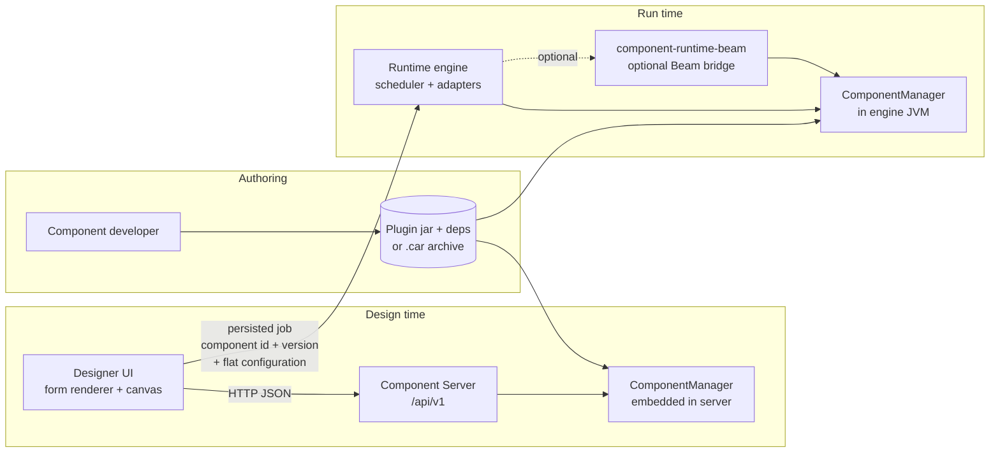
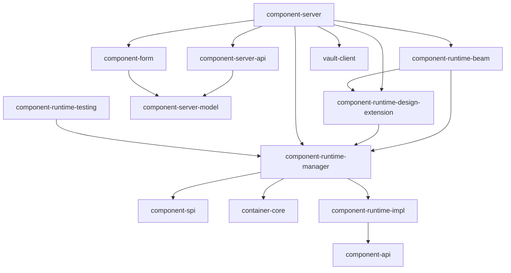
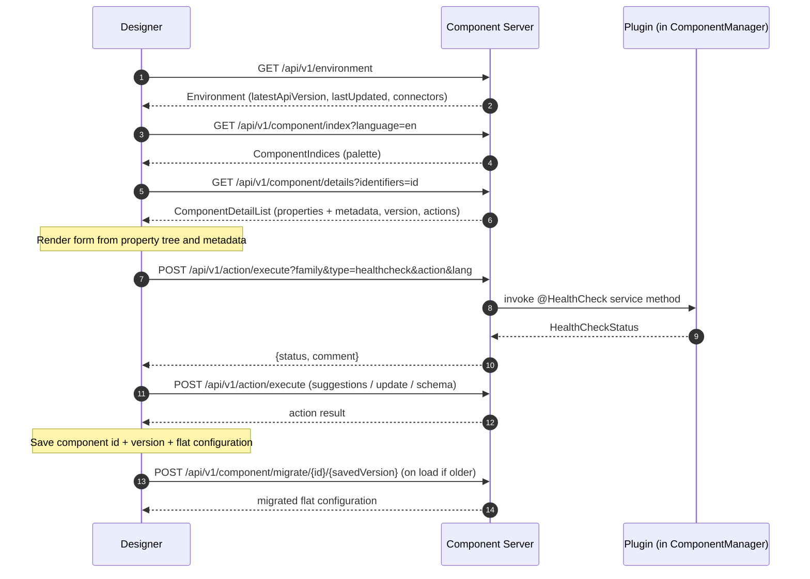
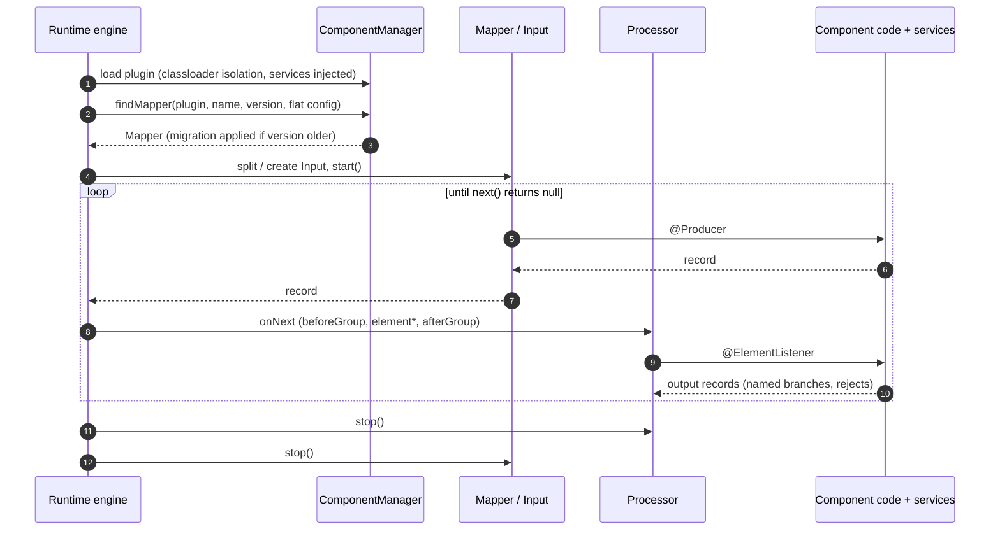

# 01 - Overview and architecture

> Framework version documented: `1.2611.0-SNAPSHOT` (root `pom.xml`, development iteration after release `1.2610.0`).
> Audience: engineers or AI agents building an ETL **Designer** (design-time host) and/or an ETL **Runtime** (run-time host) that integrate Talend Component Kit (TCK) components.
> Conventions: MUST / SHOULD / MAY are RFC 2119. Unknown facts are marked `(unverified)`. Feature IDs (`SVC-001`, `HTTP-003`, ...) point into [02-feature-catalog/](02-feature-catalog/).
> Sibling documents: [03-component-server-api.md](03-component-server-api.md), [04-data-model.md](04-data-model.md), [05-configuration-and-ui.md](05-configuration-and-ui.md), [06-runtime-execution.md](06-runtime-execution.md), [07-designer-blueprint.md](07-designer-blueprint.md), [08-runtime-blueprint.md](08-runtime-blueprint.md), [09-integration-checklist.md](09-integration-checklist.md), [10-appendix/built-in-services.md](10-appendix/built-in-services.md).

## 1. What TCK is, from a host's viewpoint

TCK is a Java framework in which a **component** (input, processor, output or standalone) is a plain annotated Java class packaged in a **plugin** (a jar plus its Maven dependencies, optionally a `.car` component archive). Components declare their behaviour with annotations from `component-api` (`org.talend.sdk.component.api.*`), never by implementing host classes. A host (ETL) does two independent jobs with the same plugin:

| Job | Host role | What it needs from the plugin | Main module |
|---|---|---|---|
| Discover, configure, validate | **Designer** | Component metadata: identity, version, configuration schema, layout/widget/condition/validation metadata, i18n, icons, documentation, design-time actions | `component-server-parent` (HTTP) or `component-runtime-manager` (in-process) |
| Instantiate and execute | **Runtime** | Executable classes with a flat `Map<String,String>` configuration, lifecycle, services, records | `component-runtime-manager` (+ `component-runtime-impl`, optional `component-runtime-beam`) |

The single point where both meet is the **flat property map** (`configuration.<path>` -> string) that the Designer produces from a form and that the Runtime feeds to a component instance (see [03-component-server-api.md](03-component-server-api.md) and [05-configuration-and-ui.md](05-configuration-and-ui.md)).

## 2. Roles

### 2.1 Component Server (provided, HTTP, design time)

- Java web application (Meecrowave/Tomcat + CXF JAX-RS + CDI + JCache) under `component-server-parent/component-server`. REST base path `/api/v1`. Resources: `component`, `configurationtype`, `action`, `documentation`, `environment`, `bulk`, `cache` (see SRV-001..SRV-016).
- Embeds a `ComponentManager`, deploys plugins (coordinates, registry file, Maven repository), and turns annotation metadata into JSON payloads (`ComponentIndices`, `ComponentDetailList`, `ConfigTypeNodes`, `ActionList`, `Environment`, ...).
- Executes **design-time actions** (health check, suggestions, dynamic values, update, schema discovery, ...) inside the plugin classloader on behalf of the Designer (`POST /api/v1/action/execute`, SRV-013).
- Has **no built-in authentication** (default handlers are `securityNoopHandler`, SRV-019). It does **not** run jobs.
- Optional: `component-form` (`component-uispec-mapper`) converts property metadata into a JSON-schema/UI-schema pair for web forms (documented in [05-configuration-and-ui.md](05-configuration-and-ui.md)); it is a library, not required by the server API itself.

### 2.2 Designer (host you build, design time)

The Designer is a client of the Component Server (or an in-process user of `ComponentManager` metadata). It MUST:

1. Discover components (`GET /component/index`, SRV-002) and load details (`GET /component/details`, SRV-003).
2. Render configuration forms from the property tree and metadata, honoring layouts, widgets, conditions and validations (categories CFG, UI, VAL).
3. Call design-time actions with the exact flat property subsets they declare (SRV-013, category ACT).
4. Persist, per component instance: component id, `ComponentDetail.version`, and the flat configuration map; migrate on load when the stored version is older (SRV-004, SRV-011).
5. Propagate schemas between components when it supports schema features (categories ACT/DAT).
6. Hand the persisted job (component ids, versions, flat configuration, connections) to the Runtime.

The Designer SHOULD cache server answers and invalidate them on `Environment.lastUpdated` (SRV-014, SRV-017: the server has **no** `ETag` support).

### 2.3 Runtime (host you build, run time)

The Runtime is an engine that executes a graph of components. It MUST:

1. Load plugins with `ComponentManager` (or a compatible implementation): one isolated classloader per plugin, `@Service` instantiation and injection (SVC-001, SVC-027, appendix [built-in-services](10-appendix/built-in-services.md)).
2. Resolve a component by `(plugin id, component name, version, flat configuration)` (`ComponentManager.findMapper(plugin, name, version, config)` / `findProcessor(...)`) and instantiate it through the `Mapper` (input), `Processor` (processor/output) or standalone runner wrappers.
3. Drive the lifecycle and data flow (`start`, `next` / `onNext` with groups, `stop`), pass `Record`s, route named outputs and rejects (categories RUN, DAT).
4. Migrate configurations whose version is older than the component version (category LCM).
5. Propagate component exceptions as job failures (category INT).

The Runtime does **not** need the Component Server. It only needs the plugin artifacts and the flat configuration.

### 2.4 Responsibility matrix

| Concern | Component Server | Designer | Runtime |
|---|---|---|---|
| Parse annotations to metadata | Yes (via `ComponentManager`) | Consumes JSON | Uses `ComponentManager` directly |
| Render forms, widgets, layouts | No (metadata only) | Yes | No |
| Run health check / suggestions / schema discovery | Executes | Triggers and interprets | Optional (embedded server) |
| Store configuration | No | Yes | Receives it |
| Migrate configuration | Yes (`/migrate`) | Calls it | Yes (in-process) |
| Instantiate and run components | No | No | Yes |
| Serve plugin jars | Yes (SRV-006/007, optional) | Optional | Optional consumer |
| Authentication | Pluggable handlers (default none) | Yes, in front | n/a |

## 3. Architecture diagram

## 4. Module map of this repository

Root `pom.xml` modules (source of truth; read from `<modules>`):

| Module | Purpose | Used by | Related catalog |
|---|---|---|---|
| `component-api` | Public API: annotations and interfaces (`base`, `component`, `configuration`, `context`, `exception`, `input`, `internationalization`, `meta`, `processor`, `record`, `service`, `standalone`). No host logic | plugins, all hosts | all |
| `container` (`container-core`, `nested-maven-repository`) | Classloader isolation (`ConfigurableClassLoader`), container manager, Maven dependency resolution, nested repositories inside a jar | manager, server | LCM |
| `component-spi` | Extension SPIs: `ComponentExtension`, `ComponentMetadataEnricher`, `GenericComponentExtension`, `ParameterExtensionEnricher` | manager, extensions | SVC-021..024 |
| `component-runtime-impl` | Executable model of the API: record implementations, JSON/Avro codecs, `Mapper`/`Input`/`Processor` wrappers, serialization (`SerializableService`, `ContainerFinder`), lifecycle bases. Documented as internal | manager, engines | RUN, DAT |
| `component-runtime-manager` | `ComponentManager`: plugin loading, service DI (`DefaultServiceProvider`), metadata extraction (parameter enrichers), migration handler factory, HTTP client service, Job DSL (`chain.Job`), `ConfigurationMapper` | server, runtime hosts | SVC, HTTP, CFG, RUN |
| `component-runtime-beam` | Bridge to Apache Beam (`TalendIO`, `TalendFn`, `BeamComponentExtension`, `BeamProducerFinder`): reference engine adapter | Beam runtimes | RUN |
| `component-runtime-design-extension` | Design-time model (`DesignModel`, `RepositoryModel`, `DesignContainerListener`) used to build the datastore/dataset tree and flow definitions (`FlowsFactory` classes) | server | CFG, RUN |
| `component-server-parent` (`component-server-api`, `component-server-model`, `component-server`, `extensions/component-server-extension-api`) | REST interfaces, payload POJOs, server implementation, server-side extension API | Designers | SRV |
| `component-form` (`component-form-core`, `component-form-model`, `component-uispec-mapper`) | Property metadata to JSON-schema + UI-schema for web forms | Web designers | UI, CFG |
| `vault-client` | Vault client for decrypting credential values | server | SRV-020 |
| `component-tools`, `component-tools-webapp` | Shared tooling (validation, CLI helpers, `.car` packaging) and a light web app to test components locally | build tools | LCM |
| `talend-component-maven-plugin` | Maven goals (validate, `.car` build, deploy-in-studio, web) | component developers | LCM |
| `component-starter-server` | Web app generating component project skeletons | component developers | none |
| `component-studio` (`component-runtime-di`) | Talend Studio integration: DI runtime bridge, `RuntimeContextInjector`, `BeamDiExtension` | Studio | SVC-019..020 |
| `component-runtime-testing` (`-junit`, `-junit-base`, `-http-junit`, `-beam-junit`, `-testing-spark`) | Test kit (JUnit 4/5, HTTP mocking, environments) | integrators, developers | TST |
| `singer-parent` (`singer-java`, `component-kitap`) | Singer (tap/target) Java API and a bridge running TCK components as Singer taps | Singer pipelines | see section 6 |
| `remote-engine-customizer` | Docker tool that adds a `.car` to a Remote Engine `docker-compose.yml` image | Cloud remote engine | see section 6 |
| `slf4j-standard` | SLF4J binding writing to stdout/stderr | fat jars, kitap | none |
| `sample-parent`, `images`, `documentation`, `reporting` | Samples, images, Antora documentation, coverage aggregation | maintainers | none |

The arrows above were read from the `<artifactId>` dependencies of the module `pom.xml` files (scopes not distinguished; only the modules drawn are shown, and `component-api` is also reached transitively by the others). `component-server` depends on `component-form-core`, `component-runtime-beam`, `component-runtime-design-extension`, `component-runtime-manager` and `vault-client`.

## 5. End-to-end flows

### 5.1 Plugin deployment

1. A plugin is provided as Maven GAV (resolved from a local Maven repository) or as a `.car` archive that provisions dependencies into a repository (`java -jar x.car maven-deploy|studio-deploy <path>`; see `studio-from-car.adoc`).
2. The host registers it: the Component Server via `talend.component.server.component.coordinates` / `.registry` (SRV-025); a plain Runtime by `ComponentManager.addPlugin(...)` or a `TALEND-INF/plugins.properties` entry (`myplugin = groupId:artifactId:version`).
3. `ComponentManager` creates a container with an isolated `ConfigurableClassLoader`, scans annotated classes, builds the service map (SVC-027), and registers components (families, mappers, processors, driver runners) and service actions.

### 5.2 Designer flow (configure a component)

Endpoint semantics and payloads: [03-component-server-api.md](03-component-server-api.md) and [SRV catalog](02-feature-catalog/SRV-server.md).

### 5.3 Runtime flow (execute a job)

Runtime semantics (lifecycle, groups, streaming, checkpoint): [06-runtime-execution.md](06-runtime-execution.md), [08-runtime-blueprint.md](08-runtime-blueprint.md). A runnable local example is the Job DSL (RUN-042): `Job.components().component("a", "fam://in?...").component("b", "fam://out").connections().from("a").to("b").build().run()`.

### 5.4 Service action call path

`Designer -> POST /action/execute -> ActionResourceImpl -> ComponentActionDao -> ServiceMeta.ActionMeta.invoker -> @Service method (plugin classloader) -> JSON result`. The server adds `$lang`, decrypts `vault:` credentials for a tenant (SRV-020) and maps `ComponentException` to HTTP 400/456/520 (SRV-024). Details for services: ACT-002.

## 6. Integration bridges (context only)

- **Talend Studio** (`studio.adoc`, `studio-schema.adoc`): Studio runs a Component Server inside `config.ini`-driven Java process (keys `component.java.*`, `component.environment=dev`) and executes jobs with the `component-runtime-di` bridge (`RuntimeContext` injection SVC-019..020, `talend.studio.type` schema property for Studio types). Studio-only functions are level 2.
- **Singer** (`singer.adoc`): `component-kitap` runs a TCK component as a Singer tap from `config.json` `{"component":{"family","name","version","configuration"}}`; requires a deployed m2 or `--component-archive` and optional `TALEND-INF/plugins.properties`.
- **Remote Engine** (`running-on-remote-engine.adoc`): `remote-engine-customizer register-component-archive` rebuilds the `connectors` docker image with a `.car`. Not officially supported per its page.
- **Compatibility** (`compatibility.adoc`): the framework version to target depends on the Talend product (Studio 7.3.1: framework up to 1.38.x; Studio 8.x and Cloud: latest QA-approved release; the page lists no other Component Kit version boundaries).

## 7. Glossary

| Term | Definition |
|---|---|
| Plugin | Jar (and its dependencies) containing components and services, loaded in one isolated classloader. Identified by a plugin id (generally the artifactId). Called "container" in the code |
| Family | Named group of components (`@Components(name=...)`); `family + name` is unique |
| Component | Input (`@PartitionMapper` / `@Emitter`), processor (`@Processor`), output (processor without outputs), or standalone (`@DriverRunner`) |
| Mapper | Runtime wrapper of an input component able to split into several `Input`s |
| Input / Producer | Runtime reader instance; `@Producer` returns the next record or null at the end |
| Processor | Runtime wrapper that receives records (`@ElementListener`) and emits records on named outputs |
| Service | `@Service` singleton in a plugin, injected by type (SVC-001) |
| Built-in service | Service provided by the host (LocalCache, Jsonb, HttpClientFactory, ...) - see [appendix](10-appendix/built-in-services.md) |
| Action | Service method annotated with an `@ActionType` annotation, executable at design time via `/action/execute` |
| Record / Schema | TCK data model (`org.talend.sdk.component.api.record`); see [04-data-model.md](04-data-model.md) |
| Datastore / Dataset | Reusable storable configuration types (connection / data selection), exposed by `/configurationtype/*` |
| `@Option` | Marks a configuration field; its path forms the flat property key |
| Flat configuration | `Map<String,String>` keyed by property path (for example `configuration.url`, list index `[0]`) |
| Component id | Server identifier of a component (derived from plugin, family, name); base64-style opaque string, treat as opaque `(unverified encoding)` |
| Version | `@Version` number of a component/configuration; stored with the configuration and used by migration |
| Migration | `MigrationHandler` transforming an older flat configuration to the current version |
| Group / bundle | Batch of consecutive records processed between `@BeforeGroup` and `@AfterGroup` |
| Component Server | The HTTP application of section 2.1 |
| ComponentManager | The in-JVM class loading and metadata engine (`component-runtime-manager`) |
| `.car` | Component archive: executable jar carrying a plugin and dependency metadata (`talend-component-maven-plugin`) |
| Designer / Runtime | Host roles of section 2 |
| SPI | `ServiceLoader` extension point (`component-spi`, see SVC-021..026) |
| Level 0 / 1 / 2 | Maturity levels of the integration checklist ([09](09-integration-checklist.md)) |
| Discrepancy | Difference between prose and code recorded in `10-appendix/known-discrepancies.md`; example: the brief expects `ETag` support, the server code has none (SRV-017) |
