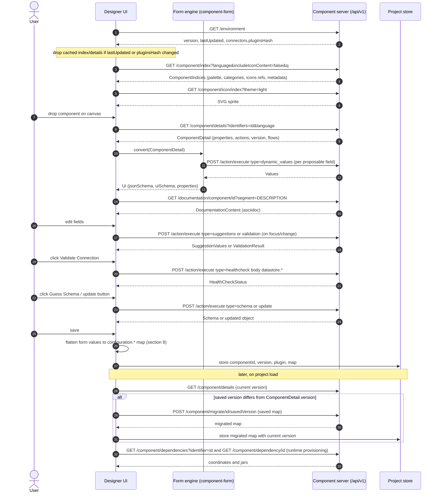

# 03 - Component server API (HTTP endpoints and payloads)

- **Framework version documented**: `1.2611.0-SNAPSHOT` (root `pom.xml`; last released tag `component-runtime-1.2610.0`).
- **Audience**: the *host* (ETL Designer, ETL Runtime provisioning). Normative keywords (MUST, SHOULD, MAY) are RFC 2119.
- **Sources of truth (code beats prose)**: JAX-RS interfaces `component-server-parent/component-server-api/.../api/*Resource.java`; implementations `component-server-parent/component-server/.../front/*ResourceImpl.java`; payload POJOs `component-server-parent/component-server-model/.../front/model/**`; form generation `component-form/component-form-core`; tests `component-server/src/test/**` and `component-form-core/src/test/**`. Prose consulted: `documentation/.../pages/ref-rest-resources.adoc`, `rest-openapi.adoc` (both only include the generated OpenAPI partial `_partials/generated_rest-resources.adoc`), `documentation-rest.adoc`, `ref-server-configuration.adoc`.
- **Marking**: `(inferred)` = deduced from code without an executable proof; `(unverified)` = not established from local sources.
- Companion appendices: [property metadata keys](10-appendix/property-metadata-keys.md), [error codes](10-appendix/error-codes.md), [server configuration](10-appendix/server-configuration.md). Configuration/UI semantics: [05-configuration-and-ui.md](05-configuration-and-ui.md). Runtime side: [06-runtime-execution.md](06-runtime-execution.md).
- Endpoint identifiers used in this file (`EP-...`) are local labels for cross-reference inside this document; each is mapped to its catalog feature ID (`SRV-*`, see [SRV-server.md](02-feature-catalog/SRV-server.md#ep-label-to-srv-id-mapping)) in the table of section 3 and in each section heading below.

## 1. Transport and conventions

| Topic | Rule |
|---|---|
| Base path | `/api/v1` (`@ApplicationPath("api/v1")` in `TalendComponentApplication`; OpenAPI `info.version = "1"`). A deployment MAY add a servlet-context prefix in front (e.g. reverse proxy); the server itself does not configure one. `Environment.latestApiVersion` is derived from the highest `@ApplicationPath("api/vN")` (currently `1`). |
| WebSocket | Every endpoint is also reachable over WebSocket with base `/websocket/v1` (replace `/api` by `/websocket`), STOMP-like frames `SEND` / `destination: <path after v1>` / headers / body `^@`; response frame `MESSAGE` + `status:`. Multiplexed variant `/websocket/v1/bus` requires header `destinationMethod` (default `GET`). Source: `documentation-rest.adoc`, `WebSocketBroadcastSetup`; used by tests via `WebsocketClient` (`ws.read(Class, "get", "/component/index?includeIconContent=true", "")`). |
| Media types | Request and response `application/json` (UTF-8 forced on requests by `ForceEncoding`). Binary endpoints: `application/octet-stream` (dependency jar, icons), `image/svg+xml` (icon index). |
| JSON serialization | Server JSON-B is `JsonbBuilder` with `PropertyOrderStrategy.LEXICOGRAPHICAL` (`JsonbFactory`): object properties are emitted in alphabetical order; `null` properties are omitted (observed in the schema fixture of `ActionResourceImplTest#checkSchemaSerialization`). Clients MUST NOT depend on property order and MUST treat absent and `null` alike. `byte[]` (`Icon.customIcon`) is a base64 string (inferred, JSON-B default). |
| Compression | gzip enabled on the connector (`meecrowave.properties`); clients SHOULD send `Accept-Encoding: gzip`. |
| Language | Query parameter `language` (index, details, configuration types, action index, documentation) or `lang` (action execute); default `en`. The requested value is normalised by `LocaleMapper` using `talend.component.server.locale.mapping` (default: `en*`->`en`, `fr*`->`fr`, `zh*`->`zh_CN`, `ja*`->`ja`, `de*`->`de`; **anything else falls back to `en`**, e.g. `it` yields English). |
| Theme | Query parameter `theme` (`light` \| `dark`, `all` only on `icon/index`); default `talend.component.server.icon.theme.default` (`light`). See section 3.3. |
| Identifiers | Component id = `Base64URL-no-padding("<plugin>#<family>#<name>")`; family id = `Base64URL-no-padding("<plugin>#<family>")`; configuration-type id = `Base64URL-no-padding("<plugin>#<family>#<configType>#<configName>")` (`IdGenerator.get`, `RepositoryModelBuilder`). Example: `amRiYy1jb21wb25lbnQjamRiYyNpbnB1dA` = `jdbc-component#jdbc#input`. The algorithm is documented in source as *not* guaranteed reversible: hosts MUST treat ids as opaque strings. |
| Deprecated endpoints | A deprecated resource method/class gets header `X-Talend-Warning` (`MessageResponseFilter`). No endpoint in `component-server-api` is currently `@Deprecated`. |

## 2. Endpoint inventory

Every JAX-RS resource interface in `component-server-api` is covered (7 interfaces, 18 operations).

| ID | Catalog ID | Verb + path (under `/api/v1`) | Interface#method | Purpose | Cached (JCache) |
|---|---|---|---|---|---|
| EP-COMPONENT-INDEX | [SRV-002](02-feature-catalog/SRV-server.md#srv-002-get-apiv1componentindex) | `GET /component/index` | `ComponentResource#getIndex` | List components (palette) | yes |
| EP-COMPONENT-DETAILS | [SRV-003](02-feature-catalog/SRV-server.md#srv-003-get-apiv1componentdetails) | `GET /component/details` | `#getDetail` | Full model of components (form) | yes |
| EP-COMPONENT-MIGRATE | [SRV-004](02-feature-catalog/SRV-server.md#srv-004-post-apiv1componentmigrateidconfigurationversion) | `POST /component/migrate/{id}/{configurationVersion}` | `#migrate` | Migrate a saved component configuration | no |
| EP-COMPONENT-DEPS | [SRV-006](02-feature-catalog/SRV-server.md#srv-006-get-apiv1componentdependencies) | `GET /component/dependencies` | `#getDependencies` | Maven coordinates a component needs | yes |
| EP-COMPONENT-DEP | [SRV-007](02-feature-catalog/SRV-server.md#srv-007-get-apiv1componentdependencyid) | `GET /component/dependency/{id}` | `#getDependency` | Download a jar (component or dependency) | yes |
| EP-ICON-FAMILY | [SRV-005](02-feature-catalog/SRV-server.md#srv-005-icon-endpoints) | `GET /component/icon/family/{id}` | `#familyIcon` | Family icon bytes | yes |
| EP-ICON-COMPONENT | [SRV-005](02-feature-catalog/SRV-server.md#srv-005-icon-endpoints) | `GET /component/icon/{id}` | `#icon(id, theme)` | Component icon bytes | yes |
| EP-ICON-CUSTOM | [SRV-005](02-feature-catalog/SRV-server.md#srv-005-icon-endpoints) | `GET /component/icon/custom/{familyId}/{iconKey}` | `#icon(familyId, iconKey, theme)` | Icon by key inside a family | yes |
| EP-ICON-INDEX | [SRV-005](02-feature-catalog/SRV-server.md#srv-005-icon-endpoints) | `GET /component/icon/index` | `#getIconIndex` | SVG sprite of all SVG icons | yes |
| EP-CONFIG-INDEX | [SRV-009](02-feature-catalog/SRV-server.md#srv-009-get-apiv1configurationtypeindex) | `GET /configurationtype/index` | `ConfigurationTypeResource#getRepositoryModel` | Tree of datastore/dataset/... types | yes |
| EP-CONFIG-DETAILS | [SRV-010](02-feature-catalog/SRV-server.md#srv-010-get-apiv1configurationtypedetails) | `GET /configurationtype/details` | `#getDetail` | Full model of config types | yes |
| EP-CONFIG-MIGRATE | [SRV-011](02-feature-catalog/SRV-server.md#srv-011-post-apiv1configurationtypemigrateidconfigurationversion) | `POST /configurationtype/migrate/{id}/{configurationVersion}` | `#migrate` | Migrate a saved config-type value | no |
| EP-ACTION-INDEX | [SRV-012](02-feature-catalog/SRV-server.md#srv-012-get-apiv1actionindex) | `GET /action/index` | `ActionResource#getIndex` | List server actions | yes |
| EP-ACTION-EXECUTE | [SRV-013](02-feature-catalog/SRV-server.md#srv-013-post-apiv1actionexecute) | `POST /action/execute` | `#execute` | Run one action (healthcheck, suggestions, ...) | no |
| EP-DOC | [SRV-008](02-feature-catalog/SRV-server.md#srv-008-get-apiv1documentationcomponentid) | `GET /documentation/component/{id}` | `DocumentationResource#getDocumentation` | AsciiDoc of a component | yes |
| EP-ENV | [SRV-014](02-feature-catalog/SRV-server.md#srv-014-get-apiv1environment) | `GET /environment` | `EnvironmentResource#get` | Versions and last-update info | no |
| EP-BULK | [SRV-015](02-feature-catalog/SRV-server.md#srv-015-post-apiv1bulk) | `POST /bulk` | `BulkReadResource#bulk` | Batch several GET/POST calls | no |
| EP-CACHE-CLEAR | [SRV-016](02-feature-catalog/SRV-server.md#srv-016-get-apiv1cacheclear) | `GET /cache/clear` | `CacheResource#clearCaches` | Redeploy plugins and clear caches | no |

Notes: the `CacheResource` implementation is `FrontCacheResolver`. There is **no** endpoint for "deploy a component" or "API version negotiation" besides `EP-ENV.latestApiVersion`.

## 3. Cross-cutting behaviour

### 3.1 Caching (no ETag support)

- **HTTP-level validators are not implemented.** A search of `component-server-parent` (Java, properties, XML) and of the documentation for `ETag`, `If-None-Match`, `Last-Modified`, `Cache-Control`, `evaluatePreconditions` finds nothing. The server never emits `ETag`, never answers `304`. The task brief (and the maturity checklist wording "caching (`ETag`)") therefore describes a capability that does not exist in this version. Hosts MUST NOT assume conditional GET support.
- **Server-side cache**: methods annotated `@CacheResult` are cached by JCache with `FrontCacheKeyGenerator`. The key is: the method parameters + `UriInfo.getPath()` + all query parameters + `Content-Language` + `Accept` + `Accept-Encoding` headers. Index endpoints additionally keep in-memory maps keyed by `RequestKey(locale, includeIconContent, query, theme)` bounded by `talend.component.server.cache.maxSize` (default 1000).
- **Invalidation**: (a) CDI event `DeployedComponent` (component deployed at runtime) clears the two index maps; (b) `GET /cache/clear` (section 4.16); (c) plugin reload (`talend.component.server.plugins.reloading.*`) calls `redeployPlugins()` which also cleans caches; (d) a refresher thread wakes every `talend.vault.cache.jcache.refresh.period` ms (default 30000) and clears caches when `Environment.lastUpdated` is newer than its last clean-up.
- **Host-side recommendation** (derived, not a server feature): a designer SHOULD cache `component/index` and `component/details` responses per `(language, theme, q, id)` and drop them when `GET /environment` returns a different `lastUpdated` or `connectors.pluginsHash` than the one seen when the cache was filled.

### 3.2 Security

- The server ships **no authentication**. Two pluggable checks run on every request:
  - `ConnectionSecurityProvider` (`@PreMatching` `ContainerRequestFilter`) fires CDI event `OnConnection`; if no observer calls `validated()` the response is `401` with `ErrorPayload{UNAUTHORIZED, "Invalid connection credentials"}`.
  - `CommandSecurityProvider` (`ContainerRequestFilter`, after matching) fires `OnCommand(resourceClass, resourceMethod)`; failure gives `401 UNAUTHORIZED "Invalid command credentials"`.
  - The observer bean is selected by name: `talend.component.server.security.connection.handler` / `.command.handler`, default `securityNoopHandler` (accepts everything). Custom handlers are CDI beans (`@Named("x")` with `@Observes OnConnection`/`OnCommand`) deployed in the server classpath (e.g. `/opt/talend/component-kit/custom/`). There are no roles; a handler decides per resource method.
- In `EP-BULK` (SRV-015), each sub-request runs through the same JAX-RS pipeline with the caller's `Principal`.
- `EP-ENV` (SRV-014) can be disabled (`talend.component.server.environment.active=false` gives `404`). The static `/documentation` UI can be disabled (`talend.component.server.documentation.active=false`).
- **Credentials in payloads**: a value beginning with `vault:` in an *action* payload is deciphered via Vault for options whose metadata has `ui::credential=true`, using header `x-talend-tenant-id` (tenant); not done for `migrate` endpoints. Errors: see [error codes](10-appendix/error-codes.md), section 5. Never log or persist deciphered values.
- `GET /component/dependency/{id}` streams any jar resolvable under the server Maven repository (source comment: "we would need to ensure some security here"). Operators SHOULD restrict it with a command handler.
- TLS: `talend.component.server.ssl.*` (see [server configuration](10-appendix/server-configuration.md)).

### 3.3 Icons and themes

`Icon` in `ComponentIndex` is resolved by `IconResolver`: with themes on (default) the lookup key is `<theme>/<icon>`, substituted into each configured pattern (`talend.component.server.icon.paths`, default `icons/%s.svg`, `icons/svg/%s.svg`, `icons/%s_icon32.png`, `icons/png/%s_icon32.png`, e.g. `icons/light/db-input.svg`, `icons/svg/light/db-input.svg`), first under `icons/override/` on the server classpath, then in the family classloader, then in the server classloader; if not found and legacy is enabled, the non-themed lookup is used. An unknown theme (e.g. `dak`) still yields the legacy icon on `icon/custom` (test `customThemedIcon`) but yields `404` on `icon/family` and `icon/index` (tests `themedFamilyIcon`, `getIconIndex`).

## 4. Endpoints

### 4.1 EP-COMPONENT-INDEX (SRV-002) - `GET /api/v1/component/index`

| Parameter | In | Type | Default | Meaning |
|---|---|---|---|---|
| `language` | query | string | `en` | Locale for display names, family names, categories. |
| `includeIconContent` | query | boolean | `false` | If true, `Icon.customIcon` (base64 bytes) is included for component and family icon. |
| `q` | query | string | none | Filter, section 4.1.1. |
| `theme` | query | string | server default (`light`) | Icon theme. |

Responses: `200` `ComponentIndices`. Errors: security only (a malformed `q` raises `IllegalArgumentException`, surfaced as `500 UNEXPECTED` (inferred)). No `304`.

Semantics (`ComponentResourceImpl.getIndex`): one `ComponentIndex` per `@PartitionMapper`/`@Emitter` (`type="input"`), `@Processor` (`type="processor"`) and `@DriverRunner` (`type="standalone"`) of every deployed plugin, plus components contributed by server extensions ("virtual" components). Order of the list is not specified (tests sort it); the designer MUST sort for display.

#### 4.1.1 Query language (`q`)

Grammar (from `SimpleQueryLanguageCompiler`): `expr := term { ("AND"|"OR") term }`, `term := "(" expr ")" | key op value`, `op := "=" | "!="`. Evaluated left to right, **no operator precedence** (so `A AND B OR C` = `(A AND B) OR C`). Comparison is case-sensitive string equality; a missing value equals the literal `null`. Whitespace is significant around tokens (use spaces around `AND`/`OR`). Keys for components: `plugin`, `id`, `familyId`, `name`, and `metadata[<key>]`, where `metadata` is the metadata map **of the first (root) property** of the component's `properties` list (prefix-stripped keys, e.g. `metadata[configurationtype::type]`). Keys for `configurationtype/index`: `id`, `type` (= `configurationType`), `name`, `metadata[<key>]` (root property of the configuration).

Example (from `ComponentResourceImplTest#getIndexWithQuery`): `(id = amRiYy...) AND (metadata[configurationtype::type] = dataset) AND (plugin = jdbc-component) AND (name = input)`.

Note: `metadata[...]` triggers a `getDetail` per candidate component (`componentEvaluators.metadata`), so it is expensive on large catalogs.

### 4.2 EP-COMPONENT-DETAILS (SRV-003) - `GET /api/v1/component/details`

| Parameter | In | Type | Default | Meaning |
|---|---|---|---|---|
| `identifiers` | query, repeatable | string[] | none | Component ids (`ComponentId.id`). |
| `language` | query | string | `en` | Locale. |

Responses: `200` `ComponentDetailList` (`{"details":[]}` if no id); `400` with body `{ "<id>": ErrorPayload, ... }` if **any** id is invalid (no partial result): codes `COMPONENT_MISSING`, `PLUGIN_MISSING`, `DESIGN_MODEL_MISSING` (see [error codes](10-appendix/error-codes.md)). Detail `type` is `processor` for processors, `input` for mappers/emitters, `standalone` otherwise.

`ComponentDetail.properties` = flattened, path-sorted list of `SimplePropertyDefinition` (section 5.3) and `actions` = the server actions referenced by the component's options (`action::*` metadata) resolved to `ActionReference` with their own parameter definitions. `links` is always `[]` in details (index carries the `Detail` link).

### 4.3 EP-COMPONENT-MIGRATE (SRV-004) - `POST /api/v1/component/migrate/{id}/{configurationVersion}`

| Parameter | In | Meaning |
|---|---|---|
| `id` | path | Component id. |
| `configurationVersion` | path (int) | Version the body was saved with (`ComponentDetail.version` at save time). |
| body | JSON object `Map<String,String>` | Flat configuration (section 8), keys with full path (`configuration.dataSet.x`). |

Behaviour (`ComponentResourceImpl.migrate`), in order:
1. Every value starting with `base64://` is replaced by the URL-safe-Base64 decoded UTF-8 text (Studio compatibility). The response contains the decoded value (asserted by `migrateFromStudio`).
2. Virtual (extension) component -> body returned unchanged.
3. Unknown component -> `404 COMPONENT_MISSING` (`"Didn't find component <id>"`).
4. `configurationVersion > registered version` -> body returned unchanged (warning logged). Test: version 3 vs registered 2 leaves the map untouched.
5. Otherwise (**including equal versions**, inferred: only `>` short-circuits) the component `MigrationHandler` (`@Version(migrationHandler)` plus implicit handlers for nested `@DataStore`/`@DataSet` classes with their own `@Version`, keyed by `<path>.__version`) is invoked and its result returned.

Response `200`: `Map<String,String>` (the possibly modified flat configuration). Handler exceptions are not caught here (they surface as `500 UNEXPECTED`, inferred). `vault:` values are **not** deciphered. Cache: none.

The documentation (`documentation-rest.adoc`) says the version must be provided under a key `tcomp::component::version`; **that key does not exist in code** (grep finds none) - the version is the path parameter (discrepancy).

### 4.4 EP-COMPONENT-DEPS (SRV-006) - `GET /api/v1/component/dependencies`

| Parameter | In | Meaning |
|---|---|---|
| `identifier` (singular, repeatable) | query | Component ids. Note the different name compared to `details` (`identifiers`). |

`200` `Dependencies`: `{"dependencies": {"<componentId>": {"dependencies": ["group:artifact:type:version[:scope]", ...]}}}`. The list is the container's dependency closure **excluding the component jar itself**; the host MUST also fetch the component via `EP-COMPONENT-DEP` (SRV-007) with the component id. With `talend.component.server.component.extend.dependencies=true` (default) extension-required artifacts are appended. No identifier -> `{"dependencies":{}}`; unknown id -> `404 COMPONENT_MISSING`. Virtual entities are keyed by the id used in the request.

Coordinate format observed in tests: `org.apache.tomee:ziplock:jar:8.0.14` (4 parts) and `...:jar:0.0.1:compile` (5 parts, with scope).

### 4.5 EP-COMPONENT-DEP (SRV-007) - `GET /api/v1/component/dependency/{id}`

`id` is either a component id (returns the plugin jar/`.car` container file, `Container.getContainerFile()`) or Maven coordinates `group:artifact:type:version` (e.g. `org.apache.commons:commons-lang3:jar:3.12.0`) resolved against the server m2 (`talend.component.server.maven.repository`) or, for synthetic GAVs prefixed `virtual.talend.component.server.generated.`, generated on the fly by `VirtualDependenciesService`. Response `200` `application/octet-stream` (streamed in 40 KiB chunks); `404` `PLUGIN_MISSING` (`"No plugin matching the id"`, `"No dependency matching the id"`, `"No file found for: <id>"`). The container may be a directory in dev setups: then `Files.exists` passes but streaming a directory fails (unverified). **Forbidden in bulk mode.**

### 4.6 EP-ICON-FAMILY / EP-ICON-COMPONENT / EP-ICON-CUSTOM (SRV-005)

| Path | Parameters | Success | Errors |
|---|---|---|---|
| `GET /component/icon/family/{id}` | `id` family id, `theme` | `200` bytes, `Content-Type` = resolved type (`image/png` or `image/svg+xml`) | `404` `FAMILY_MISSING`, `PLUGIN_MISSING`, `ICON_MISSING` |
| `GET /component/icon/{id}` | `id` component id, `theme` | same | `404` `COMPONENT_MISSING`, `PLUGIN_MISSING`, `ICON_MISSING` |
| `GET /component/icon/custom/{familyId}/{iconKey}` | `familyId`, `iconKey`, `theme` | same | `404` `FAMILY_MISSING`, `PLUGIN_MISSING`, `ICON_MISSING` |

Virtual entities always answer `404 ICON_MISSING`. `Accept` SHOULD be `application/octet-stream`. **Forbidden in bulk mode** (`/api/v1/component/icon/` prefix).

### 4.7 EP-ICON-INDEX (SRV-005) - `GET /api/v1/component/icon/index`

`theme` = `light` (default) \| `dark` \| `all`. Returns one `image/svg+xml` document `<svg xmlns="http://www.w3.org/2000/svg" class="sr-only" focusable="false" data-theme="<theme>">` containing one `<symbol id="<icon>-<theme>" data-theme data-type data-family [data-connector]>` per SVG icon (family icons: `data-type="family"`; component icons: `data-type="connector"`, `data-connector="<component display name>"`). Built from `getIndex("root"-language, includeIconContent=true)` filtered to `image/svg+xml`. Errors: `404 ICON_MISSING` when no SVG exists (or unknown theme), `406` if the `Accept` header excludes `image/svg+xml` and JSON (test `getIconIndex`), `500 UNEXPECTED` on XML failure. Designer use: inject once into the DOM and reference symbols by id.

### 4.8 EP-CONFIG-INDEX (SRV-009) - `GET /api/v1/configurationtype/index`

| Parameter | Type | Default | Meaning |
|---|---|---|---|
| `language` | string | `en` | Locale. |
| `lightPayload` | boolean | `true` | `true`: omit `properties` and `actions`. `false`: include the full form model (heavy). |
| `q` | string | none | Query (4.1.1) over `id`, `type`, `name`, `metadata[...]`. |

`200` `ConfigTypeNodes`: `{"nodes": { "<id>": ConfigTypeNode }}` - a **map** keyed by node id, containing (a) one *family node* per family that has at least one config type (no `configurationType`, `version` 0, `edges` = ids of its root configs), and (b) one node per config type, `parentId` = family id (root configs) or the id of the enclosing config type. Tree navigation: `edges` (children ids) and `parentId`. The parent/child relation for config types: a config type X is a child of config type Y when X's option tree contains an option of Y's Java type (e.g. dataset -> datastore: the *dataset* node has `parentId` = *datastore* id in the fixture `suggestions.json`; hence the designer picks a datastore first, then datasets under it). Property paths of config-type nodes are re-rooted at `configuration` (`ConfigurationTypeResourceImpl.createNode` forces the prefix to the meta name `configuration`).

### 4.9 EP-CONFIG-DETAILS (SRV-010) - `GET /api/v1/configurationtype/details`

Parameters: `identifiers` (repeatable config/family ids), `language`. Always returns full nodes (`properties`, `actions`). Unknown ids are silently ignored (empty `nodes`). Cache: yes.

### 4.10 EP-CONFIG-MIGRATE (SRV-011) - `POST /api/v1/configurationtype/migrate/{id}/{configurationVersion}`

Body: flat `Map<String,String>` of the config type value, keys prefixed `configuration.`. The server adds `configuration.__version=<configurationVersion>` if absent, runs the config-type `MigrationHandler` (from `@Version` on the datastore/dataset class; identity if none), and strips the added key from the result. Virtual entity: unchanged. Errors: `404 CONFIGURATION_MISSING`; migration failure: `ComponentException` origin USER -> `400`, BACKEND -> `456`, other -> `520`, code `UNEXPECTED` ("Migration execution failed with: ..."). Not cached.

### 4.11 EP-ACTION-INDEX (SRV-012) - `GET /api/v1/action/index`

Parameters: `type` (repeatable filter, ActionType value such as `healthcheck`), `family` (repeatable filter), `language`. Empty filter = all. Response `200` `ActionList{items:[ActionItem]}`; `ActionItem{component (= family name), type, name, properties[]}` where `properties` describe the **action method parameters** (flat `SimplePropertyDefinition`, top-level ones carry `definition::parameter::index`). Includes actions of server extensions ("virtual").

### 4.12 EP-ACTION-EXECUTE (SRV-013) - `POST /api/v1/action/execute`

| Parameter | In | Required | Meaning |
|---|---|---|---|
| `family` | query | yes | Component family name (not id). |
| `type` | query | yes | ActionType value: `user`, `healthcheck`, `suggestions`, `dynamic_values`, `validation`, `update`, `schema`, `schema_extended`, `discoverdataset`, `dynamic_dependencies`, `available_output`, `schema_mapping`, `create_connection`, `close_connection` (from `@ActionType` in `component-api`). |
| `action` | query | yes | Action name (as in `action::<type>` metadata or `ActionReference.name`). |
| `lang` | query | no (`en`) | Language; server adds parameter `$lang` (mapped language code) to the action parameters. |
| body | JSON object `Map<String,String>` | yes | Flat parameters, section 4.12.1. |
| header `x-talend-tenant-id` | header | if `vault:` values | Tenant used to decipher credentials. |

Response `200` with `Content-Type: application/json` and the JSON serialization of whatever the action method returned (section 6). Execution is synchronous on the request thread. Not cached. Errors: `400` `ACTION_MISSING` / `TYPE_MISSING` / `FAMILY_MISSING` (null query parameter), `404 ACTION_MISSING` (unknown triple), `400`/`456`/`520` `ACTION_ERROR` (exception origin), plus Vault errors. The OpenAPI text states `520` for failures - see [error codes](10-appendix/error-codes.md).

#### 4.12.1 Action request body

Keys are the **action method's own option names**, not the component paths. For an action `@HealthCheck("default") HealthCheckStatus test(@Option("datastore") JdbcDataStore ds)` the body is `{"datastore.url":"...","datastore.username":"...","datastore.password":"..."}`. Rules are those of section 8 (objects with `.`, lists with `[i]`, primitives as strings). The designer obtains the mapping from the trigger produced from the metadata (section 9): each `parameters` entry is `{key, path}` meaning "take every form value at `path` (the value itself if primitive, or the whole sub-tree if object/array) and send it under `key` (+ the sub-path suffix)". Example: trigger parameter `{"key":"datastore","path":"configuration.connection"}` with form values `configuration.connection.url=jdbc:x` sends `datastore.url=jdbc:x`. Validation triggers use `{"key":"value","path":"configuration.connection.driver"}`. Parameters whose reference starts with `$` are internal (e.g. `.$selfReference`). Test payloads: `{"dataSet.urls[0]":"empty"}`, `{"enum":"V1"}`, `{"configuration.driver":"jdbc://localhost/mydb","branch":"V1","incoming":"<serialized Schema JSON string>"}` (for `schema_extended`: `incoming` = JSON text of the incoming `Schema`).

### 4.13 EP-DOC (SRV-008) - `GET /api/v1/documentation/component/{id}`

| Parameter | Type | Default | Meaning |
|---|---|---|---|
| `id` | path | | Component id. |
| `language` | string | `en` | Tries `TALEND-INF/documentation_<mappedLang>.adoc`, `documentation_<language>.adoc`, then `documentation.adoc` from the plugin classloader, then `${talend.component.server.component.documentation.translations}/documentation_<containerId>_<lang>.adoc`. |
| `segment` | enum | `ALL` | `ALL`, `DESCRIPTION`, `CONFIGURATION`. |

`200` `DocumentationContent{type:"asciidoc", source:"<adoc text>"}` (`type` is deprecated but always `asciidoc`). The component section is located by `//component_start:<name>` ... `//component_end:<name>` markers (with `//configuration_start` / `//configuration_end` inside), or, without markers, by the `== <name>` title and `=== Configuration` sub-title. `DESCRIPTION` returns text before the configuration table, `CONFIGURATION` the table. Virtual components: `200` with empty `source`. Errors: `404 COMPONENT_MISSING` (unknown id **or** no documentation text found), `404 PLUGIN_MISSING`. Results are cached per `(id, language, segment)` inside the plugin container and via JCache. The host renders AsciiDoc itself (no HTML conversion by the server).

### 4.14 EP-ENV (SRV-014) - `GET /api/v1/environment`

`200` `Environment` (5.9). `404` (no body) if `talend.component.server.environment.active=false`. Use as health probe and as cache-invalidation signal (3.1).

### 4.15 EP-BULK (SRV-015) - `POST /api/v1/bulk`

Body `BulkRequests`; response `200` `BulkResponses` whose `responses[i]` corresponds to `requests[i]` (order kept). Constraints (`BulkReadResourceImpl`):
- `path` MUST start with `/api/v1`, MUST NOT contain `?` (pass query via `queryParameters`), else result `{status:400, response:{"code":"UNEXPECTED","description":"unknownEndpoint."}}`.
- Paths starting with `/api/v1/component/icon/` or `/api/v1/component/dependency/` -> `{status:403, response:{"code":"UNAUTHORIZED","description":"Forbidden endpoint in bulk mode."}}`.
- `verb` defaults to `GET`; `payload` is the request body as a string; `queryParameters` is `Map<String, List<String>>` (each value a **list**, joined as repeated `k=v` without URL-encoding; the OpenAPI example showing a scalar `"identifier": "12345"` does not match the model, and it calls `/component/details` with `identifier` whereas the parameter is `identifiers` - documentation errors).
- The sub-response body MUST be a JSON **object** (parsed with `readObject()`); an endpoint returning a JSON array (e.g. `dynamic_dependencies`) or non-JSON is not usable through bulk (inferred).
- `responses[i].headers` currently echoes the **request** headers of that entry (the response callback assigns the local request `headers` variable; inferred defect - the test asserting `Content-Type: application/json` passes only because the test request sets it).
- Overall status is `200` even when sub-requests fail; check each `status`.

### 4.16 EP-CACHE-CLEAR (SRV-016) - `GET /api/v1/cache/clear`

Despite `GET`, this **mutates**: `FrontCacheResolver.clearCaches()` counts non-empty front caches, then calls `ComponentManagerService.redeployPlugins()` (closes and redeploys **all** plugin containers, refreshes `connectors`, cleans caches). `200` `CacheClear{clearedCacheCount:<long>}`. Hosts SHOULD protect it with the command handler and SHOULD NOT call it from a designer.

## 5. Payload reference (field by field)

"Used by": **D** = Designer, **R** = Runtime provisioning, **B** = both. Nullability is "may be absent in JSON".

### 5.1 `ComponentIndices` / `ComponentIndex` / `ComponentId` / `Icon` / `Link`

`ComponentIndices`: `components` (`ComponentIndex[]`, D).

| `ComponentIndex` field | Type | Nullable | Meaning | Used by |
|---|---|---|---|---|
| `id` | `ComponentId` | no | Identity, see below. | B |
| `displayName` | string | no | Localized component name (falls back to technical name). | D |
| `familyDisplayName` | string | no | Localized family name. | D |
| `type` | string | no | `input` \| `processor` \| `standalone`. | B |
| `icon` | `Icon` | no | Component icon reference. | D |
| `iconFamily` | `Icon` | no | Family icon reference. | D |
| `version` | int | no | Component `@Version` (default 1). | B |
| `categories` | string[] | no (may be empty) | Palette paths; `${family}` replaced by family (localized when the family bundle has the category); a category without `${family}` gets `/<family>` appended. | D |
| `links` | `Link[]` | no | Always one entry `Detail`. | D |
| `metadata` | map<string,string> | no | Component-level metadata, raw keys (appendix, section 9). | B |

| `ComponentId` field | Type | Meaning |
|---|---|---|
| `id` | string | Component id (opaque). Argument of details/migrate/doc/icon. |
| `familyId` | string | Family id (argument of `icon/family`, config-type family node id). |
| `plugin` | string | Plugin (container) id, e.g. `jdbc-component`. |
| `pluginLocation` | string | Original plugin GAV/location when known, else the plugin id. |
| `family` | string | Technical family name (use for `family=` in action calls). |
| `name` | string | Technical component name. |

| `Icon` field | Type | Nullable | Meaning |
|---|---|---|---|
| `icon` | string | yes | Icon key (`@Icon` value or custom key). |
| `customIconType` | string | yes | MIME type of the resolved file (`image/png`, `image/svg+xml`); absent if not resolved. |
| `customIcon` | byte[] (base64) | yes | Present only if `includeIconContent=true` and resolved. |
| `theme` | string | yes | Theme used for lookup. |

`Link`: `name` (`Detail`), `path` (relative to `/api/v1`, e.g. `/component/details?identifiers=<id>`), `contentType` (`application/json`).

### 5.2 `ComponentDetailList` / `ComponentDetail`

| Field | Type | Nullable | Meaning | Used by |
|---|---|---|---|---|
| `details` | `ComponentDetail[]` | no | (in `ComponentDetailList`) | D |
| `id` | `ComponentId` | no | | B |
| `displayName` | string | no | | D |
| `icon` | string | yes | Icon **key** only (string here, unlike the index). | D |
| `type` | string | no | `input`/`processor`/`standalone`. | B |
| `version` | int | no | Component version; the host MUST persist it with each saved configuration and send it back to `migrate`/runtime. | B |
| `properties` | `SimplePropertyDefinition[]` | no | Whole option tree, sorted by `path`. Includes synthetic `$maxRecords`/`$maxDurationMs`/`$maxBatchSize`. | B |
| `actions` | `ActionReference[]` | no | Server actions referenced by the options. | D |
| `inputFlows` | string[] | yes | Named input connections (`DesignModel`), e.g. `__default__`, `REJECT`. | D |
| `outputFlows` | string[] | yes | Named output connections. | D |
| `links` | `Link[]` | no | `[]`. | D |
| `metadata` | map<string,string> | no | Component-level metadata (same as index). | B |

### 5.3 `SimplePropertyDefinition`

| Field | Type | Nullable | Meaning | Used by |
|---|---|---|---|---|
| `path` | string | no | Full dotted path from the root option, arrays as `name[]`, e.g. `configuration.connection.configurations[].driver`. `${index}` is removed by the server. Root options: `path == name`. | B |
| `name` | string | no | Last segment. | B |
| `displayName` | string | no | Localized label; fallback = `name`. | D |
| `type` | string | no | `OBJECT`, `ARRAY`, `BOOLEAN`, `STRING`, `NUMBER`, `ENUM` (`ParameterMeta.Type`). | B |
| `defaultValue` | string | yes | Java-side default as text: primitives as text (`"30"`, `"true"`); collections/maps as a JSON string (e.g. `"[{\"description\":\"D1\",\"driver\":\"d1\"}]"`); `null` for objects or when not initialised. `metadata["ui::defaultvalue::value"]` takes precedence in `component-form`. | B |
| `validation` | `PropertyValidation` | yes | Constraints, 5.4. | B |
| `metadata` | map<string,string> | yes (root always has `definition::parameter::index`) | Every key documented in [property-metadata-keys.md](10-appendix/property-metadata-keys.md). | B |
| `placeholder` | string | yes | Localized placeholder; defaults to `name` when no bundle entry. | D |
| `proposalDisplayNames` | ordered map<string,string> | yes | Only for `ENUM`: enum constant -> localized label, in declaration order. | D |

### 5.4 `PropertyValidation`

| Field | Type | Applies to | Meaning |
|---|---|---|---|
| `required` | boolean | any | Mandatory. |
| `min`, `max` | int | NUMBER | Bounds (int-typed options carry implicit `min=-2147483648`, `max=2147483647`). |
| `minLength`, `maxLength` | int | STRING | Length bounds (`char` = 1/1). |
| `minItems`, `maxItems` | int | ARRAY | Cardinality. |
| `uniqueItems` | boolean | ARRAY | No duplicates. |
| `pattern` | string | STRING | **JavaScript** regex (documented for `xregexp`). |
| `enumValues` | string[] | ENUM | Allowed constants. |

### 5.5 `ActionReference`

`family` (technical family name), `name` (action name), `type` (ActionType value), `displayName` (localized, falls back to `name`), `properties` (`SimplePropertyDefinition[]` = the action **method parameters**, top-level entries have `definition::parameter::index` = position). The designer uses `properties` + `index` to map the `parameters` of a trigger onto the ordered action arguments. In `ActionItem` (action index) the same data is `{component (= family), type, name, properties}` without `displayName`.

### 5.6 `ConfigTypeNodes` / `ConfigTypeNode`

| Field | Type | Nullable | Meaning |
|---|---|---|---|
| `nodes` | map<string, `ConfigTypeNode`> | no | (in `ConfigTypeNodes`) keyed by node `id`. |
| `id` | string | no | Node id (family id for family nodes; config-type id otherwise). |
| `version` | int | no | `@Version` of the config class, `-1` if none, `0` for family nodes. Persist with the saved value. |
| `parentId` | string | yes | Parent node id; absent on family nodes. |
| `configurationType` | string | yes | `datastore`, `dataset`, `datasetDiscovery`, `dynamicDependenciesConfiguration`, `checkpoint`; absent on family nodes. |
| `name` | string | no | Config name (`@DataStore("jdbc")` -> `jdbc`) / family name. |
| `displayName` | string | no | Localized. |
| `edges` | string[] (set) | no | Child node ids. |
| `properties` | `SimplePropertyDefinition[]` | no (empty if light) | Option tree re-rooted at `configuration`. `null` for virtual light nodes (inferred). |
| `actions` | `ActionReference[]` | yes | Absent when `lightPayload=true`. |

### 5.7 `ActionList` / `ActionItem`: see 5.5 and 4.11. `Dependencies`: `dependencies` map componentId -> `DependencyDefinition{dependencies: string[]}`.

### 5.8 `DocumentationContent`: `type` (deprecated, `asciidoc`), `source` (string).

### 5.9 `Environment` / `Connectors`

| Field | Type | Nullable | Meaning |
|---|---|---|---|
| `latestApiVersion` | int | no | Highest `api/vN` supported (`1`). |
| `version` | string | yes | Server build version (`git.build.version`). |
| `commit` | string | yes | `git.commit.id`. |
| `time` | string | yes | `git.build.time`. |
| `lastUpdated` | date | no | Last plugin (re)deployment, or `max(start time, that)` if `talend.component.server.lastUpdated.useStartTime=true`. JSON date format: JSON-B default (unverified; parse as ISO-8601). |
| `connectors.version` | string | no | Content of first line of `CONNECTORS_VERSION` in the m2 root, or `unknown`. |
| `connectors.pluginsHash` | string | no | Hash of the deployed plugin set (`Container.getPluginsHash`). |
| `connectors.pluginsList` | string[] | no | Deployed plugin ids. |

### 5.10 Bulk payloads

`BulkRequests{requests: Request[]}` with `Request{verb: string (default GET), payload: string, headers: map<string,string[]>, path: string, queryParameters: map<string,string[]>}`. `BulkResponses{responses: Result[]}` with `Result{status: int, headers: map<string,string[]>, response: JSON object}`.

### 5.11 `CacheClear{clearedCacheCount: long}`. `PrimitiveWrapper{value: any}` and `WriteStatistics{count: int}` exist in `front.model.execution` but are **not used by any endpoint** in this version (unverified beyond grep).

### 5.12 Model classes for action results: `front.model.Schema{type, elementSchema, entries[], metadata[], props{}}`, `Entry{name, rawName, type, nullable, metadata, errorCapable, valid, elementSchema, comment, props{}, defaultValue}`, `Schema.Type` = `RECORD, ARRAY, STRING, BYTES, INT, LONG, FLOAT, DOUBLE, BOOLEAN, DATETIME, DECIMAL`. These mirror the runtime `org.talend.sdk.component.api.record.Schema` for host-side deserialization (see [04-data-model.md](04-data-model.md)). `Icon`/`IconSymbol` (`icon, family, type, connector, theme, content`) is an internal helper for the sprite. `PropertyValidation` see 5.4.

## 6. Action result shapes by `ActionType`

The body is the JSON-B serialization of the Java return value. Shapes verified from API classes; examples from test fixtures where noted.

| `type` | Java return (component-api) | JSON | Host use |
|---|---|---|---|
| `healthcheck` | `HealthCheckStatus{status: OK\|KO, comment}` | `{"status":"OK"}` / `{"comment":"Connection refused","status":"KO"}` | Show success/failure message. Test: `HealthCheckStatus.Status.OK`, `comment` = lang (`langtest`). |
| `suggestions` | `SuggestionValues{cacheable: boolean, items: [{id, label}]}` | `{"cacheable":false,"items":[{"id":"a","label":"A"}]}` | Fill drop-down/autocomplete; if `cacheable` the host MAY reuse results. |
| `dynamic_values` | `Values{items: [{id, label}]}` | `{"items":[{"id":"some.driver.Jdbc","label":"Jdbc driver"}]}` | Static list computed at form-build time (`component-form` reads `items[].id/label`; entries without a string `id` are dropped). |
| `validation` | `ValidationResult{status: OK\|KO, comment}` | `{"comment":"...","status":"KO"}` | Field-level async validation message. |
| `update` | any POJO (the new value of the annotated object) | arbitrary JSON | Replace the sub-tree at the trigger's `options.path` (`options.type` = `object`/`array`...) with the returned object flattened per section 8. |
| `schema` | `org.talend.sdk.component.api.record.Schema` | see fixture below | Schema of the dataset; store per dataset and propagate downstream. |
| `schema_extended` | same `Schema` | same | Params include `incoming` (JSON text of incoming schema) and `branch` (outgoing branch name). |
| `discoverdataset` | `DiscoverDatasetResult` | `{"datasetDescriptionList":[{"metadata":{},"name":"t1"}]}` (getter-derived, inferred) | List candidate datasets of a datastore. |
| `dynamic_dependencies` | `List<String>` (GAVs) | `["org.apache.derby:derbyclient:jar:10.12.1.1"]` (test) | Extra jars the runtime must add to the classpath. A JSON array: not returnable through `EP-BULK`. |
| `available_output` | `Collection` (names) | JSON array of output-branch names (inferred) | Dynamic output connectors (`@ConditionalOutput`). |
| `schema_mapping` | `String` | JSON string (inferred) | Database type mapping id (Studio). |
| `create_connection` / `close_connection` | `Object` / `CloseConnectionObject` | n/a | Studio-only (`@Documentation`: "The functionality is for the Studio only"); not meant for a remote designer. |
| `user` | any | any | Custom UI integrations. |

`schema` fixture (`ActionResourceImplTest#checkSchemaSerialization`, exact server output):

```json
{
  "entries": [
    {
      "elementSchema": {"entries": [], "metadata": [], "props": {}, "type": "STRING"},
      "errorCapable": false,
      "metadata": false,
      "name": "array",
      "nullable": false,
      "props": {},
      "type": "ARRAY",
      "valid": true
    }
  ],
  "metadata": [],
  "props": {"talend.fields.order": "array"},
  "type": "RECORD"
}
```

Other verified bodies: `{"value":"V1"}` (user action returning `Map`), `{"code":"ACTION_ERROR","description":"Action execution failed with: this action failed intentionally"}` (status 520).

## 7. Realistic JSON examples

The identifiers, plugin names and texts below are **illustrative** (assembled from the test model `component-server/src/test/.../test/jdbc/*` and the fixtures `component-form-core/src/test/resources/{jdbc,suggestions}.json`, then adjusted to the current code path: prefix-stripped metadata, `definition::parameter::index`, `placeholder`). Structure and field names are exact. Ids are the real Base64URL of the stated triples.

### 7.1 `GET /api/v1/component/index?language=en&includeIconContent=false`

```json
{
  "components": [
    {
      "categories": ["Database/JDBC/Standard"],
      "displayName": "JDBC Input",
      "familyDisplayName": "JDBC",
      "icon": {"customIconType": "image/svg+xml", "icon": "db-input", "theme": "light"},
      "iconFamily": {"customIconType": "image/svg+xml", "icon": "jdbc", "theme": "light"},
      "id": {
        "family": "jdbc",
        "familyId": "amRiYy1jb21wb25lbnQjamRiYw",
        "id": "amRiYy1jb21wb25lbnQjamRiYyNpbnB1dA",
        "name": "input",
        "plugin": "jdbc-component",
        "pluginLocation": "org.talend.comp:jdbc-component:0.0.1"
      },
      "links": [
        {
          "contentType": "application/json",
          "name": "Detail",
          "path": "/component/details?identifiers=amRiYy1jb21wb25lbnQjamRiYyNpbnB1dA"
        }
      ],
      "metadata": {
        "documentation::value": "Reads rows from a JDBC database.",
        "mapper::infinite": "false",
        "mapper::optionalRow": "false",
        "tcomp::ui::schema::fixed": "jdbc_discover_schema",
        "tcomp::ui::schema::flows::fixed": "__default__",
        "tcomp::ui::schema::mapping": "custom",
        "tcomp::ui::schema::mapper": "schema_mapping"
      },
      "type": "input",
      "version": 2
    }
  ]
}
```

### 7.2 `GET /api/v1/component/details?identifiers=amRiYy1jb21wb25lbnQjamRiYyNpbnB1dA`

Component "JDBC Input": root option `configuration` (a dataset with an embedded datastore), one health check. This exact payload is reused as the "before" of section 10.

```json
{
  "details": [
    {
      "actions": [
        {
          "displayName": "default",
          "family": "jdbc",
          "name": "default",
          "properties": [
            {
              "displayName": "datastore", "name": "datastore", "path": "datastore", "placeholder": "datastore", "type": "OBJECT",
              "metadata": {
                "action::healthcheck": "default",
                "configurationtype::name": "jdbc",
                "configurationtype::type": "datastore",
                "definition::parameter::index": "0",
                "ui::optionsorder::value": "url,username,password"
              }
            },
            {"displayName": "password", "name": "password", "path": "datastore.password", "placeholder": "password", "type": "STRING", "metadata": {"ui::credential": "true"}},
            {"displayName": "url", "name": "url", "path": "datastore.url", "placeholder": "url", "type": "STRING", "metadata": {}, "validation": {"minLength": 1, "required": true}},
            {"displayName": "username", "name": "username", "path": "datastore.username", "placeholder": "username", "type": "STRING", "metadata": {"ui::defaultvalue::value": "sa"}}
          ],
          "type": "healthcheck"
        }
      ],
      "displayName": "JDBC Input",
      "icon": "db-input",
      "id": {
        "family": "jdbc",
        "familyId": "amRiYy1jb21wb25lbnQjamRiYw",
        "id": "amRiYy1jb21wb25lbnQjamRiYyNpbnB1dA",
        "name": "input",
        "plugin": "jdbc-component",
        "pluginLocation": "org.talend.comp:jdbc-component:0.0.1"
      },
      "inputFlows": [],
      "links": [],
      "metadata": {"mapper::infinite": "false", "mapper::optionalRow": "false"},
      "outputFlows": ["__default__"],
      "properties": [
        {
          "displayName": "Configuration", "name": "configuration", "path": "configuration", "placeholder": "configuration", "type": "OBJECT",
          "metadata": {
            "configurationtype::name": "jdbc",
            "configurationtype::type": "dataset",
            "definition::parameter::index": "0",
            "ui::optionsorder::value": "connection,query,timeout"
          }
        },
        {
          "displayName": "JDBC Connection", "name": "connection", "path": "configuration.connection", "placeholder": "connection", "type": "OBJECT",
          "metadata": {
            "action::healthcheck": "default",
            "configurationtype::name": "jdbc",
            "configurationtype::type": "datastore",
            "ui::optionsorder::value": "url,username,password"
          }
        },
        {"displayName": "password", "name": "password", "path": "configuration.connection.password", "placeholder": "password", "type": "STRING", "metadata": {"ui::credential": "true"}},
        {
          "displayName": "url", "name": "url", "path": "configuration.connection.url", "placeholder": "url", "type": "STRING",
          "metadata": {"documentation::tooltip": "true", "documentation::value": "JDBC URL of the database."},
          "validation": {"minLength": 1, "required": true}
        },
        {"displayName": "username", "name": "username", "path": "configuration.connection.username", "placeholder": "username", "type": "STRING", "metadata": {"ui::defaultvalue::value": "sa"}},
        {"displayName": "query", "name": "query", "path": "configuration.query", "placeholder": "query", "type": "STRING", "metadata": {"ui::textarea": "true"}, "validation": {"required": true}},
        {
          "defaultValue": "30", "displayName": "timeout", "name": "timeout", "path": "configuration.timeout", "placeholder": "timeout", "type": "NUMBER",
          "metadata": {},
          "validation": {"max": 2147483647, "min": 0}
        }
      ],
      "type": "input",
      "version": 2
    }
  ]
}
```

### 7.3 `GET /api/v1/configurationtype/index?lightPayload=true` (structure)

```json
{
  "nodes": {
    "amRiYy1jb21wb25lbnQjamRiYw": {
      "displayName": "JDBC",
      "edges": ["amRiYy1jb21wb25lbnQjamRiYyNkYXRhc3RvcmUjamRiYw"],
      "id": "amRiYy1jb21wb25lbnQjamRiYw",
      "name": "jdbc",
      "properties": [],
      "version": 0
    },
    "amRiYy1jb21wb25lbnQjamRiYyNkYXRhc3RvcmUjamRiYw": {
      "configurationType": "datastore",
      "displayName": "JDBC Connection",
      "edges": ["amRiYy1jb21wb25lbnQjamRiYyNkYXRhc2V0I2pkYmM"],
      "id": "amRiYy1jb21wb25lbnQjamRiYyNkYXRhc3RvcmUjamRiYw",
      "name": "jdbc",
      "parentId": "amRiYy1jb21wb25lbnQjamRiYw",
      "properties": [],
      "version": -1
    },
    "amRiYy1jb21wb25lbnQjamRiYyNkYXRhc2V0I2pkYmM": {
      "configurationType": "dataset",
      "displayName": "JDBC Dataset",
      "edges": [],
      "id": "amRiYy1jb21wb25lbnQjamRiYyNkYXRhc2V0I2pkYmM",
      "name": "jdbc",
      "parentId": "amRiYy1jb21wb25lbnQjamRiYyNkYXRhc3RvcmUjamRiYw",
      "properties": [],
      "version": -1
    }
  }
}
```

(Whether empty `properties` serialises as `[]` follows from the field default `new ArrayList<>()`; inferred.) With `lightPayload=false` or `/configurationtype/details`, each config node also carries `actions` and the full `properties` list re-rooted at `configuration` (compare fixture `suggestions.json`).

### 7.4 `GET /api/v1/component/dependencies?identifier=amRiYy1jb21wb25lbnQjamRiYyNpbnB1dA`

```json
{"dependencies": {"amRiYy1jb21wb25lbnQjamRiYyNpbnB1dA": {"dependencies": ["org.apache.tomee:ziplock:jar:8.0.14"]}}}
```

### 7.5 `POST /api/v1/action/execute?family=jdbc&type=healthcheck&action=default&lang=en`

Request body and response:

```json
{"datastore.url": "jdbc:h2:mem:test", "datastore.username": "sa", "datastore.password": "vault:v1:hcccVPODe9oZpcr/sKam8GUrbacji8VkuDRGfuDt7bg7VA=="}
```

```json
{"status": "OK"}
```

(`vault:` sample string is the one used in `ActionResourceImplTest#executeWithEncrypted`; header `x-talend-tenant-id: <tenant>` required.) Error example (HTTP 520):

```json
{"code": "ACTION_ERROR", "description": "Action execution failed with: simulating an unexpected error"}
```

### 7.6 `POST /api/v1/component/migrate/amRiYy1jb21wb25lbnQjamRiYyNpbnB1dA/1`

Request `{"configuration.query":"select 1","going":"nowhere"}`; response (test handler adds a marker) `{"configuration.query":"select 1","going":"nowhere","migrated":"true"}`. A real handler renames/moves keys; the host MUST replace its stored map by the response and store the component's current `version`.

### 7.7 `GET /api/v1/documentation/component/{id}?segment=DESCRIPTION`

```json
{"source": "desc", "type": "asciidoc"}
```

(For `segment=ALL` the fixture returns `"== input\n\ndesc\n\n=== Configuration\n\nSomething1"`.)

### 7.8 `GET /api/v1/environment`

```json
{
  "commit": "0123abcd",
  "connectors": {"pluginsHash": "4960c7dbe95b9df086f06ee6057cc57dd3c3d152be25ee71d964db00e6adbd52", "pluginsList": ["jdbc-component"], "version": "1.2610.0"},
  "lastUpdated": "2026-09-30T08:12:41Z",
  "latestApiVersion": 1,
  "time": "2026-09-29T21:03:12Z",
  "version": "1.2611.0-SNAPSHOT"
}
```

(Hash/list style from `EnvironmentResourceImplTest`; other values illustrative; `lastUpdated` format unverified.)

### 7.9 `POST /api/v1/bulk`

```json
{
  "requests": [
    {"verb": "GET", "path": "/api/v1/component/index", "queryParameters": {"language": ["en"]}, "headers": {}},
    {"verb": "POST", "path": "/api/v1/action/execute", "payload": "{\"enum\":\"V1\"}",
     "headers": {"Content-Type": ["application/json"]},
     "queryParameters": {"family": ["jdbc"], "type": ["user"], "action": ["custom"]}}
  ]
}
```

```json
{
  "responses": [
    {"status": 200, "headers": {}, "response": {"components": []}},
    {"status": 200, "headers": {"Content-Type": ["application/json"]}, "response": {"value": "V1"}}
  ]
}
```

(`response.components` abbreviated; `headers` echo the request headers, see 4.15.)

## 8. Flat properties <-> nested configuration (host serialization rules)

The server and the runtime exchange configuration as `Map<String,String>` ("flat map"). Ground truth: `ReflectionService.createObject/createList/createMap`, `ComponentManager.jsonToMap`, `MigrationHandlerFactory`, `StreamingLongParamBuilder`/`MaxBatchSizeParamBuilder`, `CheckpointState`, plus tests `JobTest`, `ConfigurationMigrationTest`, `CheckpointInputTest`.

### 8.1 Key construction

1. **Prefix** = the `@Option` name of the component constructor/action parameter: `configuration` for components created by the framework convention (keys `configuration.<path>`), or the action parameter's option name (`datastore`, `dataSet`, `value`, ...). A form value at `SimplePropertyDefinition.path` P is stored under key P (the server-provided path is already the correct key: it already includes the root option name).
2. **Nested object property**: `parent.child` (dot).
3. **Primitive values**: string form. Booleans `true`/`false`; numbers as decimal text; enums by constant name (blank -> null); dates per the option's converter (ISO text) (inferred); strings raw (no quoting). `JsonObject` options accept a JSON text; types with a registered property editor (e.g. `Schema`) accept one string value.
4. **Lists / sets / arrays** (path in the definition list: `name[]`): element `i` of primitives is key `<path>[i]`; element `i` of objects is `<path>[i].<prop>`; index starts at 0, MUST be contiguous (the reader stops at the first missing index). An optional key `<path>[length]` = element count bounds the read. The `[]` in `SimplePropertyDefinition.path` is a schema notation: replace `[]` by `[i]` when emitting values.
5. **Maps**: entry `i` is `<path>.key[i]` = key and `<path>.value[i]` = value (`<path>.value[i].<prop>` for object values); both are read together per index.
6. **Empty / unset**: omit the key. Unknown keys are ignored by the runtime (`UnsetPropertiesRecipe`).
7. **JSON -> flat map helper** (`ComponentManager.jsonToMap(JsonValue, prefix)`): object member -> `prefix.key`; array element -> `prefix[i]`; JSON string -> raw string; other scalars -> `toString()` (so JSON `null` becomes the text `null`; hosts SHOULD omit nulls first).
8. **Reserved / UI keys**: a key that contains `$` followed later by `_name` (e.g. the companion `$driver_name` of a `driver` string option, produced by `component-form` `PropertiesConverter` for `suggestions`/`dynamic_values` strings) MUST NOT be sent to the runtime; `ReflectionService.isUiParam` drops it with a warning.
9. **Secrets**: credential values MAY be `vault:v1:...` strings when the runtime side has Vault access; otherwise clear text (host policy).

### 8.2 Technical options (all optional)

| Key (relative to the root option, usually `configuration`) | Type | Meaning | Applies to |
|---|---|---|---|
| `$maxRecords` | long | Stop a streaming input after N records (`-1` = unbounded). | `@PartitionMapper(infinite=true, stoppable=true)` |
| `$maxDurationMs` | long (milliseconds) | Stop a streaming input after this duration (`-1` = unbounded). | same |
| `$maxBatchSize` | int >= 1 | Group size for `@BeforeGroup/@AfterGroup` processors (default 1000). | processors with `@AfterGroup` |
| `$checkpoint.<field>` | string | State to resume from; when `-Dtalend.checkpoint.enabled=true` the runtime (`mergeCheckpointConfiguration`, mappers only) rewrites the `$checkpoint` prefix to the path of the `@Checkpoint`-typed option. Tests use `$checkpoint.sinceId`, `$checkpoint.status`. State serialisation adds `__version` (`CheckpointState.VERSION_KEY`) inside the `$checkpoint` object. | mappers with a `@Checkpoint` option |
| `<configTypePath>.__version` | int | Version of a nested configuration class (`@DataStore`/`@DataSet` with `@Version`), e.g. `configuration.dataStore.__version=1`. Drives nested migration; the migrated result sets the current version. | any component with versioned nested configs |

`Streaming` (runtime-impl) accepts the keys with an arbitrary prefix (`startsWith("$maxRecords") || contains(".$maxRecords")`, same for `$maxDurationMs`); `TalendIO` (Beam) reads the exact keys `$maxRecords` / `$maxDurationMs` from the mapper's internal configuration. The task brief's `$maxDurationSeconds` does not exist: the option is `$maxDurationMs`.

### 8.3 Component version

The version is **not** a key in the map (contrary to `documentation-rest.adoc`'s `tcomp::component::version`). The host passes it as the `version` argument of `ComponentManager.createComponent/findMapper/findProcessor(plugin, name, version, configuration)` and of `migrate`. The runtime *always* calls the migration handler with that number at instantiation (`ComponentInstantiator.instantiate(configuration, configVersion)`), so a missing/incorrect version means either skipped or wrong migration. Chain DSL used in tests: `family://component?__version=1&configuration.key=value` (`DSLParser` removes `__version`).

### 8.4 Building the map from the designer form

Given the `properties` list: (a) for each OBJECT root, walk the form model; (b) emit only leaves whose value is set (or differs from default at the host's choice - defaults are re-applied by the component's field initialisers); (c) apply 8.1 rules; (d) add `__version` keys for versioned config types stored as separate entities; (e) persist `{componentId, componentVersion, map}`.

## 9. Triggers: how `action::*` metadata becomes UI behaviour

`component-form` builds `UiSchema.Trigger{action, family, type, onEvent, remote, options[{path,type}], parameters[{key,path}]}` from metadata (`AbstractWidgetConverter.toTrigger`):

| Metadata on the property | Trigger produced | `onEvent` | Notes |
|---|---|---|---|
| `action::validation` | `type=validation`, `parameters` from `action::validation::parameters` (default `.`) | (unset: client decides, typically blur/change) | Result `ValidationResult` -> field error. |
| `action::suggestions` | two triggers (`focus`, `change`), `type=suggestions` | `focus`, `change` | Widget = `datalist` with empty `titleMap`, filled from `SuggestionValues.items`. JSON schema `enum` removed. |
| `action::built_in_suggestable` | `family="builtin_client"`, `type=built_in_suggestable`, `remote=false` | `focus` | Handled inside the host (schema entry names). |
| `action::dynamic_values` | no trigger: values fetched **at form build** through `client.action(family, "dynamic_values", name, lang, {}, ctx)`; widget `datalist`, `restricted=true`, `titleMap` = items | n/a | Enum/`titleMap` also from `validation.enumValues`. |
| `action::healthcheck` (on an OBJECT) | a **button** child `key=<path>_<n>`, title "Validate Connection" (or display name), `widget=button`, trigger `type=healthcheck`; parameters default to `[{key:"datastore", path:<datastore path>}]` (own path if `configurationtype::type=datastore`, else the datastore having the same healthcheck name) | click | `remote` unset (treat as `true`). |
| `action::schema` on `ui::structure::type=OUT` property | button "Guess Schema", trigger `type=schema`, `options=[{path:<structure path>, type:"array"|"object"}]`, parameters = the dataset (`configurationtype::type=dataset`, same `configurationtype::name`, or the unique dataset) | click | Result `Schema` written to the structure. |
| `action::update` | button (title = action display name), trigger `type=update`, `options=[{path:<object path>, type:"object"}]`, inserted after `action::update::after` (grouped in a fieldset with that field) | click | Optional visibility from `action::update::activeIf`. |
| other `action::<type>` (e.g. `user`) | generic trigger (`type` = `<type>`) if a matching `ActionReference` exists | n/a | |

`remote` is left unset by the server-side converters except for `built_in_suggestable` (`false`); a client SHOULD treat unset as `true` (inferred; `UiSchema.Trigger.Builder` defaults it to `true`). When a referenced parameter path cannot be resolved, `toParams` throws `IllegalArgumentException("No resolved parameters for ...")` - a model inconsistency the host SHOULD log and skip.

Relative parameter references (`Suggestable.parameters`, etc.) are resolved by `AbsolutePathResolver` against the trigger owner's path: `.` = the property, `../x` = sibling `x` of the property's parent, `x` (no dot) is treated as `../x`, `a/b` becomes `a.b`.

## 10. `component-form`: `SimplePropertyDefinition` -> JSON schema + UI schema

Module: `component-form/component-form-core` (Java) and `component-form-model` (`Ui`, `JsonSchema`, `UiSchema`). Entry: `UiSpecService.convert(ComponentDetail, lang, ctx)` or `convert(family, lang, ConfigTypeNode, ctx)`. The output `Ui{jsonSchema, uiSchema[], properties}` targets the Talend UI Forms (React "UISpec") renderer; a host with another renderer MUST re-implement the same mapping. The Java library is optional.

### 10.1 Algorithm

1. **Roots**: for a `ComponentDetail` the roots are properties with `path == name`. For a `ConfigTypeNode` the roots are paths not prefixed by another path; if there is a single root starting with `configuration.` the tree is re-rooted for pre-0.0.8 compatibility.
2. **JSON schema** (`JsonSchemaConverter`): root `{title: displayName, type:"object", required:[root names with validation.required]}`. Per property: `title=displayName`; `type` = lower-cased definition type, except `ENUM` -> `type:"string"` + `enum: validation.enumValues`; `ARRAY` -> `type:"array"` with `items` (object with `properties` if children exist under `<path>[].`, else primitive item type; `ENUM` items -> `string`); `default` from `metadata["ui::defaultvalue::value"]` else `defaultValue` (arrays/objects parsed as JSON, `boolean` parsed, `number` -> double); `validation.min/max` -> `minimum/maximum` (double), `minItems/maxItems/minLength/maxLength/uniqueItems/pattern` copied; `required` list on each object = names of direct children with `validation.required`. Child `properties` are ordered by `ui::optionsorder::value` when present (unknown names last, then alphabetical), else alphabetical. Duplicate property names raise `IllegalStateException("Conflicting attribute")`.
3. **UI schema** (`UiSchemaConverter`), per property by lower-cased `type` (custom `CustomPropertyConverter`s are consulted first):

| Type / metadata | Widget in `UiSchema` |
|---|---|
| `OBJECT` with `ui::gridlayout::<Tab>::value` | `GridLayoutWidgetConverter`: one tab -> a `fieldset` (key removed); several tabs -> `tabs` widget whose items are the layouts titled by tab. Tab selection: `Main`+`Advanced` if `Main` exists, else all tabs sorted case-insensitively. A layout string `a\|b,c` gives row 1 = `a`, row 2 = `columns` widget with `b` and `c`. Names absent from the object are skipped. |
| `OBJECT` otherwise | `FieldSetWidgetConverter`: `fieldset`; children sorted by `ui::optionsorder::value` (unlisted last) else by path. |
| `OBJECT` marked `ui::hidden` | element gets condition `{"==":[1,-1]}` (never shown). |
| `ARRAY` with children `<path>[].x` | `ObjectArrayWidgetConverter`: array schema with `itemWidget:"collapsibleFieldset"` and items generated from the element object (layouts of the element apply). |
| `ARRAY` of primitives | `multiSelect`, `restricted=false`, `titleMap` from `action::dynamic_values` if any else `[]`. |
| `BOOLEAN` | `toggle` |
| `ENUM` | `datalist`, `restricted=true`, `titleMap` = `proposalDisplayNames` (value = constant, name = label) else sorted `enumValues` |
| `NUMBER` | `text` (same as string; numeric typing is expressed by the JSON schema `type:"number"`) |
| `STRING` + `ui::credential=true` | `text` with `type:"password"` |
| `STRING` + `ui::code::value` | `code`, `options.language` |
| `STRING` + `action::suggestions` or `action::built_in_suggestable` | `datalist` (+ triggers) |
| `STRING` + `action::dynamic_values` | `datalist`, restricted, `titleMap` loaded now |
| `STRING` + `ui::textarea=true` | `textarea` |
| `STRING` + `ui::datetime` | `date` (`options.dateFormat`), `datetime` (`options.useSeconds`, `useUTC`, `dateFormat`) - `time` is rendered as `datetime` with `useSeconds` |
| other `STRING` | `text` |

4. **Common `UiSchema` fields** (`newOrphanSchema`): `title=displayName`, `key=path` (removed for fieldsets/tabs), `required=true` if validation.required, `placeholder`, `description` (only if `includeDocumentationMetadata`), `tooltip` (from `documentation::value` if `documentation::tooltip=true`), `readOnly=true` if `ui::readonly`, `triggers` (section 9), `condition` (below).
5. **Conditions** (`createCondition`): each `condition::if::target[::n]` becomes JSON-logic with `var` = the resolved absolute path: `DEFAULT` -> `{"===":[{"var":<path>},<value>]}`, `LENGTH` -> `{"===":[{"var":"<path>.length"},<int>]}`, `CONTAINS` -> `{"in":[<value>,{"var":<path>}]}` (operands swapped when the target is an array); several values of one condition are OR-ed (`{"or":[...]}`); `negate=true` wraps `{"==":[<cond>,false]}`; several conditions are combined with `condition::ifs::operator` (`and`/`or`, lower-cased). Values are converted using the target's declared `type` (boolean, number). Target `ui.scope`: constant true/false (`{"==":[1,1]}` / `{"==":[1,-1]}`).
6. **Properties** (`PropertiesConverter`): builds the initial form values as a nested object: `ui::defaultvalue::value` else `defaultValue`, typed (`number` -> double, `boolean`, arrays/objects parsed from JSON); for `string` properties with `action::suggestions`/`action::dynamic_values` also `$<name>_name` = default (companion label key, never send it to the runtime).
7. `Ui.properties` is a `TreeMap`; `Ui.uiSchema` is a list with one entry per root property (buttons are appended inside the root's `items`).

### 10.2 Before / after example

**Before** = the `properties` and `actions` of section 7.2 (`GET /component/details`). **After** (`UiSpecService.convert(detail, "en", null)`), derived by applying the rules above by hand (the shapes match the assertions of `UiSpecServiceTest#jsonSchema`, `#properties`, `#uiSchema`; the exact JSON text was not produced by running the library, so property order and empty-collection rendering are `(inferred)`):

```json
{
  "jsonSchema": {
    "title": "JDBC Input",
    "type": "object",
    "required": [],
    "properties": {
      "configuration": {
        "title": "Configuration",
        "type": "object",
        "required": ["query"],
        "properties": {
          "connection": {
            "title": "JDBC Connection",
            "type": "object",
            "required": ["url"],
            "properties": {
              "url": {"title": "url", "type": "string", "minLength": 1},
              "username": {"title": "username", "type": "string", "default": "sa"},
              "password": {"title": "password", "type": "string"}
            }
          },
          "query": {"title": "query", "type": "string"},
          "timeout": {"title": "timeout", "type": "number", "default": 30.0, "minimum": 0.0, "maximum": 2.147483647E9}
        }
      }
    }
  },
  "uiSchema": [
    {
      "title": "Configuration",
      "placeholder": "configuration",
      "widget": "fieldset",
      "items": [
        {
          "title": "JDBC Connection",
          "placeholder": "connection",
          "widget": "fieldset",
          "items": [
            {"key": "configuration.connection.url", "title": "url", "placeholder": "url", "required": true, "widget": "text",
             "tooltip": "JDBC URL of the database."},
            {"key": "configuration.connection.username", "title": "username", "placeholder": "username", "widget": "text"},
            {"key": "configuration.connection.password", "title": "password", "placeholder": "password", "widget": "text", "type": "password"},
            {
              "key": "configuration.connection_1",
              "title": "Validate Connection",
              "widget": "button",
              "triggers": [
                {"action": "default", "family": "jdbc", "type": "healthcheck",
                 "parameters": [{"key": "datastore", "path": "configuration.connection"}]}
              ]
            }
          ]
        },
        {"key": "configuration.query", "title": "query", "placeholder": "query", "required": true, "widget": "textarea"},
        {"key": "configuration.timeout", "title": "timeout", "placeholder": "timeout", "widget": "text"}
      ]
    }
  ],
  "properties": {
    "configuration": {
      "connection": {"username": "sa"},
      "timeout": 30.0
    }
  }
}
```

Reading guide for the example: the `configuration` object has `ui::optionsorder::value = connection,query,timeout`, hence that order and no `tabs`; `connection` has `action::healthcheck` and `configurationtype::type=datastore`, so a button is appended as its last item with `parameters=[{key:"datastore", path:"configuration.connection"}]` (test `uiSchema` asserts `key="configuration.connection_1"`, title "Validate Connection", one parameter with key `datastore` and path `configuration.connection`); when the host executes it, it sends `POST /action/execute?family=jdbc&type=healthcheck&action=default` with `{"datastore.url":..., "datastore.username":..., "datastore.password":...}` (section 4.12.1). `password` becomes `text` + `type:"password"` because of `ui::credential`; `query` becomes `textarea` because of `ui::textarea`; the implicit `min/max` of the `int` option appear as `minimum`/`maximum`.

### 10.3 Client-side flow around the form

1. `client.action(...)` in `component-form` is the abstraction (`Client<T>`): implement it with `POST /action/execute` (`JAXRSClient` exists in `component-form-core`).
2. After a trigger returns, `ActionService.map(type, result)` is a pass-through today ("planned for migrations"). Errors are mapped by `ActionService.map(WebException)` to `UiActionResult{error, errors{}, formName, schema, value, rawData}` where `error` = `rawData.description` or `rawData.comment` or the exception message.
3. `update` results and `schema` results are applied by the renderer at the trigger's `options.path`.

## 11. Canonical designer flow (sequence)



## 12. Designer / Runtime contracts (summary)

- **Designer MUST**: use ids as opaque; send `language`; persist `ComponentDetail.version` and (for nested config types) `ConfigTypeNode.version`; call `migrate` when the stored version differs; flatten with section 8; treat `400` on `details` as a map of errors; honour `validation` and `metadata` semantics; not rely on ETag or ordering.
- **Designer SHOULD**: cache with the invalidation signals of 3.1; use `EP-BULK` (SRV-015) for many small GETs (but not icons/dependencies); implement healthcheck, suggestions, dynamic values, schema, update triggers; render `documentation`; offer datastore/dataset reuse from `configurationtype/*`.
- **Designer MAY**: use `q` filters, `includeIconContent`, the SVG sprite, WebSocket transport.
- **Runtime MUST**: obtain plugin jars through `component/dependencies` + `component/dependency` (or from its own repository with the same GAVs), instantiate with `(plugin, name, version, flatMap)`, never send UI-only keys (`$*_name`), pass technical options (`$maxBatchSize`, `$maxRecords`, `$maxDurationMs`) when needed. See [08-runtime-blueprint.md](08-runtime-blueprint.md).
- **Runtime SHOULD**: use `Environment.connectors.pluginsHash` to detect plugin set changes.

## 13. Discrepancies and open points

| # | Item | Detail |
|---|---|---|
| 1 | ETag / conditional requests | Required by the integration brief, **absent from code and docs**; only server-side JCache exists. |
| 2 | `$maxDurationSeconds` | Brief text; code is `$maxDurationMs`. |
| 3 | `tcomp::component::version` | Mentioned in `documentation-rest.adoc`; not in code. Version is a path/argument parameter. |
| 4 | `EP-BULK` example in OpenAPI | Scalar `queryParameters` value and wrong parameter name (`identifier` for details); model requires `List<String>`. |
| 5 | `EP-BULK` response headers | Echo request headers (defect, inferred). |
| 6 | `getIndex` OpenAPI annotations | `includeIconContent` schema copy-pasted from `language`; 200 media type `octet-stream`. |
| 7 | `documentation.active` | Text says localhost always allowed; filter code has no such rule; it protects the static `/documentation` UI, not `/api/v1/documentation/...`. |
| 8 | Old fixtures | `component-form-core/src/test/resources/jdbc.json` has key `dataset` and older ids (`Y29tcG9uZW50LWpkYmMjamRiYyNpbnB1dA` = 3-part ids `component-jdbc#jdbc#input`); current ids are `plugin#family#name` ... and metadata has no `dataset` key. |
| 9 | `/cache/clear` verb | `GET` with side effects; redeploys all plugins. |
| 10 | Unverified | Exact JSON of empty collections (`required: []`, `properties: []`), JSON date format of `lastUpdated`, `Content-Type` of 500 errors (`*/*`), behaviour for invalid `segment` values, `available_output` / `schema_mapping` action payload shapes (only `expectedReturnedType` known). |
