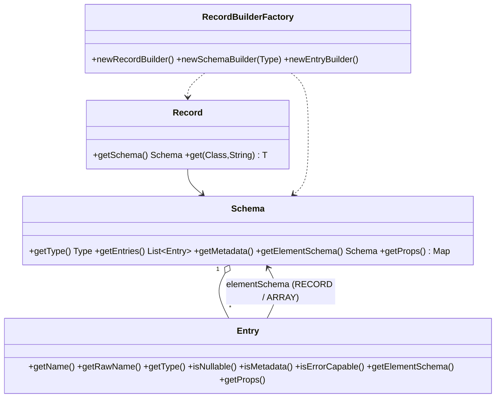

# 04 - Data model (Record, Schema, mappings)

> Framework version documented: **1.2611.0-SNAPSHOT** (root `pom.xml`).
> Sources: `component-api/.../api/record`, `component-api/.../api/service/record`, `component-api/.../api/service/schema`,
> `component-runtime-impl/.../runtime/record`, `component-runtime-manager/.../xbean/converter/SchemaConverter.java`,
> `component-runtime-beam/.../beam/spi/record`, Antora pages `record-types.adoc`, `component-record.adoc`.
> Feature IDs: [`02-feature-catalog/DAT-data-model.md`](02-feature-catalog/DAT-data-model.md) (machine index: [`index.DAT.json`](02-feature-catalog/index.DAT.json)).
> Related: [`06-runtime-execution.md`](06-runtime-execution.md) (how records flow), [`03-component-server-api.md`](03-component-server-api.md) (Schema payloads returned by actions).

Normative keywords (MUST/SHOULD/MAY) address the **host** (Designer or Runtime). Statements marked *(inferred)* are deductions from code, not documented behaviour.

## 1. Overview



* A `Record` (DAT-001) is immutable and carries a `Schema` (DAT-004). It is created only through `RecordBuilderFactory` (DAT-016), a per-plugin, Serializable service.
* Components may also produce/consume `JsonObject` or POJOs; the runtime converts to `Record` at the boundary (DAT-029). A host MUST therefore treat `Record` as the only exchange format between components.
* The default implementation is `RecordImpl` / `SchemaImpl` (`component-runtime-impl`). With `component-runtime-beam` on the classpath an Avro-backed implementation is selected automatically (DAT-031, DAT-034).

## 2. Types (`Schema.Type`, DAT-005)

| `Schema.Type` | Accepted Java classes (`Type.isCompatible`) | `Record` accessor | Stored as (`RecordImpl`) | JSON (record -> JsonObject, DAT-030) | Avro (DAT-031) |
|---|---|---|---|---|---|
| `STRING` | `String`, any `Object` | `getString` | `String` | string | `string` |
| `BYTES` | `byte[]`, `Byte[]` | `getBytes` | `byte[]` | Base64 string | `bytes` (`ByteBuffer`) |
| `INT` | `Integer` | `getInt` | `Integer` | number | `int` |
| `LONG` | `Long` | `getLong` | `Long` | number | `long` |
| `FLOAT` | `Float` | `getFloat` | `Float` | number (double) | `float` |
| `DOUBLE` | `Double` | `getDouble` | `Double` | number | `double` |
| `BOOLEAN` | `Boolean` | `getBoolean` | `Boolean` | `true`/`false` | `boolean` |
| `DATETIME` | `Long`, `java.util.Date`, any `java.time.temporal.Temporal` | `getDateTime` (`ZonedDateTime`, UTC), `getInstant` | `Long` epoch millis (or `Instant` via `withInstant`) | ISO-8601 zoned string (`ISO_ZONED_DATE_TIME`), array items as epoch millis | `long` + `timestamp-millis`; `int` + `date`; `int` + `time-millis` (logical types DAT-012) |
| `DECIMAL` | `BigDecimal` | `getDecimal` | `BigDecimal` | string (`BigDecimal.toString()`) | `string` + custom logical type `decimal`, prop `talend.component.DECIMAL=true` |
| `RECORD` | `Record` | `getRecord` | `Record` | nested object | nested `record` |
| `ARRAY` | `Collection` | `getArray(Class, name)` | `Collection` | array (homogeneous) | `array` of nullable union |

A host that stores records MUST support all 11 types. `null` is compatible with every type.

## 3. Schema

### 3.1 Shape (DAT-004, DAT-006, DAT-008)

* `getType()`: `RECORD`, `ARRAY` or a primitive. Primitive schemas are the shared singletons `Schemas.STRING`, ... and are immutable (any mutator throws `UnsupportedOperationException: Not allowed for a primitive`).
* RECORD schemas: `getEntries()` = data entries, `getMetadata()` = metadata entries (DAT-035), `getAllEntries()` = metadata first then data. `getEntry(name)` looks up by sanitized name.
* ARRAY schemas: `getElementSchema()` is mandatory (`withElementSchema` is only accepted when the schema type is ARRAY).
* `getProps()`: free `Map<String,String>`; `talend.fields.order` is written by the builder (DAT-009).
* An `Entry` has: `name`, `rawName`, `type`, `nullable`, `metadata`, `errorCapable`, `defaultValue`, `elementSchema` (required for RECORD/ARRAY entries), `comment`, `props`.
* `Schema.equals` compares type, elementSchema, entries, metadata entries and props; `hashCode` only uses names (performance shortcut).

### 3.2 Entry naming and collisions (DAT-013)

`Entry.Builder.withName(n)` sanitizes `n` unless `-Dtalend.component.record.skip.sanitize=true`:

1. First character: keep if ASCII letter or `_`; otherwise it is skipped when the second character exists and is not a digit, else replaced by `_`.
2. Next characters: keep ASCII letters/digits; other ASCII characters become `_`; non-ASCII letters become `_`; non-ASCII non-letters are UTF-8 Base64 encoded then sanitized.
3. If sanitizing changed the name, the original is kept in `rawName`.

| Input | Result |
|---|---|
| `foo123` | `foo123` |
| `1foo` | `foo` |
| `f@o` | `f_o` |
| `1234f5@o` | `___f5_o` |

Collision (`SchemaCompanionUtil.avoidCollision`): adding an entry whose sanitized name exists renames one of them to `<sanitized raw name>_<n>` (n starts at 1, first free); adding a *different* entry that has the same name as an existing one, when neither carries a raw name, is rejected by `SchemaImpl.BuilderImpl` (`Entry with name X already exist in schema`); `RecordImpl.BuilderImpl` instead reuses the entry (the value overwrites, the schema keeps the first entry); re-adding an equal entry is a no-op. Consequence: a host MUST address columns by `Entry.getName()`, never by the source-system name, and SHOULD display `rawName` when present.

### 3.3 Ordering (DAT-009)

The order of entries is defined by prop `talend.fields.order` (comma-separated names). `SchemaImpl` computes it from insertion order when absent; `Schema.Builder.moveAfter/moveBefore/swap/withEntryAfter/withEntryBefore` change it; `build(Comparator)` freezes an explicit order. `getEntriesOrdered()` returns entries in that order; entries missing from the list sort last. Record builders honour `before(name)` / `after(name)` for the next added entry.

### 3.4 Properties (DAT-011, DAT-012)

`SchemaProperty` keys (all string values): `field.origin.type`, `field.logical.type` (`date`, `time`, `timestamp`, `uuid`), `field.size`, `field.scale`, `field.pattern`, `talend.studio.type`, `field.key`, `field.foreign.key`, `field.unique`, `field.special.name`, `record.value.on.error`, `record.value.on.error.message`, `record.value.on.error.fallback_value`. `LogicalType.UUID` has storage type STRING; the others DATETIME. Hosts MUST preserve props they do not understand.

### 3.5 Schema JSON forms

**(a) Configuration form** - value of an `@Option` of type `Schema` (DAT-032). Written/read by `SchemaConverter`:

```json
{
  "type": "RECORD",
  "entries": [
    {"name": "id", "type": "LONG", "nullable": false, "props": {"field.key": "true"}},
    {"name": "tags", "type": "ARRAY", "nullable": true, "elementSchema": "STRING"},
    {"name": "address", "type": "RECORD", "nullable": true,
     "elementSchema": {"type": "RECORD", "entries": [{"name": "city", "type": "STRING"}]}}
  ],
  "props": {"talend.fields.order": "id,tags,address"},
  "order": "id,tags,address"
}
```

Rules: `type` required; `nullable` defaults to `true` when reading; `metadata` defaults to `false`; `metadatas` (array) is also read as metadata entries; entry `elementSchema` may be a full object or, for scalar arrays, the type name string; `defaultValue` is read for number, boolean and string only (arrays/objects ignored); `props` values MUST be strings; `order` (optional) sets the entry order.

**(b) Action-result form** - result of `@DiscoverSchema` / `@DiscoverSchemaExtended` actions: the framework serializes the `Schema` returned by the service with JSON-B, giving `type`, `entries` (objects with `name`, `rawName`, `type`, `nullable`, `metadata`, `errorCapable`, `defaultValue`, `elementSchema`, `comment`, `props`), `props` and `elementSchema` (asserted by `component-server` test `SchemaTest`); `metadata` is *(inferred)* from the public getter `getMetadata()`. The server-side model class (`component-server-model`, `org.talend.sdk.component.server.front.model.Schema`) is documented in [`03-component-server-api.md`](03-component-server-api.md).

## 4. Records

### 4.1 Building (DAT-002, DAT-016)

Two modes of `RecordBuilderFactory`:

| Mode | Call | Behaviour |
|---|---|---|
| Dynamic schema | `newRecordBuilder()` | schema inferred from the calls; by-name setters create entries (`withString`, `withBytes`, `withDateTime(Date|ZonedDateTime)`, `withDecimal`, `withRecord(name, Record)` -> nullable; `withInt/Long/Float/Double/Boolean`, `withTimestamp`, `withInstant` -> NOT nullable) |
| Provided schema | `newRecordBuilder(schema)` | every setter validates: unknown name -> `IllegalArgumentException: No entry 'x' expected in provided schema`; wrong type -> `Entry 'x' expected to be a T, got a U`; null on non-nullable -> `Entry 'x' is not nullable`; `build()` -> `Missing entries: a, b` |
| Copy | `newRecordBuilder(schema, record)` | copies values of entries present by name in `schema` |

Additional rules of `RecordImpl.BuilderImpl`:

* `with(Entry, Object)` verifies `entry.getType().isCompatible(value)`; DATETIME values (`Long`, `Date`, `ZonedDateTime`, `Instant`, other `Temporal` -> `INSTANT_SECONDS*1000`) are normalized to epoch millis (`Instant` kept as `Instant`).
* `withRecord(Entry, Record)` and `withArray(Entry, Collection)` require `entry.getElementSchema() != null` (`No schema for the nested record` / `No schema for the collection items`). Array item types are not verified.
* Nulls (DAT-015): with the default flag value, a null on a nullable entry is not put in the value map (the entry is still added to the schema, reads return null) and a null on a non-nullable entry throws `<name> is not nullable but got a null value`; with `talend.component.record.nullable.check=true` these checks are skipped and nulls are stored.
* `withNewSchema(schema)` on a `Record` returns a builder holding the values of entries that are **equal** to the ones in the new schema.
* Records are immutable after `build()` (backing map is unmodifiable).

### 4.2 Reading (DAT-001, DAT-003)

`Record.get(Class<T>, name)` returns the stored value when it is an instance of the class, otherwise `MappingUtils.coerce` is applied (section 6). Typed getters (`getInt`, ...) return primitives and MUST NOT be used on nullable entries; use `getOptionalXxx`. Reading an unknown entry name returns `null` (no exception) on `RecordImpl`.

### 4.3 Entry-level errors (DAT-014)

With `-Dtalend.component.record.error.support=true`, an `errorCapable` entry that receives an invalid value does not fail: the produced schema replaces that entry by a nullable copy carrying `record.value.on.error=true`, `record.value.on.error.message`, `record.value.on.error.fallback_value`; `record.isValid()` is false and `entry.isValid()` is false. A host reading records MUST check `isValid()` when it enables the feature.

## 5. Services around records

| Service | Feature | Purpose | Notes |
|---|---|---|---|
| `RecordBuilderFactory` | DAT-016 | create records/schemas/entries | provided per plugin, resolved through `RecordBuilderFactoryProvider` SPI (DAT-034); serialized as `SerializableService` |
| `RecordService` | DAT-017 | POJO<->Record (`toObject`, `toRecord`), `forwardEntry`, custom rebuild, `visit` | reference `RecordServiceImpl` |
| `RecordVisitor<T>` | DAT-018 | typed traversal with `Optional` values | default methods are no-ops; `onRecord`/`onRecordArray` return the visitor for the nested level |
| `RecordPointerFactory` / `RecordPointer` | DAT-019, DAT-020 | JSON-Pointer style extraction | see 5.1 |
| `ObjectFactory` | SVC-015 | build objects from property maps | not record specific |

### 5.1 RecordPointer syntax (DAT-020)

* `""` or `"/"` = the record itself.
* Otherwise the pointer MUST start with `/`; tokens are separated by `/`; `~1` = `/`, `~0` = `~`.
* A token applied to a `Record` is an entry name (lookup via `schema.getEntry`, fallback `record.get(Object.class, token)`); if absent -> `IllegalArgumentException: '<record>' contains no value for name '<token>'`.
* A token applied to a `Collection` is a decimal index without sign or leading zero (`0` allowed); out of range or invalid -> `IllegalArgumentException`.
* `getValue(record, Class)` returns `type.cast(value)`.

Example: `/address/street`, `/orders/0/id`.

## 6. Conversions

### 6.1 Component values to Record (DAT-029)

| Incoming value returned by a producer / emitted by a processor | Conversion (`RecordConverters.toRecord`) |
|---|---|
| `null` | `null` |
| `Record` | unchanged |
| `JsonObject` | `json2Record`: string->STRING, `true/false`->BOOLEAN, any number->**DOUBLE**, object->RECORD (element schema = nested), array->ARRAY (element schema from first item; RECORD items merged by union of field names; empty array -> STRING), `null` values skipped |
| Studio `routines.system.*` row struct | via `DiRowStructVisitor` (Studio DI runtime only) |
| POJO / other | if the plugin Jsonb is a `PojoJsonbProvider`, JSON-B writes directly into a Record (`RecordJsonGenerator`), else `Jsonb.toJson` -> JsonObject -> `json2Record` |
| primitives and `String` | returned as is by `InputImpl` (kept for tests) |

### 6.2 Record to component parameter type (DAT-029, RUN-049)

`RecordConverters.toType`: same instance if compatible; `JsonObject` from a Record via `toJson` (section 6.3); POJO via Jsonb from that JsonObject; for POJOs implementing Studio row structs a `DiRecordVisitor` is used; `Record` requested from a non-Record -> `toRecord`.

### 6.3 Record to JsonObject / JSON-B (DAT-030)

Applied per entry, `null` values are omitted: STRING/INT/LONG/FLOAT/DOUBLE/BOOLEAN as JSON scalars; BYTES -> Base64 (standard alphabet); DATETIME -> `ZonedDateTime.format(ISO_ZONED_DATE_TIME)`; DECIMAL -> `toString()`; RECORD -> nested object; ARRAY -> homogeneous array (empty array kept; item kind decided from the first item: String, Double, Float, Integer, Long, Boolean, `ZonedDateTime` -> epoch millis number, `Date` -> millis, Record -> object, JsonValue as is; other item kinds are silently dropped). Runtime JSON-B config: `BinaryDataStrategy.BASE_64`, `johnzon.cdi.activated=false`, `johnzon.accessModeDelegate=TalendAccessMode`.

```json
{
  "name": "Gary",
  "active": true,
  "birth": "2011-02-06T08:00:00Z[UTC]",
  "blob": "SGVsbG8=",
  "balance": "12.58",
  "address": {"street": "Prairie aux Ducs", "city": "Nantes"},
  "permissions": ["admin", "dev"]
}
```

### 6.4 Coercion rules (DAT-033)

`MappingUtils.coerce(expectedType, value, name)` (used by `Record.get`) applies, in order, only when `value` is not already an instance of `expectedType`:

| # | Condition | Result |
|---|---|---|
| 1 | value is null | null |
| 2 | value is `Long` and expected `ZonedDateTime` / `Date` / `Instant` | epoch-millis conversion (`ZonedDateTime` in `UTC`) |
| 3 | value is `Number` and expected is a Number type/primitive/`BigDecimal` | `BigDecimal.valueOf(double)`, `doubleValue()`, `floatValue()`, `intValue()`, `longValue()`, `byteValue()`, `shortValue()` (narrowing, no overflow check) |
| 4 | primitive <-> wrapper | unboxing/boxing |
| 5 | expected `String` | `String.valueOf(value)` |
| 6 | value is `Instant` | `ZonedDateTime` (UTC), `java.sql.Timestamp` (for `Date`), or `Long` millis |
| 7 | value is `Timestamp` and expected `Date`/`Instant` | unchanged |
| 8 | value is `long[]{seconds, nanos}` | `Instant` / `ZonedDateTime` |
| 9 | value is `String` | `Boolean.valueOf`; `"null"` (any case, trimmed) -> null; `ZonedDateTime` (digits with optional `-` = epoch millis, else `ZonedDateTime.parse`); `Date`; `char`/`Character` (first char, or `\u0000` if empty); `byte[]` (Base64 decode, fallback `getBytes()` with a warning); `BigDecimal`; `Integer`; `Long`; `Short`; `Byte`; `Float`; `Double` |
| 10 | otherwise | `IllegalArgumentException: <name> can't be converted to <type> as its value is '<v>' of type <cls>.` |

The Avro implementation (`AvroRecord`) has its own `get` logic: it additionally maps Avro `date` (`int`, epoch days), `time-millis` (`int`) and `timestamp-millis` (`long`) to `ZonedDateTime` (UTC), `ByteBuffer` to `byte[]`, decimals stored as string to `BigDecimal`.

## 7. Avro mapping (DAT-031)

Only relevant when the runtime uses `component-runtime-beam`.

* Record schema name: `org.talend.sdk.component.schema.generated.Record_<fieldCount>_<parsing fingerprint>` (`SchemaIdGenerator`; negative fingerprints are written `_n_<abs>`).
* Nullable entry -> union `[T, null]`; non-nullable -> plain `T`.
* Entry props are copied to the Avro field; `talend.component.label` carries the raw name; `talend.field.__METADATA__` alias marks metadata entries; `talend.component.record.entry.errorCapable` and `talend.component.record.value.on.error` carry error support.
* DATETIME: `timestamp-millis` by default (`Long` millis); logical type DATE -> `date` (int, epoch day); TIME -> `time-millis` (int, ms of day, UTC).
* DECIMAL -> string with the framework logical type `decimal` (`Decimal.validate` requires a STRING backing type) and prop `talend.component.DECIMAL=true`; `AvroRecord` writes `BigDecimal.toString()`.
* BYTES -> `ByteBuffer.wrap`; `RecordImpl` values inside an Avro record are converted recursively.
* `AvroRecordBuilderFactory` refuses to start if `talend.component.record.skip.sanitize=true`.
* `SchemaRegistryCoder` (Beam transport, RUN-045) prefixes each encoded record with the generated schema id and a newline.

## 8. Schema discovery and dataset discovery payloads

| Action annotation | Feature | Returns | Parameters |
|---|---|---|---|
| `@DiscoverSchema` | ACT-007 | `Schema` (record form) | the dataset (`@DataSet` type) as `@Option` |
| `@DiscoverSchemaExtended` | ACT-008 | `Schema` for an outgoing branch | configuration, optionally incoming `Schema` and branch name |
| `@FixedSchema` (component-level) | DAT-024 | n/a (metadata) | `tcomp::ui::schema::fixed`, `tcomp::ui::schema::flows::fixed`, `tcomp::ui::schema::fixed::watch` |
| `@DatabaseSchemaMapping` / `@DatabaseMapping` | ACT-013, DSG-014 | `String` mapping / metadata | Studio only |
| `@DiscoverDataset` | ACT-009 | `DiscoverDatasetResult` (ACT-009) | the datastore |

`DiscoverDatasetResult` JSON: `{"datasetDescriptionList":[{"name":"customers","metadata":{"schema":"public"}}]}`.

## 9. Host implementation checklist (data model)

Level 0 (Runtime): implement or reuse `RecordImpl`/`SchemaImpl` (DAT-001..008, DAT-013, DAT-016, DAT-029); support the 11 types; keep `name`/`rawName`; convert non-Record producer output to Record before transport.
Level 0 (Designer): read Schema JSON (DAT-004..006).
Level 1: entry order (DAT-009), props (DAT-011/012), schema discovery actions (ACT-007, ACT-008, ACT-024), Schema-typed options (DAT-032), nested types (DAT-036), JSON mapping (DAT-030), `RecordService` (DAT-017).
Level 2: visitors/pointers (DAT-018..020), error entries (DAT-014), Avro (DAT-031), dataset discovery (ACT-009/028), Studio mappings (ACT-013/026).

## 10. Documentation vs code notes

* The Antora page `record-types.adoc` lists only 10 supported types (no DECIMAL) although `Schema.Type` has `DECIMAL` (code wins).
* `record-types.adoc` says entry names `1foo` -> `foo`, matching `SchemaCompanionUtil`; it does not document `rawName`.
* `Record.RECORD_NULLABLE_CHECK`: the property name suggests enabling a check, but `true` disables it (DAT-015).
* `component-record.adoc` describes `Input` snippets with `getCheckpoint` unrelated to records (copy/paste in the docs); the entry-error API described there matches DAT-014.
