# 05 - Configuration and UI: from `@Option` tree to rendered form and triggered actions

> Framework version documented: `1.2611.0-SNAPSHOT` (root `pom.xml`).
> Audience: implementers of an ETL **Designer** (form renderer, action wiring) and, for the serialization part, of a **Runtime**.
> Catalog IDs used: [DSG](02-feature-catalog/DSG-design.md), [CFG](02-feature-catalog/CFG-configuration.md), [UI](02-feature-catalog/UI-ui.md), [VAL](02-feature-catalog/VAL-validation.md), [ACT](02-feature-catalog/ACT-actions.md). Endpoint and payload reference: [03](03-component-server-api.md). Data model: [04](04-data-model.md). Blueprints: [07](07-designer-blueprint.md), [08](08-runtime-blueprint.md).
> Inferences are marked `(inferred)`; things not verifiable in the repository are marked `(unverified)`.

## 1. Pipeline overview

```mermaid
flowchart LR
  A["Java model: @Option classes + UI/constraint/action annotations"] -->|"ParameterModelService + ParameterExtensionEnrichers (component-runtime-manager)"| B["ParameterMeta tree (metadata keys tcomp::*)"]
  B -->|"PropertiesService (component-server)"| C["SimplePropertyDefinition[] (metadata keys without tcomp::, validation object)"]
  C -->|"GET /component/details, /configurationtype/details"| D["Designer"]
  D -->|"component-form UiSpecService or equivalent"| E["JSON schema + UI schema + initial properties"]
  E -->|"user edits"| F["form values (nested JSON)"]
  F -->|"flatten (section 11)"| G["flat map configuration.path=value"]
  G -->|"POST /action/execute (design time)"| H["Component server actions"]
  G -->|"saved configuration + version"| I["Runtime: ComponentManager builds the object graph and validates"]
```



Facts driving the design:

- The designer never sees Java types; it sees `SimplePropertyDefinition` (`CFG-014`).
- All rendering hints are metadata; all constraints are in `validation` (`VAL-007`); all action bindings are `action::*` metadata plus the component's `ActionReference` list (`SRV-012`, `ACT-026`).
- The configuration exchanged with the server (actions) and the runtime is a flat `Map<String,String>` keyed by option path (`CFG-002`).

## 2. `@Option` tree to `ParameterMeta`

Rules implemented by `ParameterModelService` (`component-runtime-manager`):

1. Root options are the constructor (or action method) parameters that are not services. A parameter is a *service* when it has no `@Option` and its type is `@Service`, `@Internationalized`, has `@Request` methods, is in an `org.talend.sdk.component...service...` package, is in `javax.*`, or the parameter has `@Configuration` (`isService`).
2. Name = `@Option.value()` if non-empty, else the parameter/field name. The path of a root option is its name; children append `.<name>`.
3. Type: see `CFG-003` (`STRING`, `NUMBER`, `BOOLEAN`, `ENUM`, `OBJECT`, `ARRAY`). `OBJECT` children = all non-static `@Option` fields of the class and its superclasses (subclass field wins on a name clash), then sorted by name.
4. Arrays/collections: one nested definition `path[${index}]` (primitive element) or `path[${index}].<child>` (object elements). Maps: `path.key[${index}]...` and `path.value[${index}]...`.
5. Metadata: for every annotation of the field **and** every annotation of the field's class (or of the list's element class) that the field itself does not override, each `ParameterExtensionEnricher` contributes keys (`CFG-015`). Two different values for one key are an error (`Ambiguous metadata`). Implicit annotations: `@DateTime` on `ZonedDateTime`/`LocalDateTime`/`LocalDate`/`LocalTime`; `@Min`/`@Max` on `int`/`Integer`; char length constraints.
6. Built-in virtual options may be appended: `$maxBatchSize`, `$maxRecords`, `$maxDurationMs` (`CFG-016`).
7. i18n packages: the component package plus the package of each nested class, in order, for `Messages.properties` lookup (`DSG-013`).

## 3. `ParameterMeta` to `SimplePropertyDefinition` (server)

`PropertiesService.buildProperties` (`CFG-014`): flatten the tree depth-first, `${index}` removed from paths (`a[].b`), sort all records by `path`. Per record: `path`, `name`, `displayName` (bundle or name), `type`, `defaultValue` (from a demo instance; `CFG-014`), `validation` (from `tcomp::validation::*`, `enumValues` added for enums; `VAL-007`), `metadata` (`tcomp::` stripped, `validation::*` removed, `definition::parameter::index` added on root records), `placeholder`, `proposalDisplayNames`.

Consequences for the designer:

- Property lookups MUST use exact `path`; direct children of `P` are records whose path starts with `P.` and contain no further `.` and do not end with `[]` (`PropertyContext.isDirectChild`).
- The element definition of an array of objects has path `P[].<child>`; its presence (any record starting with `P[].`) tells the designer that the array holds objects, otherwise it holds primitives (`P[]` only).
- Array defaults are JSON strings (e.g. `"[{\"description\":\"D1\",\"driver\":\"d1\"}]"`, recorded fixture `component-form-core/src/test/resources/suggestions.json`).

## 4. Complete metadata key catalogue (property level, as delivered by the server)

| Key | Value | Produced by | Consumer meaning | Catalog |
|---|---|---|---|---|
| `definition::parameter::index` | int as string | server (root parameters of a component/action) | order of the parameter in the method signature; maps action parameters to `parameters` references | `CFG-014`, `ACT-024` |
| `documentation::value` | text | `@Documentation` | help text (overridable by `._documentation` i18n) | `DSG-007` |
| `documentation::tooltip` | `true` | `@Documentation(tooltip=true)` | render doc as tooltip | `DSG-007` |
| `ui::defaultvalue::value` | string | `@DefaultValue` | initial value (wins over `defaultValue`) | `CFG-004` |
| `ui::hidden` | `true` | `@Hidden` | never show | `CFG-005` |
| `ui::optionsorder::value` | `a,b,c` | `@OptionsOrder` | child order | `CFG-006` |
| `ui::gridlayout::<Name>::value` | `row1a,row1b\|row2` | `@GridLayout(s)` | layout per form name | `UI-002` |
| `ui::autolayout`, `ui::horizontallayout`, `ui::verticallayout` | `true` | layout markers | hints | `UI-004..006` |
| `ui::textarea` | `true` | `@TextArea` | multiline | `UI-007` |
| `ui::code::value` | language | `@Code` | code editor | `UI-008` |
| `ui::credential` | `true` | `@Credential` | password | `UI-009` |
| `ui::datetime` | `time\|date\|datetime\|zoneddatetime` | `@DateTime` / implicit | picker kind | `UI-010` |
| `ui::datetime::dateFormat`, `::useSeconds`, `::useUTC` | string / bool | `@DateTime` | picker options | `UI-010` |
| `ui::modulelist` | `true` | `@ModuleList` | Studio | `UI-011` |
| `ui::path::value` | `FILE\|DIRECTORY` | `@Path` | Studio | `UI-012` |
| `ui::structure::value`, `::discoverSchema`, `::type` | string, string, `IN\|OUT` | `@Structure` | schema binding | `UI-013` |
| `ui::basedonschema` | `true` | `@BasedOnSchema` | Studio | `UI-014` |
| `ui::readonly` | `true` | `@ReadOnly` | read-only | `UI-015` |
| `condition::if::target`, `::value`, `::negate`, `::evaluationStrategy` | strings | `@ActiveIf` | visibility | `UI-016` |
| `condition::if::<attr>::<i>` and `condition::ifs::operator` | strings | `@ActiveIfs` | grouped visibility | `UI-017` |
| `action::suggestions` (+ `::parameters`, `::labelDisplayMode`) | action name | `@Suggestable` | suggestions | `ACT-016` |
| `action::dynamic_values` | action name | `@Proposable` | dynamic list | `ACT-017` |
| `action::update` (+ `::parameters`, `::after`, `::activeIf`) | action name | `@Updatable` | update button | `ACT-018` |
| `action::validation` (+ `::parameters`) | action name | `@Validable` | async validation | `ACT-019` |
| `action::healthcheck` | action name | `@Checkable` | test connection | `ACT-020` |
| `action::built_in_suggestable` | name | `@BuiltInSuggestable` | host-side suggestions | `ACT-021` |
| `action::schema` (+ `::discoverSchema`, `::type`) | action name | `@Structure` | guess schema | `UI-013` |
| `configurationtype::type` / `::name` | type id / name | `@DataStore` etc. | reusable configuration | `CFG-007` |
| `dependencies::connector` | `family\|name\|mavenReference` | `@ConnectorRef` | connector reference | `CFG-013` |

Not present in `metadata` (moved to `validation`): `validation::required|min|max|minLength|maxLength|minItems|maxItems|uniqueItems|pattern`.

Component-level metadata keys (`ComponentIndex.metadata`, `ComponentDetail.metadata`): see `DSG-008`.

## 5. Layout resolution algorithm

Input: object property `P` (type `OBJECT`), all records, requested form filter `F` (nullable).

1. Collect `L = { name -> spec }` from keys `ui::gridlayout::<name>::value` (names compared case-insensitively). If `F` is not null and `F` in `L`, keep only `F`.
2. If `L` is not empty:
   1. If `|L| == 1`: render a single layout container (no tabs).
   2. Else tabs = (`Main` in `L`) ? [`Main`, `Advanced`] : names sorted case-insensitively. `Advanced` may be absent (tab skipped). Tab titles = layout names; empty tabs are dropped. (Other layouts, e.g. `Checkpoint`, are only rendered when requested through `F`.)
   3. For each layout: `rows = spec.split("|")`; for each row `cells = row.split(",")`. A row with one cell renders that child alone; a row with several cells renders a horizontal group (`columns`) of those children in order. Cells naming a non-existent child are skipped (inferred from `childProperties.get(...) == null`).
   4. Children not mentioned in any row are **not rendered** (validator logs them as errors; `LayoutValidator`).
3. Else if `ui::optionsorder::value` exists: children in that order, unlisted children last (order among them undefined by that key; `component-form` keeps sort stability and falls to the end); one child per line.
4. Else: children alphabetically by `path`.
5. Append buttons after the children of `P` (in this order): guess-schema button (if a descendant `ui::structure::type=OUT`), health-check button (if `action::healthcheck` on `P`), update button (if `action::update` on `P`; placed after the child named by `::after` when given). Buttons are `widget: button` with one trigger each.
6. If `tab names are translated` (`UI-022`), do not rely on `Main`/`Advanced` literals.

## 6. Widget selection algorithm

For each property `p` (skip records whose path ends with `[]` and have `STRING` type):

1. `ui::hidden` -> attach condition `{"==":[1,-1]}` (never visible) but keep the field in the model.
2. Dispatch on `type`:
   - `OBJECT` -> section 5 (recursion into children; container widget `fieldset`, `tabs` or `columns`).
   - `BOOLEAN` -> `toggle`.
   - `ENUM` -> `datalist`, `restricted=true`, options from `validation.enumValues` with labels from `proposalDisplayNames` (else the constant names sorted).
   - `NUMBER` -> `text` restricted to numbers by the JSON schema.
   - `ARRAY` -> if child records `p[].*` exist: array of nested forms (`itemWidget=collapsibleFieldset`, items rendered with section 5 using the element metadata `p[]`); else `multiSelect` (options from `action::dynamic_values` if present, otherwise free entries).
   - `STRING` -> first match of: `ui::credential`, `ui::code::value`, `action::suggestions | action::built_in_suggestable`, `action::dynamic_values`, `ui::textarea=true`, `ui::datetime`, else `text`.
3. Copy `displayName` -> title, `placeholder`, `ui::readonly` -> read-only, `validation.required` -> required flag, `documentation::value` -> description/tooltip.
4. Build the condition (section 7) and triggers (section 9).

Widget table (reference generator names): `text`, `text`+`type=password`, `textarea`, `code`(`options.language`), `datalist`, `multiSelect`, `toggle`, `date`, `datetime`, `fieldset`, `tabs`, `columns`, `button`, `collapsibleFieldset` (as `itemWidget`).

## 7. Conditions (`@ActiveIf`, `@ActiveIfs`)

### 7.1 Path resolution (normative)

`resolve(P, ref)` where `P` is the dotted path of the decorated property:

1. If `ref` contains no `.`, set `ref = "../" + ref` (sibling).
2. If `ref == "."` return `P`.
3. If `ref` starts with `..`: `cur = P`; while `ref` starts with `..`: cut `cur` at its last `.` (if none, `cur = ""`), drop the leading `..` and one following `/`; stop early when `cur` is empty. Result = `cur` joined by `.` with the remainder where `/` is replaced by `.` (empty parts omitted).
4. If `ref` starts with `.`/`./`: `P + "." + remainder` with `/` -> `.`.
5. Otherwise `ref` is absolute.

### 7.2 Evaluation (normative, mirrors `VisibilityService`)

```text
visible(property, values):
  conds = one per key "condition::if::target[::i]"
  for each cond:
     path   = resolve(property.path, target)
     actual = values.at(path)                # null if absent; JSON numbers -> double, arrays -> list
     hit(v) = case evaluationStrategy:
        DEFAULT  : v == string(actual)                         # string compare (numbers: "1.0"? use the JSON text; unverified)
        LENGTH   : size(actual) == int(v)   # null -> only v=="0"; size of list/array/string
        CONTAINS : actual contains v        # string substring or any element containing v; "lowercase=true" lower-cases actual
     result = negate != any(hit(v) for v in values_of_cond)   # values split on ","
  combine results with condition::ifs::operator (AND default; OR)
  no condition -> visible
```

Invisible properties MUST NOT be validated and MUST NOT block save. Note: the `ui.scope` target is not a real path (`UI-019`).

### 7.3 Web mapping (JSON logic) - see `UI-021` for the operator table.

## 8. Validation

- Declarative constraints come from `validation` (`VAL-007`); implicit ones from Java types (`VAL-008`). Enforce on change/blur and again on save/run. Constraint applicability: numbers (`min`,`max`), strings (`minLength`,`maxLength`,`pattern`), arrays (`minItems`,`maxItems`,`uniqueItems`), any (`required`), enums (`enumValues`).
- `pattern` MUST be evaluated with JavaScript regex semantics.
- Only active (visible) properties are validated (section 7).
- Async validation: `action::validation` -> call `SRV-013` with the `parameters`; `status=KO` -> field error with `comment` (`VAL-010`, `VAL-011`).
- Server side (runtime): the component manager re-validates and fails instantiation with a multi-line `IllegalArgumentException` (`VAL-012`); `-Dtalend.component.configuration.validation.skip=true` disables it.

## 9. Actions: how a designer renders and triggers them

### 9.1 Deriving triggers (mirrors `component-form`)

For each property `p` with `action::<type>` metadata and a matching `ActionReference{family,name,type}` (name equality ignoring a `(...)` suffix, `type` equal to the metadata key suffix):

| Type | Where the UI element goes | Event | Effect of the response |
|---|---|---|---|
| `suggestions` | on `p` (`datalist`) | `focus` and `change` | fill options (`items[].label/id`); honor `cacheable` |
| `dynamic_values` | on `p` | at form build | fill options once |
| `validation` | on `p` | (unspecified; on change/blur (inferred)) | show `comment` if `KO` |
| `healthcheck` | button in the enclosing datastore object | click | show `OK`/`KO` + `comment` |
| `schema` (`@Structure`, `OUT`) | "Guess Schema" button in the enclosing dataset/object | click | replace the structure with the returned schema |
| `update` | button in the annotated object (after `::after` child) | click | replace object at `options.path` with the response |
| `built_in_suggestable` | on `p` | `focus`, `remote=false` | host-local suggestions |
| other `action::*` | passed through as generic trigger | - | host-defined |

### 9.2 Building the request

1. For trigger `t`, `t.parameters = [{key, path}]`. Request body: `body[key] = flatValue(path)` for every parameter, where `flatValue` yields the flattened values of the sub-tree (objects expand to several keys as in section 11).
2. Send `POST /action/execute?family=<t.family>&type=<t.type>&action=<t.action>&lang=<ui language>` (JSON body, `Map<String,String>`).
3. Parameters reference syntax: `ACT-025`; `.` sends the option itself.
4. Do not send technical `$lang`; the server adds it.
5. Credentials MAY be sent vault-encrypted; the server decrypts using header `x-talend-tenant-id` (`SRV-013`).

### 9.3 Handling errors

`400/404` (missing/unknown), `456` (backend error), `520` (action failure, or user error mapped to `400`): show `ErrorPayload.description` near the originating widget. `component-form` maps `WebException` to `UiActionResult{error, errors, rawData}` reading `description` or `comment` from the payload.

### 9.4 Update details

Given `action::update`, `action::update::parameters`, `action::update::after`, `action::update::activeIf` on object `O`:

1. Render the button after child `after` (or at the end of `O`).
2. If `activeIf` is set, show the button only when the child named in `target = <child>` equals `true` (or equals one of `condition::if::value::<child>` when present) `(as implemented by component-form)`.
3. On click send the parameters; the response JSON replaces the value at `options[0].path` (type = `options[0].type`); re-evaluate conditions and validations afterwards.

## 10. Datastore/dataset reuse

1. Load `GET /configurationtype/index` (see [03](03-component-server-api.md)); build the tree with `edges`/`parentId` (`CFG-017`).
2. A component form property with `configurationtype::type=dataset|datastore` and `configurationtype::name=N` is a slot for the reusable node named `N` of the component's family. The designer SHOULD offer "pick a saved configuration or edit inline" and store the chosen values under the slot path.
3. Persist `version` (node version) with each saved instance; on load, if `version < node.version`, call the configuration migration endpoint before rendering.
4. Test connection: only when `action::healthcheck` is present (`ACT-020`).

## 11. Serialization to the runtime flat map

Given the form value tree `V` and the properties list:

1. Walk properties of type `STRING|NUMBER|BOOLEAN|ENUM`; key = property `path` with each `[]` replaced by `[i]` for the concrete element index; value = string form (`true`/`false`, number as plain decimal, enum constant name). Skip null/absent values (the framework applies field defaults).
2. Arrays: emit elements `p[0]`, `p[1]`...; for arrays of objects the children keys are `p[0].child`. Truncating an inherited array: `p[length]=N`.
3. Maps: `m.key[i]`, `m.value[i]` (with `.field` for object keys/values).
4. Include hidden (`ui::hidden`) and technical (`$maxBatchSize`, ...) values.
5. Prefix: the root path segment is the constructor parameter `@Option` name as delivered (`configuration` in the recorded fixtures); do not add other prefixes. For runtime URIs the framework uses `configuration.<path>` plus `__version=<n>` (see `JobTest`).
6. Always send the component/config `version` alongside (`LCM-001`).

## 12. Worked example (recorded fixture)

Input: property list of `component-form/component-form-core/src/test/resources/suggestions.json` (abridged):

```json
{
  "configurationType": "dataset", "name": "jdbc",
  "actions": [ { "family": "jdbc", "type": "suggestions", "name": "SuggestionForJdbcDrivers",
     "properties": [ { "name": "currentValue", "path": "currentValue", "type": "STRING",
                      "metadata": { "definition::parameter::index": "1" } } ] } ],
  "properties": [
    { "path": "configuration.driver", "name": "driver", "type": "STRING",
      "validation": { "minLength": 1 },
      "metadata": { "action::suggestions": "SuggestionForJdbcDrivers", "action::suggestions::parameters": "." } },
    { "path": "configuration.timeout", "name": "timeout", "type": "NUMBER",
      "defaultValue": "0", "validation": { "min": 1 }, "metadata": {} }
  ]
}
```

Output of `UiSpecService.convert(...)` for `configuration.driver` (asserted by `UiSpecServiceTest.suggestions`; other attributes follow the converter code):

```json
{
  "key": "configuration.driver",
  "widget": "datalist",
  "triggers": [
    { "action": "SuggestionForJdbcDrivers", "family": "jdbc", "type": "suggestions", "onEvent": "focus",
      "parameters": [ { "key": "currentValue", "path": "configuration.driver" } ] },
    { "action": "SuggestionForJdbcDrivers", "family": "jdbc", "type": "suggestions", "onEvent": "change",
      "parameters": [ { "key": "currentValue", "path": "configuration.driver" } ] }
  ]
}
```

The JSON schema gets `driver: {type: "string", minLength: 1}` and `timeout: {type: "number", minimum: 1, default: 0}`; the initial properties get `timeout: 0`. Request derived when the user focuses the field with value `org.h2`:

```
POST /api/v1/action/execute?family=jdbc&type=suggestions&action=SuggestionForJdbcDrivers&lang=en
{ "currentValue": "org.h2" }
```

Saved runtime configuration (flat): `configuration.driver=org.h2`, `configuration.timeout=5`, with `version=<n>`.

## 13. Acceptance tests (given / when / then)

| # | Given | When | Then |
|---|---|---|---|
| T1 | property `p` with `ui::gridlayout::Main::value = "a\|b,c"` and `Advanced = "d"` | rendering | tabs `Main`,`Advanced`; `Main` has row 1 = `a`, row 2 = `b` and `c` side by side |
| T2 | `p` with `ui::optionsorder::value = "z,a"` | rendering | children order `z`, `a`, others last |
| T3 | `x` with `condition::if::target=flag`, `value=true` and sibling `flag=false` | rendering / change `flag` to `true` | `x` hidden, then shown; hidden `x` empty and required does not block save |
| T4 | `condition::ifs::operator=OR` with two `::i` conditions | one holds | property visible |
| T5 | `condition::if::evaluationStrategy=LENGTH`, `value=0`, `negate=true` on target `foo` | `foo` empty, then `abc` | hidden, then shown |
| T6 | property with `ui::credential=true` | rendering | value masked |
| T7 | `action::suggestions` with `::parameters=.,../ds` | focus | one POST with keys from both parameters; response items shown as `label`, stored `id` |
| T8 | datastore with `action::healthcheck` | click test | POST `type=healthcheck`; `KO` shows `comment`; datastore without the key shows no button |
| T9 | `validation.required=true` and empty value on visible property | save | save blocked with message; on hidden property save allowed |
| T10 | `type=ENUM`, `enumValues=[A,B]` | user picks B | stored `B`; other strings rejected |
| T11 | array of objects `tables[].name` with two entries | serialize | keys `configuration.tables[0].name`, `configuration.tables[1].name` |
| T12 | saved instance `version=1`, server node `version=2` | load | migrate call issued before render |
| T13 | `action::update` with `::after=url` | click | POST `type=update`; response replaces the object; conditions re-evaluated |
| T14 | action returns HTTP 520 `ACTION_ERROR` | any trigger | error shown next to widget; form remains usable |

## 14. Discrepancies and notes (code beats prose)

- `component-registering.adoc` shows `@Components(name = ...)`; the annotation attribute is `family` (`DSG-001`).
- `generated_constraints.adoc` shows `validation::*` metadata keys; the server delivers them in the `validation` object and strips them from `metadata` (`CFG-014`).
- `component-configuration.adoc` says option names must not start with `$`, while the framework itself injects `$maxBatchSize`, `$maxRecords`, `$maxDurationMs`, `$configuration` (`CFG-016`).
- `Option.MAX_DURATION_PARAMETER`/`MAX_RECORDS_PARAMETER` are `maxDurationMs`/`maxRecords` (no `$`) whereas configuration keys are `$maxDurationMs`/`$maxRecords`.
- `generated_ui.adoc` sample for `@Path` shows `ui::path::value: "null"`; the real value is the enum name (`FILE`/`DIRECTORY`).
- Layout hints `@AutoLayout`, `@HorizontalLayout`, `@VerticalLayout` and widgets `@ModuleList`, `@Path`, `@BasedOnSchema` are delivered as metadata but not rendered by `component-form`.
