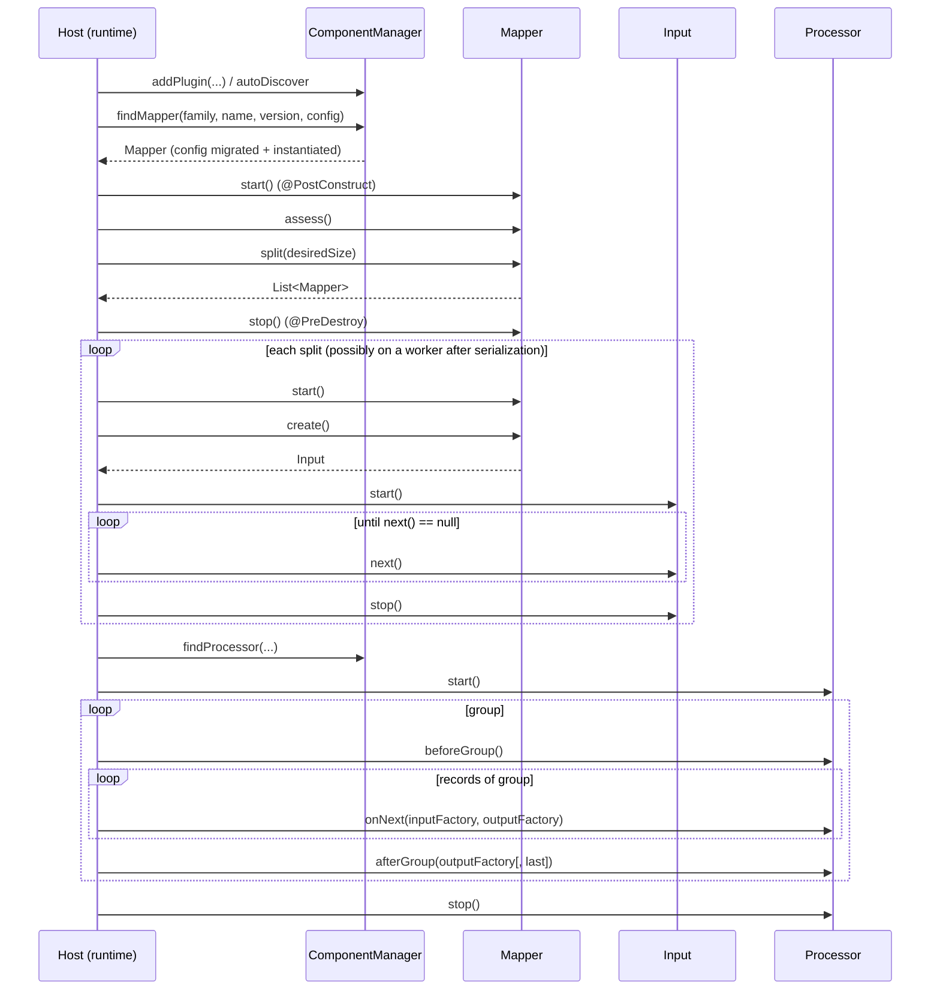
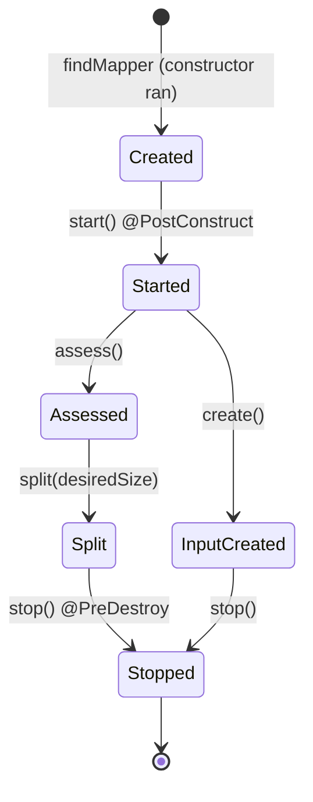
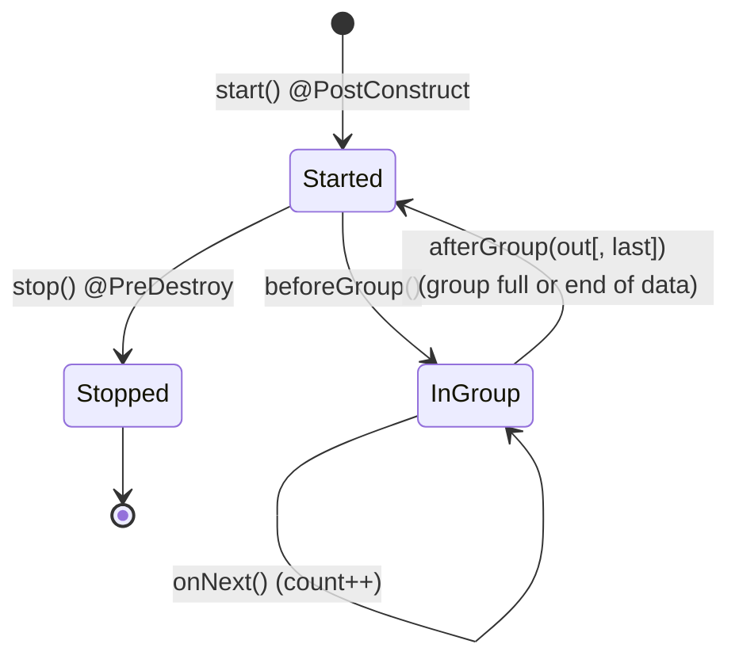
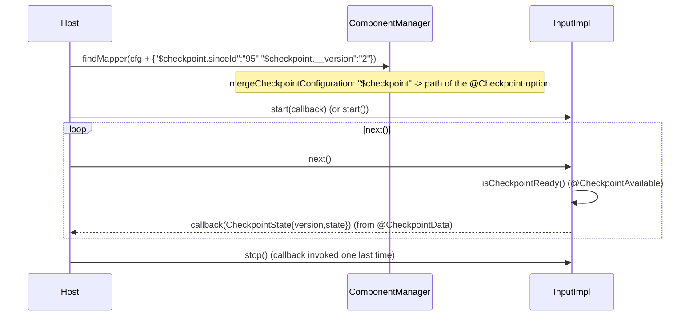
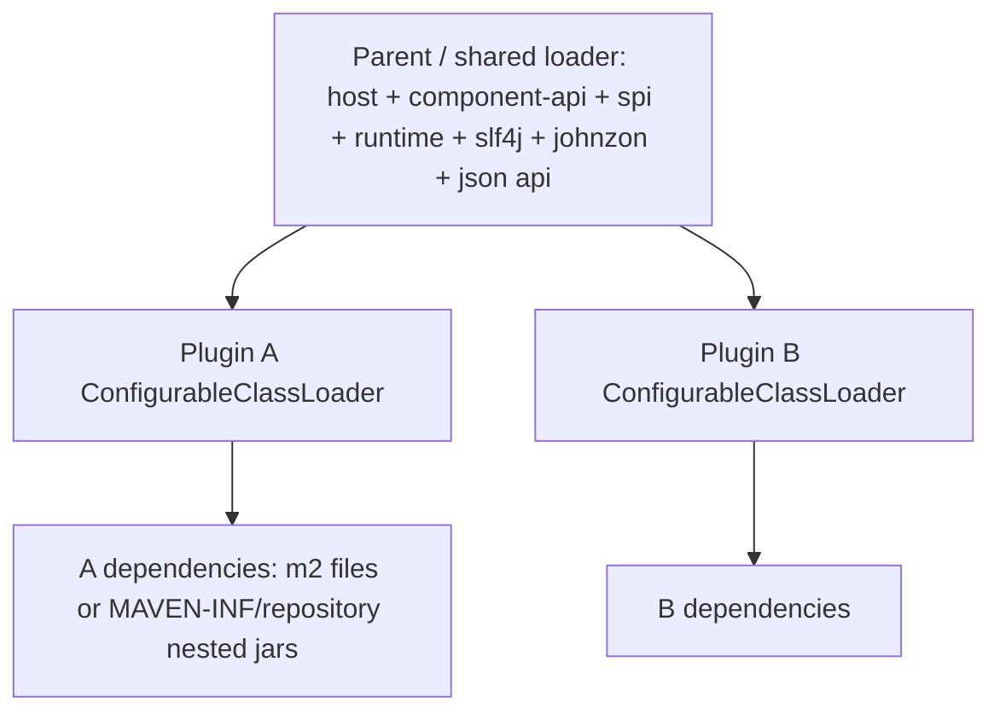

# 06 - Runtime execution

> Framework version documented: **1.2611.0-SNAPSHOT** (root `pom.xml`).
> Sources: `component-api` (`input`, `processor`, `standalone`, `component`, `exception`, `service.dependency`), `component-runtime-impl` (`input`, `output`, `standalone`, `base`, `serialization`, `record`), `component-runtime-manager` (`ComponentManager`, `chain`, `reflect`, `configuration`), `container/container-core`, `component-runtime-beam`, `component-runtime-design-extension`, `component-tools` (`CarBundler`); Antora pages `component-execution`, `component-loading`, `component-partition-mapper`, `component-producer`, `component-processor`, `component-output`, `component-combiner`, `component-driver-runner`, `component-checkpoint`, `component-implementing-streaming`, `component-versions-and-migration`, `concept-processor-and-batch-processing`.
> Catalog: [`RUN`](02-feature-catalog/RUN-runtime.md), [`LCM`](02-feature-catalog/LCM-lifecycle.md), [`INT`](02-feature-catalog/INT-interceptors.md), [`DAT`](02-feature-catalog/DAT-data-model.md). Data types: [`04-data-model.md`](04-data-model.md). Hook table: [`10-appendix/lifecycle-hooks.md`](10-appendix/lifecycle-hooks.md). Keys: [`10-appendix/runtime-configuration-keys.md`](10-appendix/runtime-configuration-keys.md).
> Blueprint for building a runtime host: [`08-runtime-blueprint.md`](08-runtime-blueprint.md).

Keywords MUST/SHOULD/MAY address the **runtime host**. *(inferred)* = deduced from code.

## 1. Component kinds and runtime surface

| Component | Annotations (author side) | Manager entry point | Runtime interface (`component-runtime-impl`) | Wrapper class | Server `type` | Flows (in / out) |
|---|---|---|---|---|---|---|
| Input (batch) | `@Emitter` class, `@Producer` | `findMapper` | `Mapper` -> `Input` | `LocalPartitionMapper` -> `InputImpl` | `input` | none / `__default__` |
| Input (partitioned) | `@PartitionMapper` (`@Assessor`, `@Split`, `@Emitter`), `@Producer` | `findMapper` | `Mapper` -> `Input` | `PartitionMapperImpl` -> `InputImpl` | `input` | none / `__default__` |
| Input (streaming) | `@PartitionMapper(infinite = true[, stoppable = true])` | `findMapper` | `Mapper.isStream()==true` | `PartitionMapperImpl` -> `StreamingInputImpl` | `input` | none / `__default__` |
| Processor | `@Processor`, `@ElementListener`, `@BeforeGroup`, `@AfterGroup` | `findProcessor` | `Processor` | `ProcessorImpl` | `processor` | from listener params / from listener params |
| Output | `@Processor` with void listener and no `@Output` | `findProcessor` | `Processor` | `ProcessorImpl` | `processor` (empty `outputFlows`) | in / none |
| Standalone | `@DriverRunner`, `@RunAtDriver` | `findDriverRunner` | `DriverRunner` | `DriverRunnerImpl` | `standalone` | none / none |
| Combiner | not available (RUN-020) | - | - | - | - | - |

Features: RUN-001..RUN-022, RUN-024, RUN-025, RUN-048. All wrappers extend `LifecycleImpl` (RUN-023) and are Serializable through `writeReplace` (section 13).

## 2. End-to-end execution model



The coordinator/worker split of the Antora page `component-execution` applies to distributed engines: constructors and the partition plan run on the coordinator; the instances are serialized; `@PostConstruct` and the flow run on workers; `@PreDestroy` after processing. All methods handled by the framework MUST be `public` (private ones are ignored, `Class.getMethods()`).

## 3. Component instantiation (RUN-025, RUN-041, LCM-003)

Algorithm of `ComponentManager.findComponentInternal(plugin, name, type, version, configuration)`:

1. If no plugin is registered, auto-discover (`autoDiscoverPluginsIfEmpty(true,true)`, LCM-006).
2. If checkpointing is enabled and the type is MAPPER: rewrite keys prefixed `$checkpoint` to the path of the `@Checkpoint` option (RUN-033).
3. For each container: if it has a `GenericComponentExtension` that `canHandle` -> `createInstance`; else look up `family` (argument `plugin`, sanitized by `trim`) then `name` in the family's partition mappers / processors / driver runners (`ComponentInstantiator`).
4. `BaseMeta.instantiate(configuration, version)`: `migrationHandler.migrate(version, configuration)` (always, LCM-003), then the instantiator.
5. Instantiator: build constructor arguments from the flat map (`ReflectionService.parameterFactory`), validate visible parameters, call the (single, public) constructor inside the plugin TCCL (result MUST be `Serializable`), wrap into `PartitionMapperImpl`/`LocalPartitionMapper`/`ProcessorImpl`/`DriverRunnerImpl` (or ask an owning `ComponentExtension` to `convert`).
6. Return `Optional.empty()` when family/name are unknown.

Only the entries of the configuration map whose key starts with `$` or contains `.$` are copied into the `internalConfiguration` of `PartitionMapperImpl` and `ProcessorImpl` (RUN-040); `LocalPartitionMapper` and `DriverRunnerImpl` keep none.

Flat configuration rules (RUN-041), confirmed in `ReflectionService`:

| Java shape | Keys read |
|---|---|
| nested object `@Option("configuration") Cfg c` | `configuration.<field>` (field name or its `@Option` value) |
| primitives/String/enum | `<path>` (enum: `Enum.valueOf(trim)`; empty -> null) |
| `List<T>` / `Set<T>` of primitives | `<path>[0]`, `<path>[1]`, ... (stops at the first missing index; `<path>[length]` if present caps the size) |
| `List<Obj>` | `<path>[i].<field>` |
| `Map<K,V>` | `<path>.key[i]` and `<path>.value[i]` (and `.key[i].<field>` for object keys/values) |
| `Schema` | JSON string (DAT-032) |
| `JsonObject` | JSON string |
| `@Configuration("prefix")` object | read from `LocalConfiguration` keys `prefix.<field>` |
| services (`Jsonb`, `RecordBuilderFactory`, user `@Service`, `Collection<Service>` ...) | injected from the container, never from the map |

The host MUST send all properties including defaults it rendered; the runtime does not apply UI defaults except those coded in the Java field initializers. Validation errors (`required`, `min`, `max`, `minLength`, `maxLength`, `minItems`, `maxItems`, `pattern`, `uniqueItems`, only for parameters visible under `@ActiveIf` conditions) raise one `IllegalArgumentException` listing all messages (VAL-012).

## 4. Mapper, assessor and split (RUN-002..RUN-005)

State machine of a `Mapper`:



Algorithm to translate a mapper into N parallel readers (what `JobImpl.InputRunner`, `ChainedMapper` and Beam `BoundedSourceImpl` do):

1. `mapper.start()`.
2. `size = mapper.assess()` (default 1 when no `@Assessor`).
3. `splits = mapper.split(desiredSize)`: `desiredSize` is engine-defined (local runner uses `assess()` itself; Beam bounded uses `desiredBundleSizeBytes`; Beam unbounded uses `desiredNumSplits`). For `@Split(int)` the runtime narrows the `long`. Each result is a new `PartitionMapperImpl` (same names, same internal configuration, delegate = the component returned by user code).
4. `mapper.stop()`.
5. Distribute the splits (they are Serializable); on each worker: `split.start()`, `input = split.create()`, `input.start()`, loop `input.next()`, `input.stop()`, `split.stop()`.
6. `create()` calls the `@Emitter` method to obtain the producer object; for `isStream()` it returns a `StreamingInputImpl` with the retry and stop strategies (section 9); otherwise `InputImpl`.

`LocalPartitionMapper` (`@Emitter` class) has `assess()==1`, `split()` = itself, `start/stop` no-ops; `create()` returns the delegate if it already is an `Input` else `new InputImpl`.

## 5. Producer / Input loop (RUN-006, RUN-024)

```
input.start()                       // @PostConstruct on producer object; init checkpoint methods if enabled
while ((data = input.next()) != null) {   // InputImpl.next(): readNext() -> convert to Record (DAT-029)
    emit(data)
    // checkpoint (section 10): if callback registered and isCheckpointReady(): callback(getCheckpoint())
}
input.stop()                        // final checkpoint callback if registered, then @PreDestroy
```

Batch: `null` = end of data. The `@Producer` method is located once (first public method annotated `@Producer`). `next()` never returns `null` for a converted record; primitives/`String` pass unconverted. `InputImpl` is stateful and MUST NOT be shared between threads (only `StreamingInputImpl` serializes `readNext` with a semaphore).

## 6. Processor lifecycle, groups, outputs (RUN-008..RUN-019, RUN-026, RUN-049)

Group state machine (per processor instance):



Reference implementation (`AutoChunkProcessor`, chunk = `$maxBatchSize`):

```
for each incoming element e:
    if count == 0: processor.beforeGroup()
    try { processor.onNext(inputFactory(e), outputFactory); count++ }
    finally { if count == chunkSize { processor.afterGroup(outputFactory); count = 0 } }
at end of data: if count > 0 { processor.afterGroup(outputFactory) }   // flush (MUST)
processor.stop()
```

Rules:

* `ProcessorImpl.beforeGroup()` initializes reflective caches on the first call, calls every `@BeforeGroup`, and (if there is no `@ElementListener`) creates the group buffer. `onNext` MUST NOT be called before the first `beforeGroup`.
* `@ElementListener` parameters: parameters without `@Output` are inputs (`@Input("name")`, default `__default__`), converted to the declared type (`Record`, `JsonObject`, POJO; RUN-049); `@Output` parameters are `OutputEmitter<T>` (or `MultiOutputIterator<T>`, Studio only). A non-void return value is emitted on `__default__` after the call.
* `@AfterGroup` may declare `@Output` emitters, `Collection<Record|JsonObject>` (group buffer, only for processors without listener) and `@LastGroup` boolean (RUN-012). The host uses `afterGroup(out, last)` when `isLastGroupUsed()`; with `last=true` only on the final flush.
* Multiple inputs: `InputFactory.read(name)` returns the record of that branch for the current call; branch data are aligned by group key (RUN-050).
* Named outputs: `OutputFactory.create(name)` MUST return an emitter for any branch name; `__default__` is the implicit one; `REJECT` is the reserved reject name (RUN-018). An emitter converts its argument to `Record` (DAT-029) and ignores `null` (Beam impl).
* Output component (RUN-019) = processor with no outgoing flow; it gets the same calls and must receive the final flush.
* Group size: the host chooses; `$maxBatchSize` (Integer, default option value 1000 when `@AfterGroup` exists and `_maxBatchSize.active` is not false) is the user-visible upper bound. `chunkSize` is 1 in the local runner when the option is absent (calls `beforeGroup/afterGroup` around every element).
* Group semantics in Beam (`BaseProcessorFn`): one Beam bundle = one group; `maxBatchSize>0` additionally forces `afterGroup` every N elements; `finishBundle` flushes.
* Note (Antora `concept-processor-and-batch-processing`): the "buffer >= maxBatchSize" test described there is component logic; the framework only cuts groups.

Output routing with `OutputFactory`:

```
onNext(in, out):  listener(args...)      // args built by parameterBuilderProcess
   emitter.emit(x)  ->  out.create(branch).emit(x)  ->  host routes x to (component, branch)
   return value     ->  out.create("__default__").emit(ret)
```

## 7. Standalone components (RUN-021, RUN-022)

`DriverRunnerImpl.runAtDriver()` locates the single `@RunAtDriver` method and invokes it with the plugin TCCL. Sequence: `findDriverRunner(...)`, `start()`, `runAtDriver()`, `stop()`, on the driver/coordinator only. It has no records and no flows. Studio `@ReturnVariables` may apply (RUN-036).

## 8. Combiner (RUN-020)

Absent from the API (`component-combiner.adoc` says so). Aggregations MUST be done in processors using groups or by the engine.

## 9. Streaming (RUN-027..RUN-029)

* Declaration: `@PartitionMapper(infinite = true)`; optional `stoppable = true`.
* `StreamingInputImpl.readNext()`:
  1. `running == false` -> `null`.
  2. Stop strategy active and `shouldStop(readRecords)` -> `null`.
  3. Acquire the semaphore; loop while running and `retries > 0` (`maxRetries`, default `Integer.MAX_VALUE`):
     * with `maxDurationMs > -1`: check `shouldStop`; run the producer in a one-thread executor with timeout `maxDurationMs + 3000 ms grace - elapsed` (minimum 10 ms); a timeout cancels the read and returns the (null) value;
     * otherwise call the producer directly;
     * non-null -> reset retry strategy, `readRecords++`, return it;
     * null -> `retries--`, sleep `strategy.nextPauseDuration()` (negative = give up and stop; `>=1000` ms is slept in 250 ms slices while `running`).
  4. Return `null` when retries are exhausted.
* `start()` sets `running=true` and registers a JVM shutdown hook; `stop()` clears it, removes the hook and takes the semaphore (waits for a running read).
* Stop conditions `maxRecords`, `maxDurationMs` (-1 = none): resolution order and option names in RUN-028; UI/config default -1. Component code may read them in `@PostConstruct` via `@Option(Option.MAX_RECORDS_PARAMETER)` / `@Option(Option.MAX_DURATION_PARAMETER)`.
* Retry strategies (RUN-029): `constant` (500 ms) or `exponential` (`min(initialBackOff * exponent^iteration, max)` with jitter `(rand*2-1)*randomizationFactor*interval`, capped at `max`; defaults 1000 ms, 1.5, 0.5, 300000 ms).
* For a runtime host: treat a streaming `Input.next() == null` as termination, ensure `stop()` is invoked on job cancel, and configure stop conditions in every non-interactive deployment (otherwise the job never ends).
* Beam: `TalendIO.read` builds `InfiniteRead` with `withMaxNumRecords/withMaxReadTime` from job properties `streaming.maxRecords` (default 1000 in `BeamExecutor`) and `streaming.maxDurationMs` (default 60000), unless the mapper's internal configuration provides `$maxRecords/$maxDurationMs`.

## 10. Checkpoint (RUN-030..RUN-033)

Enabled only with JVM property `talend.checkpoint.enabled=true` (see discrepancy in section 17).



* `CheckpointState.toJson()` = `{"$checkpoint": {...state fields..., "__version": v}}`. Version = `@Version` on the state class (default 1).
* Persistence and restart are host responsibilities; the host MUST store the JSON, convert it to flat properties (`ComponentManager.jsonToMap`) and pass it back when creating the mapper; a stored `__version` older than the class version is migrated by the nested migration of LCM-003.
* `Input.getCheckpoint()`, `isCheckpointReady()` and `start(Consumer)` throw `UnsupportedOperationException` on any `Input` implementation that does not override them (`InputImpl` and `ChainedInput` do) - hosts MUST guard.
* Beam reference: unbounded sources use `NoCheckpointCoder`; no checkpoint integration.

## 11. Versioning and migration (LCM-001..LCM-003)

1. The host stores `(component version, configuration map)` at save time.
2. At load time (Designer) it MAY call `POST /component/migrate/{id}/{version}` (or `/configurationtype/migrate/...`) to upgrade the stored configuration; at run time (Runtime) it passes the stored version to `findMapper/findProcessor/findDriverRunner`, which migrates internally.
3. Nested configuration migration is driven by `<path>.__version` keys (LCM-003); the component-level handler always runs and receives full paths.
4. `MigrationHandler` classes are instantiated once per plugin (constructor with most parameters, services injected) and cached.
5. If the stored version is higher than the registry version the server skips migration with a warning (component endpoint) - the runtime does not check.

## 12. Studio return / after variables (RUN-036, RUN-037)

`@ReturnVariables`/`@ReturnVariable` (and deprecated `@AfterVariables`/`@AfterVariable`, `@AfterVariableContainer`) only produce component metadata (`variables::return::value`, `variables::after::value`); the Studio DI runtime reads the values after execution. Runtime hosts other than Studio MAY ignore them. `ModelVisitor` still validates after-variable declarations (allowed types listed in RUN-037).

## 13. Serialization requirements (RUN-039, SVC-003)

1. Component classes, their constructor argument objects (configuration POJOs) and `@Service` classes MUST be `Serializable` (services may extend `BaseService` or be proxied by the manager).
2. Runtime wrappers serialize to a `SerializationReplacer` holding `plugin`, `rootName`, `name`, delegate bytes and wrapper state; on the target JVM `readResolve` re-creates the wrapper by reading the bytes with `EnhancedObjectInputStream` bound to `ContainerFinder.Instance.get().find(plugin).classloader()`.
3. The target JVM MUST have the plugin registered under the same id **before** deserialization and MUST have a `ContainerFinder` able to return it (`ComponentManager` registers `StandaloneContainerFinder` through SPI; otherwise the TCCL fallback is used).
4. Service references are serialized as `SerializableService(plugin, class)` and resolved via `LightContainer.findService`.
5. In secured deployments set `talend.component.runtime.serialization.java.inputstream.whitelist` (allow-list of class-name prefixes); without it a built-in deny-list is used with a warning.
6. `ComponentManager` itself serializes to a token resolved to `ComponentManager.instance()`.
7. Records in Beam are transported by `SchemaRegistryCoder` (RUN-045).

## 14. Plugin loading and classloader isolation (LCM-004..LCM-006, LCM-011, SVC-027)



1. **Registration**: `addPlugin(pathOrGav)` -> `ContainerManager.builder(id, module).create()`; id = `buildAutoIdFromName` (artifactId or file name without version).
2. **Classpath**: the module itself + dependencies from `TALEND-INF/dependencies.txt` (+ dynamic dependencies, contributors) filtered to scopes `compile|runtime`, types `jar|bundle|zip`; each dependency resolved to `<m2>/<g>/<a>/<v>/<a>-<v>.jar` or a nested `MAVEN-INF/repository/` entry.
3. **Classloader**: `ConfigurableClassLoader(id, urls, parent, parentFilter, childFirstFilter, nestedDependencies, jvmMarkers, resourcesFilter)`; parent-first only for the framework prefixes listed in LCM-005, child-first for everything else; JVM classes are never overridden.
4. **Listeners**: `Updater.onCreate` scans (LCM-011), builds services (SVC-027), validates and registers components (`ModelVisitor`, RUN-046) into `ContainerComponentRegistry` keyed by family name. One family per module is assumed; two modules contributing to the same family are merged unless a name conflicts (`Conflicting processors|mappers|driver runners`).
5. **Execution context**: every call into a plugin sets the TCCL to the plugin loader (`LifecycleImpl.doInvoke`, `ComponentManager.executeInContainer`). Hosts calling plugin classes directly MUST do the same.
6. **Removal**: `removePlugin(id)` runs `onClose` (registry cleared, `@PreDestroy` on services, `Jsonb` closed) then closes the classloader.
7. **Concurrency**: registry reads use a read lock, add/remove a write lock; instantiation is lock-free per call.
8. **Host classloader requirements**: the parent loader MUST contain (or expose through `Customizer`) all classes the runtime shares with plugins; Beam users add `BeamCustomizer` (class index of Beam and its dependencies as parent-loaded).

## 15. Dependency resolution and packaging (LCM-007..LCM-010)

* `.car` (component archive, LCM-010): executable jar with `MAVEN-INF/repository/**` (all runtime dependencies in Maven layout), `TALEND-INF/metadata.properties` (`component_coordinates`, `type`, `version`, `date`, `CarBundlerVersion`) and `CarMain` (`studio-deploy`, `maven-deploy`, `deploy-to-nexus`). A runtime host deploying a `.car` SHOULD copy `MAVEN-INF/repository/` into its m2 and register `component_coordinates`.
* Fat jar (LCM-009): `ContainerDependenciesTransformer` + `PluginTransformer`.
* Dynamic dependencies (ACT-010/014): `@DynamicDependencies` returns GAVs; `TALEND-INF/dynamic-dependencies.properties` (plugin id -> GAV list) appends them to the classpath at container creation; `Resolver` builds volatile loaders at runtime.
* Root repository discovery: LCM-008.

## 16. Beam reference translation (RUN-042..RUN-045)

| Job element | Beam construct |
|---|---|
| source (mapper) | `TalendIO.read(mapper, {maxRecords,maxDurationMs})` -> `Read`/`InfiniteRead` -> `RecordNormalizer` |
| edge `(from,branch)->(to,inBranch)` | `RecordBranchFilter(fromBranch)` -> optional `RecordBranchMapper(fromBranch,toBranch)` -> `RecordBranchUnwrapper(toBranch)` -> `AutoKVWrapper(GroupKeyProvider)` |
| single incoming edge | `RecordKVUnwrapper` + `RecordNormalizer` |
| several incoming edges | `KeyedPCollectionTuple` + `CoGroupByKey` + `CoGroupByKeyResultMappingTransform` |
| processor with outgoing edge | `TalendFn.asFn(processor)` (ParDo) |
| terminal processor (output) | `TalendIO.write(processor)` (ParDo with no output) |
| multi-branch output | one record whose entries are arrays named by branch (sanitized name); consumers read them with `BeamInputFactory` |

Bundle mapping (`BaseProcessorFn`): `@Setup` -> `processor.start()`; `@ProcessElement` -> `beforeGroup` if `currentCount==0`, then `onNext`, `currentCount++`, forced `afterGroup` if `maxBatchSize` reached; `@FinishBundle` -> `afterGroup` when `currentCount>0`; `@Teardown` -> `stop()`. Pipeline options: `talend.beam.job.<name>=<value>`.

A custom engine adapter MUST: (1) call the lifecycle exactly as in sections 4-6; (2) route branches by name; (3) align multiple inputs by group key; (4) serialize components (section 13); (5) flush groups at end of input; (6) surface `ComponentException` (section 18). The local runner in `JobImpl` is the smallest reference (~ sequential levels, in-memory maps keyed by group key).

## 17. Discrepancies between docs and code

| Topic | Docs say | Code says | Wins |
|---|---|---|---|
| Checkpoint system property | `talend.checkpoint.enable` (`component-checkpoint.adoc`) | `talend.checkpoint.enabled` (`InputImpl`, `ComponentManager`) | code |
| `Input.getCheckpoint()` / `isCheckpointReady()` types and defaults | `Object` / `Boolean`, default throws `IllegalArgumentException` | `CheckpointState` / `boolean`, default throws `UnsupportedOperationException` | code |
| Conditional outputs annotation | `@ConditionalOutputFlows` (`component-processor.adoc`) | `org.talend.sdk.component.api.meta.ConditionalOutput` | code |
| `@ElementListener` javadoc | "Mark a method as returning an input connector" | processing method of a processor | code semantics |
| `@BeforeGroup` / `@AfterGroup` javadoc | both say "Called before an element group" | AfterGroup is called after | code semantics |
| Checkpoint frequency | `@Checkpoint` "can specify method type and frequency (RECORD/TIME)" | `@Checkpoint` has only `value()`; no frequency logic in runtime | code |
| Combiner | described as concept | no API | code |
| `maxBatchSize` description | "buffer >= maxBatchSize" inside listener | framework only cuts groups; option added by `MaxBatchSizeParamBuilder` | code |
| Docs on `PartitionSize` | "long value" | `int` or `long` | code |

## 18. Error handling (INT-005..INT-009, VAL-012)

* Reflective invocations unwrap `InvocationTargetException` (INT-009): the host sees `ComponentException` (with `errorOrigin`, `originalType`, `originalMessage`) or `java.*` runtime exceptions, never plugin exception classes.
* Constructor or configuration problems are `IllegalArgumentException` (VAL-012, RUN-046).
* During `stop()`/`@PreDestroy` failures propagate; hosts SHOULD still call `stop()` on all other components (the local runner does so in `finally`).
* The server maps `ComponentException` to HTTP 400 (USER), 456 (BACKEND), 520 (other) for design-time calls.

## 19. Traceability

| Section | Features |
|---|---|
| 1 | RUN-001..RUN-022, RUN-024, RUN-048 |
| 3 | RUN-025, RUN-040, RUN-041, LCM-003, VAL-012 |
| 4 | RUN-002..RUN-005 |
| 5 | RUN-006, RUN-007 |
| 6 | RUN-008..RUN-019, RUN-026, RUN-049, RUN-050 |
| 7 | RUN-021, RUN-022 |
| 9 | RUN-027..RUN-029 |
| 10 | RUN-030..RUN-033 |
| 11 | LCM-001..LCM-003 |
| 12 | RUN-036, RUN-037 |
| 13 | RUN-039, SVC-003 |
| 14 | LCM-004..LCM-006, LCM-011, SVC-027, SVC-021, DSG-006 |
| 15 | LCM-007..LCM-010, ACT-010..SVC-015 |
| 16 | RUN-042..RUN-045 |
| 18 | INT-005..INT-009 |
