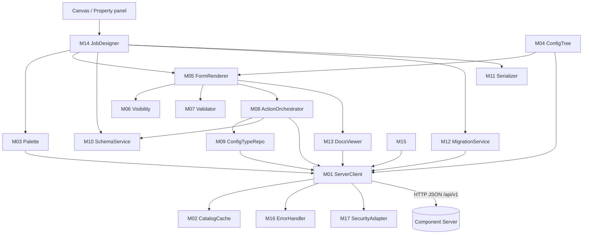

# 07 - Designer blueprint (AI-oriented specification of an ETL Designer host)

> Framework version documented: `1.2611.0-SNAPSHOT` (root `pom.xml`; last release tag `component-runtime-1.2610.0`).
> Audience: an AI (or developer) that must implement, from this file plus the linked documents, a **fully functional ETL Designer**: a design-time host that discovers TCK components on a Component Server, renders their configuration forms, wires design-time actions, propagates schemas, persists jobs and hands them to a Runtime host ([08-runtime-blueprint.md](08-runtime-blueprint.md)).
> Normative words MUST / SHOULD / MAY are RFC 2119. `(inferred)` = deduced from code without executable proof; `(unverified)` = not established from local sources; `(host)` = a design decision of this blueprint, not a server or framework fact.
> Sources of truth: [03-component-server-api.md](03-component-server-api.md) (endpoints and payloads), [05-configuration-and-ui.md](05-configuration-and-ui.md) (metadata to widgets), [04-data-model.md](04-data-model.md) (Schema), [10-appendix/](10-appendix/) (metadata keys, actions, error codes), [known discrepancies](10-appendix/known-discrepancies.md). Feature IDs point into [02-feature-catalog/](02-feature-catalog/README.md); the machine-readable list is [02-feature-catalog/index.json](02-feature-catalog/index.json). Code beats prose.

## 1. Scope and non-goals

### 1.1 In scope

The Designer covers everything between "the user opens a project" and "a persisted, validated job is handed to a runtime":

1. Discover components (palette) from `GET /api/v1/component/index`, with families, categories, icons, i18n.
2. Load a component model from `GET /api/v1/component/details`, build the configuration tree, render the form (layouts, widgets, conditions, validation).
3. Trigger design-time actions through `POST /api/v1/action/execute` (health check, suggestions, dynamic values, update, async validation, schema discovery, dataset discovery, dynamic dependencies, connections).
4. Reuse datastores and datasets through `GET /api/v1/configurationtype/index|details` and `POST /api/v1/configurationtype/migrate/{id}/{configurationVersion}`.
5. Model a job (component instances, ports/flows, connections), propagate schemas along connections.
6. Serialize form values to the runtime flat map (`configuration.<path>=value`, technical `$` options) and persist `{componentId, version, map}`.
7. Migrate persisted configurations on load (`POST /api/v1/component/migrate/{id}/{configurationVersion}`).
8. Display documentation, handle errors (`ErrorPayload`), cache client-side, be aware of plugin/dependency deployment, secure the channel.

### 1.2 Non-goals

- Executing components (that is the Runtime, [08-runtime-blueprint.md](08-runtime-blueprint.md)); the Designer MUST NOT instantiate `@PartitionMapper` / `@Processor` classes.
- Implementing the Component Server or `component-form` themselves (the mapping of `component-form` is re-specified here so a non-Java host can reproduce it, [03 section 10](03-component-server-api.md)).
- Authoring components or the `.car` packaging (`LCM` category).
- Studio-only features (`create_connection`/`close_connection` sharing, `schema_mapping`, `variables::*`, `@ModuleList`, `@Path`, `@BasedOnSchema`) beyond tolerating their metadata. They are Level 2 and optional.
- Relying on HTTP validators: the server has **no `ETag`, `If-None-Match`, `Last-Modified` or `Cache-Control` support** and never returns `304` (C1 and D01 in [known-discrepancies.md](10-appendix/known-discrepancies.md); [SRV-017](02-feature-catalog/SRV-server.md)). All caching is client-side (section 7).
- Calling `GET /api/v1/cache/clear` from normal flows: it redeploys all plugins ([SRV-016](02-feature-catalog/SRV-server.md), C5).

## 2. Architecture and module decomposition

### 2.1 Modules

The blueprint names 18 logical modules (`M01`..`M18`). A conforming implementation MAY merge or split them; the traceability table (section 13) uses these names.

| Module | Name | Responsibility | Depends on |
|---|---|---|---|
| M01 | ServerClient | Transport to `/api/v1` (HTTP; optional WebSocket `/websocket/v1`), `language`/`lang` handling, headers, response decoding, bulk batching | M02, M16, M17 |
| M02 | CatalogCache | Client-side cache and invalidation (section 7), `GET /environment` watcher | M01 |
| M03 | Palette | Index model, category tree, icons, i18n, search (`q`), component identity | M01, M02 |
| M04 | ConfigTree | `SimplePropertyDefinition[]` -> configuration tree (section 4.2) | M01 |
| M05 | FormRenderer | Form model (layouts, widgets, labels, tooltips, defaults), field state | M04, M06, M07, M08 |
| M06 | Visibility | `@ActiveIf`/`@ActiveIfs` evaluation, path resolution | M04 |
| M07 | Validator | Synchronous constraints from `validation`, enum restriction, save gate | M04, M06 |
| M08 | ActionOrchestrator | Trigger derivation from `action::*` metadata, request building, debounce, pending/stale handling, result application | M01, M04, M05 |
| M09 | ConfigTypeRepo | Datastore/dataset/discovery configuration types, saved configuration library, slots, dataset discovery | M01, M08, M12 |
| M10 | SchemaService | Schema model, discovery, fixed schema, propagation along connections | M08, M14 |
| M11 | Serializer | Form values <-> flat map, technical `$` options, streaming/batch options | M04 |
| M12 | MigrationService | Component and configuration-type migration on load | M01, M11 |
| M13 | DocsViewer | Documentation panel (AsciiDoc), tooltips | M01 |
| M14 | JobDesigner | Canvas graph, ports from `inputFlows`/`outputFlows`, instances, persistence, lifecycle | M03, M05, M10, M11, M12 |
| M15 | DeploymentAwareness | Plugin-set change detection, dependency listing/download for provisioning, dynamic dependencies | M01, M02 |
| M16 | ErrorHandler | `ErrorPayload` decoding, status mapping, presentation policy | none |
| M17 | SecurityAdapter | Authentication in front of the server, tenant header, secret handling | none |
| M18 | TestKit | Contract tests replaying recorded payloads, serialization cross-checks | M01, M11 |



### 2.2 Dependency rules

- Only M01 talks to the network. Every other module receives an interface `ServerClient` (section 10).
- M04 is pure (no I/O): input `SimplePropertyDefinition[]`, output `ConfigTree`. M06, M07, M11 are pure functions over `ConfigTree` and a value tree, so they are unit-testable without a server.
- The persisted job model (section 3.6) is independent of rendering: a headless tool MUST be able to load, migrate, validate and export a job without M05.

## 3. Data structures (language-neutral pseudo-schemas)

Notation: `T?` = optional/nullable (absent and `null` are equivalent on the wire), `T[]` = list, `map<K,V>`, `enum{...}`. "Wire" structures mirror server JSON exactly ([03 section 5](03-component-server-api.md)); "Host" structures are defined by this blueprint.

### 3.1 Wire: palette

```text
ComponentIndices { components: ComponentIndex[] }
ComponentIndex {
  id: ComponentId
  displayName: string
  familyDisplayName: string
  type: enum{"input","processor","standalone"}
  icon: Icon                    # component icon reference
  iconFamily: Icon              # family icon reference
  version: int                  # @Version of the component (default 1)
  categories: string[]          # palette paths, e.g. "Database/JDBC/Standard"
  links: Link[]                 # one entry {name:"Detail", path:"/component/details?identifiers=<id>", contentType:"application/json"}
  metadata: map<string,string>  # component-level, keys NOT stripped of "tcomp::" (see DSG-008)
}
ComponentId { id: string, familyId: string, plugin: string, pluginLocation: string, family: string, name: string }
Icon { icon: string?, customIconType: string?, customIcon: bytes(base64)?, theme: string? }
```

`id.id` and `id.familyId` are opaque (Base64URL of `plugin#family#name` and `plugin#family`; not reversible by contract, [03 section 1](03-component-server-api.md)). `id.family` (technical name, NOT the id) is the value of the `family` query parameter of `/action/execute`. Component identity for display and de-duplication is `(family, name)` ([DSG-001](02-feature-catalog/DSG-design.md)); the persisted key is `id.id` plus `id.plugin`/`id.family`/`id.name` (to survive id re-encoding, host).

### 3.2 Wire: component detail

```text
ComponentDetailList { details: ComponentDetail[] }
ComponentDetail {
  id: ComponentId
  displayName: string
  icon: string?                          # icon KEY only (string), unlike the index
  type: enum{"input","processor","standalone"}
  version: int                           # MUST be persisted with every saved configuration
  properties: SimplePropertyDefinition[] # whole option tree, sorted by path; includes synthetic $maxRecords/$maxDurationMs/$maxBatchSize
  actions: ActionReference[]             # server actions referenced by the options
  inputFlows: string[]?                  # named input connectors, e.g. ["__default__"]
  outputFlows: string[]?                 # named output connectors, e.g. ["__default__","REJECT"]; [] = terminal component
  links: Link[]                          # always []
  metadata: map<string,string>
}
SimplePropertyDefinition {
  path: string                 # dotted; arrays as name[] ; e.g. configuration.tables[].name
  name: string                 # last segment
  displayName: string
  type: enum{"OBJECT","ARRAY","BOOLEAN","STRING","NUMBER","ENUM"}   # unknown -> treat as STRING (inferred, CFG-003)
  defaultValue: string?        # primitives as text; collections/maps as JSON text
  validation: PropertyValidation?
  metadata: map<string,string>?   # prefix "tcomp::" already stripped; "validation::*" removed
  placeholder: string?
  proposalDisplayNames: ordered map<string,string>?   # ENUM only
}
PropertyValidation { required?: bool, min?: int, max?: int, minLength?: int, maxLength?: int,
                     minItems?: int, maxItems?: int, uniqueItems?: bool, pattern?: string /*JavaScript regex*/, enumValues?: string[] }
ActionReference { family: string, name: string, type: string, displayName: string, properties: SimplePropertyDefinition[] /* action METHOD parameters */ }
```

Metadata keys are catalogued in [10-appendix/property-metadata-keys.md](10-appendix/property-metadata-keys.md) and [05 section 4](05-configuration-and-ui.md). Validation constraints are in `validation`, never in `metadata` (D16).

### 3.3 Wire: configuration types

```text
ConfigTypeNodes { nodes: map<nodeId, ConfigTypeNode> }
ConfigTypeNode {
  id: string, version: int /* -1 = no @Version, 0 = family node */, parentId: string?,
  configurationType: enum{"datastore","dataset","datasetDiscovery","dynamicDependenciesConfiguration","checkpoint"}?,   # absent on family nodes
  name: string, displayName: string, edges: string[] /* child node ids */,
  properties: SimplePropertyDefinition[]   # re-rooted at "configuration"; empty when lightPayload=true
  actions: ActionReference[]?              # absent when lightPayload=true
}
```

### 3.4 Wire: action payloads

```text
ActionRequest  { query: {family: string /*technical family name*/, type: string, action: string, lang: string?},
                 header: {"x-talend-tenant-id"?: string},
                 body: map<string,string> }            # flat, keys are the ACTION METHOD's option names
HealthCheckStatus  { status: enum{"OK","KO"}, comment: string? }
ValidationResult   { status: enum{"OK","KO"}, comment: string? }
SuggestionValues   { cacheable: bool, items: [{id: string, label: string}] }
Values             { items: [{id: string, label: string}] }
SchemaWire         { type: enum{"RECORD","ARRAY","STRING","BYTES","INT","LONG","FLOAT","DOUBLE","BOOLEAN","DATETIME","DECIMAL"},
                     entries: EntryWire[], metadata: EntryWire[], props: map<string,string>, elementSchema: SchemaWire? }
EntryWire          { name, rawName?, type, nullable: bool, metadata: bool, errorCapable: bool, valid: bool,
                     elementSchema?: SchemaWire, comment?: string, props: map<string,string>, defaultValue?: any }
DiscoverDatasetResult { datasetDescriptionList: [{name: string, metadata: map<string,string>}] }   # getter-derived (inferred)
UpdateResult       any JSON object (the new value of the annotated object)
DynamicDependencies string[]  # GAVs; a JSON ARRAY (not usable through /bulk)
ErrorPayload       { code: ErrorDictionary, description: string? }
```

Per-type result table: [03 section 6](03-component-server-api.md). `schema` and `schema_extended` return the same `Schema` shape ([04-data-model.md](04-data-model.md)).

### 3.5 Host: configuration tree (built by M04)

```text
ConfigTree {
  roots: ConfigNode[]                      # properties whose path == name
  byPath: map<string, ConfigNode>          # exact path -> node (the "[]" notation is kept in the key)
  actionRefs: map<string, ActionReference> # key = family + "/" + type + "/" + name
}
ConfigNode {
  def: SimplePropertyDefinition            # verbatim
  kind: enum{"OBJECT","ARRAY_OF_OBJECT","ARRAY_OF_PRIMITIVE","MAP","BOOLEAN","STRING","NUMBER","ENUM"}
  children: ConfigNode[]                   # ordered by ui::optionsorder::value, else by path (algorithm A2)
  elementDef: ConfigNode?                  # for arrays: the "path[]" definition and its "path[].x" children
  parent: ConfigNode?
  meta: parsed metadata (see 3.5.1)
}
```

`kind` rules: `ARRAY` with any record starting with `<path>[].` -> `ARRAY_OF_OBJECT`; else `ARRAY_OF_PRIMITIVE`; `OBJECT` whose children are exactly `key[]` and `value[]` -> `MAP` (`<path>.key[]`, `<path>.value[]`, [03 section 8.1](03-component-server-api.md)).

#### 3.5.1 Parsed metadata (`ConfigNode.meta`)

| Field | Source key(s) | Notes |
|---|---|---|
| `gridLayouts: map<name,string>` | `ui::gridlayout::<Name>::value` | names compared case-insensitively |
| `optionsOrder: string[]` | `ui::optionsorder::value` (comma list) | |
| `hidden`, `readonly`, `credential`, `textarea` | `ui::hidden`, `ui::readonly`, `ui::credential`, `ui::textarea` | value `"true"` |
| `code: string?` | `ui::code::value` | language |
| `datetime` | `ui::datetime`, `ui::datetime::dateFormat`, `::useSeconds`, `::useUTC` | picker kind |
| `defaultValue: string?` | `ui::defaultvalue::value` else `defaultValue` | metadata wins ([03 section 5.3](03-component-server-api.md)) |
| `structure` | `ui::structure::value`, `ui::structure::discoverSchema`, `ui::structure::type` (`IN`/`OUT`) | |
| `conditions[]` | `condition::if::target[::i]`, `::value[::i]`, `::negate[::i]`, `::evaluationStrategy[::i]`, `condition::ifs::operator` | see A6 |
| `actions: map<type,ActionBinding>` | `action::<type>` + `::parameters`, `::after`, `::activeIf`, `::labelDisplayMode`, `::discoverSchema`, `::type` | `ActionBinding{name, parameters[], after?, activeIf?}` |
| `configType: {type,name}?` | `configurationtype::type`, `configurationtype::name` | slot for datastore/dataset reuse |
| `doc: {text, tooltip}` | `documentation::value`, `documentation::tooltip` | |
| `paramIndex: int?` | `definition::parameter::index` | root records only |
| `connectorRef` | `dependencies::connector` | `family`/`name`/`mavenReference` part |
| `unknown: map<string,string>` | any other key | MUST be preserved and ignored ([DSG-006](02-feature-catalog/DSG-design.md)) |

### 3.6 Host: component instance and job (persisted)

```text
ComponentInstance {
  instanceId: string                       # host uuid, stable inside the job
  component: { id: string, plugin: string, family: string, name: string }   # id.* copied from ComponentId
  version: int                             # ComponentDetail.version at save time (or after last migration)
  displayLabel: string                     # user label
  configuration: map<string,string>        # FLAT map, keys "configuration.<path>" (+ "$" options, "<path>.__version")
  uiValues: any?                           # optional nested cache of form values (derivable from configuration; not authoritative)
  configLinks: ConfigLink[]                # datastore/dataset slots bound to saved configurations (3.7)
  schemas: map<flowName, SchemaState>      # per OUTPUT flow, see 3.8
  status: enum{"resolved","unresolved","migrating","migration_failed","invalid"}   # see state machine 5.4
  canvas: { x: number, y: number }
}
Connection { fromInstance: string, fromFlow: string /*default "__default__"*/, toInstance: string, toFlow: string /*default "__default__"*/ }
JobDesign {
  formatVersion: int,                     # host format version (host)
  name: string, language: string,
  serverEnvironment: { latestApiVersion: int, pluginsHash: string?, lastUpdated: string? },   # snapshot, informational
  instances: ComponentInstance[], connections: Connection[]
}
```

The Runtime input is the projection `{plugin, family, name, version, configuration}` per instance plus `connections` ([08-runtime-blueprint.md](08-runtime-blueprint.md)). The version is NOT a key of `configuration` (C3); it travels beside it.

### 3.7 Host: reusable configuration library

```text
SavedConfig { savedId: string, typeNodeId: string /*ConfigTypeNode.id*/, family: string, configurationType: string,
              name: string, version: int /*ConfigTypeNode.version at save time*/, values: map<string,string> /*keys "configuration.<sub>"*/ }
ConfigLink  { slotPath: string /*e.g. configuration.connection*/, savedId: string?, mode: enum{"inline","by_reference"} }
```

### 3.8 Host: schema state

```text
SchemaState { schema: SchemaWire?, origin: enum{"fixed","discovered","user","propagated","unknown"},
              sourceAction: {family,type,name}?, stale: bool, error: ErrorPayload? }
```

### 3.9 Host: form model (output of M05, renderer-independent)

```text
FormModel { title: string, rootItems: FormItem[], values: any /*nested value tree*/, errors: map<path,string[]>, pending: set<path> }
FormItem {
  kind: enum{"field","group","tabs","columns","array","button"},
  path: string?,                 # value path for fields (with concrete [i] for array elements)
  widget: enum{"text","password","textarea","code","datalist","multiSelect","toggle","date","datetime","time"}?,
  title: string, placeholder: string?, description: string?, tooltip: string?,
  required: bool, readOnly: bool, options: {value:string,label:string}[]?, restrictedToOptions: bool?,
  visibleWhen: Condition?,       # compiled from condition::*
  triggers: Trigger[], children: FormItem[]
}
Condition { op: enum{"and","or","leaf"}, leaf?: {target: string /*absolute path*/, strategy: enum{"DEFAULT","LENGTH","CONTAINS"}, values: string[], negate: bool}, items: Condition[] }
Trigger { type: string, family: string, action: string, onEvent: enum{"focus","change","click","blur","load"}?, remote: bool /*default true*/,
          options: [{path: string, type: string}], parameters: [{key: string, path: string}] }
```

### 3.10 Host: field state

```text
FieldState { path, value, touched: bool, dirty: bool, visible: bool,
             syncErrors: string[], asyncState: enum{"idle","pending","ok","ko","error"}, asyncMessage: string?,
             optionsState: enum{"idle","loading","loaded","error"} }
```

## 4. Algorithms

Each algorithm is normative for a conforming Designer. Numbers are stable step ids used by the acceptance tests.

### A1. Fetch index and build the palette (M01, M02, M03) - [SRV-002](02-feature-catalog/SRV-server.md), [DSG-001](02-feature-catalog/DSG-design.md), [DSG-002](02-feature-catalog/DSG-design.md), [DSG-003](02-feature-catalog/DSG-design.md), [SRV-005](02-feature-catalog/SRV-server.md), [SRV-018](02-feature-catalog/SRV-server.md)

1. Determine the UI language `L` (BCP-47 or `xx_YY`). Send it as `language=L`; the server maps it (`en*`,`fr*`,`zh*`->`zh_CN`,`ja*`,`de*`; anything else -> `en`), so the response language MAY differ from `L` and the cache key MUST use `L` as sent ([SRV-018](02-feature-catalog/SRV-server.md)).
2. `GET /api/v1/environment` (see A17) to obtain `lastUpdated`/`connectors.pluginsHash`; if a cache entry for key `index|L|theme|q` exists and its stamp equals the current stamp, use it and go to step 5.
3. `GET /api/v1/component/index?language=L&includeIconContent=false[&theme=light|dark][&q=<expr>]`. Use `includeIconContent=true` only if the host cannot fetch icons individually (payload size grows with base64 content).
4. Store the response with the stamp of step 2.
5. Sort components (the server order is unspecified) by `(familyDisplayName, displayName)` case-insensitively.
6. Build the category tree: for each component and each string in `categories`, split on `/`; insert nodes; attach the component at the leaf. A component with an empty `categories` list is placed under a synthetic node named after `familyDisplayName` (host). The server already substituted `${family}` and localized names.
7. Group by family: key `id.familyId`, label `familyDisplayName`, icon `iconFamily`.
8. Icon resolution per component (M03):
   1. if `icon.customIcon` is present, use it with `icon.customIconType`;
   2. else if the host uses the sprite: once per theme `GET /api/v1/component/icon/index?theme=<light|dark|all>` and inject the `image/svg+xml` document into the DOM; reference `<symbol id="<icon>-<theme>">` (`data-type="family"` or `"connector"`) ([SRV-005](02-feature-catalog/SRV-server.md));
   3. else `GET /api/v1/component/icon/{id.id}` / `icon/family/{id.familyId}` / `icon/custom/{familyId}/{iconKey}` with header `Accept: application/octet-stream` (never through `/bulk`);
   4. on `404` (`ICON_MISSING`, `FAMILY_MISSING`, `COMPONENT_MISSING`, `PLUGIN_MISSING`) or empty `icon`, show the host default icon. The icon key is opaque: it MAY be a custom key unknown to `Icon.IconType` ([DSG-003](02-feature-catalog/DSG-design.md), [DSG-015](02-feature-catalog/DSG-design.md)).
9. Search: the client filters the cached list locally by display name, family, category. Server-side `q` (grammar in [03 section 4.1.1](03-component-server-api.md), keys `plugin`, `id`, `familyId`, `name`, `metadata[<key>]`) is optional ([SRV-022](02-feature-catalog/SRV-server.md)); `metadata[...]` triggers a details load per component on the server and is expensive.
10. Tolerate unknown `metadata` keys ([DSG-008](02-feature-catalog/DSG-design.md)). MAY use `mapper::infinite` to badge streaming sources and `mapper::optionalRow` to make the incoming connection optional (A11, [RUN-038](02-feature-catalog/RUN-runtime.md)).

### A2. Fetch details and build the configuration tree (M04) - [SRV-003](02-feature-catalog/SRV-server.md), [CFG-014](02-feature-catalog/CFG-configuration.md), [CFG-002](02-feature-catalog/CFG-configuration.md), [CFG-003](02-feature-catalog/CFG-configuration.md), [CFG-006](02-feature-catalog/CFG-configuration.md)

1. When a component is dropped (or an instance is loaded), `GET /api/v1/component/details?identifiers=<id>&language=L` (repeat `identifiers` for several ids; see section 8 for batching). On `400` the body is a map `{ "<id>": ErrorPayload }` (NOT a single payload): mark each id (`COMPONENT_MISSING`, `PLUGIN_MISSING`, `DESIGN_MODEL_MISSING`) and do not process the others of the same call; retry the remaining ids individually.
2. Sort `properties` by `path` if not already sorted. Create one `ConfigNode` per record; index `byPath` with the exact `path`.
3. Compute the parent of each record: strip the last segment (`.name`); for a record whose path ends in `[]` or contains `[].`, the parent is the array node (`elementDef` links). Direct children of `P` = records starting with `P.`, containing no further `.`, not ending in `[]` ([05 section 3](05-configuration-and-ui.md)).
4. Classify `kind` (3.5). A record with an unknown `type` is treated as `STRING` (inferred).
5. Parse metadata into `meta` (3.5.1). Ignore `unknown` keys.
6. Order children of each object: if `meta.gridLayouts` non-empty use layout resolution (A4), else if `optionsOrder` is set the listed names first in listed order, then the remaining children by path, else by path ([05 section 5](05-configuration-and-ui.md)). Duplicate names under one parent are a model error: log and keep the first.
7. Resolve `ActionReference`s: for every `actions[]` entry add `actionRefs[family/type/name]`. For every node binding `action::<type>=<name>`, the reference is matched by `type` equal to `<type>` and `name` equal to the value ignoring a trailing `(...)` suffix ([05 section 9.1](05-configuration-and-ui.md)). An unmatched binding is logged and the field renders without trigger.
8. Extract component-level info: `type`, `version` (persist!), `inputFlows`, `outputFlows` (A11), `metadata` (schema keys, A12).
9. Initial values (A3).

### A3. Initial values

For each leaf in tree order: value = `meta.defaultValue` (`ui::defaultvalue::value`) if present, else `defaultValue`. Typing: `BOOLEAN` -> bool; `NUMBER` -> number; `ARRAY`/`OBJECT` defaults are JSON text and MUST be parsed; `ENUM` -> string. Only values that differ from "absent" enter the value tree. For instances loaded from storage, values come from the stored flat map (A14 inverse), and defaults only fill keys that are absent.

### A4. Render the form (M05, M06, M07) - [UI-001..UI-022 in the traceability table](#13-feature---module-traceability), [05 sections 5-8](05-configuration-and-ui.md)

Layout resolution for an `OBJECT` node `P` with optional requested form name `F`:

1. `L` = the layouts of `meta.gridLayouts`; if `F` is given and present, keep only `F`.
2. If `L` is non-empty: if `|L| == 1` render one container without tabs; else the tab list is `[Main, Advanced]` (those present) when `Main` exists, otherwise all layout names sorted case-insensitively; tab titles are the layout names (translated by the server only when `talend.component.server.gridlayout.translation.support=true`; so a Designer MUST NOT hard-code `Main`/`Advanced` as its only tab logic, [UI-022](02-feature-catalog/UI-ui.md)). Drop empty tabs. Layouts such as `Checkpoint` render only when requested via `F`.
3. For each layout string: `rows = split("|")`; `cells = row.split(",")`; one cell = a single item; several cells = a `columns` group in order. Cells naming a nonexistent child are skipped (inferred). Children not mentioned by any row are NOT rendered.
4. Else if `optionsOrder`: children in that order, unlisted last; else children by path.
5. Buttons (kind `button`) are appended after the children in this order: guess-schema button (a descendant with `ui::structure::type=OUT`), health check button (`action::healthcheck` on `P`), update button (`action::update` on `P`, placed after the child named by `::after` when given).
6. `@AutoLayout`, `@HorizontalLayout`, `@VerticalLayout` are delivered as `ui::autolayout`, `ui::horizontallayout`, `ui::verticallayout` but `component-form` does not render them (D20); a Designer MAY implement them, else falls back to step 3/4/5.

Widget selection per leaf (first match wins) ([05 section 6](05-configuration-and-ui.md), [UI-020](02-feature-catalog/UI-ui.md), [UI-021](02-feature-catalog/UI-ui.md)):

| Node | Widget |
|---|---|
| `ui::hidden=true` | keep in model, never visible (condition constant false) |
| `OBJECT` | group / tabs / columns (above) |
| `BOOLEAN` | `toggle` |
| `ENUM` | `datalist` restricted to `validation.enumValues`; labels from `proposalDisplayNames` else the constants |
| `NUMBER` | numeric text input (`min`/`max` from `validation`) |
| `ARRAY_OF_OBJECT` | repeatable collapsible group, one form per element using the element metadata `path[]` |
| `ARRAY_OF_PRIMITIVE` | `multiSelect`; options from `action::dynamic_values` if present, else free entries |
| `STRING` + `ui::credential=true` | `password` (masked) |
| `STRING` + `ui::code::value` | `code` editor with language |
| `STRING` + `action::suggestions` or `action::built_in_suggestable` | `datalist` + triggers |
| `STRING` + `action::dynamic_values` | `datalist` restricted, options loaded (A8) |
| `STRING` + `ui::textarea=true` | `textarea` |
| `STRING` + `ui::datetime` | `date` / `datetime` / `time` per value (`time` MAY be a datetime with seconds); options `dateFormat`, `useSeconds`, `useUTC` |
| other | `text` |

Common attributes: `title = displayName`, `placeholder`, `readOnly = ui::readonly`, `required = validation.required`, description/tooltip from `documentation::value` (tooltip when `documentation::tooltip=true`), `Documentation` i18n is already applied by the server. Widgets for `@ModuleList`, `@Path`, `@BasedOnSchema` (`ui::modulelist`, `ui::path::value` = enum name `FILE`/`DIRECTORY`, `ui::basedonschema`) are MAY (Studio-oriented, D19, D20).

Technical `$` options (`$maxRecords`, `$maxDurationMs`, `$maxBatchSize`, delivered as ordinary records) SHOULD be shown in an "Advanced" area ([CFG-016](02-feature-catalog/CFG-configuration.md), [RUN-040](02-feature-catalog/RUN-runtime.md)); `$maxDurationSeconds` does not exist (C2).

### A5. Path resolution (shared by A6 and A8) - [ACT-025](02-feature-catalog/ACT-actions.md)

`resolve(P, ref)`:
1. If `ref` contains no `.`: `ref = "../" + ref` (a bare name is a sibling).
2. If `ref == "."`: return `P`.
3. If `ref` starts with `..`: `cur = P`; while `ref` starts with `..`: cut `cur` at its last `.` (empty if none), drop the leading `..` and one following `/`; stop early when `cur` is empty. Result: `cur` joined with the remainder where `/` becomes `.`, empty parts omitted.
4. If `ref` starts with `.` or `./`: `P + "." + remainder` with `/` -> `.`.
5. Otherwise `ref` is absolute (`a/b` -> `a.b`).

Example: `P = configuration.dataset.query`, `../table` -> `configuration.dataset.table`, `../../datastore` -> `configuration.datastore`.

### A6. Conditions: visibility engine (M06) - [UI-016](02-feature-catalog/UI-ui.md), [UI-017](02-feature-catalog/UI-ui.md), [UI-018](02-feature-catalog/UI-ui.md), [UI-019](02-feature-catalog/UI-ui.md)

1. Compile once per node: collect keys `condition::if::target` (and `::target::<i>` for `@ActiveIfs`), with `::value[::i]` (comma-separated), `::negate[::i]` (default false), `::evaluationStrategy[::i]` (default `DEFAULT`), and the combinator `condition::ifs::operator` (`AND` default, `OR`).
2. Evaluate on every value change of any referenced path: `actual = values.at(resolve(node.path, target))` (absent = null; JSON numbers compare as text of the number, arrays as lists).
3. `hit(v)`: `DEFAULT` -> `v == string(actual)`; `LENGTH` -> `size(actual) == int(v)` (null -> only `v == "0"`; size of list/array/string); `CONTAINS` -> `actual` contains `v` (substring or list membership).
4. `result_i = negate_i != any(hit(v) for v in values_i)`; combine `result_i` with the operator. No condition -> visible.
5. Target `ui.scope` is not a real path; a web Designer treats it as scope `cloud` (constant), D38 ([UI-019](02-feature-catalog/UI-ui.md)).
6. A node that is invisible MUST NOT be validated and MUST NOT block save (T3/T9 of [05](05-configuration-and-ui.md)); an invisible node is not sent to actions unless it is referenced by an action parameter that is itself visible (host); it MAY be omitted from the serialized map (A14).
7. Conditions on children propagate: an invisible `OBJECT` hides its subtree.

### A7. Synchronous validation (M07) - [VAL-001..VAL-009](#13-feature---module-traceability), [VAL-012](02-feature-catalog/VAL-validation.md)

1. For each visible node evaluate `validation`: `required` (non-empty; for numbers 0 is a value), `min`/`max` (NUMBER; note int options carry implicit `-2147483648..2147483647`), `minLength`/`maxLength` (STRING), `pattern` with JavaScript regex semantics, `minItems`/`maxItems`/`uniqueItems` (ARRAY), `enumValues` (value MUST be one of them).
2. Trigger on change and blur, and for all nodes again at save/run.
3. `Min`/`Max` bounds are integers on the wire (D37); do not rely on fractions.
4. The runtime re-validates and fails instantiation with a multi-line `IllegalArgumentException` if the map violates constraints ([VAL-012](02-feature-catalog/VAL-validation.md)); the Designer's validation is the front line, not a substitute.
5. Save gate: a job may be saved with invalid instances (status `invalid`) but MUST NOT be exported to the runtime until all visible nodes validate.

### A8. Action trigger wiring (M08) - [ACT-024](02-feature-catalog/ACT-actions.md), [ACT-025](02-feature-catalog/ACT-actions.md), [ACT-026](02-feature-catalog/ACT-actions.md), [SRV-013](02-feature-catalog/SRV-server.md), [SRV-012](02-feature-catalog/SRV-server.md)

#### A8.0 Deriving triggers from metadata (mirrors `component-form`)

For every node `p` and each binding `action::<type>` with reference `r` (A2 step 7):

| Metadata | Trigger(s) | `onEvent` | Notes |
|---|---|---|---|
| `action::suggestions` (`@Suggestable`) | two triggers, `type=suggestions` | `focus` and `change` | `::parameters` default `.`; result fills `datalist`; `::labelDisplayMode` is a display hint |
| `action::dynamic_values` (`@Proposable`) | none; loaded at form build (A8.3) | n/a | `restricted=true` |
| `action::validation` (`@Validable`) | one, `type=validation` | unset (host: change + blur, inferred) | `::parameters` default `.` |
| `action::healthcheck` (`@Checkable`) on an OBJECT | button "Validate Connection" (or display name), `type=healthcheck` | click | default parameter: the datastore object |
| `action::update` (`@Updatable`) on an OBJECT | button titled by action display name, `type=update`, `options=[{path:<object path>, type:"object"}]` | click | `::after`, `::activeIf` |
| `action::schema` with `ui::structure::type=OUT` | button "Guess Schema", `type=schema`, `options=[{path:<structure path>, type:"array"\|"object"}]` | click | parameters: the dataset |
| `action::built_in_suggestable` | `family="builtin_client"`, `type=built_in_suggestable`, `remote=false` | focus | host-local, no server call |
| other `action::<t>` (e.g. `user`) | generic trigger of type `<t>` if a matching `ActionReference` exists | host-defined | |

`remote` unset MUST be treated as `true`.

#### A8.1 Building the request body

1. For each entry `ref` (comma-separated in `action::<type>::parameters`; defaults above) compute the absolute node path `Q = resolve(p.path, ref)`. If `Q` cannot be resolved: log the model inconsistency and skip the trigger, unless `ref` starts with `$` (internal pseudo references such as `$selfReference`).
2. The i-th `ref` corresponds to the i-th action parameter, ordered by `definition::parameter::index` of the root records in `ActionReference.properties`. Let `keyRoot` = the `path` of that root record (e.g. `datastore`, `currentValue`, `value`).
3. For `Q` primitive: `body[keyRoot] = value(Q)`. For `Q` object/array: for every leaf below `Q` with sub-path `s` (relative to `Q`), `body[keyRoot + "." + s] = value` (arrays `[i]`). Nulls omitted. Example: `configuration.connection.url=jdbc:x` with `keyRoot=datastore` gives `datastore.url=jdbc:x`.
4. Do not send `$lang`; the server adds it from `lang` ([SRV-018](02-feature-catalog/SRV-server.md), [DSG-012](02-feature-catalog/DSG-design.md)).
5. `POST /api/v1/action/execute?family=<ActionReference.family>&type=<type>&action=<name>&lang=<L>` with `Content-Type: application/json`. `family` is the technical family name (`ComponentId.family`), not `familyId`.
6. Secrets: send the value as entered, or the `vault:v1:...` string if the host stores them ciphered, plus header `x-talend-tenant-id` ([SRV-020](02-feature-catalog/SRV-server.md)); never log bodies containing credentials.

#### A8.2 Scheduling and staleness (see state machine 5.2)

1. `focus` triggers fire once when the field gains focus; `change` triggers fire on value change after a debounce (host default 300 ms, inferred from the ACT-024/SRV-013 guidance to debounce); button triggers fire on click and disable the button while pending.
2. Each request carries a monotonically increasing `seq` per `(path, type)`; a response whose `seq` is not the latest for that key MUST be discarded (stale).
3. `cacheable=true` in `SuggestionValues` allows reuse for identical `(family, action, body)` within the session (host TTL).
4. Editing MUST NOT be blocked while an action is pending ([VAL-010](02-feature-catalog/VAL-validation.md)).
5. Execution is synchronous on the server; set a client timeout (host default 60 s) and map it to failure.

#### A8.3 Per-type handling

1. **Health check** ([ACT-003](02-feature-catalog/ACT-actions.md), [ACT-020](02-feature-catalog/ACT-actions.md)): body `datastore.*`; `{status:"OK"}` -> success badge; `{status:"KO", comment}` -> failure with `comment`. Show the button only where `action::healthcheck` exists.
2. **Suggestions** ([ACT-004](02-feature-catalog/ACT-actions.md), [ACT-016](02-feature-catalog/ACT-actions.md)): options = `items[]` shown as `label`, stored value = `id`. The companion `$<name>_name` UI key used by `component-form` MUST NOT be persisted.
3. **Dynamic values** ([ACT-005](02-feature-catalog/ACT-actions.md), [ACT-017](02-feature-catalog/ACT-actions.md)): at form build, `POST /action/execute?family&type=dynamic_values&action&lang` with an empty body `{}`; entries without a string `id` are dropped; options restricted to the list; cache per `(family, action, lang)` and invalidate with the catalog stamp.
4. **Update** ([ACT-006](02-feature-catalog/ACT-actions.md), [ACT-018](02-feature-catalog/ACT-actions.md)): the JSON response replaces the sub-tree at `options[0].path` (`options[0].type` object/array): delete all values under that path, flatten the response under that path prefix (A14 rules), re-run A6/A7. `::activeIf` shows the button only when the named sibling equals `true` (or one of `condition::if::value::<child>` when present, as implemented by `component-form`).
5. **Async validation** ([VAL-010](02-feature-catalog/VAL-validation.md), [VAL-011](02-feature-catalog/VAL-validation.md), [ACT-019](02-feature-catalog/ACT-actions.md)): `ValidationResult.status=KO` -> field error `comment`, `asyncState=ko`; `OK` clears it. Async errors are separate from sync errors and are re-run when any referenced value changes. A save gate MAY require `asyncState != ko`.
6. **Schema discovery** ([ACT-007](02-feature-catalog/ACT-actions.md), [ACT-008](02-feature-catalog/ACT-actions.md), [UI-013](02-feature-catalog/UI-ui.md)): see A12.
7. **Dataset discovery** ([ACT-009](02-feature-catalog/ACT-actions.md)): see A10.4.
8. **Dynamic dependencies** ([ACT-010](02-feature-catalog/ACT-actions.md), [CFG-012](02-feature-catalog/CFG-configuration.md)): see A18.
9. **Available outputs** ([ACT-014](02-feature-catalog/ACT-actions.md), [RUN-034](02-feature-catalog/RUN-runtime.md)): if component `metadata["conditional_output::value"]` is set, call `type=available_output&action=<that value>` with the component configuration (parameters as the `ActionItem` from `/action/index` describes) on every relevant change; the result (JSON array of names, inferred) replaces the output ports (keep connections whose flow still exists, flag the others). Otherwise use static `outputFlows`.
10. **Create/close connection** ([ACT-011](02-feature-catalog/ACT-actions.md), [ACT-012](02-feature-catalog/ACT-actions.md)): Studio-oriented (`@Documentation`: "for the Studio only"); a remote Designer MAY ignore them. A Studio-like in-process host calls `create_connection` once per shared datastore before running and calls the `CloseConnectionObject` at job end.
11. **Database schema mapping** ([ACT-013](02-feature-catalog/ACT-actions.md), [DSG-014](02-feature-catalog/DSG-design.md)): metadata `tcomp::ui::schema::mapping` / `tcomp::ui::schema::mapper` on the component; a host mapping DB types MAY call `type=schema_mapping`.
12. **User actions** ([ACT-001](02-feature-catalog/ACT-actions.md)): pass through any JSON; host-defined UI.
13. **Built-in suggestable** ([ACT-021](02-feature-catalog/ACT-actions.md)): `INCOMING_SCHEMA_ENTRY_NAMES` -> names of the incoming schema entries from A12; degrade to a plain text field when unsupported. Never call the server.

#### A8.4 Discover the action catalogue

`GET /api/v1/action/index?type=<t>&family=<f>&language=L` (both filters repeatable) returns `ActionList{items:[ActionItem{component (= family), type, name, properties[]}]}`. Use it for actions NOT referenced by any option (thus absent from `ComponentDetail.actions`): fixed-schema actions (A12), `available_output`, `discoverdataset`, `dynamic_dependencies`, `user` ([SRV-012](02-feature-catalog/SRV-server.md)).

### A9. Datastore and dataset reuse (M09) - [SRV-009](02-feature-catalog/SRV-server.md), [SRV-010](02-feature-catalog/SRV-server.md), [CFG-007](02-feature-catalog/CFG-configuration.md), [CFG-008](02-feature-catalog/CFG-configuration.md), [CFG-009](02-feature-catalog/CFG-configuration.md), [CFG-017](02-feature-catalog/CFG-configuration.md)

1. `GET /api/v1/configurationtype/index?language=L&lightPayload=true` (cache as index). Build the tree: family nodes (no `configurationType`, `version=0`) -> root configs via `edges`/`parentId`. A dataset is a child of the datastore it embeds.
2. When rendering a component form, a node with `meta.configType = {type, name}` (`configurationtype::type`, `configurationtype::name`) is a **slot**. The candidate reusable nodes are the nodes with the same `configurationType`, `name` and family.
3. Offer "use saved configuration" / "edit inline". To fetch the full model of a node: `GET /api/v1/configurationtype/details?identifiers=<nodeId>&language=L` (full `properties` re-rooted at `configuration`, `actions`). Unknown ids are silently ignored (empty `nodes`).
4. Pick a saved configuration: copy `SavedConfig.values` into the instance re-rooted at the slot path: key `configuration.<sub>` -> `<slotPath>.<sub>`. For a dataset that embeds its datastore, the datastore keys are already nested (`configuration.connection.url`). Store `ConfigLink{slotPath, savedId, mode}`.
5. Create a saved configuration from a slot: extract keys under `slotPath.` and re-root to `configuration.`; store with `ConfigTypeNode.version`.
6. Versions: when `ConfigTypeNode.version >= 0` and the slot is a nested versioned class, the flat map carries `<slotPath>.__version=<n>` ([03 section 8.2](03-component-server-api.md)); a node with `version=-1` has no `@Version`, do not emit the key.
7. On load of a `SavedConfig` whose `version` is lower than the node version, run A15.2 first.
8. Test connection on a saved datastore uses A8.3.1 with the node's own `actions`.
9. `by_reference` mode: the job stores `savedId`; at export (A14) the values are inlined because the runtime only understands the flat map.
10. `datasetDiscovery` ([CFG-010](02-feature-catalog/CFG-configuration.md), [CFG-011](02-feature-catalog/CFG-configuration.md)) and `dynamicDependenciesConfiguration` ([CFG-012](02-feature-catalog/CFG-configuration.md)) nodes appear in the same tree; render `retrieveDataset` as a normal boolean.
11. Dataset discovery (A10.4) starts from a datastore.

### A10. Configuration-type helpers

1. **Property search**: `GET /configurationtype/index?q=type = dataset AND name = jdbc` (keys `id`, `type`, `name`, `metadata[<key>]`; no precedence, [03 section 4.1.1](03-component-server-api.md)).
2. **Connector references** ([CFG-013](02-feature-catalog/CFG-configuration.md)): `dependencies::connector` = `family`/`name`/`mavenReference` marks a string option that names another connector; a Designer MAY offer a picker over the palette.
3. **Checkpoint** configuration type (`configurationType=checkpoint`) is runtime state; the Designer MUST NOT prompt for it (layout `Checkpoint` renders only when requested).
4. **Dataset discovery**: after a datastore is filled and valid, if an action `type=discoverdataset` exists for the family (`GET /action/index?type=discoverdataset&family=F`), `POST /action/execute?family=F&type=discoverdataset&action=<name>` with body `datastore.*`; show `datasetDescriptionList[].name`; on selection create a dataset instance (or SavedConfig) prefilled from `metadata` (host mapping) ([ACT-009](02-feature-catalog/ACT-actions.md)).

### A11. Ports, flows and connections (M14) - [RUN-048](02-feature-catalog/RUN-runtime.md), [RUN-018](02-feature-catalog/RUN-runtime.md), [RUN-019](02-feature-catalog/RUN-runtime.md), [RUN-016](02-feature-catalog/RUN-runtime.md), [RUN-001](02-feature-catalog/RUN-runtime.md), [RUN-002](02-feature-catalog/RUN-runtime.md), [RUN-008](02-feature-catalog/RUN-runtime.md), [RUN-014](02-feature-catalog/RUN-runtime.md), [RUN-021](02-feature-catalog/RUN-runtime.md)

1. Ports come from `ComponentDetail.inputFlows` / `outputFlows` (never inferred from `type`): an input has `inputFlows=[]` and `outputFlows=["__default__"]`; a standalone has both empty; a processor's input flows are its `@Input` names or `__default__`; its output flows are `__default__` (if the listener returns a value) plus every `@Output` branch. Show `REJECT` distinctly ([RUN-018](02-feature-catalog/RUN-runtime.md)); show all named branches ([RUN-016](02-feature-catalog/RUN-runtime.md)).
2. A processor with empty `outputFlows` is an output (sink): it MUST NOT accept an outgoing connection ([RUN-019](02-feature-catalog/RUN-runtime.md)). There is no `type="output"`.
3. A `standalone` component has no ports: it runs alone (driver runner); the canvas MUST NOT allow connections and MUST run it as a job of one node ([RUN-021](02-feature-catalog/RUN-runtime.md)).
4. A connection is `{fromInstance, fromFlow, toInstance, toFlow}`; a flow name is used verbatim; the default flow is `__default__`. Validate: `fromFlow` in source `outputFlows`, `toFlow` in target `inputFlows`, no cycles (the runtime job graph is a DAG, host rule), every non-optional input port connected, at least one `input` instance reachable.
5. Input ports of a processor with several `@Input` names each accept one upstream connection (a fan-in on one port is a runtime grouping topic: [RUN-050](02-feature-catalog/RUN-runtime.md), MAY expose a join key per input).
6. `mapper::optionalRow=true` (component metadata) allows an input component to be placed without upstream and lets a Designer relax the "must have an outgoing connection" rule ([RUN-038](02-feature-catalog/RUN-runtime.md)); `mapper::infinite=true` marks a streaming source ([RUN-027](02-feature-catalog/RUN-runtime.md), [RUN-028](02-feature-catalog/RUN-runtime.md)): show the `$maxRecords`/`$maxDurationMs` options prominently (A14.4).
7. Studio variables (`variables::return::value`, `variables::after::value`) MAY be exposed to downstream expressions ([RUN-036](02-feature-catalog/RUN-runtime.md), [RUN-037](02-feature-catalog/RUN-runtime.md)); otherwise ignore.

### A12. Schema propagation (M10) - [DAT-024](02-feature-catalog/DAT-data-model.md), [DSG-008](02-feature-catalog/DSG-design.md), [ACT-007](02-feature-catalog/ACT-actions.md), [ACT-008](02-feature-catalog/ACT-actions.md), [UI-013](02-feature-catalog/UI-ui.md), [DAT-032](02-feature-catalog/DAT-data-model.md)

Inputs: the job graph, each instance's component `metadata`, its configuration, and the `SchemaState` of every upstream flow. The Designer stores one `SchemaState` per **output flow** of each instance.

Component metadata keys (NOT stripped of `tcomp::`, [DSG-008](02-feature-catalog/DSG-design.md)): `tcomp::ui::schema::fixed` (name of a `@DiscoverSchema`/`@DiscoverSchemaExtended` action), `tcomp::ui::schema::flows::fixed` (comma list of fixed flows; default `__default__`), `tcomp::ui::schema::fixed::watch` (comma list of parameter paths that trigger a refresh).

Algorithm `computeSchemas(job)`:

1. Topologically sort instances. For each instance `n` in order:
2. Collect `incoming[flow]` for every input flow from the connection's upstream `SchemaState` (absent if unconnected).
3. Determine, for each output flow `f`, its schema source:
   1. **Fixed** if `f` is listed in `tcomp::ui::schema::flows::fixed` (or the key is absent and `tcomp::ui::schema::fixed` is present and `f == "__default__"`): the user MUST NOT edit this schema ([DAT-024](02-feature-catalog/DAT-data-model.md)). Look up the action `X = tcomp::ui::schema::fixed` in `GET /action/index?family=<family>&type=schema` and `...&type=schema_extended`; the type found selects the call.
      - `type=schema` (`@DiscoverSchema`, parameter = a dataset): body = the dataset values re-keyed by A8.1 (the dataset slot is the descendant with `configurationtype::type=dataset`; if several, the one with the same `configurationtype::name` as the action, else the unique one, inferred from `component-form`). Response `SchemaWire`.
      - `type=schema_extended` (`@DiscoverSchemaExtended`): body = configuration values re-keyed under the action's `@Option` name, plus the method parameters named in the `ActionItem.properties`: `incomingSchema` = the incoming schema serialized to a JSON **string** (only when the method declares it), `branch` = the outgoing flow name (`__default__`, `MAIN`, `REJECT`) (only when declared). Derive the exact key names from `ActionItem.properties` instead of hard-coding them; the catalog says `incomingSchema` ([ACT-008](02-feature-catalog/ACT-actions.md)) whereas one test payload of [03 section 4.12.1](03-component-server-api.md) uses `incoming` (open point, section 16).
      - Store `origin=fixed`, `stale=false`. Errors (`ErrorPayload`) go to `SchemaState.error`.
      - Register a watcher: for each path `w` of `tcomp::ui::schema::fixed::watch` (relative syntax as `@Updatable.parameters`, resolved with A5 against the configuration root; `a/b` -> `a.b`), when the value at `w` changes, mark `stale=true` and recompute (debounced) and propagate downstream.
   2. **Structure-bound** (an option with `ui::structure::type=OUT`, `ui::structure::discoverSchema=<id>`, `action::schema`): the user obtains the schema by "Guess Schema" (A8.3.6) or edits manually; `origin=discovered` or `user`. The returned `SchemaWire.entries[].name` populate the option: for a `List<String>` structure write the entry names as elements; for a `List<Object>` structure write one object per entry whose child names match entry fields (inferred, [UI-013](02-feature-catalog/UI-ui.md)).
   3. **Processor without fixed schema**: default policy (host): each output flow schema = the schema of the incoming flow with the same name, else of `__default__`, `origin=propagated`; `REJECT` policy is component-specific and unspecified by the framework (unverified) - if no fixed action exists, leave `unknown`.
   4. **Input without any schema source**: `origin=unknown`, downstream components show "schema unknown".
4. Propagation trigger events: connection added/removed, upstream configuration change (debounced), a `watch` path change, dataset selection change, project load (after migration). Recompute only the affected downstream cone.
5. Schema model handling ([DAT-004](02-feature-catalog/DAT-data-model.md), [DAT-005](02-feature-catalog/DAT-data-model.md), [DAT-006](02-feature-catalog/DAT-data-model.md), [DAT-009](02-feature-catalog/DAT-data-model.md), [DAT-011](02-feature-catalog/DAT-data-model.md), [DAT-013](02-feature-catalog/DAT-data-model.md), [DAT-036](02-feature-catalog/DAT-data-model.md)):
   - Entry `name` is the sanitized technical identifier, `rawName` the original label (show `rawName` if present).
   - Order of columns: `props["talend.fields.order"]` is a comma list of entry names (seen in the recorded fixture); keep it when re-serializing (`EntriesOrder`).
   - `type=ARRAY` entries carry `elementSchema`; `type=RECORD` entries carry nested `entries` (nested schemas are marked partial for Studio, [DSG-010](02-feature-catalog/DSG-design.md)).
   - Honor `props` keys `field.key`, `field.size`, `field.scale`, `field.pattern`, `field.origin.type`, `field.logical.type`, `talend.studio.type` when displaying or mapping ([DAT-011](02-feature-catalog/DAT-data-model.md)); preserve unknown props verbatim.
   - Accept legacy shapes ([DAT-021](02-feature-catalog/DAT-data-model.md)) and error-capable entries ([DAT-014](02-feature-catalog/DAT-data-model.md), [DAT-035](02-feature-catalog/DAT-data-model.md)) without failing.
6. `built_in_suggestable` `INCOMING_SCHEMA_ENTRY_NAMES` reads `incoming[flow]` names (A8.3.13).

### A13. Documentation display (M13) - [SRV-008](02-feature-catalog/SRV-server.md), [DSG-007](02-feature-catalog/DSG-design.md), [SRV-021](02-feature-catalog/SRV-server.md)

1. On selecting a component: `GET /api/v1/documentation/component/{id}?language=L&segment=DESCRIPTION` (also `CONFIGURATION`, default `ALL`). The body is `DocumentationContent{type:"asciidoc", source}`; the Designer renders AsciiDoc itself.
2. `404 COMPONENT_MISSING` means unknown id **or** no documentation text: hide the panel, do not report an error. `404 PLUGIN_MISSING`: plugin gone, see A17. `500 UNEXPECTED`: unreadable adoc file; show a soft error.
3. Virtual (extension) components return `200` with empty `source`.
4. Field-level help: `documentation::value` as description, or as tooltip when `documentation::tooltip=true` (already translated by the server).
5. Cache per `(id, L, segment)` with the catalog stamp. The static `/documentation` UI toggle (`talend.component.server.documentation.active`) does not affect this endpoint.

### A14. Serialize form values to the runtime flat map (M11) - [CFG-002](02-feature-catalog/CFG-configuration.md), [CFG-016](02-feature-catalog/CFG-configuration.md), [RUN-040](02-feature-catalog/RUN-runtime.md), [RUN-041](02-feature-catalog/RUN-runtime.md), [03 section 8](03-component-server-api.md)

1. Walk `ConfigTree` and the value tree in tree order; visit primitive nodes (`STRING`, `NUMBER`, `BOOLEAN`, `ENUM`).
2. Key = the node `path` with each `[]` replaced by `[i]` of the concrete element (0-based, contiguous; the reader stops at the first missing index). The server-provided path already contains the root option name (`configuration`); do not add prefixes.
3. Value = string form: booleans `true`/`false`; numbers as plain decimal text (no exponent/locale); enum constant name; strings raw (no quoting); dates in the ISO-like text the option's converter accepts (inferred); `JsonObject` options a JSON text; `Schema`-typed options a JSON string of the schema.
4. Omit null/absent/empty values (unknown keys are ignored by the runtime; field initializers supply defaults). Include `ui::hidden` values and the technical options `configuration.$maxBatchSize`, `configuration.$maxRecords`, `configuration.$maxDurationMs` when set (milliseconds; `-1` = unbounded for the two streaming options). MAY omit values of nodes invisible by condition (host policy; server behaviour unverified).
5. Arrays of primitives `p[0]`, `p[1]`; of objects `p[0].child`. Optionally `p[length]=N` to bound a read of an inherited array. Maps: `m.key[i]` and `m.value[i]` (with `.field` for object values).
6. Never emit UI companion keys: any key containing `$` followed later by `_name` (e.g. `$driver_name`) is dropped by the runtime with a warning ([03 section 8.1](03-component-server-api.md)). `$checkpoint.*` is runtime state and MUST NOT be invented.
7. For each versioned nested config class stored separately (A9.6) add `<slotPath>.__version=<n>`.
8. Persist `{component.id, component.plugin, component.family, component.name, version, configuration}`. The component `version` is NOT part of the map (C3, D03).
9. Inverse (load): split keys into segments; `name[i]` -> array index; `name.key[i]`/`name.value[i]` -> map entries; produce the nested value tree; drop keys with no tree node (except `__version`, `$` options) with a warning.
10. Cross-check the serializer with recorded fixtures ([TST-007](02-feature-catalog/TST-testing.md), [TST-019](02-feature-catalog/TST-testing.md)).

### A15. Migration on load (M12) - [LCM-001](02-feature-catalog/LCM-lifecycle.md), [LCM-003](02-feature-catalog/LCM-lifecycle.md), [SRV-004](02-feature-catalog/SRV-server.md), [SRV-011](02-feature-catalog/SRV-server.md)

**A15.1 Component instance.** For each `ComponentInstance` on project load:
1. Fetch `ComponentDetail` (A2). If it is missing (`COMPONENT_MISSING`, `PLUGIN_MISSING`), set `status=unresolved`, keep the stored map untouched, block export, offer "replace component".
2. Let `stored = instance.version`, `current = detail.version`.
3. If `stored == current`: no call (the server would also invoke the handler on equal versions, D35, but the result is identity for a correct handler).
4. If `stored > current`: the server returns the map unchanged (it short-circuits on `>`); the Designer MUST warn "saved with a newer component version" and MUST NOT silently downgrade the version number.
5. If `stored < current`: `POST /api/v1/component/migrate/{id}/{stored}` with the stored flat map as body (`Map<String,String>`, keys with full path, e.g. `configuration.dataStore.url`, plus any `<path>.__version` keys). Set `status=migrating`.
6. On `200`: replace the stored map by the response (values starting `base64://` come back decoded), set `version=current`, drop keys absent from the new tree (except `$` options and `__version`), re-validate (A7), set `status=resolved` or `invalid`. Keep a backup of the pre-migration map in the project history.
7. On error (`500 UNEXPECTED` from a throwing `MigrationHandler`, inferred; `404 COMPONENT_MISSING`): `status=migration_failed`, keep the old map and old version, block export.
8. Credentials are not deciphered by the migrate endpoint ("vault:" values are passed through).
9. Migrations are not cached and are not sent through `/bulk` without need (bulk works, but errors per sub-request must be checked).

**A15.2 Saved configuration (datastore/dataset).** For each `SavedConfig` with `version < ConfigTypeNode.version`: `POST /api/v1/configurationtype/migrate/{nodeId}/{version}` with the values keyed `configuration.<...>`; the server adds `configuration.__version=<version>` itself if absent and strips it from the response. Errors: `404 CONFIGURATION_MISSING`; `400` (`ComponentException` origin USER), `456` (BACKEND), `520` (other), code `UNEXPECTED`, description prefix `Migration execution failed with: `. Then set `version` to the node's version.

**A15.3 Fallback.** When migration is impossible, the instance stays loadable read-only with its old values.

### A16. Error handling (M16) - [SRV-024](02-feature-catalog/SRV-server.md), [INT-005](02-feature-catalog/INT-interceptors.md), [INT-006](02-feature-catalog/INT-interceptors.md), [HTTP-024](02-feature-catalog/HTTP-http-client.md)

1. Decode `ErrorPayload{code, description}`; `description` is not localized and not stable: never parse it, show it as detail text.
2. Status/`code` mapping table (host presentation policy):

| HTTP | `code` | Meaning | Designer policy |
|---|---|---|---|
| 400 (`/component/details`) | map `{id: ErrorPayload}` | per id `COMPONENT_MISSING`, `PLUGIN_MISSING`, `DESIGN_MODEL_MISSING` | mark ids unresolved; retry the rest individually |
| 400 | `ACTION_MISSING`, `TYPE_MISSING`, `FAMILY_MISSING` | request built wrongly | bug in the Designer: log, show generic error |
| 400 | `ACTION_ERROR` / `UNEXPECTED` | `ComponentException` origin USER | user-fixable: show `description` next to the originating widget |
| 404 | `ACTION_MISSING` | unknown (family,type,action) | trigger disabled; refresh catalog |
| 404 | `COMPONENT_MISSING`, `PLUGIN_MISSING`, `FAMILY_MISSING`, `CONFIGURATION_MISSING`, `ICON_MISSING` | unknown entity | see per-endpoint algorithm |
| 401 | `UNAUTHORIZED` | security handler rejected | re-authenticate (M17) |
| 456 | `ACTION_ERROR` / `UNEXPECTED` | `ComponentException` origin BACKEND | remote system problem: "service unavailable", retry allowed |
| 520 | `ACTION_ERROR` / `UNEXPECTED` | other failure | show `description`; form stays usable |
| 500 | `UNEXPECTED` | anything else (also malformed `q`, throwing migration handler) | generic error; content type MAY be `*/*` (unverified) |
| 403 inside a bulk result | `UNAUTHORIZED` | forbidden endpoint in bulk mode | route the call outside bulk |

3. The text `Action execution failed with: ` prefixes `ACTION_ERROR` descriptions; `Migration execution failed with: ` prefixes migration errors. Strip only for display.
4. Schema-discovery errors: the JSON-B form of `DiscoverSchemaException` (`possibleHandleErrorWith`) is interpreted only by Studio; the server behaviour for this type is unverified ([INT-007](02-feature-catalog/INT-interceptors.md), [INT-008](02-feature-catalog/INT-interceptors.md)); treat as a generic action error and show the `description`.
5. HTTP-client failures inside an action surface as `ACTION_ERROR`; MAY show the nested `error(String.class)` text when present ([HTTP-024](02-feature-catalog/HTTP-http-client.md)).
6. A failed action never invalidates the form; only the associated widget shows the error (`asyncState=error`).
7. Network failure / timeout: distinct from server errors; retry with exponential backoff for idempotent GETs only; never auto-retry `POST /action/execute` for `healthcheck`/`update` without user intent.

### A17. Environment watcher and invalidation (M02, M15) - [SRV-014](02-feature-catalog/SRV-server.md), [SRV-017](02-feature-catalog/SRV-server.md)

1. `GET /api/v1/environment` returns `Environment{latestApiVersion, version, commit, time, lastUpdated, connectors{version, pluginsHash, pluginsList}}`. If it answers `404` (endpoint disabled by `talend.component.server.environment.active=false`), fall back to a TTL-only cache (section 7.4).
2. At startup: compare `latestApiVersion` with the API version the Designer supports (`1`); if greater, warn but continue on `/api/v1`. There is no other version negotiation endpoint.
3. Poll every 30 s (the server itself refreshes caches every `talend.vault.cache.jcache.refresh.period`, default 30000 ms) and on window focus. `stamp = (lastUpdated, connectors.pluginsHash)`. If `stamp` changed: invalidate all catalog caches (section 7.2), reload the palette, and re-validate open instances (A2/A15 for each open instance: version may have changed).
4. `pluginsList` diff: instances whose `component.plugin` disappeared become `unresolved`.
5. Use the endpoint as a health probe as well.

### A18. Dependency and deployment awareness (M15) - [SRV-006](02-feature-catalog/SRV-server.md), [SRV-007](02-feature-catalog/SRV-server.md), [SRV-025](02-feature-catalog/SRV-server.md), [CFG-012](02-feature-catalog/CFG-configuration.md), [ACT-010](02-feature-catalog/ACT-actions.md)

1. The Designer never deploys plugins over HTTP; the server has no deploy endpoint. Plugins come from `talend.component.server.component.coordinates` / `.registry` at server start or from reload (`talend.component.server.plugins.reloading.*`); the Designer reacts through A17 only.
2. Provisioning for a Runtime that does not share the server's Maven repository: for each distinct component in the job, `GET /api/v1/component/dependencies?identifier=<id>` (parameter name is **`identifier`**, singular and repeatable, unlike `identifiers` of details) -> `Dependencies{dependencies:{<id>:{dependencies:["group:artifact:type:version[:scope]",...]}}}`; the list excludes the component jar itself, so also `GET /api/v1/component/dependency/{id}` with the component id (container jar or `.car`), and each coordinate `GET /api/v1/component/dependency/{group:artifact:type:version}` (`application/octet-stream`, `404 PLUGIN_MISSING` if absent). Never through `/bulk` (`/api/v1/component/dependency/` is forbidden there).
3. Dynamic dependencies: if a configuration type has `configurationtype::type=dynamicDependenciesConfiguration` and an action `type=dynamic_dependencies` exists (A8.4), call it when the relevant option changes; the response is a JSON array of GAVs (not usable through `/bulk`); add them to the job's provisioning list (`extraDependencies`).
4. Record in the exported job `{connectors.version, connectors.pluginsHash}` so the Runtime can detect a plugin-set mismatch.
5. `GET /api/v1/component/dependency/{id}` is unauthenticated by default: ensure it is reached only through a trusted gateway (section 11).

### A19. Job design lifecycle and export (M14)

1. New job -> add instances (A2) -> connect (A11) -> configure (A4) -> propagate schemas (A12) -> validate (A7, async) -> save (A14 + persist) -> load (A15) -> export.
2. Export = `{job.name, instances[{instanceId, plugin, family, name, version, configuration (inlined, A9.9)}], connections, extraDependencies, connectorsStamp}`. The export MUST refuse when any instance is `unresolved`, `migrating`, `migration_failed` or `invalid`.
3. Portable test serialization: `family://component?__version=<n>&configuration.key=value` (Job DSL URI) MAY be generated for local runs ([RUN-042](02-feature-catalog/RUN-runtime.md)).
4. Instance creation on the runtime side is identified by `(plugin, name, version, flat map)` ([RUN-025](02-feature-catalog/RUN-runtime.md)); the Designer supplies exactly these.

## 5. State machines

### 5.1 Form field state

```text
States (per field, orthogonal regions):
  Visibility:  visible <-> hidden                (driven by A6 on any referenced value change)
  Edit:        pristine -> touched -> dirty      (focus -> blur/change)
  SyncValidity: valid <-> invalid                (A7; only while visible; hidden => valid)
  Async:       idle -> pending -> ok | ko | error (A8.3.5; reset to idle on value change; hidden => idle)
  Options:     idle -> loading -> loaded | error (suggestions / dynamic values; reload on parameter change)
Transitions:
  value change            : Edit->dirty; Async->idle (cancel pending); schedule Async if binding exists (debounce)
  referenced value change : recompute Visibility; if becomes hidden: SyncValidity->valid, Async->idle
  save                    : run all SyncValidity; block if any visible field invalid (T9)
```

### 5.2 Action call (per `(path,type)`)

```text
        trigger(seq=n)
 idle ---------------> pending --200--> success   (apply result if seq == latest)
                          |--400/456/520/404--> failure(ErrorPayload) (show, keep form usable)
                          |--timeout/network--> failure(transport)
                          |--newer trigger--> superseded (result discarded, no state change)
 success/failure --new trigger--> pending
 button: disabled while pending; re-enabled on success/failure/superseded
```

### 5.3 Schema state

```text
unknown --discover/propagate--> loading --200--> fresh --(watch path or upstream change)--> stale --> loading
                                    |--error--> error (shows ErrorPayload; downstream keeps last fresh schema, flagged)
fixed flows are never user-editable (DAT-024); user-editable flows go fresh -> user (manual edit) and stop auto-propagation until "reset to propagated"
```

### 5.4 Component instance / job lifecycle

```text
Draft --add/configure--> Configured --all visible fields valid--> Validated --save--> Saved
Saved --load--> Loading --details ok--> [version equal] Resolved
                       |--details ok, stored<current--> Migrating --200--> Resolved(or Invalid)
                       |                                       |--error--> MigrationFailed
                       |--details 400 (missing)--> Unresolved
Resolved --edit--> Configured ; Resolved+Validated --export--> Exported
Exported / any state --environment stamp changed--> Reloading catalog --> re-run Loading for open instances
```

Export gate: only `Resolved` and valid instances leave the Designer (A19.2).

## 6. Threading and consistency requirements

- UI state is single-threaded per project; network calls are asynchronous. Every async result MUST be applied only if its request token is still current (A8.2).
- Value change -> conditions -> validation -> schema recompute are ordered (`condition` before `validation`, `validation` before `schema` recompute) to avoid flicker.
- Cache reads are non-blocking; writes are atomic per key (M02).
- A Designer used by several users on one project (out of scope) needs its own concurrency control; the server has no per-project state.

## 7. Client-side caching strategy (the server has NO ETag support)

Facts: C1/D01 in [known-discrepancies.md](10-appendix/known-discrepancies.md) and [SRV-017](02-feature-catalog/SRV-server.md): no `ETag`, `If-None-Match`, `Last-Modified`, `Cache-Control`, no `304`. The server only has a JCache of its own, keyed by request parameters and cleared when `Environment.lastUpdated` changes.

### 7.1 Rules

1. The Designer MUST NOT send `If-None-Match` / `If-Modified-Since` and MUST NOT expect validators; sending them is harmless but useless.
2. The cache stamp is `(Environment.lastUpdated, Environment.connectors.pluginsHash)` (A17).
3. Cache key = `method + normalized URL (path + sorted query params, including language, theme, q, lightPayload, includeIconContent, segment, identifiers) [+ Accept]`. The language used is the one sent, not the mapped one.

### 7.2 What is cached

| Resource | Cached | Key extras | Invalidated by |
|---|---|---|---|
| `GET /component/index` | yes | `language`,`theme`,`q`,`includeIconContent` | stamp change |
| `GET /component/details` | yes, per component id (split multi-id responses per id) | `language` | stamp change |
| `GET /configurationtype/index`, `/details` | yes | `language`,`lightPayload`,`q` | stamp change |
| `GET /action/index` | yes | `type`,`family`,`language` | stamp change |
| `GET /documentation/component/{id}` | yes | `language`,`segment` | stamp change |
| `GET /component/icon/*`, `/icon/index` | yes | `theme` | stamp change |
| `GET /component/dependencies` | yes | `identifier` | stamp change |
| `POST /action/execute` `dynamic_values` | yes | `(family,action,lang)`, empty body | stamp change |
| `POST /action/execute` `suggestions` with `cacheable=true` | session-only | `(family,action,lang,body)` | value change / TTL |
| `POST /action/execute` other types | no | | |
| `POST /component/migrate`, `/configurationtype/migrate` | no | | |
| `GET /environment` | no (it is the validator) | | |
| `GET /cache/clear` | never called | | |

### 7.3 Behaviour

1. Stale-while-revalidate: serve cached data immediately, revalidate in background when the stamp poll (A17) detects a change; swap atomically.
2. Persist across sessions in a local store keyed by server base URL plus stamp; on startup compare the stored stamp with a fresh `GET /environment` before use.
3. Bound memory: LRU over details (default 200 components). The server itself caps at `talend.component.server.cache.maxSize` (default 1000) entries.
4. If `GET /environment` answers `404` or fails: TTL-only mode (host default 10 minutes for index/details, 1 hour for icons), plus a manual "refresh" command.
5. After a manual refresh or stamp change, keep the loaded `ComponentDetail` of open instances until the new one is fetched, then run A15 for version drift.
6. Never treat a cached `ErrorPayload` as valid content.

## 8. Bulk endpoint usage and its defects (SRV-015)

Usage (M01), [SRV-015](02-feature-catalog/SRV-server.md), [03 section 4.15](03-component-server-api.md): use `POST /api/v1/bulk` to load many small GETs at project open (details per distinct component, `action/index`, `configurationtype/details`, documentation).

```json
{"requests":[
  {"verb":"GET","path":"/api/v1/component/details","queryParameters":{"identifiers":["amRiYy1jb21wb25lbnQjamRiYyNpbnB1dA"],"language":["en"]},"headers":{}},
  {"verb":"GET","path":"/api/v1/configurationtype/details","queryParameters":{"identifiers":["amRiYy1jb21wb25lbnQjamRiYyNkYXRhc3RvcmUjamRiYw"],"language":["en"]},"headers":{}}
]}
```

Rules and workarounds:
1. `path` MUST start with `/api/v1` and MUST NOT contain `?`; parameters go into `queryParameters` whose values are **lists** (`Map<String,String[]>`). The OpenAPI sample (scalar value, parameter `identifier` for details) is wrong (D30).
2. Values are joined as repeated `k=v` without URL-encoding: the Designer MUST pre-encode values containing reserved characters (component ids are URL-safe Base64 and need none).
3. Forbidden inside bulk (status 403 per entry): `/api/v1/component/icon/` and `/api/v1/component/dependency/`. Use direct calls.
4. Each sub-response body MUST be a JSON object: array results (`dynamic_dependencies`) or non-JSON are not usable (D36); call these directly.
5. `responses[i].headers` echoes the **request** headers of entry `i` (defect, D31): never read response headers from it.
6. The outer status is `200` even when sub-requests fail: inspect every `responses[i].status`; the `response` of a failing entry is the endpoint's `ErrorPayload` (or the `{id: ErrorPayload}` map for `details`).
7. Order of `responses` equals order of `requests`; correlate by index only.
8. `dynamic_dependencies`, migration and `action/execute` for user-triggered flows SHOULD NOT use bulk (staleness handling and error mapping are simpler without it); bulk is a read optimization.
9. Fallback: if `/bulk` returns non-200 or a malformed body, replay the sub-requests individually.
10. A malformed sub-request path returns `{status:400, response:{"code":"UNEXPECTED","description":"unknownEndpoint."}}`.

## 9. Deployment awareness (summary)

See A17 (environment watcher) and A18 (dependencies). Additionally: the Designer SHOULD display `Environment.version`/`connectors.version` in an "About" panel, SHOULD show a banner when `pluginsHash` changes, and SHOULD lock export while any instance is unresolved. The GET `/cache/clear` endpoint exists to redeploy plugins for operators, not for Designers.

## 10. Pluggability points

| Point | Interface (pseudo) | Default | Purpose |
|---|---|---|---|
| Transport | `ServerClient.get/post(path, query, body, headers) -> Response` | HTTP `/api/v1`; alternatives: WebSocket `/websocket/v1` (`SEND`/`destination`), in-process `ComponentManager` | swap network or embed |
| Cache store | `CacheStore.get/put/invalidate(stamp)` | memory + persistent local store | section 7 |
| Widget registry | `WidgetFactory.register(predicate(ConfigNode) -> Widget)` | table in A4 | custom widgets (e.g. `ui::modulelist`, `ui::path::value`, `ui::basedonschema`) |
| Metadata handlers | `MetadataHandler.register(keyPrefix, fn(ConfigNode))` | none | consume `user::*` and unknown keys ([DSG-005](02-feature-catalog/DSG-design.md)) |
| Condition strategies | `EvaluationStrategy.register(name, fn)` | `DEFAULT`, `LENGTH`, `CONTAINS` | future strategies |
| Action handlers | `ActionHandler.register(type, handler)` | per-type handlers of A8.3 | `user` actions, `builtin_client` local actions |
| Schema policy | `SchemaPropagationPolicy.compute(instance, incoming) -> flow->SchemaState` | A12 default | processor/reject policies |
| Icon provider | `IconProvider.resolve(Icon) -> image` | A1 step 8 | branding, offline sets |
| Doc renderer | `DocRenderer.render(asciidoc) -> html` | any AsciiDoc library | |
| I18n provider | `Locale -> language string` | UI locale | |
| Project store | `ProjectStore.load/save(JobDesign)` | host | persistence format |
| Auth | `AuthInterceptor.decorate(request)` | none | section 11 |
| Migration hook | `MigrationPolicy.beforeAfter(instance)` | backup + prune | audit |
| Error presenter | `ErrorPresenter.show(ErrorPayload, context)` | A16 table | |
| Validation extensions | `Validator.register(path|predicate, fn)` | A7 | extra client checks |

## 11. Security note

- The default Component Server has **no authentication**: `talend.component.server.security.connection.handler` and `.command.handler` both default to `securityNoopHandler`, the only shipped value (C4, D04, [SRV-019](02-feature-catalog/SRV-server.md)). There are no roles or scopes. The Designer MUST NOT assume any; a production deployment MUST place authentication and authorization in front of the server (gateway, servlet filter, or a custom `@Named` CDI handler) and the Designer MUST be able to add credentials (`AuthInterceptor`) and handle `401 UNAUTHORIZED`.
- Protect at the gateway: `GET /api/v1/cache/clear` (side effects, C5), `GET /api/v1/component/dependency/{id}` (streams any resolvable jar), `POST /api/v1/action/execute` (executes plugin code with user-supplied parameters).
- Secrets: `@Credential` options (`ui::credential=true`) are masked in the UI, never logged, excluded from URLs, and stored according to host policy (encrypted at rest). A `vault:v1:...` value is deciphered by the server for `/action/execute` when header `x-talend-tenant-id` is supplied; it is NOT deciphered by the migrate endpoints ([SRV-020](02-feature-catalog/SRV-server.md)).
- Documentation and error `description` strings are server-provided text: render them escaped (AsciiDoc output MUST be sanitized before injecting into the DOM).
- Icon SVG from the sprite comes from plugins: sanitize before DOM injection (host).
- Use TLS (`talend.component.server.ssl.*` on the server side, see [server configuration](10-appendix/server-configuration.md)).
- Component metadata is untrusted input: bound recursion depth and collection sizes when building the tree and evaluating conditions.

## 12. Level notes for incremental building

Levels are cumulative ([README](02-feature-catalog/README.md) section 3). A Designer "is Level N" when 100% of its `[Designer]`/`[Both]` items up to N pass ([09-integration-checklist.md](09-integration-checklist.md)).

- Level 0 needs no layouts, no icons, no actions: a generic typed field list rendered from `SimplePropertyDefinition` order, correct serialization, required/enum validation, version pass-through and error display.
- Level 1 adds forms with layouts/widgets/conditions, i18n, icons, docs, health check, suggestions, dynamic values, schema discovery and fixed schemas, datastore/dataset reuse, migration, branches/reject, client-side caching.
- Level 2 adds update actions, async validation, dataset discovery, dynamic dependencies, checkpoint/streaming controls, bulk, environment/version negotiation, dependency provisioning, advanced widgets, interceptors' error surfaces, Studio bridges and test helpers.

## 13. Feature -> module traceability

Every catalog entry whose `tag` in [index.json](02-feature-catalog/index.json) is `Designer` or `Both` appears exactly once, grouped by maturity level. "Designer obligation" is the first sentence of the catalog's `designer` contract (abbreviated). Entries tagged `Runtime` are covered by [08-runtime-blueprint.md](08-runtime-blueprint.md).

### 13.1 Level 0 (32 entries)

| ID | Name | Tag | Module | Designer obligation (catalog) |
|---|---|---|---|---|
| [DSG-001](02-feature-catalog/DSG-design.md) | @Components | Both | M03 Palette | MUST group the palette by `family` and `categories` from `ComponentIndex`; |
| [CFG-001](02-feature-catalog/CFG-configuration.md) | @Option | Both | M04 ConfigTree | MUST build the form from the server `properties`, never from Java classes; |
| [CFG-002](02-feature-catalog/CFG-configuration.md) | Option path and flat configuration map syntax | Both | M04 ConfigTree | MUST serialize user input to this flat form (prefix rules and `[i]` indexes) for `/action/execute` and for saved configuration; |
| [CFG-003](02-feature-catalog/CFG-configuration.md) | Parameter types and type mapping | Both | M04 ConfigTree | MUST support at least `STRING`, `NUMBER`, `BOOLEAN`, `ENUM`, `OBJECT`, `ARRAY`; |
| [CFG-014](02-feature-catalog/CFG-configuration.md) | Property definition and metadata model (SimplePropertyDefinition) | Both | M04 ConfigTree | MUST build forms and default values from these records; |
| [VAL-001](02-feature-catalog/VAL-validation.md) | @Required | Both | M07 Validator | MUST refuse to save/run a configuration where an active (`UI-016`) required option is empty/null; |
| [VAL-007](02-feature-catalog/VAL-validation.md) | PropertyValidation payload and JSON-schema mapping | Designer | M07 Validator | MUST read constraints from `validation` (not from `metadata`); |
| [VAL-009](02-feature-catalog/VAL-validation.md) | Enum value restriction | Both | M07 Validator | MUST restrict the input to `enumValues` (restricted list) and MUST store the constant name, not the label. |
| [VAL-012](02-feature-catalog/VAL-validation.md) | Runtime configuration validation | Both | M07 Validator | SHOULD pre-validate so users see errors before execution. |
| [DAT-001](02-feature-catalog/DAT-data-model.md) | Record | Both | M10 SchemaService | MUST NOT implement or instantiate; |
| [DAT-004](02-feature-catalog/DAT-data-model.md) | Schema | Both | M10 SchemaService | MUST be able to read the Schema JSON returned by schema-discovery actions and MAY store it as design-time schema of a connection. |
| [DAT-005](02-feature-catalog/DAT-data-model.md) | Schema.Type | Both | M10 SchemaService | MUST map each constant to a UI/column type and to the host's internal type system. |
| [DAT-006](02-feature-catalog/DAT-data-model.md) | Schema.Entry | Both | M10 SchemaService | MUST display name, type, nullable and comment; |
| [DAT-013](02-feature-catalog/DAT-data-model.md) | SchemaCompanionUtil (name sanitization and collisions) | Both | M10 SchemaService | MUST use `name` (sanitized) as the technical identifier and MAY show `rawName`. |
| [RUN-001](02-feature-catalog/RUN-runtime.md) | @Emitter | Both | M14 JobDesigner | MUST show it as an input component (no input flow, one `__default__` output flow). |
| [RUN-002](02-feature-catalog/RUN-runtime.md) | @PartitionMapper | Both | M14 JobDesigner | MUST show it as an input component; |
| [RUN-008](02-feature-catalog/RUN-runtime.md) | @Processor | Both | M14 JobDesigner | MUST render one input connection per input flow and one output connection per output flow returned by the server. |
| [RUN-014](02-feature-catalog/RUN-runtime.md) | @Output | Both | M14 JobDesigner | MUST create one output connection per branch (`ComponentDetail.outputFlows`); |
| [RUN-019](02-feature-catalog/RUN-runtime.md) | Output component (sink) | Both | M14 JobDesigner | MUST treat a processor with empty `outputFlows` as a terminal component (no outgoing connection allowed). |
| [RUN-021](02-feature-catalog/RUN-runtime.md) | @DriverRunner | Both | M14 JobDesigner | MUST show it without connections; |
| [RUN-025](02-feature-catalog/RUN-runtime.md) | Component instantiation (ComponentManager.find*) | Both | M14 JobDesigner | MUST persist the component `version` together with each saved configuration (ComponentDetail.version at design time). |
| [RUN-041](02-feature-catalog/RUN-runtime.md) | Flat configuration to constructor arguments | Both | M11 Serializer | MUST serialize form values into these exact key shapes using each property's `path` from ComponentDetail. |
| [RUN-048](02-feature-catalog/RUN-runtime.md) | Input and output flows (FlowsFactory) | Both | M14 JobDesigner | MUST use `inputFlows` / `outputFlows` of ComponentDetail to build connectors. |
| [LCM-001](02-feature-catalog/LCM-lifecycle.md) | @Version | Both | M12 MigrationService | MUST store the component `version` (and each configuration type `version`) with every saved configuration and MUST send it back when calling migrate. |
| [INT-005](02-feature-catalog/INT-interceptors.md) | ComponentException | Both | M16 ErrorHandler | MUST map it to a user-facing error: origin USER = fixable by the user (configuration), BACKEND = remote system problem. |
| [SVC-001](02-feature-catalog/SVC-services.md) | @Service | Both | M17 SecurityAdapter | none (services are reached only through actions, see ACT-002). |
| [SVC-005](02-feature-catalog/SVC-services.md) | LocalConfiguration | Both | M17 SecurityAdapter | MUST NOT resolve `local_configuration:` itself if it talks to a Component Server (values arrive resolved); |
| [HTTP-024](02-feature-catalog/HTTP-http-client.md) | HttpException | Both | M16 ErrorHandler | MAY show `getResponse().error(String.class)` for action failures (actions surface as `ComponentException`/HTTP 520 in the server). |
| [SRV-001](02-feature-catalog/SRV-server.md) | Base path and JAX-RS application | Designer | M01 ServerClient | MUST prefix every call with `/api/v1`; |
| [SRV-002](02-feature-catalog/SRV-server.md) | GET /api/v1/component/index | Both | M03 Palette | MUST call it to build the palette; |
| [SRV-003](02-feature-catalog/SRV-server.md) | GET /api/v1/component/details | Both | M04 ConfigTree | MUST fetch details before rendering a form or creating a job node; |
| [SRV-024](02-feature-catalog/SRV-server.md) | Error payload (ErrorPayload and ErrorDictionary) | Designer | M16 ErrorHandler | MUST parse `ErrorPayload` on non-2xx and surface `description`; |

### 13.2 Level 1 (73 entries)

| ID | Name | Tag | Module | Designer obligation (catalog) |
|---|---|---|---|---|
| [DSG-002](02-feature-catalog/DSG-design.md) | @Icon | Designer | M03 Palette | MUST fall back to a default icon when the icon is missing or unknown; |
| [DSG-003](02-feature-catalog/DSG-design.md) | Icon key resolution and Icon.IconType | Designer | M03 Palette | MUST treat the icon as an opaque key (never assume it is one of `IconType`); |
| [DSG-007](02-feature-catalog/DSG-design.md) | @Documentation | Designer | M05 FormRenderer | SHOULD show `documentation::value` as help text (or as `tooltip` when `documentation::tooltip` is `true`); |
| [DSG-008](02-feature-catalog/DSG-design.md) | Component metadata map (keys) | Both | M10 SchemaService | MUST tolerate unknown keys; |
| [DSG-013](02-feature-catalog/DSG-design.md) | Resource bundle key conventions (Messages.properties) | Designer | M05 FormRenderer | MUST pass the requested `language` on index/detail calls and MUST display server-translated strings as is; |
| [DSG-015](02-feature-catalog/DSG-design.md) | Custom icon file conventions | Designer | M03 Palette | SHOULD request icon content as SVG when it supports it, PNG otherwise; |
| [CFG-004](02-feature-catalog/CFG-configuration.md) | @DefaultValue | Both | M05 FormRenderer | MUST pre-fill the field with `ui::defaultvalue::value` when present, else with `defaultValue`; |
| [CFG-005](02-feature-catalog/CFG-configuration.md) | @Hidden | Designer | M05 FormRenderer | MUST NOT show the field to the user; |
| [CFG-006](02-feature-catalog/CFG-configuration.md) | @OptionsOrder | Designer | M05 FormRenderer | MUST render children in this order when no grid layout applies (one widget per row). |
| [CFG-007](02-feature-catalog/CFG-configuration.md) | @ConfigurationType (meta-annotation) | Designer | M09 ConfigTypeRepo | MUST use `configurationtype::type` to recognize reusable configuration nodes inside a component form. |
| [CFG-008](02-feature-catalog/CFG-configuration.md) | @DataStore | Both | M09 ConfigTypeRepo | MUST offer datastore reuse (create/edit/pick a saved datastore) and MUST offer a connection test button when a health check of the same name exists. |
| [CFG-009](02-feature-catalog/CFG-configuration.md) | @DataSet | Both | M09 ConfigTypeRepo | MUST allow selecting/creating a dataset for input/output components and SHOULD pass the dataset configuration to schema discovery. |
| [CFG-016](02-feature-catalog/CFG-configuration.md) | Built-in technical options ($maxBatchSize, $maxRecords, $maxDurationMs, $lang) | Both | M11 Serializer | MUST render them like normal options (they appear in `properties`) and MUST send them back in the flat configuration; |
| [CFG-017](02-feature-catalog/CFG-configuration.md) | Configuration type tree (ConfigTypeNode) | Designer | M09 ConfigTypeRepo | MUST browse the tree to offer reusable datastores/datasets, MUST resolve `parentId`/`edges`; |
| [UI-001](02-feature-catalog/UI-ui.md) | @Ui (meta-annotation) | Designer | M05 FormRenderer | MUST read UI hints only from `metadata` keys starting with `ui::` and MUST ignore unknown ones. |
| [UI-002](02-feature-catalog/UI-ui.md) | @GridLayout | Designer | M05 FormRenderer | MUST render one row per `\|` segment and one column per `,` item; |
| [UI-003](02-feature-catalog/UI-ui.md) | @GridLayouts | Designer | M05 FormRenderer | same as `UI-002`. |
| [UI-007](02-feature-catalog/UI-ui.md) | @TextArea | Designer | M05 FormRenderer | MUST render a multiline input for `ui::textarea=true`. |
| [UI-008](02-feature-catalog/UI-ui.md) | @Code | Designer | M05 FormRenderer | SHOULD render a code editor with the given language; |
| [UI-009](02-feature-catalog/UI-ui.md) | @Credential | Both | M05 FormRenderer | MUST mask the value (password input) and MUST NOT log or display it in clear; |
| [UI-010](02-feature-catalog/UI-ui.md) | @DateTime | Both | M05 FormRenderer | MUST render a picker and MUST serialize to the string form the runtime converter accepts (ISO-like, per Java type; |
| [UI-013](02-feature-catalog/UI-ui.md) | @Structure | Designer | M05 FormRenderer | MUST offer schema discovery (button) for `OUT` structures and MUST write the returned schema entries into the option (inferred from `options.path`/`type`); |
| [UI-015](02-feature-catalog/UI-ui.md) | @ReadOnly | Designer | M05 FormRenderer | MUST NOT let the user edit the value; |
| [UI-016](02-feature-catalog/UI-ui.md) | @ActiveIf | Both | M06 Visibility | MUST hide inactive options, re-evaluate on every change of the target, and SHOULD exclude inactive options from validation; |
| [UI-017](02-feature-catalog/UI-ui.md) | @ActiveIfs | Both | M06 Visibility | MUST combine the conditions with the operator. |
| [UI-018](02-feature-catalog/UI-ui.md) | @Condition (meta-annotation) | Designer | M06 Visibility | MUST support at least the types `if` and `ifs`. |
| [UI-020](02-feature-catalog/UI-ui.md) | Type-driven default widgets | Designer | M05 FormRenderer | MUST offer at least a text control per type and MUST honor `enumValues` restriction; |
| [UI-021](02-feature-catalog/UI-ui.md) | UiSchema and JSON Schema generation contract | Designer | M05 FormRenderer | MAY reuse `component-form` (Java) or MUST reimplement the same mapping; |
| [VAL-002](02-feature-catalog/VAL-validation.md) | @Min | Both | M07 Validator | MUST enforce `min` on numbers, `minItems` on lists and `minLength` on strings. |
| [VAL-003](02-feature-catalog/VAL-validation.md) | @Max | Both | M07 Validator | MUST enforce `max`, `maxItems`, `maxLength`. |
| [VAL-004](02-feature-catalog/VAL-validation.md) | @Pattern | Both | M07 Validator | MUST validate with a JavaScript regex engine (JSON schema `pattern`). |
| [VAL-005](02-feature-catalog/VAL-validation.md) | @Uniques | Both | M07 Validator | MUST prevent duplicate entries (JSON schema `uniqueItems`). |
| [VAL-008](02-feature-catalog/VAL-validation.md) | Implicit constraints from Java types | Both | M07 Validator | MUST enforce them like explicit constraints (they arrive in `validation`). |
| [ACT-002](02-feature-catalog/ACT-actions.md) | @ActionType (meta-annotation) | Both | M08 ActionOrchestrator | MUST dispatch response handling on the `type` id (`SRV-013` result table). |
| [ACT-003](02-feature-catalog/ACT-actions.md) | @HealthCheck and HealthCheckStatus | Designer | M08 ActionOrchestrator | MUST offer a test-connection button on datastores having `action::healthcheck` and MUST display `comment` on `KO`; |
| [ACT-004](02-feature-catalog/ACT-actions.md) | @Suggestions and SuggestionValues | Designer | M08 ActionOrchestrator | MUST call the action when the field is focused/changed (`ACT-024`), display `label` (or `label (id)` when `labelDisplayMode=LABEL_ID`), store `id`; |
| [ACT-005](02-feature-catalog/ACT-actions.md) | @DynamicValues and Values | Designer | M08 ActionOrchestrator | MUST call it once when building the form (no parameters), render a restricted list (`titleMap` from `label`, value `id`); |
| [ACT-007](02-feature-catalog/ACT-actions.md) | @DiscoverSchema | Both | M10 SchemaService | MUST call the action with the dataset configuration and convert the returned record `Schema` JSON (`entries[]{name,rawName,type,nullable,comment,metadata,errorCapable,... |
| [ACT-008](02-feature-catalog/ACT-actions.md) | @DiscoverSchemaExtended | Designer | M10 SchemaService | MAY call it to propagate schemas between components (schema propagation, see [07](07-designer-blueprint.md)); |
| [ACT-011](02-feature-catalog/ACT-actions.md) | @CreateConnection | Both | M08 ActionOrchestrator | Studio-like hosts SHOULD call it once and hand the connection to components using `@Connection`; |
| [ACT-012](02-feature-catalog/ACT-actions.md) | @CloseConnection, CloseConnectionObject, @Connection | Both | M08 ActionOrchestrator | Studio-like hosts MUST call the close object at end of job; |
| [ACT-015](02-feature-catalog/ACT-actions.md) | @ActionRef (meta-annotation) | Designer | M08 ActionOrchestrator | none (consumes the metadata). |
| [ACT-016](02-feature-catalog/ACT-actions.md) | @Suggestable | Designer | M08 ActionOrchestrator | MUST implement `ACT-004` and honor `labelDisplayMode` (unknown values fall back to `LABEL`). |
| [ACT-017](02-feature-catalog/ACT-actions.md) | @Proposable | Designer | M08 ActionOrchestrator | MUST implement `ACT-005`. |
| [ACT-020](02-feature-catalog/ACT-actions.md) | @Checkable | Designer | M08 ActionOrchestrator | MUST add the connection test button only when `action::healthcheck` is present. |
| [ACT-024](02-feature-catalog/ACT-actions.md) | Trigger model (UiSchema.Trigger) and wiring semantics | Designer | M08 ActionOrchestrator | MUST build request bodies from `parameters` (`body[key] = value(path)`); |
| [ACT-025](02-feature-catalog/ACT-actions.md) | Action parameter reference syntax | Designer | M08 ActionOrchestrator | MUST implement this resolution identically (Studio counterpart `SettingsCreator.computeTargetPath`). |
| [ACT-026](02-feature-catalog/ACT-actions.md) | Action metadata keys on options | Designer | M08 ActionOrchestrator | MUST derive triggers from these keys plus `ActionReference` (`ACT-024`). |
| [DAT-009](02-feature-catalog/DAT-data-model.md) | Schema.EntriesOrder | Both | M10 SchemaService | SHOULD display columns using the order given by `getEntriesOrdered()` / prop `talend.fields.order`. |
| [DAT-011](02-feature-catalog/DAT-data-model.md) | SchemaProperty | Both | M10 SchemaService | SHOULD honor `field.key`, `field.size`, `field.scale`, `field.pattern`, `field.origin.type` when showing or mapping schemas. |
| [DAT-012](02-feature-catalog/DAT-data-model.md) | SchemaProperty.LogicalType | Both | M10 SchemaService | SHOULD render DATE/TIME/TIMESTAMP with the matching widget/format. |
| [DAT-024](02-feature-catalog/DAT-data-model.md) | @FixedSchema | Designer | M10 SchemaService | MUST NOT let the user edit the schema of the listed flows; |
| [DAT-032](02-feature-catalog/DAT-data-model.md) | Schema JSON serialization (SchemaConverter) | Both | M10 SchemaService | MUST serialize a chosen schema with these keys when a component option is of type `Schema`. |
| [DAT-036](02-feature-catalog/DAT-data-model.md) | Arrays and nested records | Both | M10 SchemaService | MUST handle ARRAY/RECORD entries (render nested, or flatten) when propagating schemas. |
| [RUN-013](02-feature-catalog/RUN-runtime.md) | @Input | Both | M14 JobDesigner | MUST create one input connection per distinct name (`ComponentDetail.inputFlows`) and label them. |
| [RUN-018](02-feature-catalog/RUN-runtime.md) | Named branches (__default__, REJECT) | Both | M14 JobDesigner | MUST expose one connection per name in `inputFlows`/`outputFlows`; |
| [RUN-026](02-feature-catalog/RUN-runtime.md) | Batch grouping and maxBatchSize | Both | M11 Serializer | MUST render `$maxBatchSize` (it is delivered as a normal property) and send its value back in the flat configuration. |
| [RUN-040](02-feature-catalog/RUN-runtime.md) | Internal configuration keys ($-prefix) | Both | M11 Serializer | MUST send them under the same prefix as the other properties of the component configuration root. |
| [RUN-042](02-feature-catalog/RUN-runtime.md) | Job DSL and local runner | Both | M14 JobDesigner | MAY use `family://name?...` URIs as a portable job serialization for tests. |
| [LCM-003](02-feature-catalog/LCM-lifecycle.md) | Configuration migration protocol | Both | M12 MigrationService | MUST record `__version` for each nested configuration type it persists (datastore, dataset) and SHOULD call the migrate endpoints on load when `saved version < Compone... |
| [INT-006](02-feature-catalog/INT-interceptors.md) | ComponentException.ErrorOrigin | Both | M16 ErrorHandler | SHOULD present USER errors as validation feedback and BACKEND errors as service unavailability. |
| [SRV-004](02-feature-catalog/SRV-server.md) | POST /api/v1/component/migrate/{id}/{configurationVersion} | Both | M12 MigrationService | MUST call it on load when the stored version is lower than `ComponentDetail.version`, then persist the returned map with the new version. |
| [SRV-005](02-feature-catalog/SRV-server.md) | Icon endpoints | Designer | M03 Palette | SHOULD render icons from these endpoints or from `includeIconContent=true`; |
| [SRV-008](02-feature-catalog/SRV-server.md) | GET /api/v1/documentation/component/{id} | Designer | M13 DocsViewer | SHOULD display it in a help panel and render asciidoc (or use the returned rendering). |
| [SRV-009](02-feature-catalog/SRV-server.md) | GET /api/v1/configurationtype/index | Designer | M09 ConfigTypeRepo | MUST use it to offer reusable datastores/datasets and to link them to components. |
| [SRV-010](02-feature-catalog/SRV-server.md) | GET /api/v1/configurationtype/details | Designer | M09 ConfigTypeRepo | MUST use it to render dataset/datastore forms. |
| [SRV-011](02-feature-catalog/SRV-server.md) | POST /api/v1/configurationtype/migrate/{id}/{configurationVersion} | Both | M12 MigrationService | MUST migrate stored datasets/datastores whose version is older. |
| [SRV-012](02-feature-catalog/SRV-server.md) | GET /api/v1/action/index | Designer | M08 ActionOrchestrator | MAY use it for discovery; |
| [SRV-013](02-feature-catalog/SRV-server.md) | POST /api/v1/action/execute | Designer | M08 ActionOrchestrator | MUST send only the properties the action declares (see the action's `properties` from `ComponentDetail`), with the exact `configuration.<path>` keys; |
| [SRV-017](02-feature-catalog/SRV-server.md) | Response caching and invalidation | Designer | M02 CatalogCache | MUST NOT rely on `ETag`/`304`; |
| [SRV-018](02-feature-catalog/SRV-server.md) | Internationalization (language parameter and locale mapping) | Both | M01 ServerClient | MUST send the UI language in `language`/`lang`; |
| [SRV-022](02-feature-catalog/SRV-server.md) | Simple query language (q parameter) | Designer | M03 Palette | MAY use it for server-side palette filtering; |
| [SRV-025](02-feature-catalog/SRV-server.md) | Plugin deployment, registry and reloading | Both | M15 DeploymentAwareness | MUST refresh its palette after `lastUpdated` changes (SRV-014). |

### 13.3 Level 2 (71 entries)

| ID | Name | Tag | Module | Designer obligation (catalog) |
|---|---|---|---|---|
| [DSG-005](02-feature-catalog/DSG-design.md) | @Metadatas / @Metadatas.Metadata | Designer | M03 Palette | MAY read the `metadata` map for host-specific behavior; |
| [DSG-006](02-feature-catalog/DSG-design.md) | ComponentMetadataEnricher SPI | Both | M03 Palette | none (consumes the resulting keys, see `DSG-008`). |
| [DSG-009](02-feature-catalog/DSG-design.md) | @Internal | Designer | M03 Palette | none. |
| [DSG-010](02-feature-catalog/DSG-design.md) | @Partial | Designer | M03 Palette | SHOULD NOT assume full support (nested schemas) on features marked partial. |
| [DSG-012](02-feature-catalog/DSG-design.md) | @Language | Both | M08 ActionOrchestrator | MUST pass `lang` on action calls when it wants localized results. |
| [DSG-014](02-feature-catalog/DSG-design.md) | @DatabaseMapping | Designer | M10 SchemaService | MAY (Studio-like hosts only) read `tcomp::ui::schema::mapping` / `tcomp::ui::schema::mapper` (see `DSG-008`) to map column types; |
| [CFG-010](02-feature-catalog/CFG-configuration.md) | @DatasetDiscovery | Both | M09 ConfigTypeRepo | MAY use it to let the user browse available datasets of a datastore (pairs with `ACT-009`). |
| [CFG-011](02-feature-catalog/CFG-configuration.md) | DatasetDiscoveryConfiguration | Both | M09 ConfigTypeRepo | MUST render it like any boolean option. |
| [CFG-012](02-feature-catalog/CFG-configuration.md) | @DynamicDependenciesConfiguration | Both | M15 DeploymentAwareness | MAY call the dynamic dependencies action with this configuration to resolve extra jars before running. |
| [CFG-013](02-feature-catalog/CFG-configuration.md) | @ConnectorRef and ConnectorReference | Both | M05 FormRenderer | MAY offer a connector picker filling the fields; |
| [CFG-018](02-feature-catalog/CFG-configuration.md) | ConfigurationMapper (object to flat map) | Both | M11 Serializer | none (browser hosts implement the same rules by hand). |
| [CFG-019](02-feature-catalog/CFG-configuration.md) | Datastore/dataset design rules (build-time) | Designer | M09 ConfigTypeRepo | MAY rely on these invariants (an input always has a dataset which contains a datastore). |
| [UI-004](02-feature-catalog/UI-ui.md) | @AutoLayout | Designer | M05 FormRenderer | MAY choose its own layout; |
| [UI-005](02-feature-catalog/UI-ui.md) | @HorizontalLayout | Designer | M05 FormRenderer | MAY lay children out in one row. |
| [UI-006](02-feature-catalog/UI-ui.md) | @VerticalLayout | Designer | M05 FormRenderer | SHOULD stack children vertically (default). |
| [UI-011](02-feature-catalog/UI-ui.md) | @ModuleList | Designer | M05 FormRenderer | Studio-like hosts MAY render a module chooser; |
| [UI-012](02-feature-catalog/UI-ui.md) | @Path | Designer | M05 FormRenderer | Studio-like hosts MAY render a file/directory chooser; |
| [UI-014](02-feature-catalog/UI-ui.md) | @BasedOnSchema | Designer | M05 FormRenderer | Studio-like hosts MAY auto-fill the column from the schema. |
| [UI-019](02-feature-catalog/UI-ui.md) | UIScope | Designer | M06 Visibility | MUST declare its scope (Studio-like hosts: `studio*`, web hosts: `cloud`) and show/hide options accordingly; |
| [UI-022](02-feature-catalog/UI-ui.md) | Layout tab name translation | Designer | M05 FormRenderer | SHOULD NOT hard-code `Main`/`Advanced` when the server may translate tab names; |
| [VAL-006](02-feature-catalog/VAL-validation.md) | @Validation and @Validations (meta-annotations) | Designer | M07 Validator | none (only the resulting names matter; |
| [VAL-010](02-feature-catalog/VAL-validation.md) | @AsyncValidation | Both | M08 ActionOrchestrator | SHOULD call the action when the validable field changes/loses focus and display `comment` on failure (`status = KO`); |
| [VAL-011](02-feature-catalog/VAL-validation.md) | ValidationResult | Designer | M08 ActionOrchestrator | MUST treat `KO` as a validation error on the field and show `comment`. |
| [VAL-013](02-feature-catalog/VAL-validation.md) | Build-time model validators | Designer | M07 Validator | none. |
| [ACT-001](02-feature-catalog/ACT-actions.md) | @Action (type user) | Designer | M08 ActionOrchestrator | MAY expose custom actions via `GET /action/index?type=user`; |
| [ACT-006](02-feature-catalog/ACT-actions.md) | @Update | Designer | M08 ActionOrchestrator | MUST render a button (title = action display name or `<name> (update)`), call the action with the parameters of `@Updatable.parameters`, and replace the value at the t... |
| [ACT-009](02-feature-catalog/ACT-actions.md) | @DiscoverDataset and DiscoverDatasetResult | Designer | M09 ConfigTypeRepo | MAY offer a "browse datasets" step after a datastore is defined and create a dataset per selection (use `metadata` to prefill). |
| [ACT-010](02-feature-catalog/ACT-actions.md) | @DynamicDependencies | Both | M15 DeploymentAwareness | MAY call it and request the listed artifacts from the dependency endpoints before running. |
| [ACT-013](02-feature-catalog/ACT-actions.md) | @DatabaseSchemaMapping | Designer | M10 SchemaService | Studio-like hosts MAY call it to map DB column types; |
| [ACT-014](02-feature-catalog/ACT-actions.md) | @AvailableOutputFlows | Both | M10 SchemaService | MAY re-query available outputs when the configuration changes and rebuild the output ports; |
| [ACT-018](02-feature-catalog/ACT-actions.md) | @Updatable | Designer | M08 ActionOrchestrator | MUST implement `ACT-006` and the button placement/visibility rules above. |
| [ACT-019](02-feature-catalog/ACT-actions.md) | @Validable | Designer | M08 ActionOrchestrator | MUST implement `VAL-010`; |
| [ACT-021](02-feature-catalog/ACT-actions.md) | @BuiltInSuggestable | Designer | M08 ActionOrchestrator | MAY implement `INCOMING_SCHEMA_ENTRY_NAMES` (suggest incoming column names) locally; |
| [DAT-014](02-feature-catalog/DAT-data-model.md) | Entry-level error support | Both | M10 SchemaService | MAY display invalid cells using the entry props. |
| [DAT-021](02-feature-catalog/DAT-data-model.md) | Deprecated schema API (service.schema.Schema and Type) | Designer | M10 SchemaService | MUST still accept schemas returned by legacy components (same JSON shape). |
| [DAT-035](02-feature-catalog/DAT-data-model.md) | Metadata entries | Both | M10 SchemaService | SHOULD hide metadata entries from the default column list and expose them separately. |
| [RUN-016](02-feature-catalog/RUN-runtime.md) | MultiOutputIterator | Both | M14 JobDesigner | SHOULD display all branches listed in `@Output(branches)`. |
| [RUN-027](02-feature-catalog/RUN-runtime.md) | Streaming input (infinite mapper) | Both | M11 Serializer | SHOULD flag `mapper::infinite=true` components as streaming (job never ends unless stop conditions are set). |
| [RUN-028](02-feature-catalog/RUN-runtime.md) | Streaming stop conditions ($maxRecords, $maxDurationMs) | Both | M11 Serializer | MUST render the two options for stoppable inputs (they are ordinary properties). |
| [RUN-030](02-feature-catalog/RUN-runtime.md) | @Checkpoint | Both | M11 Serializer | SHOULD hide checkpoint properties from the normal form (they are state), or show them in the `CHECKPOINT` form type. |
| [RUN-034](02-feature-catalog/RUN-runtime.md) | @ConditionalOutput | Designer | M10 SchemaService | MAY call `type=available_output` (ACT-014) with the current configuration to filter `outputFlows`. |
| [RUN-036](02-feature-catalog/RUN-runtime.md) | @ReturnVariables / @ReturnVariable | Designer | M14 JobDesigner | MAY expose the variables to downstream expressions (Studio-like host). |
| [RUN-037](02-feature-catalog/RUN-runtime.md) | @AfterVariables / @AfterVariable / @AfterVariableContainer | Both | M14 JobDesigner | MAY expose the variables. |
| [RUN-038](02-feature-catalog/RUN-runtime.md) | optionalRow | Designer | M14 JobDesigner | MAY relax the requirement of an outgoing connection for such inputs. |
| [RUN-050](02-feature-catalog/RUN-runtime.md) | Multi-input record grouping (GroupKeyProvider) | Both | M14 JobDesigner | MAY let users configure the join key per input. |
| [INT-007](02-feature-catalog/INT-interceptors.md) | DiscoverSchemaException | Designer | M16 ErrorHandler | MAY implement the recovery strategies (INT-008) for schema-guess failures. |
| [INT-008](02-feature-catalog/INT-interceptors.md) | DiscoverSchemaException.HandleErrorWith | Designer | M16 ErrorHandler | MAY react to EXECUTE_LIFECYCLE/EXECUTE_MOCK_JOB by running the component (Studio-like hosts). |
| [SRV-006](02-feature-catalog/SRV-server.md) | GET /api/v1/component/dependencies | Both | M15 DeploymentAwareness | MAY use it to package a job. |
| [SRV-007](02-feature-catalog/SRV-server.md) | GET /api/v1/component/dependency/{id} | Both | M15 DeploymentAwareness | MAY proxy it. |
| [SRV-014](02-feature-catalog/SRV-server.md) | GET /api/v1/environment | Designer | M02 CatalogCache | SHOULD poll it (or call on reconnect) to invalidate its component cache when `lastUpdated`/`connectors.pluginsHash` change; |
| [SRV-015](02-feature-catalog/SRV-server.md) | POST /api/v1/bulk | Designer | M01 ServerClient | MAY use it to reduce round trips (index + details). |
| [SRV-016](02-feature-catalog/SRV-server.md) | GET /api/v1/cache/clear | Designer | M17 SecurityAdapter | MAY expose a "reload components" action (Studio dev mode does). |
| [SRV-019](02-feature-catalog/SRV-server.md) | Security handlers (connection and command) | Designer | M17 SecurityAdapter | MUST add authentication in front of the server (gateway/handler) in multi-tenant deployments; |
| [SRV-020](02-feature-catalog/SRV-server.md) | Credential decryption (vault) | Both | M17 SecurityAdapter | MAY send encrypted (`vault:`-prefixed) credentials to action calls instead of clear text; |
| [SRV-021](02-feature-catalog/SRV-server.md) | Documentation UI and toggle | Both | M13 DocsViewer | none |
| [SRV-023](02-feature-catalog/SRV-server.md) | Server configuration keys (summary) | Designer | M17 SecurityAdapter | none beyond knowing which endpoints may be disabled (`environment`, `documentation`). |
| [TST-002](02-feature-catalog/TST-testing.md) | @WithComponents, ComponentExtension and @Injected (JUnit 5) | Both | M18 TestKit | none |
| [TST-003](02-feature-catalog/TST-testing.md) | ComponentsHandler and BaseComponentsHandler | Both | M18 TestKit | none |
| [TST-004](02-feature-catalog/TST-testing.md) | Mock components test://emitter and test://collector | Both | M18 TestKit | none |
| [TST-005](02-feature-catalog/TST-testing.md) | ServiceInjectionRule | Both | M18 TestKit | none |
| [TST-006](02-feature-catalog/TST-testing.md) | Input factories and Outputs | Both | M18 TestKit | none |
| [TST-007](02-feature-catalog/TST-testing.md) | SimpleFactory.configurationByExample | Designer | M18 TestKit | MAY use it to cross-check its own form-to-map serialization. |
| [TST-008](02-feature-catalog/TST-testing.md) | RecordAsserts and ExceptionVerifier | Both | M18 TestKit | none |
| [TST-009](02-feature-catalog/TST-testing.md) | Multi-environment test framework | Both | M18 TestKit | none |
| [TST-011](02-feature-catalog/TST-testing.md) | HTTP mocking with JUnit 4 | Both | M18 TestKit | none |
| [TST-012](02-feature-catalog/TST-testing.md) | HTTP mocking with JUnit 5 | Both | M18 TestKit | none |
| [TST-013](02-feature-catalog/TST-testing.md) | HTTP capture, passthrough and response location | Both | M18 TestKit | none |
| [TST-014](02-feature-catalog/TST-testing.md) | MavenDecrypter, Server and JUnit helpers | Both | M18 TestKit | none |
| [TST-015](02-feature-catalog/TST-testing.md) | Beam JUnit helpers | Both | M18 TestKit | none |
| [TST-017](02-feature-catalog/TST-testing.md) | Temporary folder helpers | Both | M18 TestKit | none |
| [TST-019](02-feature-catalog/TST-testing.md) | Executable payload fixtures (server and manager tests) | Both | M18 TestKit | MAY replay these interactions to test its client. |


## 14. Implementation order by maturity level

Build strictly in this order; do not start a level before every item of the previous level passes its acceptance tests (section 15).

### 14.1 Level 0 - discover, load, configure minimally, serialize correctly

| Step | Module | Build (algorithms) | Feature IDs |
|---|---|---|---|
| 0.1 | M01 ServerClient | see section 2.1 | SRV-001 |
| 0.2 | M03 Palette | see section 2.1 | DSG-001, SRV-002 |
| 0.3 | M04 ConfigTree | see section 2.1 | CFG-001, CFG-002, CFG-003, CFG-014, SRV-003 |
| 0.4 | M07 Validator | see section 2.1 | VAL-001, VAL-007, VAL-009, VAL-012 |
| 0.5 | M10 SchemaService | see section 2.1 | DAT-001, DAT-004, DAT-005, DAT-006, DAT-013 |
| 0.6 | M11 Serializer | see section 2.1 | RUN-041 |
| 0.7 | M12 MigrationService | see section 2.1 | LCM-001 |
| 0.8 | M14 JobDesigner | see section 2.1 | RUN-001, RUN-002, RUN-008, RUN-014, RUN-019, RUN-021, RUN-025, RUN-048 |
| 0.9 | M16 ErrorHandler | see section 2.1 | INT-005, HTTP-024, SRV-024 |
| 0.10 | M17 SecurityAdapter | see section 2.1 | SVC-001, SVC-005 |

### 14.2 Level 1 - usable product

| Step | Module | Build (algorithms) | Feature IDs |
|---|---|---|---|
| 1.1 | M01 ServerClient | see section 2.1 | SRV-018 |
| 1.2 | M02 CatalogCache | see section 2.1 | SRV-017 |
| 1.3 | M03 Palette | see section 2.1 | DSG-002, DSG-003, DSG-015, SRV-005, SRV-022 |
| 1.4 | M05 FormRenderer | see section 2.1 | DSG-007, DSG-013, CFG-004, CFG-005, CFG-006, UI-001, UI-002, UI-003, UI-007, UI-008, UI-009, UI-010, UI-013, UI-015, UI-020, UI-021 |
| 1.5 | M06 Visibility | see section 2.1 | UI-016, UI-017, UI-018 |
| 1.6 | M07 Validator | see section 2.1 | VAL-002, VAL-003, VAL-004, VAL-005, VAL-008 |
| 1.7 | M08 ActionOrchestrator | see section 2.1 | ACT-002, ACT-003, ACT-004, ACT-005, ACT-011, ACT-012, ACT-015, ACT-016, ACT-017, ACT-020, ACT-024, ACT-025, ACT-026, SRV-012, SRV-013 |
| 1.8 | M09 ConfigTypeRepo | see section 2.1 | CFG-007, CFG-008, CFG-009, CFG-017, SRV-009, SRV-010 |
| 1.9 | M10 SchemaService | see section 2.1 | DSG-008, ACT-007, ACT-008, DAT-009, DAT-011, DAT-012, DAT-024, DAT-032, DAT-036 |
| 1.10 | M11 Serializer | see section 2.1 | CFG-016, RUN-026, RUN-040 |
| 1.11 | M12 MigrationService | see section 2.1 | LCM-003, SRV-004, SRV-011 |
| 1.12 | M13 DocsViewer | see section 2.1 | SRV-008 |
| 1.13 | M14 JobDesigner | see section 2.1 | RUN-013, RUN-018, RUN-042 |
| 1.14 | M15 DeploymentAwareness | see section 2.1 | SRV-025 |
| 1.15 | M16 ErrorHandler | see section 2.1 | INT-006 |

### 14.3 Level 2 - full TCK

| Step | Module | Build (algorithms) | Feature IDs |
|---|---|---|---|
| 2.1 | M01 ServerClient | see section 2.1 | SRV-015 |
| 2.2 | M02 CatalogCache | see section 2.1 | SRV-014 |
| 2.3 | M03 Palette | see section 2.1 | DSG-005, DSG-006, DSG-009, DSG-010 |
| 2.4 | M05 FormRenderer | see section 2.1 | CFG-013, UI-004, UI-005, UI-006, UI-011, UI-012, UI-014, UI-022 |
| 2.5 | M06 Visibility | see section 2.1 | UI-019 |
| 2.6 | M07 Validator | see section 2.1 | VAL-006, VAL-013 |
| 2.7 | M08 ActionOrchestrator | see section 2.1 | DSG-012, VAL-010, VAL-011, ACT-001, ACT-006, ACT-018, ACT-019, ACT-021 |
| 2.8 | M09 ConfigTypeRepo | see section 2.1 | CFG-010, CFG-011, CFG-019, ACT-009 |
| 2.9 | M10 SchemaService | see section 2.1 | DSG-014, ACT-013, ACT-014, DAT-014, DAT-021, DAT-035, RUN-034 |
| 2.10 | M11 Serializer | see section 2.1 | CFG-018, RUN-027, RUN-028, RUN-030 |
| 2.11 | M13 DocsViewer | see section 2.1 | SRV-021 |
| 2.12 | M14 JobDesigner | see section 2.1 | RUN-016, RUN-036, RUN-037, RUN-038, RUN-050 |
| 2.13 | M15 DeploymentAwareness | see section 2.1 | CFG-012, ACT-010, SRV-006, SRV-007 |
| 2.14 | M16 ErrorHandler | see section 2.1 | INT-007, INT-008 |
| 2.15 | M17 SecurityAdapter | see section 2.1 | SRV-016, SRV-019, SRV-020, SRV-023 |
| 2.16 | M18 TestKit | see section 2.1 | TST-002, TST-003, TST-004, TST-005, TST-006, TST-007, TST-008, TST-009, TST-011, TST-012, TST-013, TST-014, TST-015, TST-017, TST-019 |

Level-by-level guidance:

- **Level 0**: M01 (transport, `language`), M16 (error decoding), M03 (index -> flat list), M04 (A2 without layouts), M05 in *generic mode* (ordered typed field list, A3 defaults), M07 (required/enum), M11 (A14, `$` options optional), M14 (persist `{id, version, map}`, ports from `inputFlows`/`outputFlows`, sinks and standalones), M12 not yet (version is stored, not migrated). Exit criteria: AT-01, AT-04, AT-05, AT-06, AT-11 (required/enum part), AT-27, AT-28, AT-33 (basic error display).
- **Level 1**: A4 layouts and widgets, A6 conditions, A7 full constraints, A8 triggers (health check, suggestions, dynamic values, schema discovery, connections), A9 datastore/dataset reuse, A12 schema propagation with fixed schemas, A13 documentation, A15 migration, section 7 client caching, i18n and icons (A1), `REJECT` and branches (A11). Exit criteria: AT-02, AT-03, AT-07..AT-10, AT-12..AT-16, AT-19..AT-25, AT-29..AT-35, AT-37, AT-42, AT-44.
- **Level 2**: update actions (AT-17), async validation (AT-18), dataset discovery (AT-26), dynamic dependencies and provisioning (AT-38, AT-39), available outputs (AT-43), bulk (AT-36), environment/version negotiation, security hooks (AT-40, AT-41), advanced widgets, Studio bridges (`create_connection`, `close_connection`, `schema_mapping`), test kit (M18).

Tests referencing a feature of a higher level than the target are skipped for that level.

## 15. Acceptance tests (given / when / then)

Notation: `GET`/`POST` paths are under `/api/v1`. "Fixture" JSON is taken from [03 section 7](03-component-server-api.md).

| # | Feature IDs | Given | When | Then |
|---|---|---|---|---|
| AT-01 | SRV-002, DSG-001, RUN-048 | server index returns component `{"id":{"id":"amRiYy1jb21wb25lbnQjamRiYyNpbnB1dA","family":"jdbc","familyId":"amRiYy1jb21wb25lbnQjamRiYw","plugin":"jdbc-component","name":"input"},"displayName":"JDBC Input","familyDisplayName":"JDBC","type":"input","version":2,"categories":["Database/JDBC/Standard"]}` | palette is built | tree `Database > JDBC > Standard` contains "JDBC Input"; family group keyed by `familyId` labelled "JDBC" |
| AT-02 | SRV-002, SRV-018 | UI language `it` | `GET /component/index?language=it` | request sent with `language=it`; cache key uses `it`; palette renders whatever language is returned (English fallback accepted) |
| AT-03 | DSG-002, DSG-003, SRV-005 | component `icon.icon="db-input"` but `GET /component/icon/{id}` answers `404 {"code":"ICON_MISSING"}` | palette renders | default icon displayed, no error toast, icon key kept opaque |
| AT-04 | SRV-003, CFG-014, CFG-002 | `GET /component/details?identifiers=<id>` returns the JDBC payload of 03 section 7.2 | tree is built | root `configuration` (OBJECT) has children `connection`, `query`, `timeout` in `ui::optionsorder::value` order `connection,query,timeout`; `connection` has children `url`, `username`, `password` |
| AT-05 | SRV-003, SRV-024 | `GET /component/details?identifiers=A&identifiers=B` returns `400 {"A":{"code":"COMPONENT_MISSING","description":"..."},"B":{"code":"PLUGIN_MISSING","description":"..."}}` | project load | both instances `unresolved`, stored maps untouched, export blocked, other instances still loaded via individual retry |
| AT-06 | CFG-004, CFG-014 | property `configuration.connection.username` with `metadata["ui::defaultvalue::value"]="sa"` and `configuration.timeout` with `defaultValue="30"` | new instance | initial values `username="sa"`, `timeout=30` (number); the metadata default wins over `defaultValue` |
| AT-07 | UI-002, UI-003, UI-022 | object with `ui::gridlayout::Main::value="a\|b,c"` and `ui::gridlayout::Advanced::value="d"` | render | tabs `Main`,`Advanced`; `Main` row 1 = `a`, row 2 = `b` and `c` side by side; a child not named in any layout is not rendered |
| AT-08 | UI-020, UI-021, UI-009, UI-007 | `password` has `ui::credential=true`; `query` has `ui::textarea=true`; `timeout` is `NUMBER` | render | password masked; multi-line editor for `query`; numeric input for `timeout` |
| AT-09 | UI-016, UI-017, UI-018 | `x` has `condition::if::target=flag`, `condition::if::value=true`; sibling `flag=false` | user sets `flag=true` | `x` hidden then visible; while hidden a `required` `x` does not block save |
| AT-10 | UI-017, UI-016 | `condition::ifs::operator=OR`, two conditions, only the second holds; `condition::if::evaluationStrategy::1=LENGTH`, `value::1=0`, `negate::1=true` on target `foo` | `foo="abc"` | property visible |
| AT-11 | VAL-001, VAL-007, VAL-009 | `url` has `validation={"minLength":1,"required":true}` and is visible and empty | save | save blocked, message on `url`; ENUM `mode` with `enumValues:["A","B"]` rejects `C` |
| AT-12 | VAL-002, VAL-003, VAL-004, VAL-005 | `timeout` `validation={"max":2147483647,"min":0}`; a string with `pattern`; an array with `uniqueItems=true` | user enters `-1`, a non-matching string, duplicate elements | three errors; `pattern` evaluated with JavaScript regex semantics |
| AT-13 | ACT-003, ACT-020, ACT-024 | `connection` has `action::healthcheck=default` and `configurationtype::type=datastore` | user clicks "Validate Connection" | `POST /action/execute?family=jdbc&type=healthcheck&action=default&lang=en` body `{"datastore.url":"jdbc:h2:mem:test","datastore.username":"sa","datastore.password":"p"}`; `{"status":"OK"}` -> success badge; `{"status":"KO","comment":"Connection refused"}` -> failure with the comment |
| AT-14 | ACT-024, ACT-025, ACT-004, ACT-016 | `driver` has `action::suggestions=SuggestionForJdbcDrivers`, `action::suggestions::parameters=.`; ActionReference has root param `currentValue` (index 1) | user focuses the field containing `org.h2` | one `POST ...type=suggestions&action=SuggestionForJdbcDrivers` with `{"currentValue":"org.h2"}`; `{"cacheable":false,"items":[{"id":"a","label":"A"}]}` shows label `A`, stores `a` |
| AT-15 | ACT-005, ACT-017 | property with `action::dynamic_values=drivers` | form build | one `POST ...type=dynamic_values&action=drivers` with `{}`; items without a string `id` dropped; field restricted to the list; second render uses the cache |
| AT-16 | ACT-024, ACT-016 | two rapid `change` events, first response arrives after the second | responses arrive out of order | only the response of the last request is applied; the first is discarded (stale) |
| AT-17 | ACT-006, ACT-018 | object `O` with `action::update=guess`, `::after=url`, `::parameters=.` | click the update button | `POST ...type=update&action=guess` with the flattened `O` values; response replaces the sub-tree at `options[0].path`; conditions and validations re-run |
| AT-18 | VAL-010, VAL-011, ACT-019 | `email` has `action::validation=checkEmail` | value changes | after debounce `POST ...type=validation&action=checkEmail` body `{"value":"x"}`; `{"status":"KO","comment":"Something went wrong"}` -> field error `Something went wrong`, editing not blocked; `OK` clears it |
| AT-19 | ACT-007, UI-013, DAT-004 | dataset structure option with `ui::structure::type=OUT`, `action::schema=jdbc_discover_schema` | click "Guess Schema" | `POST ...type=schema&action=jdbc_discover_schema` body `dataset.*`; response `{"entries":[{"name":"column1","type":"STRING","nullable":false}],"metadata":[],"props":{"talend.fields.order":"column1"},"type":"RECORD"}` written to the structure; SchemaState `origin=discovered` |
| AT-20 | DAT-024, DSG-008, ACT-008 | component metadata `tcomp::ui::schema::fixed=jdbc_discover_schema`, `tcomp::ui::schema::flows::fixed=__default__`, `tcomp::ui::schema::fixed::watch=configuration/dataset/table` | user changes `configuration.dataset.table` | schema editor of `__default__` read-only; action re-called after the debounce; downstream instances receive the new schema; SchemaState transitions fresh -> stale -> loading -> fresh |
| AT-21 | ACT-008, DAT-032 | processor with `@DiscoverSchemaExtended`, incoming schema S, output flow `REJECT` | schema propagation | request body contains the configuration keys, `branch="REJECT"` and the incoming schema as a JSON **string** value under the parameter name given by `ActionItem.properties` |
| AT-22 | RUN-018, RUN-048, RUN-019 | processor detail `"inputFlows":["__default__"],"outputFlows":["__default__","REJECT"]`; a sink with `"outputFlows":[]` | canvas | processor shows two output ports with `REJECT` styled distinctly; sink refuses an outgoing connection; a connection from `REJECT` to an input port is accepted |
| AT-23 | RUN-002, RUN-021, RUN-048 | standalone component `"inputFlows":[],"outputFlows":[]` | canvas | no ports; connection attempts rejected; job of one node exports |
| AT-24 | SRV-009, SRV-010, CFG-007, CFG-008, CFG-009, CFG-017 | config index with nodes jdbc datastore (`parentId`=family) and jdbc dataset (`parentId`=datastore); component slot `configuration.connection` has `configurationtype::type=datastore`, `configurationtype::name=jdbc` | user picks saved datastore values `{"configuration.url":"jdbc:x","configuration.username":"sa"}` | instance map gets `configuration.connection.url=jdbc:x` and `configuration.connection.username=sa`; `ConfigLink{slotPath:"configuration.connection",...}` stored; `by_reference` export inlines the values |
| AT-25 | SRV-011, CFG-017 | saved datastore with `version=1`, node `version=2` | load | `POST /configurationtype/migrate/<nodeId>/1` body keyed `configuration.*`; response replaces values; saved `version=2` |
| AT-26 | ACT-009 | action index lists `discoverdataset` for family `jdbc` | user clicks "browse datasets" on a valid datastore | `POST ...type=discoverdataset` with `datastore.*`; `{"datasetDescriptionList":[{"name":"t1","metadata":{}}]}` lists `t1`; selecting it creates a dataset instance |
| AT-27 | CFG-002, CFG-016, RUN-040, RUN-041 | list `tables` of objects with 2 entries, `timeout=5`, `$maxRecords=100`, `$maxDurationMs=60000` | save | map contains `configuration.tables[0].name`, `configuration.tables[1].name`, `configuration.timeout=5`, `configuration.$maxRecords=100`, `configuration.$maxDurationMs=60000`; no `$maxDurationSeconds`; no `$..._name` keys; no version key inside the map |
| AT-28 | CFG-002, RUN-041 | map option `m` with 2 entries | save | `m.key[0]`,`m.value[0]`,`m.key[1]`,`m.value[1]` |
| AT-29 | LCM-001, LCM-003, SRV-004 | stored instance `version=1`, `GET /component/details` `version=2`, stored map `{"configuration.query":"select 1","going":"nowhere"}` | project load | `POST /component/migrate/<id>/1` with that body; response `{"configuration.query":"select 1","going":"nowhere","migrated":"true"}` replaces the map; `version=2` persisted; backup kept |
| AT-30 | LCM-003, SRV-004 | stored `version=3`, server `version=2` | load | no rewrite of the version; warning "saved with newer version"; response (unchanged map) not used to bump the version |
| AT-31 | SRV-004, SRV-024 | migrate call answers `500 {"code":"UNEXPECTED","description":"..."}` | load | `status=migration_failed`, old map and version kept, export blocked |
| AT-32 | SRV-008, DSG-007 | `GET /documentation/component/<id>?segment=DESCRIPTION` -> `{"source":"desc","type":"asciidoc"}`; another component answers `404 COMPONENT_MISSING` | select each | first renders "desc"; second hides the panel silently |
| AT-33 | SRV-013, SRV-024, INT-005, INT-006 | action answers `520 {"code":"ACTION_ERROR","description":"Action execution failed with: simulating an unexpected error"}` | any trigger | error text shown next to the widget, form stays usable, button re-enabled; a `456` shows "service unavailable" style message |
| AT-34 | SRV-014, SRV-017 | cached index stamp `(2026-09-30T08:12:41Z, hashA)`; `GET /environment` now returns `pluginsHash=hashB` | poll | catalog caches invalidated, palette reloaded, open instances re-checked for version drift; no `If-None-Match` header was ever sent |
| AT-35 | SRV-017 | `GET /environment` answers `404` | startup | TTL-only cache mode; manual refresh available |
| AT-36 | SRV-015 | bulk request with details + `/api/v1/component/icon/x` | project load | icon entry returns `status:403` `UNAUTHORIZED`; Designer re-issues it as a direct call; the details entry `status:200` used; response headers ignored |
| AT-37 | SRV-015 | `GET /component/details` sub-response is `400` with the `{id: ErrorPayload}` map inside a bulk entry | project load | handled exactly as AT-05 |
| AT-38 | SRV-006, SRV-007 | export job with component `<id>` | provisioning | `GET /component/dependencies?identifier=<id>` then `GET /component/dependency/<id>` and each GAV; not routed via bulk |
| AT-39 | ACT-010, CFG-012 | `dynamic_dependencies` action returns `["org.apache.derby:derbyclient:jar:10.12.1.1"]` | option changes | GAV appended to job `extraDependencies`; call not sent through bulk |
| AT-40 | SRV-019 | server without authentication behind a gateway requiring a bearer token | any call | `AuthInterceptor` adds the token; `401 UNAUTHORIZED` triggers re-authentication and one retry |
| AT-41 | SRV-020 | password value `vault:v1:abc` and header tenant configured | health check | request carries `x-talend-tenant-id`; the value is never logged; migrate call does not expect deciphering |
| AT-42 | UI-021, ACT-021 | property with `action::built_in_suggestable=INCOMING_SCHEMA_ENTRY_NAMES` | focus | no HTTP call; suggestions are the incoming schema entry names; without incoming schema the field is plain text |
| AT-43 | RUN-034, ACT-014 | component metadata `conditional_output::value=outs` | configuration change | `POST ...type=available_output&action=outs`; port set replaced by the returned array; connections on removed flows flagged |
| AT-44 | SRV-022 | user searches palette for JDBC | search | local filtering; optional `GET /component/index?q=(plugin = jdbc-component) AND (name = input)`; malformed `q` yields `500 UNEXPECTED` shown as generic error |

## 16. Open points affecting a Designer

| # | Point | Note |
|---|---|---|
| 1 | Key name of the incoming schema for `schema_extended` | Catalog ([ACT-008](02-feature-catalog/ACT-actions.md)): parameter names MUST be `incomingSchema` and `branch` (`ActionValidator`). One recorded test payload in [03 section 4.12.1](03-component-server-api.md) uses the key `incoming` (a test service). Derive key names from `ActionItem.properties` (A12). Not listed in [known-discrepancies.md](10-appendix/known-discrepancies.md); to be verified against a real connector. |
| 2 | Handling of values of condition-hidden fields on serialize | Server behaviour unverified; this blueprint lets the host choose (A14.4). |
| 3 | `REJECT` schema policy for processors without fixed schema | Not specified by the framework (unverified). |
| 4 | `Environment.lastUpdated` JSON format | Parse as ISO-8601 (unverified, [03 section 5.9](03-component-server-api.md)). |
| 5 | Body content type of `500` errors | May be `*/*` (unverified); do not rely on `Content-Type`. |
| 6 | `available_output`, `schema_mapping`, `discoverdataset` JSON shapes | Getter-derived (inferred) ([03 section 6](03-component-server-api.md)). |
| 7 | Debounce and timeout defaults | Host defaults (300 ms, 60 s); the framework specifies none. |
| 8 | `@Structure` write-back for `List<Object>` | Inferred from `options.path`/`type` ([UI-013](02-feature-catalog/UI-ui.md)). |

Related: [known discrepancies](10-appendix/known-discrepancies.md), [property metadata keys](10-appendix/property-metadata-keys.md), [actions appendix](10-appendix/actions.md), [error codes](10-appendix/error-codes.md), [09-integration-checklist.md](09-integration-checklist.md).
