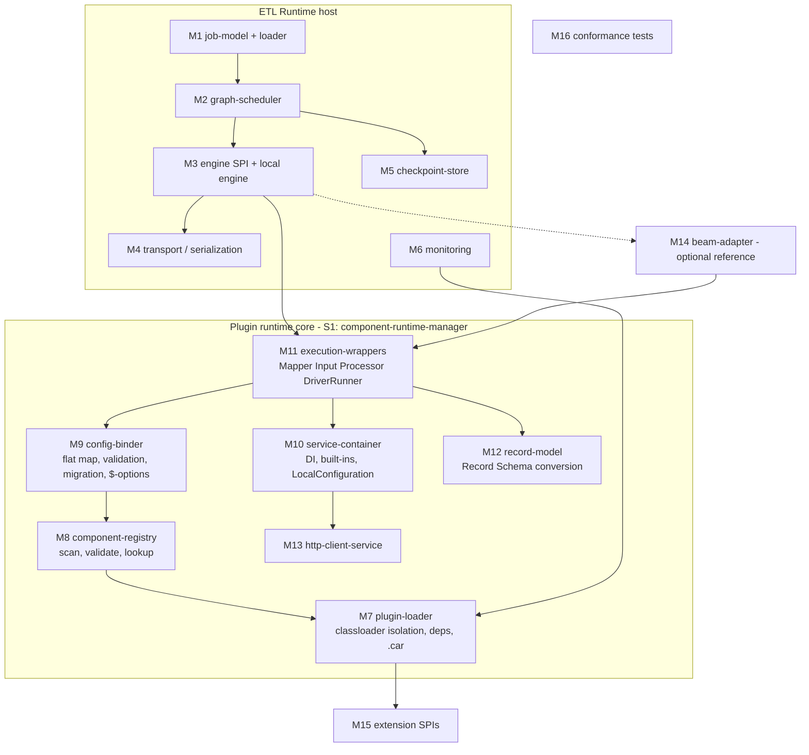
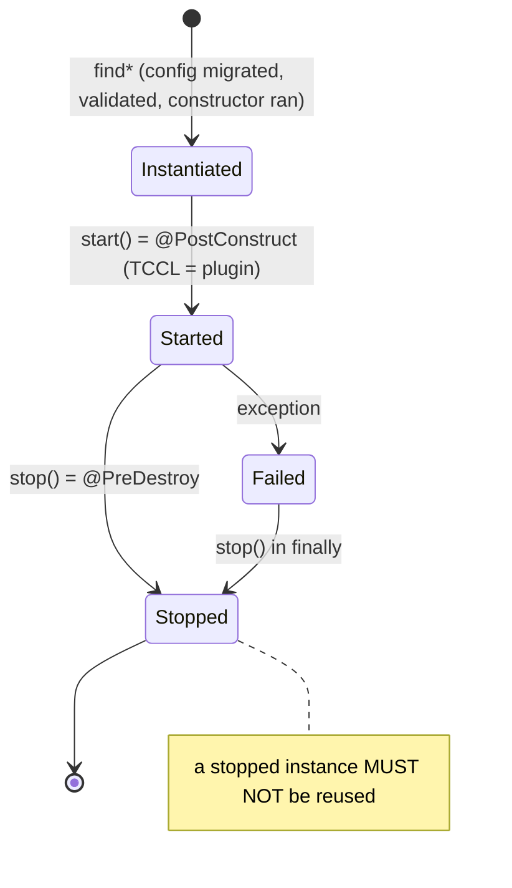
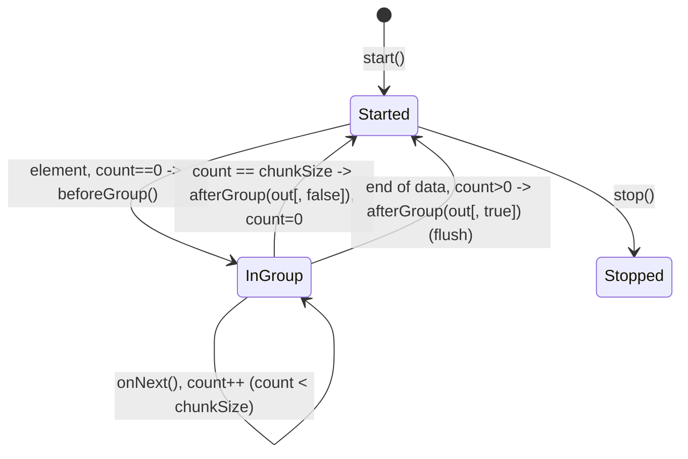
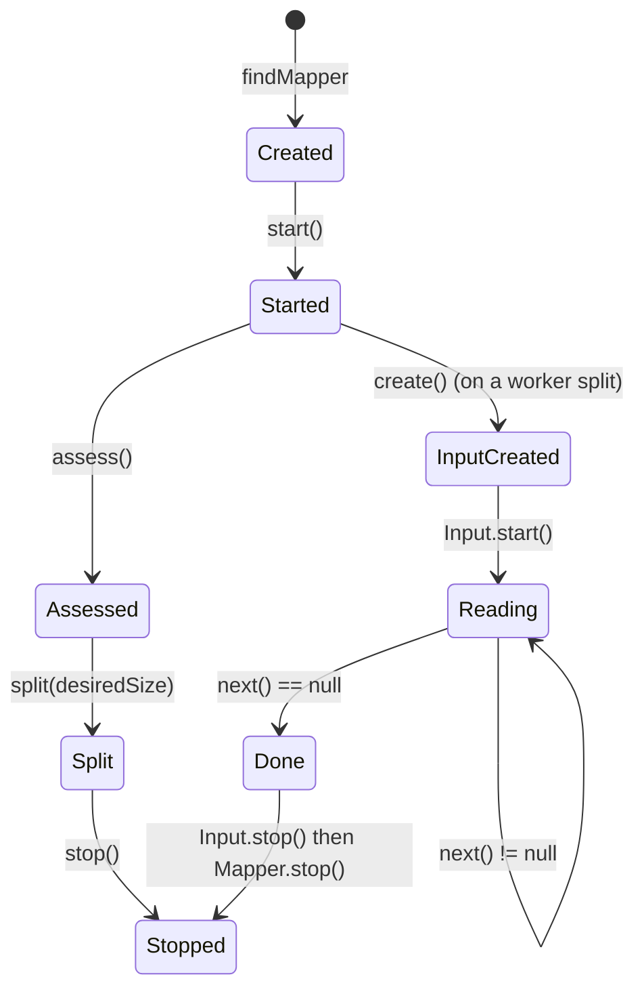

# 08 - Runtime blueprint (implementing an ETL Runtime that executes TCK components)

> Framework version documented: **1.2611.0-SNAPSHOT** (root `pom.xml`; last release tag `1.2610.0`).
> Audience: an AI or engineer who must build a **fully functional run-time host** (no Designer, no Component Server needed) that loads TCK plugins and executes a graph of components.
> Sources of truth inside this documentation set: [01](01-overview-and-architecture.md), [04](04-data-model.md), [06](06-runtime-execution.md), [03](03-component-server-api.md), catalog [RUN](02-feature-catalog/RUN-runtime.md) / [LCM](02-feature-catalog/LCM-lifecycle.md) / [SVC](02-feature-catalog/SVC-services.md) / [HTTP](02-feature-catalog/HTTP-http-client.md) / [DAT](02-feature-catalog/DAT-data-model.md) / [CFG](02-feature-catalog/CFG-configuration.md) / [VAL](02-feature-catalog/VAL-validation.md) / [INT](02-feature-catalog/INT-interceptors.md) / [DSG](02-feature-catalog/DSG-design.md) / [ACT](02-feature-catalog/ACT-actions.md) / [UI](02-feature-catalog/UI-ui.md) / [SRV](02-feature-catalog/SRV-server.md) / [TST](02-feature-catalog/TST-testing.md), machine index [`02-feature-catalog/index.json`](02-feature-catalog/index.json), appendices [runtime-configuration-keys](10-appendix/runtime-configuration-keys.md), [lifecycle-hooks](10-appendix/lifecycle-hooks.md), [built-in-services](10-appendix/built-in-services.md), [known-discrepancies](10-appendix/known-discrepancies.md).
> Conventions: MUST / SHOULD / MAY are RFC 2119 and address the runtime host. Names in backticks are exact names from the framework. `(inferred)` = deduced from code by the earlier documents; `(unverified)` = not confirmed; `(design)` = a choice made by this blueprint (not a framework fact). Code beats prose where they differ (see [known-discrepancies](10-appendix/known-discrepancies.md), especially C2, C3, C6, D06, D07, D13, D14, D34).

## 0. How to use this blueprint

1. Decide the **integration strategy** (section 1.3): **S1 reuse** `component-runtime-manager` (recommended: the Java `ComponentManager`), or **S2 re-implement** the contracts in another language/runtime. Every algorithm below states the behaviour that S2 must reproduce; under S1 the algorithm is provided by the library and the host implements only the parts marked `HOST`.
2. Build modules in the order of section 11 (maturity levels 0, 1, 2).
3. Use the traceability table (section 10) to check that every Runtime/Both feature has an owner module, and the acceptance tests (section 12) to verify.

## 1. Scope and non-goals

### 1.1 In scope

An ETL Runtime that, given a **persisted job** (graph of component instances, each with plugin id, family, component name, `@Version` value, flat configuration map, plus connections), can:

1. Load one or several TCK plugins (jar + Maven dependencies, or `.car`) with one isolated classloader each (LCM-004..LCM-008, LCM-010).
2. Resolve components by `(plugin, family, name, type)` and instantiate them with a flat `Map<String,String>` configuration, applying validation and version migration (RUN-025, RUN-041, LCM-001..LCM-003).
3. Inject services (built-in and user `@Service`) (SVC-001, SVC-027, [built-in-services](10-appendix/built-in-services.md)).
4. Execute inputs (mapper split, parallel readers, producer loop), processors (groups, named outputs, reject), outputs, standalone components (RUN-001..RUN-022).
5. Run streaming inputs with stop conditions and checkpoint save/restore (RUN-027..RUN-033).
6. Convert and transport `Record`s between components and workers (DAT-029, DAT-030, RUN-039).
7. Provide the HTTP client service, `LocalConfiguration`, `LocalCache`, JSON services (HTTP-001..HTTP-026, SVC-005, SVC-008, SVC-016, SVC-017).
8. Propagate `ComponentException` and validation errors as job failures (INT-005, INT-009, VAL-012).
9. Optionally expose monitoring hooks (LCM-018) and target a distributed engine through an **engine adapter** (Beam is the reference: RUN-043..RUN-045).

### 1.2 Non-goals

* No Designer functions: no form rendering, no layouts/widgets, no `@Action` execution for UI (ACT-*, UI-* are Designer-tagged, except the items listed in section 10). A runtime MAY ignore design-time actions (ACT-002).
* No Component Server: the runtime does not call `/api/v1/*` (01 section 2.3). SRV-002/SRV-003/SRV-018/SRV-021/SRV-025 have no runtime work; SRV-004/SRV-011 are satisfied through in-process migration; SRV-006/SRV-007/SRV-020 are optional.
* No combiner (RUN-020: no API exists) and no job scheduling/persistence of run history (host product concern).
* No re-definition of the component API; the runtime consumes `org.talend.sdk.component.api.*` unchanged.

### 1.3 Integration strategies

| Strategy | Description | Effort | What `HOST` must write |
|---|---|---|---|
| S1 (recommended) | JVM host embedding `component-runtime-manager` (`ComponentManager`), `component-runtime-impl` wrappers (`Mapper`, `Input`, `Processor`, `DriverRunner`, `Lifecycle`) | low | plugin list, graph scheduler, routing, group cutting, threading, checkpoint persistence, engine adapter |
| S2 | Any-language re-implementation of the same contracts | very high | everything, incl. classloader isolation, reflection binding, DI, `Record`/`Schema`, HTTP client; **requires a JVM anyway** because plugins are Java bytecode (`(inferred)`, no non-JVM host is documented) |

Consequence: even an "S2" host must run plugin bytecode in a JVM; the realistic S2 variants are "JVM host that does not use `ComponentManager`" (re-implement LCM/SVC/HTTP contracts, RUN-024 wrapper interfaces) or "polyglot host talking to a JVM sidecar". This blueprint documents the contracts for both.

## 2. Architecture and module decomposition



| Id | Module | Responsibility | Owner of (main algorithm section) |
|---|---|---|---|
| M1 | `job-model` | parse/validate the persisted job into an execution graph (section 3.5); URI form `family://name?...` optional | 4.3 |
| M2 | `graph-scheduler` | topological levels, wiring of `(node, branch)` edges, lifecycle sequencing, failure cleanup | 4.8-4.12 |
| M3 | `engine-spi` + `local-engine` | abstraction over execution engines; minimal single-JVM engine | 9 |
| M4 | `transport` | Java serialization of wrappers, `Record` encoding between workers | 4.15, 7 |
| M5 | `checkpoint-store` | persist/restore `CheckpointState` JSON | 4.14 |
| M6 | `monitoring` | `ContainerListener`, JMX, logging | 4.19 |
| M7 | `plugin-loader` | container per plugin, `ConfigurableClassLoader`, dependency resolution, `.car` deploy | 4.1, 4.2 |
| M8 | `component-registry` | scan, `ModelVisitor` validation, registry keyed by family, lookup by name and type | 4.3 |
| M9 | `config-binder` | flat map to constructor arguments, validation, technical options, migration | 4.4-4.6 |
| M10 | `service-container` | built-in services, `@Service` instantiation and injection, `LocalConfiguration`, `LocalCache`, interceptors | 4.7, 4.17 |
| M11 | `execution-wrappers` | `Lifecycle`, `Mapper`, `Input`, `Processor`, `DriverRunner` wrappers | 4.8-4.14 |
| M12 | `record-model` | `Record`, `Schema`, `RecordBuilderFactory`, JSON/Avro/POJO conversions | 4.15 |
| M13 | `http-client-service` | declarative `@Request` client | 4.16 |
| M14 | `beam-adapter` | reference engine adapter (`TalendIO`, `TalendFn`) | 9.2 |
| M15 | `extension-spi` | `ComponentExtension`, `ComponentMetadataEnricher`, `ParameterExtensionEnricher`, `ContainerListenerExtension`, `Customizer`, `RecordBuilderFactoryProvider`, `ContainerFinder`, `OAuth1Provider` | 8 |
| M16 | `conformance` | acceptance tests, reuse of `component-runtime-testing` helpers | 12 |

Under S1, M7-M13 are provided by `component-runtime-manager`, `container-core`, `component-runtime-impl` (module map: [01 section 4](01-overview-and-architecture.md)); the host writes M1-M6, M14 optionally, M15 as needed.

## 3. Data structures (language-neutral)

Notation: `T?` nullable, `[T]` list, `{K:V}` map, `->` reference. All flat maps are `{String:String}`.

### 3.1 PluginContainer

```
PluginContainer {
  id                : String            // plugin id, e.g. artifactId (LCM-006, buildAutoIdFromName)
  rootModule        : String            // GAV or path of the jar
  classloader       : ConfigurableClassLoader
  dependencies      : [ResolvedDependency]   // from TALEND-INF/dependencies.txt (+dynamic) (LCM-007)
  state             : CREATED | DEPLOYED | ON_ERROR | UNDEPLOYING | UNDEPLOYED   // Container.State
  registry          : ComponentFamilyRegistry
  services          : LazyMap<Class, ServiceInstance>       // per plugin (SVC-027)
  localConfiguration: LocalConfiguration
  serviceActions    : [ActionMeta]                          // design time; may be ignored (ACT-002)
}
ResolvedDependency { groupId, artifactId, version, scope: compile|runtime, type: jar|bundle|zip, location: File | NestedEntry("MAVEN-INF/repository/...") }
ConfigurableClassLoader {
  id, urls, parent, parentClassesFilter, childFirstFilter, nestedDependencies, jvmMarkers, parentResourcesFilter
}
```

### 3.2 ComponentDescriptor (registry entry)

```
ComponentFamilyRegistry { family: String, partitionMappers: {name: MapperMeta}, processors: {name: ProcessorMeta}, driverRunners: {name: DriverRunnerMeta} }
ComponentMeta {                        // MapperMeta | ProcessorMeta | DriverRunnerMeta (BaseMeta)
  plugin        : String               // container id
  family        : String               // @Components(family=...)  (DSG-001)
  name          : String
  type          : MAPPER | PROCESSOR | DRIVER_RUNNER
  version       : Integer              // @Version value; default 1
  migrationHandler : MigrationHandler
  parameterMetas: [ParameterMeta]      // option tree incl. $-options
  inputFlows    : [String]             // "__default__", named @Input (RUN-048)
  outputFlows   : [String]             // "__default__", named @Output; empty => output component (RUN-019)
  infinite      : Boolean              // @PartitionMapper(infinite) -> streaming (RUN-027)
  stoppable     : Boolean
  instantiator  : (Map<String,String> config, Integer storedVersion) -> Lifecycle wrapper
  metadata      : {String:String}      // e.g. mapper::infinite (DSG-008)
}
ParameterMeta { path, name, type: OBJECT|ARRAY|STRING|NUMBER|BOOLEAN|ENUM, javaType, children:[ParameterMeta], metadata:{String:String} }   // CFG-014
```

### 3.3 Configuration map

```
ComponentConfiguration : {String:String}     // keys per CFG-002 / RUN-041 (see 4.4)
  "<root>.<path>"                     ordinary option (root is typically "configuration")
  "<path>[i]"                         list element; "<path>[length]" optional size cap
  "<path>[i].<field>"                 list of objects
  "<path>.key[i]" / "<path>.value[i]" map entries
  "<path>.__version"                  version of a nested @Version configuration type (LCM-003)
  "$maxBatchSize" | "<root>.$maxBatchSize"        group size cap (RUN-026)
  "$maxRecords"   | "<root>.$maxRecords"          stream stop (RUN-028)
  "$maxDurationMs"| "<root>.$maxDurationMs"       stream stop (RUN-028)
  "$checkpoint.<field>", "$checkpoint.__version"   restored state, mappers only (RUN-033)
```

`$maxDurationSeconds` does NOT exist (C2/D02).

### 3.4 Record, Schema, Group, CheckpointState

```
Schema  { type: STRING|BYTES|INT|LONG|FLOAT|DOUBLE|BOOLEAN|DATETIME|DECIMAL|RECORD|ARRAY   // 11 types (DAT-005)
          entries:[Entry], metadata:[Entry], elementSchema: Schema?, props:{String:String} }   // DAT-004
Entry   { name, rawName?, type, nullable, metadata: Boolean, errorCapable, defaultValue?, elementSchema?, comment?, props }   // DAT-006
Record  { schema: Schema, values: {entryName: Value} }  // immutable, built via RecordBuilderFactory (DAT-001, DAT-016)
Value   = String | bytes | Int | Long | Float | Double | Boolean | epochMillis(Long)|Instant | BigDecimal | Record | [Value]
Group   { processorInstance: Processor, count: Integer, chunkSize: Integer, open: Boolean }   // section 5.2
GroupKey{ componentId, branchName, data: Record } -> String key   // GroupKeyProvider (RUN-050)
CheckpointState { version: Integer, state: JsonObject }
CheckpointJson  = { "$checkpoint": { <stateFields>..., "__version": <int> } }   // RUN-033
```

### 3.5 ExecutionGraph (persisted job)

```
Job {
  properties : {String:String}      // e.g. streaming.maxRecords, streaming.maxDurationMs, talend.beam.job.<opt>, executor builder key (runtime-configuration-keys s7)
  nodes      : [Node]
  edges      : [Edge]
}
Node { id, plugin?, family, name, version: Integer, configuration: ComponentConfiguration, kind: derived(MAPPER|PROCESSOR|OUTPUT|DRIVER_RUNNER) }
Edge { fromNode, fromBranch = "__default__", toNode, toBranch = "__default__" }   // RUN-018
Derived: level(node) = 0 for nodes without incoming edges, else 1 + max(level(predecessors))   // (design), matches local runner "sequential levels" (06 s16)
```

Validation of a Job (HOST): every node resolves via section 4.3; `fromBranch` is in `outputFlows` of the source (or is `REJECT`); `toBranch` is in `inputFlows` of the target; an output component (empty `outputFlows`) has no outgoing edge; a driver runner has no edges (RUN-021, RUN-048); the graph is acyclic (`(design)`).

## 4. Algorithms

Each algorithm is numbered. `LIB` = performed by `component-runtime-manager` under S1. `HOST` = written by the integrator.

### 4.1 Plugin discovery and loading with classloader isolation (LCM-004..LCM-006, LCM-011, SVC-027)

Input: plugin sources. Output: N `PluginContainer` in state `DEPLOYED`.

1. `HOST` Choose the parent (shared) loader. It MUST expose: host classes, `org.talend.sdk.component.api.`, `.spi.`, `.classloader.`, `.runtime.`, `.container.`, `.dependencies.`, `javax.annotation.`, `javax.json.`, `org.slf4j.`, `org.apache.johnzon.` (default parent-first prefixes, LCM-005) plus anything from `Customizer.containerClassesAndPackages()` or JVM property `talend.component.manager.classloader.container.classesAndPackages`.
2. `HOST` Configure the Maven repository: `-Dtalend.component.manager.m2.repository=<path>` in production (LCM-008; the default intentionally points to a non-existent path unless `talend.component.manager.user.m2.fallback=true`).
3. `LIB` Determine plugin sources (LCM-006), in this order of concerns: explicit `addPlugin(pathOrGav)`; `TALEND-INF/plugins.properties` entries `<pluginName>=<GAV or path>` (parallel if `talend.component.manager.plugins.parallel=true`); classpath auto-discovery of jars containing `TALEND-INF/dependencies.txt` (disabled by `component.manager.classpath.skip=true`); caller-jar discovery (disabled by `component.manager.callers.skip=true`). If no plugin is registered when a component is looked up, auto-discovery runs (`autoDiscoverPluginsIfEmpty`, 06 s3 step 1).
4. `LIB` For each source: id = `buildAutoIdFromName` (artifactId or file name without version). SHOULD keep ids stable across upgrades so a re-deploy replaces instead of duplicating.
5. `LIB` Resolve the classpath (algorithm 4.2), create `ConfigurableClassLoader(id, urls, parent, parentFilter, childFirstFilter, nestedDependencies, jvmMarkers, resourcesFilter)`.
6. `LIB` `ContainerManager.builder(id, module).create()` sets state `CREATED` and calls every `ContainerListener.onCreate(Container)` in registration order: the built-in `Updater` scans, builds services (4.7) and registers components (4.3); the JMX listener registers MBeans unless `talend.component.manager.jmx.skip=true`; extension listeners (`ContainerListenerExtension`, ordered by `order()`) run after them.
7. `LIB` If any listener throws, the deployment aborts with `<id> can't be deployed`, `onClose` runs on the listeners already called, state `ON_ERROR`. Otherwise state `DEPLOYED`.
8. `HOST` Keep one `ComponentManager` per JVM (LCM-004). On shutdown or plugin upgrade call `removePlugin(id)` / `close()`: `onClose` clears the registry, invokes `@PreDestroy` on services (skipping generated proxies), closes `Jsonb`, unregisters JMX, then closes the classloader.
9. `LIB` Class loading order of `ConfigurableClassLoader.loadClass`: JVM/platform classes (`jvmMarkers`) -> already loaded -> child if child-first -> parent if `parentFilter` accepts -> child otherwise -> JVM fallback -> Java classpath. Resources: own first, then parent when the resource filter accepts (default `/xmlMappings/`, plus `talend.component.manager.classloader.container.parentResources`); `TALEND-INF/*` is never read from the parent. Scanning restrictions come from `TALEND-INF/scanning.properties` (LCM-011).
10. Execution context rule (MUST): every call into plugin code sets the thread context classloader (TCCL) to the plugin loader (`LifecycleImpl.doInvoke`, `ComponentManager.executeInContainer`). Hosts calling plugin classes directly MUST do the same and restore the TCCL in `finally`.

### 4.2 Dependency resolution, Maven and `.car` (LCM-007..LCM-010)

1. Read `TALEND-INF/dependencies.txt` of the plugin (the output of `mvn dependency:list`). Keep entries with scope `compile` or `runtime` and type `jar`, `bundle` or `zip`.
2. Append dynamic dependencies: `TALEND-INF/dynamic-dependencies.properties` (`<pluginId>=gav1,gav2`) and `ContainerClasspathContributor` SPI results (skippable via `talend.component.manager.classpathcontributor.skip=true`) (ACT-010, SVC-026).
3. Resolve each GAV to `<m2>/<groupId as path>/<artifactId>/<version>/<artifactId>-<version>.jar` in the repository resolved by LCM-008 (priority: `talend.component.manager.m2.repository`; then only with `talend.component.manager.user.m2.fallback=true`: `talend.component.manager.m2.settings` `<localRepository>`, `MAVEN_HOME`/`M2_HOME` settings, `~/.m2/repository`; Studio: `maven.repository`, `osgi.configuration.area`), or to a nested entry under `MAVEN-INF/repository/` when the runtime itself is a fat jar (LCM-009).
4. Missing jar: fail the deployment of that plugin (the host SHOULD surface the GAV; exact `ComponentManager` message `(unverified)`).
5. `.car` deployment (LCM-010), `HOST` for a remote-engine style runtime: (a) read `TALEND-INF/metadata.properties` (`component_coordinates`, `type`, `version`, `date`, `CarBundlerVersion`); (b) copy `MAVEN-INF/repository/**` into the local m2 (the `.car` is an executable jar: `java -jar x.car maven-deploy <m2>`, `studio-deploy`, `deploy-to-nexus` exist in `CarMain`); (c) register `component_coordinates` with step 4.1.4.
6. `Customizer.ignoreDefaultDependenciesDescriptor()` MAY replace steps 1-3 for hosts with their own layout (SVC-026).
7. Dynamic dependencies at run time: a service `Resolver` (SVC-013) builds an isolated `ConfigurableClassLoader` from GAVs (`mapDescriptorToClassLoader`); `ClassLoaderDefinition` (SVC-014) is optional and throws `UnsupportedOperationException` if unsupported.

### 4.3 Component registration and lookup by family / name / type (LCM-004, RUN-025, RUN-046, RUN-047, DSG-001, RUN-048)

Registration (`LIB`, during `onCreate`):

1. Scan public classes of the plugin (respecting `scanning.properties`; never scan the manager itself, LCM-011).
2. For each class annotated `@PartitionMapper`, `@Emitter`, `@Processor`, `@DriverRunner`: call each `ComponentExtension.onComponent(ComponentContext)` (sorted by `priority()`); an extension may `skipValidation()` or own the component (SVC-021..SVC-023).
3. Validate with `ModelVisitor` (RUN-046) unless `talend.component.impl.mode=UNSAFE` (RUN-047): failures are `IllegalArgumentException` at deployment (rules: single public constructor, no `final` `@Option` fields, `Serializable`, etc.; see RUN-046 for the list).
4. Build `ComponentMeta` (3.2): options from the constructor parameters, `$maxBatchSize` when the processor has `@AfterGroup`, `$maxRecords`/`$maxDurationMs` for `stoppable` mappers, `inputFlows`/`outputFlows` (RUN-048), metadata enrichers (DSG-006).
5. Register into `ContainerComponentRegistry` keyed by family. Two modules with the same family merge unless a name conflicts (`Conflicting processors|mappers|driver runners`). Registry reads use a read lock, add/remove a write lock.

Lookup (`LIB` `ComponentManager.findComponentInternal`, `find` entry points `findMapper`, `findProcessor`, `findDriverRunner`):

1. `HOST` Choose the entry point from the node kind: input -> `findMapper`; processor/output -> `findProcessor`; standalone -> `findDriverRunner`.
2. If no plugin is registered, auto-discover.
3. For each container: a `GenericComponentExtension` that `canHandle` the coordinates wins (`createInstance`, SVC-024); otherwise look up `family` (the `plugin` argument, trimmed) then `name`.
4. `HOST` An empty `Optional` MUST be reported as **component missing** (family/name/type in the message), never as a null pointer (RUN-025).
5. Uniqueness: `(family, name)` is the component identity (DSG-001); the same `name` may exist in two families.

### 4.4 Flat configuration to component instance option binding (CFG-001..CFG-003, RUN-041, VAL-012)

Input: `ComponentConfiguration` (3.3), stored version. Output: constructor arguments and instance.

1. `HOST` Send the **complete** map including values rendered from defaults: the runtime applies no UI defaults, only Java field initializers (CFG-004, RUN-041).
2. `LIB` Copy `$`-keys (keys starting with `$` or containing `.$`) into the wrapper's `internalConfiguration` (mappers `PartitionMapperImpl`, processors `ProcessorImpl` only; `LocalPartitionMapper` and `DriverRunnerImpl` keep none) (RUN-040).
3. `LIB` Migrate first (4.6), then build the arguments with `ReflectionService.parameterFactory` using these rules:

| Java shape | Keys read |
|---|---|
| nested object `@Option("configuration") Cfg c` | `configuration.<field>` (field name or its `@Option` value) |
| primitives / `String` / enum | `<path>`; enum: `Enum.valueOf(trim)`, empty -> null; unknown constant fails (VAL-009) |
| `List<T>` / `Set<T>` of primitives | `<path>[0]`, `<path>[1]`, ... stops at the first missing index; `<path>[length]` caps the size |
| `List<Obj>` | `<path>[i].<field>` |
| `Map<K,V>` | `<path>.key[i]`, `<path>.value[i]` (and `.key[i].<field>` for object keys/values) |
| `Schema` | JSON string in the configuration form of [04 s3.5(a)](04-data-model.md) (DAT-032) |
| `JsonObject` | JSON string |
| `@Configuration("prefix")` object | read from `LocalConfiguration` keys `prefix.<field>` (SVC-006), not from the map |
| services (`Jsonb`, `RecordBuilderFactory`, user `@Service`, `Collection<Service>`, ...) | injected from the container, never from the map |

4. Conversion of primitives/dates uses the manager's property editors: the host MUST NOT re-implement it (CFG-003). Date options use the xbean converters (UI-010).
5. Unknown keys are ignored, missing keys keep field initializers (CFG-002, inferred).
6. `LIB` Validate visible parameters only: parameters whose `@ActiveIf`/`@ActiveIfs` condition evaluates to hidden are skipped (UI-016, UI-017; `VisibilityService`; `ui.scope` conditions are treated as absent, D38). Checks: `required` (VAL-001), `min`/`max` (VAL-002, VAL-003), `minLength`/`maxLength`, `minItems`/`maxItems`, `pattern` (VAL-004), `uniqueItems` (VAL-005), implicit type constraints (VAL-008). All messages are collected into **one** `IllegalArgumentException` (VAL-012). `-Dtalend.component.configuration.validation.skip=true` bypasses it and SHOULD be used only for legacy configurations.
7. `HOST` Report that exception as a **user (configuration) error** of the node, before any data flows.
8. `LIB` Call the single public constructor inside the plugin TCCL; the instance MUST be `Serializable` (RUN-039), wrap it (`PartitionMapperImpl`, `LocalPartitionMapper`, `ProcessorImpl`, `DriverRunnerImpl`, or `ComponentExtension.convert`).
9. Datastore/dataset objects (`@DataStore`, `@DataSet`, CFG-008, CFG-009) are ordinary nested options; `@DatasetDiscovery` (CFG-010, CFG-011) and `@ConnectorRef` (CFG-013) need no special runtime code; `@DynamicDependenciesConfiguration` (CFG-012) triggers 4.2 step 7.

### 4.5 Technical options (CFG-016, RUN-026, RUN-028, RUN-033, RUN-040)

| Key | Type / default | Consumer | Runtime action |
|---|---|---|---|
| `$maxBatchSize` (`<root>.$maxBatchSize`) | Integer, default 1000 from `LocalConfiguration` `<Class>._maxBatchSize.value` then `_maxBatchSize.value`; `_maxBatchSize.active=false` removes the option; min 1 | `ProcessorImpl` (only classes with `@AfterGroup`) | group size upper bound (4.10) |
| `$maxRecords` | Long, default -1 (`<Class>$maxRecords`, `$maxRecords` in `LocalConfiguration`) | streaming mappers with `stoppable` | stop after N records (4.13) |
| `$maxDurationMs` | Long, default -1 | same | stop after N ms (4.13) |
| `$checkpoint.<field>`, `$checkpoint.__version` | restored state | mappers, only if `talend.checkpoint.enabled=true` | rewritten to the `@Checkpoint` option path (4.14) |
| `$lang` (`Locale` for `@Internationalized`, DSG-012) | string | services | provide the current locale (SHOULD) |

Rules: forward `$`-keys unchanged (RUN-040); component code reads `maxRecords`/`maxDurationMs` (no `$`) through `@Option(Option.MAX_RECORDS_PARAMETER)` / `@Option(Option.MAX_DURATION_PARAMETER)` in `@PostConstruct` (D18); an unset value means "framework default", not zero.

### 4.6 Version migration via `MigrationHandler` (LCM-001..LCM-003)

1. `HOST` Persist `(component version, configuration map)` at save time; at run time pass the stored version as the `version` argument of `find*`. MUST NOT rewrite the stored version silently (LCM-001).
2. `LIB` `BaseMeta.instantiate(configuration, version)` calls `migrationHandler.migrate(version, configuration)` **always** (also when versions are equal; only a stored version higher than the registry version is short-circuited by the server endpoint, D35) (LCM-002).
3. Nested configuration types (`@DataStore`, `@DataSet`, any class with `@Version`) are migrated by implicit handlers driven by `<path>.__version` keys; the host MUST keep those keys in the map (LCM-003).
4. `MigrationHandler` classes are instantiated once per plugin (constructor injection of services) and cached.
5. A handler exception is an `IllegalArgumentException`/`ComponentException` at instantiation: fail the node before start (host classification: configuration error, `(design)`).
6. Checkpoint state migrates through the same mechanism using the state class `@Version` (RUN-033).

### 4.7 Service DI and built-in services (SVC-001, SVC-027, SVC-002, SVC-005..SVC-009, SVC-013..SVC-017, DAT-016, DAT-017, DAT-020, HTTP-001, INT-001..INT-003, DSG-011)

Injection is by exact declared type; each plugin has its own lazy service map; services are singletons and MUST be thread-safe and stateless ([built-in-services s1](10-appendix/built-in-services.md)).

Per plugin, in this order (SVC-027):

1. `LIB` Create `@Internationalized` proxies (DSG-011).
2. `LIB` For every interface extending `HttpClient` that declares `@Request` methods, create the proxy `HttpClientFactory.create(proxy, null)` and register it (HTTP-001, HTTP-002).
3. `LIB` Instantiate every `@Service` class (SVC-001); wrap it in a generated `$$TalendServiceProxy` when it has interceptors (`@Intercepts`, INT-001..INT-003; calls MUST go through the proxy) or is not serializable; services extending `BaseService` get their `serializationHelper` set (SVC-002).
4. `LIB` Inject `@Service` fields via `Injector` (SVC-007), then run `@PostConstruct` once per container start.
5. `LIB` Register action metadata (`ServiceMeta.ActionMeta`); the runtime MAY ignore actions.
6. `LIB` Scan components (4.3).
7. On undeploy: `@PreDestroy` on non-proxy services, `Jsonb.close()`.

Built-in services the host MUST make injectable (full table: [built-in-services s2](10-appendix/built-in-services.md)):

| Level | Types |
|---|---|
| 0 | `LocalConfiguration` (SVC-005), `LocalCache` (SVC-008), `RecordBuilderFactory` (DAT-016), `javax.json.spi.JsonProvider`, `JsonBuilderFactory`, `JsonReaderFactory`, `JsonWriterFactory`, `JsonParserFactory`, `JsonGeneratorFactory` (SVC-016), `Jsonb` (SVC-017), `HttpClientFactory` and every `HttpClient` sub-interface proxy (HTTP-001, HTTP-002), user `@Service` classes (SVC-001) |
| 1 | `Injector` (SVC-007), `Resolver` (SVC-013), `RecordService` (DAT-017), `RecordPointerFactory` (DAT-020), `@Internationalized` proxies (DSG-011), `@Cached` interception (SVC-009), `@Configuration` (SVC-006) |
| 2 | `ObjectFactory` (SVC-015), `ProducerFinder` (SVC-012), `ContainerInfo`, `ProxyGenerator` (SVC-018), `@RuntimeContext`/`RuntimeContextHolder` (SVC-019, SVC-020), `ComponentExtension` services (SVC-021) |

Rules: all built-ins MUST be `Serializable` (either implementations returning `SerializableService(plugin, className)` from `writeReplace()`, or serializable proxies) (SVC-003, SVC-016). Unknown types: built-in lookup returns null, then `@Service` classes are searched; a component asking for an unknown type fails at injection. A global (plugin-less) lookup exists only for the five JSON-P factories and `RecordBuilderFactory` (`DefaultServices.lookup`).

### 4.8 Mapper assess, split and parallel reader creation (RUN-001..RUN-005, RUN-024)

Entry: input node (kind MAPPER), `Mapper` obtained by `findMapper`.

1. `mapper.start()` (`@PostConstruct` of the mapper object) - coordinator.
2. `size = mapper.assess()` (`@Assessor`; `Number.longValue()`; default 1 when absent; unit is component-defined, bytes by convention, RUN-003).
3. Choose `desiredSize` (HOST/engine-defined; the local runner uses `assess()` itself; Beam bounded uses `desiredBundleSizeBytes`, unbounded uses `desiredNumSplits`). `@PartitionSize` parameter may be `int` or `long` (narrowed by `intValue()`, D14) (RUN-005).
4. `splits = mapper.split(desiredSize)` (`@Split`; returns `Collection` of new `Mapper`s, same names and internal configuration, each `Serializable`) (RUN-004).
5. `mapper.stop()` (`@PreDestroy`). The coordinator-side instance is not reused.
6. Distribute the splits to workers (serialization: 7.2). For `@Emitter`-only classes (`LocalPartitionMapper`): `assess()==1`, `split()` returns itself, `start/stop` are no-ops, `create()` returns the delegate if it already is an `Input`.
7. On each worker, for each split (any parallelism up to `len(splits)`): `split.start()`; `input = split.create()` (`@Emitter` method obtains the producer object; `StreamingInputImpl` if `isStream()` else `InputImpl`); run the producer loop 4.9; `split.stop()` in `finally`.
8. `HOST` MUST NOT share a split or `Input` instance across threads (only `StreamingInputImpl` serializes `readNext`).

### 4.9 Producer loop (RUN-006, RUN-024, RUN-023, DAT-029)

```
input.start()                                   // @PostConstruct of producer object; resolves checkpoint methods if enabled
try {
  while ((data = input.next()) != null) {       // InputImpl.next(): @Producer -> DAT-029 conversion to Record
      dispatch(data)                            // route to consumers, 4.10 / 4.11
      if (checkpointCallback != null && input.isCheckpointReady()) callback(input.getCheckpoint())   // 4.14
  }
} finally { input.stop() }                      // final checkpoint callback if registered, then @PreDestroy
```

* Batch: `null` = end of data; streaming: `null` = the stream is over (stop condition, give-up, or `stop()`), never "no data yet" (RUN-027).
* `@Producer` is the first public method annotated `@Producer`. Values that are `String`/primitives pass unconverted (tests); everything else is converted to `Record` (4.15).
* `BufferizedProducerSupport` (RUN-007) is a component-side helper; the host does nothing.
* `stop()` MUST be called on every started `Input`, also on failure.

### 4.10 Processor execution: groups, batching, named outputs, reject (RUN-008..RUN-019, RUN-026, RUN-049, RUN-050)

Reference: `AutoChunkProcessor` and Beam `BaseProcessorFn`.

1. `processor.start()` (`@PostConstruct`).
2. Determine `chunkSize`: internal `$maxBatchSize` if present (RUN-026); else host default. Local runner default when the option is absent is 1 (calls `beforeGroup`/`afterGroup` around every element); a distributed host chooses (Beam: one bundle = one group, plus a forced `afterGroup` every N when `maxBatchSize>0`).
3. For each incoming element `e` (already a `Record`, aligned across inputs, step 8):
   * if `count == 0`: `processor.beforeGroup()` (`@BeforeGroup`; MUST precede the first `onNext`, otherwise NullPointerException on `parameterBuilderProcess`, RUN-049);
   * `processor.onNext(inputFactory(e), outputFactory)`; `count++`; in `finally`, if `count == chunkSize`: `afterGroup` and `count = 0`.
4. `afterGroup` call form: `processor.afterGroup(outputFactory)`, or `processor.afterGroup(outputFactory, last)` when `processor.isLastGroupUsed()` (an `@AfterGroup` method with a trailing `@LastGroup boolean`, appended at the END of the arguments, RUN-012). `last=true` exactly on the final flush.
5. End of data: if `count > 0`: flush with `afterGroup` (MUST, also for output components); if the processor uses `@LastGroup` and `count == 0` at end, the host `(design)` SHOULD still emit one `afterGroup(out, true)` only if the reference does; the reference behaviour for an empty final group is `(unverified)`.
6. `processor.stop()` (`@PreDestroy`) in `finally`.
7. `InputFactory.read(name)` returns the record of that input branch for the current call (default `__default__`, `@Input("name")`, RUN-013); `null` if none.
8. **Multi-input** processors: align records of the different incoming branches by **group key** (`GroupKeyProvider.getComponentId()`, `getBranchName()`, `getData()` -> key) (RUN-050): collect per key one record per input branch, then call `onNext` with an `InputFactory` exposing them. The default key strategy is `(unverified)` (defined in the `chain` package `GroupKeyProvider`; a custom provider may be given by job property `org.talend.sdk.component.runtime.manager.chain.GroupKeyProvider`).
9. `OutputFactory.create(branchName)` MUST return an `OutputEmitter` for **any** name; `__default__` is implicit; `REJECT` is the reserved reject name; branches with no connected edge MUST silently discard, never fail (RUN-014, RUN-015, RUN-018). `emit(x)`: convert `x` to `Record` (DAT-029), ignore `null`, then route to every edge whose `fromBranch` equals the name.
10. A non-void `@ElementListener` return value is emitted on `__default__` after the call. `@AfterGroup` may declare `@Output` emitters and a group buffer `Collection<Record|JsonObject>` (processors without a listener) (RUN-011).
11. `MultiOutputIterator` (`createMultiOutputIterator()`, RUN-016) and `TaggedOutput` (RUN-017) are optional: if not implemented the components using them fail at runtime (Beam reference does not implement them). `HOST` decision: unsupported at level 0-1.
12. Record-in-listener typing: parameters are converted to their declared type (`Record`, `JsonObject`, POJO via Jsonb) (RUN-049, DAT-029).

### 4.11 Output components (RUN-019)

An output is a `@Processor` with void listener and no `@Output` (`outputFlows` empty, server type `processor`). Execute with 4.10; it is the last stage; no outgoing edge; it MUST get `beforeGroup`/`afterGroup` and the final flush. Beam: `TalendIO.write`.

### 4.12 Standalone components (RUN-021, RUN-022)

1. `driver = findDriverRunner(plugin, name, version, config)`.
2. On the **driver/coordinator only**: `driver.start()`; `driver.runAtDriver()` exactly once (locates the single `@RunAtDriver` method, invoked in the plugin TCCL); `driver.stop()` in `finally`.
3. No records, no flows. Schedule it as its own node before/after data nodes according to job dependencies `(design)`; the graph model has no edges for it (3.5).
4. Studio `@ReturnVariables`/`@AfterVariables` (RUN-037) are metadata for Studio; other hosts MAY ignore them.

### 4.13 Streaming with `$maxRecords` / `$maxDurationMs` (RUN-027..RUN-029)

1. Streaming = `@PartitionMapper(infinite=true)` (metadata `mapper::infinite`, DSG-008); `Mapper.isStream()==true`; `stoppable=true` adds the options `$maxRecords`, `$maxDurationMs`.
2. `HOST` MUST configure stop conditions for every non-interactive run, else the job never ends. Resolution order in `Streaming.loadStopStrategy`: (a) internal configuration key starting with or containing `.` + `$maxRecords`/`$maxDurationMs`; (b) JVM property `<plugin>.talend.input.streaming.maxRecords|maxDurationMs`; (c) `LocalConfiguration` `talend.input.streaming.maxRecords|maxDurationMs`. `-1` = unlimited.
3. `StreamingInputImpl.readNext()`:
   1. `running == false` -> `null`.
   2. stop strategy active and `shouldStop(readRecords)` -> `null`.
   3. acquire the 1-permit semaphore; while `running` and `retries > 0` (`maxRetries`, default `Integer.MAX_VALUE`): if `maxDurationMs > -1` run the producer in a one-thread executor with timeout `maxDurationMs + 3000 ms - elapsed` (min 10 ms), else call directly; non-null -> reset the retry strategy, `readRecords++`, return; null -> `retries--`, sleep `strategy.nextPauseDuration()` (negative = give up and stop; pauses >= 1000 ms are slept in 250 ms slices while `running`).
   4. retries exhausted -> `null`.
4. `start()` sets `running=true` and registers a JVM shutdown hook; `stop()` clears `running`, removes the hook and takes the semaphore (waits for a running read). `HOST` MUST call `stop()` on job cancel.
5. Retry strategy from `LocalConfiguration` (RUN-029): `talend.input.streaming.retry.strategy` (`constant` | `exponential`, default `constant`), `.maxRetries`, `.constant.timeout` (500), `.exponential.initialBackOff` (1000), `.exponent` (1.5), `.randomizationFactor` (0.5), `.maxDuration` (300000). Exponential: `min(initialBackOff * exponent^iteration, maxDuration)` with jitter `(rand*2-1)*randomizationFactor*interval`, capped at `maxDuration`. The host's `LocalConfiguration` MUST support these keys with the `<family>.<key>` first rule (4.17).
6. Job-level caps of the reference engines: `streaming.maxRecords` (local -1, Beam 1000) and `streaming.maxDurationMs` (Beam 60000), overridden by mapper-level `$` options.

### 4.14 Checkpoint save and restore (RUN-030..RUN-033)

Enabled only with `-Dtalend.checkpoint.enabled=true` (NOT `enable`, C6/D06); default off. Unsupported for processors.

1. **Restore**: `HOST` loads the stored JSON `{"$checkpoint": {<fields>, "__version": v}}`, flattens it with `ComponentManager.jsonToMap` and merges it into the mapper configuration (`"$checkpoint.<field>"`, `"$checkpoint.__version"`). `LIB` `mergeCheckpointConfiguration` rewrites the `$checkpoint` prefix to the path of the option annotated `@Checkpoint` (MAPPER type only). A stored `__version` older than the state class `@Version` is migrated (4.6.6).
2. **Save, callback mode**: `input.start(Consumer<CheckpointState>)` (kept only if checkpointing is enabled). After each non-null `next()`, `InputImpl` polls `isCheckpointReady()` (`@CheckpointAvailable`); if true it calls the callback with `getCheckpoint()` (`@CheckpointData`) - a `CheckpointState{version,state}`; `stop()` calls the callback one last time.
3. **Save, polling mode**: `HOST` calls `input.isCheckpointReady()` after `next()` and `input.getCheckpoint()` when true.
4. `CheckpointState.toJson()` = `{"$checkpoint": {...state fields..., "__version": v}}`; `version` = `@Version` of the state class (default 1).
5. Persistence, atomicity and exactly-once semantics are HOST responsibilities. `(design)`: persist the checkpoint only after the records emitted before it were durably consumed by all downstream nodes.
6. Guard: `Input.getCheckpoint()`, `isCheckpointReady()`, `start(Consumer)` throw `UnsupportedOperationException` on `Input` implementations that do not override them (`InputImpl` and `ChainedInput` do); signatures are `CheckpointState` / `boolean`, not `Object` / `Boolean` (D07). There is no frequency logic (D11).
7. Beam reference does not integrate checkpoints (unbounded sources use `NoCheckpointCoder`).

### 4.15 Record conversion and serialization between workers (DAT-001..DAT-016, DAT-029..DAT-036, RUN-039, RUN-045)

1. **Factory**: provide one `RecordBuilderFactory` per plugin through the `RecordBuilderFactoryProvider` SPI (DAT-034); default `RecordImpl`/`SchemaImpl` (memory). With `component-runtime-beam` on the classpath an Avro-backed factory is auto-selected (`talend.component.beam.record.factory.impl` = `auto|memory|default|avro`); do not mix implementations inside a plugin (DAT-031). Factories MUST be `Serializable` (serialize as `SerializableService`).
2. **To Record** (`RecordConverters.toRecord`, DAT-029): `null` -> `null`; `Record` unchanged; `JsonObject` -> `json2Record` (string -> STRING, boolean -> BOOLEAN, any number -> DOUBLE, object -> RECORD, array -> ARRAY with element schema from the first item, empty array -> STRING, JSON `null` skipped); POJO -> plugin Jsonb (`PojoJsonbProvider` writes straight into a Record, else `Jsonb.toJson` then `json2Record`); primitives/`String` returned as is by `InputImpl`.
3. **From Record to parameter type** (`RecordConverters.toType`): same instance if compatible; `JsonObject` via `toJson`; POJO via Jsonb.
4. **JSON mapping** (DAT-030): STRING/INT/LONG/FLOAT/DOUBLE/BOOLEAN scalars; BYTES Base64 (`BinaryDataStrategy.BASE_64`); DATETIME `ISO_ZONED_DATE_TIME` string; DECIMAL `toString()`; RECORD nested; ARRAY homogeneous; `null` omitted. Use a Johnzon-compatible JSON-B/JSON-P provider (`johnzon.cdi.activated=false`, `johnzon.accessModeDelegate=TalendAccessMode`).
5. **Names and props**: address entries by `Entry.getName()` (sanitized), keep `rawName` (DAT-013); preserve `props` including unknown ones and `field.logical.type` (DAT-011, DAT-012); preserve the order property `talend.fields.order` (DAT-009); keep metadata entries (DAT-035); handle arrays and nested records (DAT-036).
6. **Coercion** (`MappingUtils.coerce`, DAT-033) applies to `Record.get(Class, name)`: a host with its own `Record` MUST reproduce the 10 rules of [04 s6.4](04-data-model.md) or reuse `RecordImpl`.
7. **Flags**: `talend.component.record.error.support` (DAT-014, check `isValid()` when on), `talend.component.record.nullable.check` (`true` SKIPS null checks, D34, DAT-015), `talend.component.record.skip.sanitize` (incompatible with Avro).
8. **Component instances between JVMs** (RUN-039, SVC-003): wrappers serialize through `writeReplace` to a `SerializationReplacer{plugin, rootName, name, delegate bytes, wrapper state}`; the target JVM MUST have the plugin registered under the same id **before** deserialization and a `ContainerFinder` able to return it (`StandaloneContainerFinder` via SPI, or `ContainerFinder.Instance.set(...)`); the stream is read with `EnhancedObjectInputStream` bound to the plugin classloader. Set `talend.component.runtime.serialization.java.inputstream.whitelist` (class-name prefixes) in secured deployments, otherwise a deny-list with a warning applies. Service references travel as `SerializableService(plugin, class)` and re-resolve on the worker; service state MUST NOT be shipped.
9. **Records between workers** are `HOST`-encoded: any lossless encoding of the 11 types works; the reference (Beam) uses `SchemaRegistryCoder` (each record prefixed with the generated schema id + newline), so a distributed host MUST guarantee that the schema id resolves on the decoding side (RUN-045, inferred: registry replicated to every decoding JVM). A simple portable alternative (design): Schema JSON of [04 s3.5(a)] plus the record JSON of DAT-030 with an out-of-band type map, since JSON alone loses the DATETIME/DECIMAL/BYTES distinction.

### 4.16 HTTP client service (HTTP-001..HTTP-026)

`LIB` under S1; under a re-implementation these are the normative rules.

1. Register `HttpClientFactory` (serializable, plugin-scoped) and auto-create a proxy for every `HttpClient` sub-interface with `@Request` methods (HTTP-001, HTTP-002). Components call `client.base(url)` (usually in `@PostConstruct`); the base MUST be preserved when the proxy is copied.
2. Parse each interface method once (annotations + parameters) and cache the execution plan (HTTP-003); a method without `@Request` fails creation.
3. URL: `@Url` parameter wins and ignores base and path (HTTP-005); else `@Base` (HTTP-004) or proxy base + `/` + `@Request.path` (single slash join); `@Path` placeholders encoded as specified (HTTP-007); query parameters `@Query` in declaration order (HTTP-008), `@QueryParams` maps (HTTP-009), `QueryFormat` both modes, other value -> `IllegalArgumentException("Unsupported formatting")` (HTTP-010); method from `@Request.method` or `@HttpMethod` (HTTP-006).
4. Headers: `@Header` (HTTP-011), `@Headers` maps (HTTP-012), set with `setRequestProperty` semantics before the configurer.
5. Body: at most one payload parameter (the one without HTTP annotation, else `IllegalArgumentException("has two payload parameters")`) (HTTP-026); `Encoder.encode` only for non-null, non-`byte[]` payloads (HTTP-014).
6. Codecs (`@Codec`, HTTP-013; `@ContentType`, HTTP-016; defaults and matching, HTTP-017): user codecs win on identical keys, two codecs with the same key -> `IllegalArgumentException`; defaults `*/json`, `*/*+json` (JSON-B), `*/xml`, `*/*+xml` (JAXB when a context exists), fallback `*/*` (String UTF-8 both ways). Matching: content type before `;`, lower-case, empty = `*/*`, exact first then the first pattern (`*` -> `.+`, `+` literal), none -> `IllegalStateException("No codec found for content-type: '<ct>'")`, memoized. Decoder receives the generic `Type` (`Response<T>` argument) (HTTP-015).
7. Configurers: `@UseConfigurer` (method wins over interface, public no-arg constructor) (HTTP-018), `Configurer.configure(connection, configuration)` once per invocation, `postConfigure` (follow redirects) before connecting (HTTP-019), `@ConfigurerOption` passes the raw argument object (HTTP-020). OAuth1 (HTTP-021) needs an `OAuth1Provider` (SPI, HTTP-022); the manager registers `OAuth1ProviderImpl` through `META-INF/services/org.talend.sdk.component.api.service.http.configurer.oauth1.OAuth1$OAuth1Provider`.
8. Execution order (HTTP-025): build URL (+ `?` joined query), open `HttpURLConnection`, set method, set headers, run configurer, `postConfigure`, write payload (`setDoOutput(true)`), read status, read body. Return `InputStream` when declared (streamed), raw `byte[]` when declared, else slurp and decode. On `IOException` while reading: read the error stream, build the error `Response`; return it if the declared type is `Response` (HTTP-023, error body via `error()`), else throw `HttpException` (HTTP-024) which is a component failure.

### 4.17 Local configuration resolution (SVC-005, SVC-006, SVC-008, SVC-009)

`LocalConfiguration.get(k)` for plugin `p`:

1. Delegates in order: (1) `LocalConfiguration` SPI implementations (unless `talend.component.manager.localconfiguration.skip=true`); (2) JVM system properties; (3) environment variables (exact name, then non-alphanumerics replaced by `_`, then upper-cased); (4) `TALEND-INF/local-configuration.properties` of the plugin (all copies aggregated, sorted by integer `_ordinal` default 0, higher wins; skipped when `talend.component.configuration.<p>.ignoreLocalConfiguration=true`).
2. Try `p.k` through all delegates first, then plain `k`; each attempt is retried with `.` replaced by `_`. `keys()` returns the union, also exposing `p.`-prefixed keys without the prefix.
3. `local_configuration:<key>` inside annotation strings is resolved once when parameter metadata is built.
4. `LocalCache` (SVC-008): one per plugin, released by `@PreDestroy release()`; eviction keys `talend.component.manager.services.cache.eviction.{defaultEvictionTimeout,maxDeletionPerEvictionRun,defaultMaxSize}` (names inferred, D40); `@Cached` (SVC-009) honoured through interceptor proxies, else methods still execute uncached.
5. `@Configuration("prefix") Supplier<X>` on service fields is re-evaluated at each `get()`; `@Configuration("prefix") X` on constructor parameters is read once (SVC-006).

### 4.18 Error handling and `ComponentException` (INT-005, INT-006, INT-009, VAL-012, HTTP-024, DAT-014)

1. Every reflective call unwraps `InvocationTargetException` (`InvocationExceptionWrapper`): the host sees `ComponentException` (with `ErrorOrigin` `USER` / `BACKEND` / `UNKNOWN`, `originalType`, `originalMessage`) or `java.*` runtime exceptions, never plugin exception classes (classloader isolation). The host MUST NOT depend on plugin exception classes and SHOULD log `originalType` (INT-005, INT-009).
2. Classification (INT-006, `(design)` mapping): `USER` -> configuration/user error, no retry; `BACKEND` -> external system failure, may retry per policy; other -> internal error. Server mapping for reference: 400 USER, 456 BACKEND, 520 other.
3. Configuration/validation errors (`IllegalArgumentException` from 4.4.6) are raised at instantiation, before start: fail the job start without running any data (VAL-012).
4. Failure during a node: mark the job failed, cancel the other nodes, but **still call `stop()` on every started component** in `finally` (local runner behaviour); `stop()` failures propagate and SHOULD be logged without hiding the first error.
5. `HttpException` and entry-level errors (`isValid()==false`) are data/component failures per component design; the host MUST NOT treat invalid entries as data (DAT-014).

### 4.19 JMX and lifecycle listeners (LCM-018, SVC-025)

1. `ContainerListener.onCreate/onClose` (registered in order; listeners from `ContainerListenerExtension` SPI ordered by `order()`, added after the built-in `Updater` and JMX listener).
2. The built-in JMX listener registers container MBeans unless `talend.component.manager.jmx.skip=true`.
3. `HOST` MAY add its own `ContainerListener` for metrics of plugin deployment (start/end, failures) and a per-node timer/counter wrapper around `next()`/`onNext()` `(design)`.
4. `Container.State` transitions: CREATED -> DEPLOYED (or ON_ERROR) -> UNDEPLOYING -> UNDEPLOYED.
5. JVM shutdown hook: `ComponentManager.SingletonHolder` closes the contextual manager once at exit.

## 5. State machines

### 5.1 Component lifecycle (all wrappers extend `LifecycleImpl`, RUN-023, RUN-024)



### 5.2 Group handling (processor and output)



Invariant: `BeforeGroup -> onNext* -> AfterGroup`; `onNext` before the first `beforeGroup` is illegal.

### 5.3 Mapper / Input



### 5.4 Streaming / checkpoint

```mermaid
stateDiagram-v2
  [*] --> Restoring : $checkpoint.* merged (if any)
  Restoring --> Running : start(callback) running=true, shutdown hook
  Running --> Running : next() != null, readRecords++ ; if isCheckpointReady -> callback(state)
  Running --> Waiting : next() null-read, retries--, pause
  Waiting --> Running : pause elapsed
  Running --> Ended : shouldStop(maxRecords/maxDurationMs) or retries exhausted or stop()
  Waiting --> Ended : give up (pause < 0) or stop()
  Ended --> [*] : stop(): final checkpoint callback, take semaphore, @PreDestroy
```

### 5.5 Job

`CREATED -> VALIDATED -> STARTING (instantiate all nodes, fail fast on config errors) -> RUNNING -> (COMPLETED | FAILED | CANCELLED) -> CLEANUP (stop all started components)` `(design)`.

## 6. Error handling summary

| Situation | Detection | Runtime action | Feature |
|---|---|---|---|
| Unknown family/name/type | empty `Optional` | fail node "component missing" | RUN-025 |
| Invalid configuration | `IllegalArgumentException` from validation | fail at start as user error | VAL-012, RUN-041 |
| Migration exception | exception in `migrate` | fail at start | LCM-002 |
| Deployment failure | `<id> can't be deployed` | mark plugin `ON_ERROR`, fail jobs needing it | LCM-004 |
| Component exception | `ComponentException` | fail job, classify by `ErrorOrigin`, stop all | INT-005, INT-006 |
| HTTP failure | `HttpException` | component failure | HTTP-024 |
| Missing service | injection failure | fail plugin deployment or node | SVC-027 |
| Stream never ends | no stop condition | host must set `$maxRecords`/`$maxDurationMs` or cancel | RUN-028 |

## 7. Threading and serialization requirements

### 7.1 Threading

1. `InputImpl`, `ProcessorImpl`, `PartitionMapperImpl` instances are **stateful and not thread-safe**: one thread at a time per instance. Parallelism = several instances (splits), never concurrent calls on one.
2. `StreamingInputImpl.readNext` is serialized by a 1-permit semaphore; `stop()` waits for the running read.
3. Services are shared singletons across all component instances of a plugin: they MUST be thread-safe (no per-call state) ([built-in-services s1.5](10-appendix/built-in-services.md)).
4. Registry: read lock for lookup, write lock for add/remove; instantiation is lock-free per call. Do not hot-remove a plugin with running nodes.
5. TCCL: set per call to the plugin loader; restore afterwards (thread pools MUST NOT leak a plugin TCCL between tasks).
6. `LocalCacheService` uses a 4-thread scheduler shared by the manager; streaming reads with `maxDurationMs` use a one-thread executor per read.
7. Ordering: within a branch, records of one input keep their emission order; across parallel splits, no global order is guaranteed `(design)`.

### 7.2 Serialization

1. Component classes, constructor argument objects, `@Service` classes: `Serializable` (RUN-039, SVC-003).
2. Wrappers, `Mapper` splits, `Processor`s cross JVMs through `writeReplace`/`readResolve` (4.15.8). The plugin MUST be registered on the worker before deserialization; the worker classpath needs the runtime jars and the plugin jars.
3. `ComponentManager` serializes to a token resolved to `ComponentManager.instance()`.
4. Coordinator vs worker: constructors, `assess`, `split`, `runAtDriver` run on the coordinator; `@PostConstruct`, flow, `@PreDestroy` on workers (hook table: [lifecycle-hooks s1](10-appendix/lifecycle-hooks.md)).
5. Whitelist property for secured deployments (see 4.15.8).

## 8. Pluggability points

| Point | Type | Purpose | Feature |
|---|---|---|---|
| `Customizer` (SPI `ComponentManager$Customizer`) | SPI | class filters, `ignoreDefaultDependenciesDescriptor`, parent classes/packages | SVC-026 |
| `ContainerClasspathContributor` | SPI | add classpath entries per container | SVC-026 |
| `ContainerListenerExtension`, `ContainerListener` | SPI | deployment hooks, monitoring | SVC-025, LCM-018 |
| `ComponentExtension` (+ `ComponentContext`, `ComponentInstance`) | SPI | non-standard component kinds (e.g. Beam `BeamComponentExtension`) | SVC-021..SVC-023 |
| `GenericComponentExtension` | SPI | single generic component provider, consulted before standard lookup | SVC-024 |
| `ComponentMetadataEnricher` | SPI | add `metadata` keys | DSG-006 |
| `ParameterExtensionEnricher` | SPI | add parameter metadata keys (one prefix per extension recommended) | CFG-015 |
| `LocalConfiguration` implementations | SPI | inject configuration (vault, database, cloud config) | SVC-005 |
| `RecordBuilderFactoryProvider` | SPI | choose Record implementation (memory / Avro / custom) | DAT-034 |
| `ProducerFinder` | SPI | resolve mappers across plugins | SVC-012 |
| `ContainerFinder` | SPI | worker-side plugin lookup for deserialization | RUN-039, SVC-003 |
| `OAuth1Provider` | SPI | OAuth1 signing | HTTP-022 |
| `Job$ExecutorBuilder` (job property `org.talend.sdk.component.runtime.manager.chain.Job$ExecutorBuilder`) | job SPI | engine selection: `standalone`, `default`, `local`, `beam`, class or instance | RUN-042 |
| `GroupKeyProvider` | job SPI | multi-input join key | RUN-050 |
| Engine adapter (section 9) | host | new execution engine | RUN-043 |
| `ClassLoaderDefinition` | API default | volatile classloaders for dynamic dependencies | SVC-014 |

## 9. Engine adapter design

### 9.1 Adapter contract (any engine)

A custom engine adapter MUST (06 s16):

1. Call the lifecycle exactly as in 4.8-4.12 (`start`, `assess`/`split`/`create`, `next`, `beforeGroup`/`onNext`/`afterGroup`, `stop`).
2. Route records by branch name and edge `(fromNode, fromBranch) -> (toNode, toBranch)`.
3. Align multiple inputs by group key (4.10.8).
4. Serialize components (4.15.8, 7.2).
5. Flush groups at end of input (also outputs).
6. Surface `ComponentException` as job failure (4.18).

Interface (design, language-neutral):

```
interface ExecutionEngine {
  supports(job: Job) : Boolean
  run(job: Job, manager: ComponentManagerHandle) : JobResult          // blocks or returns handle
  cancel(handle) : void                                               // MUST end streaming inputs via Input.stop()
}
interface RecordTransport { encode(Record) : bytes ; decode(bytes) : Record }   // 4.15.9
```

### 9.2 Beam as the reference adapter (RUN-043..RUN-045)

| Job element | Beam construct |
|---|---|
| source (mapper) | `TalendIO.read(mapper, {maxRecords,maxDurationMs})` -> `Read`/`InfiniteRead` -> `RecordNormalizer` |
| edge `(from,branch)->(to,inBranch)` | `RecordBranchFilter(fromBranch)` -> optional `RecordBranchMapper(fromBranch,toBranch)` -> `RecordBranchUnwrapper(toBranch)` -> `AutoKVWrapper(GroupKeyProvider)` |
| single incoming edge | `RecordKVUnwrapper` + `RecordNormalizer` |
| several incoming edges | `KeyedPCollectionTuple` + `CoGroupByKey` + `CoGroupByKeyResultMappingTransform` |
| processor with outgoing edge | `TalendFn.asFn(processor)` (ParDo) |
| terminal processor (output) | `TalendIO.write(processor)` (ParDo with no output) |
| multi-branch output | one record whose entries are arrays named by sanitized branch name, read back with `BeamInputFactory` |

Bundle mapping (`BaseProcessorFn`): `@Setup` -> `processor.start()`; `@ProcessElement` -> `beforeGroup` when `currentCount==0`, `onNext`, `currentCount++`, forced `afterGroup` at `maxBatchSize`; `@FinishBundle` -> `afterGroup` if `currentCount>0`; `@Teardown` -> `stop()`. Source mapping: `BoundedSource.split/getEstimatedSizeBytes/createReader` -> `Mapper.start(); split/assess/create; Mapper.stop()`; `Reader.start()` -> `Input.start()` + first `next()`; `advance()` -> `next()`; `close()` -> `Input.stop()`. Pipeline options: `talend.beam.job.<option>=value`.

Requirements to embed it: `component-runtime-beam` and Beam on the container parent classloader (`BeamCustomizer` class index), `BeamComponentExtension` transformer flags (`talend.component.beam.transformers.skip|io.enhanced|debug`), Avro coder cache size `component.runtime.beam.avrocoder.cache.size` (default 1024), schema id resolvable on decoders (RUN-045). Validate with the Direct environment at least (TST-010). Other engines (Spark, Flink, custom) follow the same table conceptually `(design)`; Spark cluster testing exists as TST-016.

### 9.3 Minimal single-JVM engine (design, reference: local `Job` runner, RUN-042)

Data: `outbox[node][branch] : queue<Record>` in memory.

1. Validate the job (3.5) and compute levels.
2. Instantiate every node (4.3, 4.4); on any exception stop nothing (nothing started yet) and fail.
3. For level 0 input nodes, in order: 4.8 with `desiredSize = assess()`; for each split run 4.9 sequentially; each emitted `Record` goes through `route(node, branch, record)`, which appends to the outbox of every edge target.
4. For each next level: for each node, drain its inputs by group key (4.10.8), run 4.10 with `chunkSize = $maxBatchSize` (or 1 when absent), then final flush, then `stop()`.
5. Standalone nodes run 4.12 at their scheduled position.
6. `finally`: stop every started component; rethrow the first failure.
7. For streaming inputs, apply 4.13 stop conditions; because levels are sequential, a streaming source MUST be bounded by `$maxRecords`/`$maxDurationMs` (or `streaming.maxRecords`, default -1 = unbounded in the local runner).
8. This engine is sequential and loads all intermediate data in memory: `(design)` to scale, replace the outbox by bounded queues and run levels concurrently, keeping one thread per node instance.

## 10. Feature to module traceability

Every feature tagged `Runtime` or `Both` in [`index.json`](02-feature-catalog/index.json) is listed exactly once, grouped by maturity level. "Sec." is the section of this document that specifies the behaviour. Module ids: see section 2. `M16` (conformance) covers `TST-*`. Features tagged `Both` whose runtime contract is `none` are listed for completeness (no runtime work beyond passing data through).

### Level 0 (79 features)

| ID | Name | Tag | Module | Sec. |
|---|---|---|---|---|
| [DSG-001](02-feature-catalog/DSG-design.md#dsg-001-components) | @Components | Both | M8 component-registry | 4.3 |
| [CFG-001](02-feature-catalog/CFG-configuration.md#cfg-001-option) | @Option | Both | M9 config-binder | 4.4 |
| [CFG-002](02-feature-catalog/CFG-configuration.md#cfg-002-option-path-and-flat-configuration-map-syntax) | Option path and flat configuration map syntax | Both | M9 config-binder | 4.4 |
| [CFG-003](02-feature-catalog/CFG-configuration.md#cfg-003-parameter-types-and-type-mapping) | Parameter types and type mapping | Both | M9 config-binder | 4.4 |
| [CFG-014](02-feature-catalog/CFG-configuration.md#cfg-014-property-definition-and-metadata-model-simplepropertydefinition) | Property definition and metadata model (SimplePropertyDefinition) | Both | M8 component-registry | 3.2 |
| [VAL-001](02-feature-catalog/VAL-validation.md#val-001-required) | @Required | Both | M9 config-binder | 4.4 |
| [VAL-009](02-feature-catalog/VAL-validation.md#val-009-enum-value-restriction) | Enum value restriction | Both | M9 config-binder | 4.4 |
| [VAL-012](02-feature-catalog/VAL-validation.md#val-012-runtime-configuration-validation) | Runtime configuration validation | Both | M9 config-binder | 4.4 |
| [DAT-001](02-feature-catalog/DAT-data-model.md#dat-001-record) | Record | Both | M12 record-model | 4.15 |
| [DAT-002](02-feature-catalog/DAT-data-model.md#dat-002-recordbuilder) | Record.Builder | Runtime | M12 record-model | 4.15 |
| [DAT-003](02-feature-catalog/DAT-data-model.md#dat-003-record-value-access-and-coercion) | Record value access and coercion | Runtime | M12 record-model | 4.15 |
| [DAT-004](02-feature-catalog/DAT-data-model.md#dat-004-schema) | Schema | Both | M12 record-model | 4.15 |
| [DAT-005](02-feature-catalog/DAT-data-model.md#dat-005-schematype) | Schema.Type | Both | M12 record-model | 4.15 |
| [DAT-006](02-feature-catalog/DAT-data-model.md#dat-006-schemaentry) | Schema.Entry | Both | M12 record-model | 4.15 |
| [DAT-007](02-feature-catalog/DAT-data-model.md#dat-007-schemaentrybuilder) | Schema.Entry.Builder | Runtime | M12 record-model | 4.15 |
| [DAT-008](02-feature-catalog/DAT-data-model.md#dat-008-schemabuilder) | Schema.Builder | Runtime | M12 record-model | 4.15 |
| [DAT-013](02-feature-catalog/DAT-data-model.md#dat-013-schemacompanionutil-name-sanitization-and-collisions) | SchemaCompanionUtil (name sanitization and collisions) | Both | M12 record-model | 4.15 |
| [DAT-016](02-feature-catalog/DAT-data-model.md#dat-016-recordbuilderfactory) | RecordBuilderFactory | Runtime | M10 service-container / M12 | 4.7 |
| [DAT-029](02-feature-catalog/DAT-data-model.md#dat-029-component-data-type-conversion-record--jsonobject--pojo) | Component data type conversion (Record / JsonObject / POJO) | Runtime | M12 record-model | 4.15 |
| [RUN-001](02-feature-catalog/RUN-runtime.md#run-001-emitter) | @Emitter | Both | M11 execution-wrappers | 4.8 |
| [RUN-002](02-feature-catalog/RUN-runtime.md#run-002-partitionmapper) | @PartitionMapper | Both | M11 execution-wrappers | 4.8 |
| [RUN-003](02-feature-catalog/RUN-runtime.md#run-003-assessor) | @Assessor | Runtime | M11 execution-wrappers | 4.8 |
| [RUN-004](02-feature-catalog/RUN-runtime.md#run-004-split) | @Split | Runtime | M11 execution-wrappers | 4.8 |
| [RUN-005](02-feature-catalog/RUN-runtime.md#run-005-partitionsize) | @PartitionSize | Runtime | M11 execution-wrappers | 4.8 |
| [RUN-006](02-feature-catalog/RUN-runtime.md#run-006-producer) | @Producer | Runtime | M11 execution-wrappers | 4.9 |
| [RUN-008](02-feature-catalog/RUN-runtime.md#run-008-processor) | @Processor | Both | M11 execution-wrappers | 4.10 |
| [RUN-009](02-feature-catalog/RUN-runtime.md#run-009-elementlistener) | @ElementListener | Runtime | M11 execution-wrappers | 4.10 |
| [RUN-010](02-feature-catalog/RUN-runtime.md#run-010-beforegroup) | @BeforeGroup | Runtime | M11 execution-wrappers | 4.10 |
| [RUN-011](02-feature-catalog/RUN-runtime.md#run-011-aftergroup) | @AfterGroup | Runtime | M11 execution-wrappers | 4.10 |
| [RUN-014](02-feature-catalog/RUN-runtime.md#run-014-output) | @Output | Both | M2 graph-scheduler | 4.10 |
| [RUN-015](02-feature-catalog/RUN-runtime.md#run-015-outputemitter) | OutputEmitter | Runtime | M2 graph-scheduler | 4.10 |
| [RUN-019](02-feature-catalog/RUN-runtime.md#run-019-output-component-sink) | Output component (sink) | Both | M11 execution-wrappers | 4.11 |
| [RUN-021](02-feature-catalog/RUN-runtime.md#run-021-driverrunner) | @DriverRunner | Both | M11 execution-wrappers | 4.12 |
| [RUN-022](02-feature-catalog/RUN-runtime.md#run-022-runatdriver) | @RunAtDriver | Runtime | M11 execution-wrappers | 4.12 |
| [RUN-023](02-feature-catalog/RUN-runtime.md#run-023-component-lifecycle-hooks-postconstruct--predestroy) | Component lifecycle hooks (@PostConstruct / @PreDestroy) | Runtime | M11 execution-wrappers | 5.1 |
| [RUN-024](02-feature-catalog/RUN-runtime.md#run-024-runtime-wrapper-interfaces-lifecycle-mapper-input-processor-driverrunner) | Runtime wrapper interfaces (Lifecycle, Mapper, Input, Processor, DriverRunner) | Runtime | M11 execution-wrappers | 2 |
| [RUN-025](02-feature-catalog/RUN-runtime.md#run-025-component-instantiation-componentmanagerfind) | Component instantiation (ComponentManager.find*) | Both | M8 component-registry | 4.3 |
| [RUN-039](02-feature-catalog/RUN-runtime.md#run-039-serialization-requirements) | Serialization requirements | Runtime | M4 transport | 4.15 |
| [RUN-041](02-feature-catalog/RUN-runtime.md#run-041-flat-configuration-to-constructor-arguments) | Flat configuration to constructor arguments | Both | M9 config-binder | 4.4 |
| [RUN-048](02-feature-catalog/RUN-runtime.md#run-048-input-and-output-flows-flowsfactory) | Input and output flows (FlowsFactory) | Both | M8 component-registry / M2 scheduler | 3.5 |
| [RUN-049](02-feature-catalog/RUN-runtime.md#run-049-processor-input-conversion-and-group-buffer) | Processor input conversion and group buffer | Runtime | M11 execution-wrappers | 4.10 |
| [LCM-001](02-feature-catalog/LCM-lifecycle.md#lcm-001-version) | @Version | Both | M9 config-binder | 4.6 |
| [LCM-002](02-feature-catalog/LCM-lifecycle.md#lcm-002-migrationhandler) | MigrationHandler | Runtime | M9 config-binder | 4.6 |
| [LCM-004](02-feature-catalog/LCM-lifecycle.md#lcm-004-plugin-container-model) | Plugin (container) model | Runtime | M7 plugin-loader | 4.1 |
| [LCM-005](02-feature-catalog/LCM-lifecycle.md#lcm-005-classloader-isolation-configurableclassloader) | Classloader isolation (ConfigurableClassLoader) | Runtime | M7 plugin-loader | 4.1 |
| [LCM-006](02-feature-catalog/LCM-lifecycle.md#lcm-006-plugin-discovery-and-registration-sources) | Plugin discovery and registration sources | Runtime | M7 plugin-loader | 4.1 |
| [LCM-007](02-feature-catalog/LCM-lifecycle.md#lcm-007-dependency-resolution-dependenciestxt) | Dependency resolution (dependencies.txt) | Runtime | M7 plugin-loader | 4.2 |
| [LCM-008](02-feature-catalog/LCM-lifecycle.md#lcm-008-maven-repository-discovery-m2) | Maven repository discovery (m2) | Runtime | M7 plugin-loader | 4.2 |
| [INT-005](02-feature-catalog/INT-interceptors.md#int-005-componentexception) | ComponentException | Both | M11 / M2 error handling | 4.18 |
| [INT-009](02-feature-catalog/INT-interceptors.md#int-009-runtime-exception-unwrapping-invocationexceptionwrapper) | Runtime exception unwrapping (InvocationExceptionWrapper) | Runtime | M11 execution-wrappers | 4.18 |
| [SVC-001](02-feature-catalog/SVC-services.md#svc-001-service) | @Service | Both | M10 service-container | 4.7 |
| [SVC-005](02-feature-catalog/SVC-services.md#svc-005-localconfiguration) | LocalConfiguration | Both | M10 service-container | 4.17 |
| [SVC-008](02-feature-catalog/SVC-services.md#svc-008-localcache) | LocalCache | Runtime | M10 service-container | 4.17 |
| [SVC-016](02-feature-catalog/SVC-services.md#svc-016-json-p-services) | JSON-P services | Runtime | M10 service-container | 4.7 |
| [SVC-017](02-feature-catalog/SVC-services.md#svc-017-jsonb) | Jsonb | Runtime | M10 service-container | 4.7 |
| [SVC-027](02-feature-catalog/SVC-services.md#svc-027-service-instantiation-injection-and-lifecycle-order) | Service instantiation, injection and lifecycle order | Runtime | M10 service-container | 4.7 |
| [HTTP-001](02-feature-catalog/HTTP-http-client.md#http-001-httpclientfactory) | HttpClientFactory | Runtime | M13 http-client-service | 4.16 |
| [HTTP-002](02-feature-catalog/HTTP-http-client.md#http-002-httpclient) | HttpClient | Runtime | M13 http-client-service | 4.16 |
| [HTTP-003](02-feature-catalog/HTTP-http-client.md#http-003-request) | @Request | Runtime | M13 http-client-service | 4.16 |
| [HTTP-004](02-feature-catalog/HTTP-http-client.md#http-004-base) | @Base | Runtime | M13 http-client-service | 4.16 |
| [HTTP-005](02-feature-catalog/HTTP-http-client.md#http-005-url) | @Url | Runtime | M13 http-client-service | 4.16 |
| [HTTP-006](02-feature-catalog/HTTP-http-client.md#http-006-httpmethod) | @HttpMethod | Runtime | M13 http-client-service | 4.16 |
| [HTTP-007](02-feature-catalog/HTTP-http-client.md#http-007-path) | @Path | Runtime | M13 http-client-service | 4.16 |
| [HTTP-008](02-feature-catalog/HTTP-http-client.md#http-008-query) | @Query | Runtime | M13 http-client-service | 4.16 |
| [HTTP-009](02-feature-catalog/HTTP-http-client.md#http-009-queryparams) | @QueryParams | Runtime | M13 http-client-service | 4.16 |
| [HTTP-010](02-feature-catalog/HTTP-http-client.md#http-010-queryformat) | QueryFormat | Runtime | M13 http-client-service | 4.16 |
| [HTTP-011](02-feature-catalog/HTTP-http-client.md#http-011-header) | @Header | Runtime | M13 http-client-service | 4.16 |
| [HTTP-012](02-feature-catalog/HTTP-http-client.md#http-012-headers) | @Headers | Runtime | M13 http-client-service | 4.16 |
| [HTTP-013](02-feature-catalog/HTTP-http-client.md#http-013-codec) | @Codec | Runtime | M13 http-client-service | 4.16 |
| [HTTP-014](02-feature-catalog/HTTP-http-client.md#http-014-encoder) | Encoder | Runtime | M13 http-client-service | 4.16 |
| [HTTP-015](02-feature-catalog/HTTP-http-client.md#http-015-decoder) | Decoder | Runtime | M13 http-client-service | 4.16 |
| [HTTP-016](02-feature-catalog/HTTP-http-client.md#http-016-contenttype) | @ContentType | Runtime | M13 http-client-service | 4.16 |
| [HTTP-017](02-feature-catalog/HTTP-http-client.md#http-017-default-codecs-and-content-type-matching) | Default codecs and content-type matching | Runtime | M13 http-client-service | 4.16 |
| [HTTP-023](02-feature-catalog/HTTP-http-client.md#http-023-response) | Response | Runtime | M13 http-client-service | 4.16 |
| [HTTP-024](02-feature-catalog/HTTP-http-client.md#http-024-httpexception) | HttpException | Both | M13 http-client-service | 4.16 |
| [HTTP-025](02-feature-catalog/HTTP-http-client.md#http-025-request-execution-semantics) | Request execution semantics | Runtime | M13 http-client-service | 4.16 |
| [HTTP-026](02-feature-catalog/HTTP-http-client.md#http-026-payload-parameter) | Payload parameter | Runtime | M13 http-client-service | 4.16 |
| [SRV-002](02-feature-catalog/SRV-server.md#srv-002-get-apiv1componentindex) | GET /api/v1/component/index | Both | none (Designer/server; in-process equivalent noted) | 1.2 |
| [SRV-003](02-feature-catalog/SRV-server.md#srv-003-get-apiv1componentdetails) | GET /api/v1/component/details | Both | none (Designer/server; in-process equivalent noted) | 1.2 |

### Level 1 (51 features)

| ID | Name | Tag | Module | Sec. |
|---|---|---|---|---|
| [DSG-008](02-feature-catalog/DSG-design.md#dsg-008-component-metadata-map-keys) | Component metadata map (keys) | Both | M8 component-registry / M11 | 4.13 |
| [DSG-011](02-feature-catalog/DSG-design.md#dsg-011-internationalized) | @Internationalized | Runtime | M10 service-container | 4.7 |
| [CFG-004](02-feature-catalog/CFG-configuration.md#cfg-004-defaultvalue) | @DefaultValue | Both | M9 config-binder | 4.4 |
| [CFG-008](02-feature-catalog/CFG-configuration.md#cfg-008-datastore) | @DataStore | Both | M9 config-binder | 4.4 |
| [CFG-009](02-feature-catalog/CFG-configuration.md#cfg-009-dataset) | @DataSet | Both | M9 config-binder | 4.4 |
| [CFG-016](02-feature-catalog/CFG-configuration.md#cfg-016-built-in-technical-options-maxbatchsize-maxrecords-maxdurationms-lang) | Built-in technical options ($maxBatchSize, $maxRecords, $maxDurationMs, $lang) | Both | M9 config-binder | 4.5 |
| [UI-009](02-feature-catalog/UI-ui.md#ui-009-credential) | @Credential | Both | M9 config-binder (log hygiene) | 4.4 |
| [UI-010](02-feature-catalog/UI-ui.md#ui-010-datetime) | @DateTime | Both | M9 config-binder | 4.4 |
| [UI-016](02-feature-catalog/UI-ui.md#ui-016-activeif) | @ActiveIf | Both | M9 config-binder | 4.4 |
| [UI-017](02-feature-catalog/UI-ui.md#ui-017-activeifs) | @ActiveIfs | Both | M9 config-binder | 4.4 |
| [VAL-002](02-feature-catalog/VAL-validation.md#val-002-min) | @Min | Both | M9 config-binder | 4.4 |
| [VAL-003](02-feature-catalog/VAL-validation.md#val-003-max) | @Max | Both | M9 config-binder | 4.4 |
| [VAL-004](02-feature-catalog/VAL-validation.md#val-004-pattern) | @Pattern | Both | M9 config-binder | 4.4 |
| [VAL-005](02-feature-catalog/VAL-validation.md#val-005-uniques) | @Uniques | Both | M9 config-binder | 4.4 |
| [VAL-008](02-feature-catalog/VAL-validation.md#val-008-implicit-constraints-from-java-types) | Implicit constraints from Java types | Both | M9 config-binder | 4.4 |
| [ACT-002](02-feature-catalog/ACT-actions.md#act-002-actiontype-meta-annotation) | @ActionType (meta-annotation) | Both | M10 service-container | 4.7 |
| [ACT-007](02-feature-catalog/ACT-actions.md#act-007-discoverschema) | @DiscoverSchema | Both | M10 service-container (optional) | 1.2 |
| [ACT-011](02-feature-catalog/ACT-actions.md#act-011-createconnection) | @CreateConnection | Both | M10 service-container | 4.7 |
| [ACT-012](02-feature-catalog/ACT-actions.md#act-012-closeconnection-closeconnectionobject-connection) | @CloseConnection, CloseConnectionObject, @Connection | Both | M10 service-container | 4.7 |
| [DAT-009](02-feature-catalog/DAT-data-model.md#dat-009-schemaentriesorder) | Schema.EntriesOrder | Both | M12 record-model | 4.15 |
| [DAT-011](02-feature-catalog/DAT-data-model.md#dat-011-schemaproperty) | SchemaProperty | Both | M12 record-model | 4.15 |
| [DAT-012](02-feature-catalog/DAT-data-model.md#dat-012-schemapropertylogicaltype) | SchemaProperty.LogicalType | Both | M12 record-model | 4.15 |
| [DAT-017](02-feature-catalog/DAT-data-model.md#dat-017-recordservice) | RecordService | Runtime | M10 service-container | 4.7 |
| [DAT-020](02-feature-catalog/DAT-data-model.md#dat-020-recordpointerfactory) | RecordPointerFactory | Runtime | M10 service-container | 4.7 |
| [DAT-030](02-feature-catalog/DAT-data-model.md#dat-030-json-p--json-b-mapping-of-record) | JSON-P / JSON-B mapping of Record | Runtime | M12 record-model | 4.15 |
| [DAT-032](02-feature-catalog/DAT-data-model.md#dat-032-schema-json-serialization-schemaconverter) | Schema JSON serialization (SchemaConverter) | Both | M12 record-model | 4.15 |
| [DAT-033](02-feature-catalog/DAT-data-model.md#dat-033-type-conversion-rules-mappingutilscoerce) | Type conversion rules (MappingUtils.coerce) | Runtime | M12 record-model | 4.15 |
| [DAT-036](02-feature-catalog/DAT-data-model.md#dat-036-arrays-and-nested-records) | Arrays and nested records | Both | M12 record-model | 4.15 |
| [RUN-012](02-feature-catalog/RUN-runtime.md#run-012-lastgroup) | @LastGroup | Runtime | M11 execution-wrappers | 4.10 |
| [RUN-013](02-feature-catalog/RUN-runtime.md#run-013-input) | @Input | Both | M11 execution-wrappers | 4.10 |
| [RUN-018](02-feature-catalog/RUN-runtime.md#run-018-named-branches-__default__-reject) | Named branches (__default__, REJECT) | Both | M2 graph-scheduler | 4.10 |
| [RUN-026](02-feature-catalog/RUN-runtime.md#run-026-batch-grouping-and-maxbatchsize) | Batch grouping and maxBatchSize | Both | M11 execution-wrappers / M2 scheduler | 4.10 |
| [RUN-040](02-feature-catalog/RUN-runtime.md#run-040-internal-configuration-keys--prefix) | Internal configuration keys ($-prefix) | Both | M9 config-binder | 4.4 |
| [RUN-042](02-feature-catalog/RUN-runtime.md#run-042-job-dsl-and-local-runner) | Job DSL and local runner | Both | M3 engine-spi / local-engine | 9.3 |
| [RUN-046](02-feature-catalog/RUN-runtime.md#run-046-component-validation-at-registration-modelvisitor) | Component validation at registration (ModelVisitor) | Runtime | M8 component-registry | 4.3 |
| [LCM-003](02-feature-catalog/LCM-lifecycle.md#lcm-003-configuration-migration-protocol) | Configuration migration protocol | Both | M9 config-binder | 4.6 |
| [LCM-011](02-feature-catalog/LCM-lifecycle.md#lcm-011-component-scanning-rules) | Component scanning rules | Runtime | M8 component-registry | 4.3 |
| [INT-006](02-feature-catalog/INT-interceptors.md#int-006-componentexceptionerrororigin) | ComponentException.ErrorOrigin | Both | M2 error handling | 4.18 |
| [SVC-002](02-feature-catalog/SVC-services.md#svc-002-baseservice) | BaseService | Runtime | M10 service-container | 4.7 |
| [SVC-003](02-feature-catalog/SVC-services.md#svc-003-serial) | Serial | Runtime | M4 transport | 4.15 |
| [SVC-006](02-feature-catalog/SVC-services.md#svc-006-configuration) | @Configuration | Runtime | M10 service-container | 4.17 |
| [SVC-007](02-feature-catalog/SVC-services.md#svc-007-injector) | Injector | Runtime | M10 service-container | 4.7 |
| [SVC-009](02-feature-catalog/SVC-services.md#svc-009-cached) | @Cached | Runtime | M10 service-container | 4.17 |
| [SVC-013](02-feature-catalog/SVC-services.md#svc-013-resolver) | Resolver | Runtime | M10 + M7 | 4.2 |
| [HTTP-018](02-feature-catalog/HTTP-http-client.md#http-018-useconfigurer) | @UseConfigurer | Runtime | M13 http-client-service | 4.16 |
| [HTTP-019](02-feature-catalog/HTTP-http-client.md#http-019-configurer) | Configurer | Runtime | M13 http-client-service | 4.16 |
| [HTTP-020](02-feature-catalog/HTTP-http-client.md#http-020-configureroption) | @ConfigurerOption | Runtime | M13 http-client-service | 4.16 |
| [SRV-004](02-feature-catalog/SRV-server.md#srv-004-post-apiv1componentmigrateidconfigurationversion) | POST /api/v1/component/migrate/{id}/{configurationVersion} | Both | M9 config-binder (in-process migration) | 4.6 |
| [SRV-011](02-feature-catalog/SRV-server.md#srv-011-post-apiv1configurationtypemigrateidconfigurationversion) | POST /api/v1/configurationtype/migrate/{id}/{configurationVersion} | Both | M9 config-binder (in-process migration) | 4.6 |
| [SRV-018](02-feature-catalog/SRV-server.md#srv-018-internationalization-language-parameter-and-locale-mapping) | Internationalization (language parameter and locale mapping) | Both | none (Designer/server; in-process equivalent noted) | 1.2 |
| [SRV-025](02-feature-catalog/SRV-server.md#srv-025-plugin-deployment-registry-and-reloading) | Plugin deployment, registry and reloading | Both | none (Designer/server; in-process equivalent noted) | 1.2 |

### Level 2 (77 features)

| ID | Name | Tag | Module | Sec. |
|---|---|---|---|---|
| [DSG-006](02-feature-catalog/DSG-design.md#dsg-006-componentmetadataenricher-spi) | ComponentMetadataEnricher SPI | Both | M15 extension-spi | 8 |
| [DSG-012](02-feature-catalog/DSG-design.md#dsg-012-language) | @Language | Both | M10 service-container | 4.5 |
| [CFG-010](02-feature-catalog/CFG-configuration.md#cfg-010-datasetdiscovery) | @DatasetDiscovery | Both | M9 config-binder | 4.4 |
| [CFG-011](02-feature-catalog/CFG-configuration.md#cfg-011-datasetdiscoveryconfiguration) | DatasetDiscoveryConfiguration | Both | M9 config-binder | 4.4 |
| [CFG-012](02-feature-catalog/CFG-configuration.md#cfg-012-dynamicdependenciesconfiguration) | @DynamicDependenciesConfiguration | Both | M7 plugin-loader | 4.2 |
| [CFG-013](02-feature-catalog/CFG-configuration.md#cfg-013-connectorref-and-connectorreference) | @ConnectorRef and ConnectorReference | Both | M9 config-binder | 4.4 |
| [CFG-015](02-feature-catalog/CFG-configuration.md#cfg-015-parameterextensionenricher-spi) | ParameterExtensionEnricher SPI | Runtime | M15 extension-spi | 8 |
| [CFG-018](02-feature-catalog/CFG-configuration.md#cfg-018-configurationmapper-object-to-flat-map) | ConfigurationMapper (object to flat map) | Both | M9 config-binder | 4.4 |
| [VAL-010](02-feature-catalog/VAL-validation.md#val-010-asyncvalidation) | @AsyncValidation | Both | M9 config-binder | 4.4 |
| [ACT-010](02-feature-catalog/ACT-actions.md#act-010-dynamicdependencies) | @DynamicDependencies | Both | M7 plugin-loader | 4.2 |
| [ACT-014](02-feature-catalog/ACT-actions.md#act-014-availableoutputflows) | @AvailableOutputFlows | Both | M11 execution-wrappers | 4.10 |
| [DAT-010](02-feature-catalog/DAT-data-model.md#dat-010-orderedmap) | OrderedMap | Runtime | M12 record-model | 4.15 |
| [DAT-014](02-feature-catalog/DAT-data-model.md#dat-014-entry-level-error-support) | Entry-level error support | Both | M12 record-model | 4.15 |
| [DAT-015](02-feature-catalog/DAT-data-model.md#dat-015-nullable-check-switch) | Nullable check switch | Runtime | M12 record-model | 4.15 |
| [DAT-018](02-feature-catalog/DAT-data-model.md#dat-018-recordvisitor) | RecordVisitor | Runtime | M12 record-model | 4.7 |
| [DAT-019](02-feature-catalog/DAT-data-model.md#dat-019-recordpointer) | RecordPointer | Runtime | M12 record-model | 4.7 |
| [DAT-031](02-feature-catalog/DAT-data-model.md#dat-031-avro-mapping-beam-runtime) | Avro mapping (Beam runtime) | Runtime | M12 record-model | 4.15 |
| [DAT-034](02-feature-catalog/DAT-data-model.md#dat-034-recordbuilderfactoryprovider-spi) | RecordBuilderFactoryProvider SPI | Runtime | M15 extension-spi | 8 |
| [DAT-035](02-feature-catalog/DAT-data-model.md#dat-035-metadata-entries) | Metadata entries | Both | M12 record-model | 4.15 |
| [RUN-007](02-feature-catalog/RUN-runtime.md#run-007-bufferizedproducersupport) | BufferizedProducerSupport | Runtime | none (component-side helper) | 4.9 |
| [RUN-016](02-feature-catalog/RUN-runtime.md#run-016-multioutputiterator) | MultiOutputIterator | Both | M11 execution-wrappers | 4.10 |
| [RUN-017](02-feature-catalog/RUN-runtime.md#run-017-taggedoutput) | TaggedOutput | Runtime | M11 execution-wrappers | 4.10 |
| [RUN-020](02-feature-catalog/RUN-runtime.md#run-020-combiner-not-supported) | Combiner (not supported) | Runtime | none (no API) | 1.2 |
| [RUN-027](02-feature-catalog/RUN-runtime.md#run-027-streaming-input-infinite-mapper) | Streaming input (infinite mapper) | Both | M11 + M5 streaming | 4.13 |
| [RUN-028](02-feature-catalog/RUN-runtime.md#run-028-streaming-stop-conditions-maxrecords-maxdurationms) | Streaming stop conditions ($maxRecords, $maxDurationMs) | Both | M11 + M5 streaming | 4.13 |
| [RUN-029](02-feature-catalog/RUN-runtime.md#run-029-streaming-retry-strategy) | Streaming retry strategy | Runtime | M11 + M10 (LocalConfiguration) | 4.13 |
| [RUN-030](02-feature-catalog/RUN-runtime.md#run-030-checkpoint) | @Checkpoint | Both | M5 checkpoint-store | 4.14 |
| [RUN-031](02-feature-catalog/RUN-runtime.md#run-031-checkpointdata) | @CheckpointData | Runtime | M5 checkpoint-store | 4.14 |
| [RUN-032](02-feature-catalog/RUN-runtime.md#run-032-checkpointavailable) | @CheckpointAvailable | Runtime | M5 checkpoint-store | 4.14 |
| [RUN-033](02-feature-catalog/RUN-runtime.md#run-033-checkpoint-runtime-protocol-checkpoint-checkpointstate) | Checkpoint runtime protocol ($checkpoint, CheckpointState) | Runtime | M5 checkpoint-store | 4.14 |
| [RUN-037](02-feature-catalog/RUN-runtime.md#run-037-aftervariables--aftervariable--aftervariablecontainer) | @AfterVariables / @AfterVariable / @AfterVariableContainer | Both | none (Studio metadata) | 4.12 |
| [RUN-043](02-feature-catalog/RUN-runtime.md#run-043-beam-translation-of-a-job) | Beam translation of a job | Runtime | M14 beam-adapter | 9.2 |
| [RUN-044](02-feature-catalog/RUN-runtime.md#run-044-beam-io-adapters-talendio-talendfn) | Beam I/O adapters (TalendIO, TalendFn) | Runtime | M14 beam-adapter | 9.2 |
| [RUN-045](02-feature-catalog/RUN-runtime.md#run-045-beam-coders-and-schema-registry) | Beam coders and schema registry | Runtime | M14 beam-adapter / M4 transport | 9.2 |
| [RUN-047](02-feature-catalog/RUN-runtime.md#run-047-runtime-mode-unsafe) | Runtime Mode (UNSAFE) | Runtime | M8 component-registry | 4.3 |
| [RUN-050](02-feature-catalog/RUN-runtime.md#run-050-multi-input-record-grouping-groupkeyprovider) | Multi-input record grouping (GroupKeyProvider) | Both | M2 graph-scheduler | 4.10 |
| [LCM-009](02-feature-catalog/LCM-lifecycle.md#lcm-009-nested-maven-repository-and-shade-transformers) | Nested Maven repository and shade transformers | Runtime | M7 plugin-loader | 4.2 |
| [LCM-010](02-feature-catalog/LCM-lifecycle.md#lcm-010-component-archive-car) | Component archive (.car) | Runtime | M7 plugin-loader | 4.2 |
| [LCM-018](02-feature-catalog/LCM-lifecycle.md#lcm-018-containerlistener-and-jmx-exposure) | ContainerListener and JMX exposure | Runtime | M6 monitoring | 4.19 |
| [INT-001](02-feature-catalog/INT-interceptors.md#int-001-intercepts) | @Intercepts | Runtime | M10 service-container | 4.7 |
| [INT-002](02-feature-catalog/INT-interceptors.md#int-002-interceptorhandler) | InterceptorHandler | Runtime | M10 service-container | 4.7 |
| [INT-003](02-feature-catalog/INT-interceptors.md#int-003-interceptor-chain-resolution-and-service-proxies) | Interceptor chain resolution and service proxies | Runtime | M10 service-container | 4.7 |
| [SVC-012](02-feature-catalog/SVC-services.md#svc-012-producerfinder) | ProducerFinder | Runtime | M10 service-container | 4.7 |
| [SVC-014](02-feature-catalog/SVC-services.md#svc-014-classloaderdefinition) | ClassLoaderDefinition | Runtime | M7 plugin-loader | 4.2 |
| [SVC-015](02-feature-catalog/SVC-services.md#svc-015-objectfactory) | ObjectFactory | Runtime | M10 service-container | 4.7 |
| [SVC-018](02-feature-catalog/SVC-services.md#svc-018-containerinfo-and-proxygenerator-internal-services) | ContainerInfo and ProxyGenerator (internal services) | Runtime | M10 service-container | 4.7 |
| [SVC-019](02-feature-catalog/SVC-services.md#svc-019-runtimecontext) | @RuntimeContext | Runtime | M10 service-container | 4.7 |
| [SVC-020](02-feature-catalog/SVC-services.md#svc-020-runtimecontextholder) | RuntimeContextHolder | Runtime | M10 service-container | 4.7 |
| [SVC-021](02-feature-catalog/SVC-services.md#svc-021-componentextension) | ComponentExtension | Runtime | M15 extension-spi | 8 |
| [SVC-022](02-feature-catalog/SVC-services.md#svc-022-componentextensioncomponentcontext) | ComponentExtension.ComponentContext | Runtime | M15 extension-spi | 8 |
| [SVC-023](02-feature-catalog/SVC-services.md#svc-023-componentextensioncomponentinstance) | ComponentExtension.ComponentInstance | Runtime | M15 extension-spi | 8 |
| [SVC-024](02-feature-catalog/SVC-services.md#svc-024-genericcomponentextension) | GenericComponentExtension | Runtime | M15 extension-spi | 8 |
| [SVC-025](02-feature-catalog/SVC-services.md#svc-025-containerlistenerextension) | ContainerListenerExtension | Runtime | M6 monitoring / M15 | 4.19 |
| [SVC-026](02-feature-catalog/SVC-services.md#svc-026-containerclasspathcontributor-and-componentmanagercustomizer) | ContainerClasspathContributor and ComponentManager.Customizer | Runtime | M15 extension-spi | 8 |
| [HTTP-021](02-feature-catalog/HTTP-http-client.md#http-021-oauth1-configurer) | OAuth1 configurer | Runtime | M13 http-client-service | 4.16 |
| [HTTP-022](02-feature-catalog/HTTP-http-client.md#http-022-oauth1provider-spi) | OAuth1Provider (SPI) | Runtime | M15 extension-spi | 8 |
| [SRV-006](02-feature-catalog/SRV-server.md#srv-006-get-apiv1componentdependencies) | GET /api/v1/component/dependencies | Both | M7 plugin-loader (optional remote fetch) | 4.2 |
| [SRV-007](02-feature-catalog/SRV-server.md#srv-007-get-apiv1componentdependencyid) | GET /api/v1/component/dependency/{id} | Both | M7 plugin-loader (optional remote fetch) | 4.2 |
| [SRV-020](02-feature-catalog/SRV-server.md#srv-020-credential-decryption-vault) | Credential decryption (vault) | Both | M9 config-binder (optional decrypt) | 13 |
| [SRV-021](02-feature-catalog/SRV-server.md#srv-021-documentation-ui-and-toggle) | Documentation UI and toggle | Both | none (Designer/server; in-process equivalent noted) | 1.2 |
| [TST-001](02-feature-catalog/TST-testing.md#tst-001-simplecomponentrule-junit-4) | SimpleComponentRule (JUnit 4) | Runtime | M16 conformance | 12 |
| [TST-002](02-feature-catalog/TST-testing.md#tst-002-withcomponents-componentextension-and-injected-junit-5) | @WithComponents, ComponentExtension and @Injected (JUnit 5) | Both | M16 conformance | 12 |
| [TST-003](02-feature-catalog/TST-testing.md#tst-003-componentshandler-and-basecomponentshandler) | ComponentsHandler and BaseComponentsHandler | Both | M16 conformance | 12 |
| [TST-004](02-feature-catalog/TST-testing.md#tst-004-mock-components-testemitter-and-testcollector) | Mock components test://emitter and test://collector | Both | M16 conformance | 12 |
| [TST-005](02-feature-catalog/TST-testing.md#tst-005-serviceinjectionrule) | ServiceInjectionRule | Both | M16 conformance | 12 |
| [TST-006](02-feature-catalog/TST-testing.md#tst-006-input-factories-and-outputs) | Input factories and Outputs | Both | M16 conformance | 12 |
| [TST-008](02-feature-catalog/TST-testing.md#tst-008-recordasserts-and-exceptionverifier) | RecordAsserts and ExceptionVerifier | Both | M16 conformance | 12 |
| [TST-009](02-feature-catalog/TST-testing.md#tst-009-multi-environment-test-framework) | Multi-environment test framework | Both | M16 conformance | 12 |
| [TST-010](02-feature-catalog/TST-testing.md#tst-010-built-in-environments) | Built-in environments | Runtime | M16 conformance | 9.2 |
| [TST-011](02-feature-catalog/TST-testing.md#tst-011-http-mocking-with-junit-4) | HTTP mocking with JUnit 4 | Both | M16 conformance | 12 |
| [TST-012](02-feature-catalog/TST-testing.md#tst-012-http-mocking-with-junit-5) | HTTP mocking with JUnit 5 | Both | M16 conformance | 12 |
| [TST-013](02-feature-catalog/TST-testing.md#tst-013-http-capture-passthrough-and-response-location) | HTTP capture, passthrough and response location | Both | M16 conformance | 12 |
| [TST-014](02-feature-catalog/TST-testing.md#tst-014-mavendecrypter-server-and-junit-helpers) | MavenDecrypter, Server and JUnit helpers | Both | M16 conformance | 12 |
| [TST-015](02-feature-catalog/TST-testing.md#tst-015-beam-junit-helpers) | Beam JUnit helpers | Both | M16 conformance | 12 |
| [TST-016](02-feature-catalog/TST-testing.md#tst-016-spark-cluster-testing) | Spark cluster testing | Runtime | M16 conformance | 12 |
| [TST-017](02-feature-catalog/TST-testing.md#tst-017-temporary-folder-helpers) | Temporary folder helpers | Both | M16 conformance | 12 |
| [TST-019](02-feature-catalog/TST-testing.md#tst-019-executable-payload-fixtures-server-and-manager-tests) | Executable payload fixtures (server and manager tests) | Both | M16 conformance | 12 |


## 11. Implementation order by maturity level

Levels are cumulative (catalog rule: [README s3](02-feature-catalog/README.md)). Pass criterion: a host "is Level N" when 100% of its Runtime and Both items for levels <= N pass ([09](09-integration-checklist.md)).

### Level 0 - run components correctly (minimal)

Build order (each step is testable before the next):

1. **M7/M8 plugin loading and registry**: 4.1, 4.2, 4.3 (LCM-004..LCM-008, DSG-001, RUN-025). Test AT-01..AT-04.
2. **M12 record model**: `Record`/`Schema`/factory (DAT-001..DAT-008, DAT-013, DAT-016, DAT-029). AT-08.
3. **M10 service container**: `LocalConfiguration`, `LocalCache`, JSON services, `Jsonb`, user `@Service` and the HTTP service (SVC-001, SVC-005, SVC-008, SVC-016, SVC-017, SVC-027, HTTP-001..HTTP-017, HTTP-023..HTTP-026). AT-05, AT-24..AT-26.
4. **M9 config binder**: flat map, validation, versions (CFG-001..CFG-003, VAL-001, VAL-009, VAL-012, RUN-041, LCM-001, LCM-002). AT-06, AT-07, AT-09.
5. **M11 execution wrappers**: mapper/producer, processor with groups, outputs, standalone (RUN-001..RUN-006, RUN-008..RUN-011, RUN-014, RUN-015, RUN-019, RUN-021..RUN-024, RUN-048, RUN-049). AT-10..AT-15.
6. **Errors**: INT-005, INT-009, HTTP-024. AT-22, AT-23.
7. **M2 minimal engine** (9.3) + serialization requirement RUN-039 (in-process only at this level).

### Level 1 - normal experience

1. Named outputs and reject flows (RUN-013, RUN-018), `@LastGroup` (RUN-012), `$maxBatchSize` (RUN-026, CFG-016), `$`-key forwarding (RUN-040).
2. Migration protocol with nested `__version` (LCM-003), standard validations (VAL-002..VAL-005, VAL-008, UI-016, UI-017), datastore/dataset options (CFG-004, CFG-008, CFG-009), credential hygiene (UI-009), date options (UI-010).
3. Services: `Injector`, `@Configuration`, `@Cached`, `Resolver`, `RecordService`, `RecordPointerFactory`, `BaseService`/`Serial` (SVC-002, SVC-003, SVC-006, SVC-007, SVC-009, SVC-013, DAT-017, DAT-020), `@Internationalized` (DSG-011), interceptors deferred to level 2.
4. Record features: order, props, JSON mapping, `Schema` JSON, coercion, nested types (DAT-009, DAT-011, DAT-012, DAT-030, DAT-032, DAT-033, DAT-036).
5. HTTP configurers (HTTP-018..HTTP-020), registration validation (RUN-046), scanning rules (LCM-011), Job DSL parity as reference oracle (RUN-042), design-time connection injection for Studio-like runtimes (ACT-011, ACT-012), optional schema discovery (ACT-002, ACT-007, DSG-008).
6. Optional server-side helpers: SRV-004, SRV-011, SRV-018, SRV-025 (no runtime work beyond in-process migration).

### Level 2 - full TCK

1. Streaming (RUN-027..RUN-029) and checkpoint (RUN-030..RUN-033), `mapper::infinite` handling (DSG-008 details), `.car`/nested repository/fat jar (LCM-009, LCM-010), `Customizer`/classpath contributors/listeners/extensions (SVC-021..SVC-026, DSG-006, CFG-015, LCM-018).
2. Distributed engine adapter and Beam reference (RUN-043..RUN-045), multi-input join (RUN-050), `MultiOutputIterator`/`TaggedOutput` (RUN-016, RUN-017), `AvailableOutputFlows` (ACT-014), `UNSAFE` mode (RUN-047).
3. Interceptors (INT-001..INT-003), dynamic dependencies (ACT-010, CFG-012, SVC-014), `ObjectFactory`, `ProducerFinder`, Studio runtime context (SVC-012, SVC-015, SVC-018..SVC-020), OAuth1 (HTTP-021, HTTP-022).
4. Record extras: Avro, error entries, nullable switch, visitors, pointers, provider SPI, metadata entries (DAT-010, DAT-014, DAT-015, DAT-018, DAT-019, DAT-031, DAT-034, DAT-035).
5. Vault-encrypted values (SRV-020), remote download of plugins (SRV-006, SRV-007), tests/conformance (TST-*).

## 12. Acceptance tests (given / when / then)

Fixtures: components `test://emitter` and `test://collector` (TST-004), a demo plugin `demo` with input `numbers`, processors `upper`, `sink` (`(design)` names for illustration), a local Maven repository. IDs refer to the catalog.

| # | Feature IDs | Given | When | Then |
|---|---|---|---|---|
| AT-01 | LCM-004, LCM-006, LCM-008 | a runtime with `talend.component.manager.m2.repository` set and plugin GAV `org.example:demo:1.0` | `addPlugin(gav)` | a container with id `demo` is `DEPLOYED` and its family is registered |
| AT-02 | LCM-005 | two plugins `a` and `b` with different versions of the same library | both are loaded and each creates an instance | each sees its own library version (no `ClassCastException`); host classes under `org.talend.sdk.component.api.` are shared |
| AT-03 | LCM-007 | a plugin whose `TALEND-INF/dependencies.txt` lists a `runtime` dependency missing in the m2 | deployment | deployment fails, the plugin is `ON_ERROR`, others keep running |
| AT-04 | RUN-025, DSG-001 | a registered family `demo` | `findMapper("demo","missing",1,{})` | empty `Optional` is reported as "component missing", no NPE |
| AT-05 | SVC-001, SVC-027, SVC-005, SVC-008, SVC-016, SVC-017, DAT-016 | a component constructor injecting `LocalConfiguration`, `LocalCache`, `Jsonb`, `JsonBuilderFactory`, `RecordBuilderFactory`, and a user `@Service` whose `@PostConstruct` uses another service | instantiate the component | all parameters are non-null, `Serializable`, and the service `@PostConstruct` observed injected fields |
| AT-06 | RUN-041, CFG-001, CFG-002 | nested config with a list `configuration.items[0]=a`, `items[1]=b` and map `configuration.m.key[0]=k`, `m.value[0]=v` | `findMapper` with that map | the object graph has items `[a,b]` and map `{k:v}` |
| AT-07 | VAL-012, VAL-001, VAL-002, VAL-004, RUN-041 | a required option missing and an `@Min(1)` option set to `0` | instantiate | one `IllegalArgumentException` lists both messages; the host reports a user error and starts no data flow |
| AT-08 | DAT-029, DAT-004, DAT-013 | a producer returning a `JsonObject` `{"a":1,"b":"x"}` | read one record | the runtime hands a `Record` with `a` of type DOUBLE and `b` STRING (numbers become DOUBLE); entries addressed by sanitized `Entry.getName()` |
| AT-09 | LCM-001, LCM-002, LCM-003 | component version 2 with a `MigrationHandler` renaming `oldKey` to `newKey`; stored version 1, map with `oldKey` and `datasetCfg.__version=1` | `findProcessor(..., 1, map)` | the instance receives `newKey`; `__version` keys are preserved in the map |
| AT-10 | RUN-001, RUN-002, RUN-003, RUN-004, RUN-005 | a `@PartitionMapper` whose `@Assessor` returns 100 and `@Split` splits into 4 mappers | run 4.8 | `start,assess,split,stop` called once on the coordinator; 4 serializable splits; each split gets `start,create,stop` |
| AT-11 | RUN-006, RUN-023 | an input producing 5 records then `null` | run the producer loop | exactly 5 records dispatched; `Input.start` before, `Input.stop` after even if a downstream node throws |
| AT-12 | RUN-008, RUN-009, RUN-010, RUN-011, RUN-026, RUN-049 | a processor with `@BeforeGroup`/`@AfterGroup`, `$maxBatchSize=3`, 7 input records | run 4.10 | call sequence: BG, E, E, E, AG, BG, E, E, E, AG, BG, E, AG (final flush); no `onNext` before `beforeGroup` |
| AT-13 | RUN-014, RUN-015, RUN-018, RUN-013 | a processor emitting to `__default__` and `REJECT`; only `__default__` is connected | run | reject records are silently discarded; no exception; default records reach the next node |
| AT-14 | RUN-019, RUN-011 | an output component with `@AfterGroup` and 2 records, `$maxBatchSize` unset (local engine chunk 1) | run | `beforeGroup/onNext/afterGroup` around each element; final flush leaves no buffered data |
| AT-15 | RUN-021, RUN-022 | a `@DriverRunner` with one `@RunAtDriver` | run | `start`, `runAtDriver` (once), `stop` on the coordinator; no records flow |
| AT-16 | RUN-012, RUN-011 | a processor whose `@AfterGroup` has a trailing `@LastGroup boolean`; 4 records, chunk 2 | run | `afterGroup(out,false)` after record 2, `afterGroup(out,true)` on the final flush only |
| AT-17 | RUN-026, CFG-016, RUN-040 | `configuration.$maxBatchSize=500` and `$maxRecords=10` | instantiate | both `$` keys are forwarded unchanged into the internal configuration; no key `$maxDurationSeconds` is ever produced |
| AT-18 | RUN-027, RUN-028 | a streaming mapper (`infinite=true, stoppable=true`), `$maxRecords=100` | run | the reader returns `null` after 100 records; `stop()` is called; the job ends |
| AT-19 | RUN-027, RUN-028, RUN-029 | a streaming mapper with `$maxDurationMs=2000` producing nothing, `talend.input.streaming.retry.strategy=constant` | run | the read ends within `maxDurationMs + 3000 ms` grace; retries paced by `talend.input.streaming.retry.constant.timeout` (500 ms) |
| AT-20 | RUN-030, RUN-031, RUN-032, RUN-033 | `-Dtalend.checkpoint.enabled=true`, a mapper with `@Checkpoint` state `{sinceId}` | run to `sinceId=95`, persist, restart with `$checkpoint.sinceId=95`, `$checkpoint.__version=2` | the callback delivered `{"$checkpoint":{"sinceId":..,"__version":..}}` incl. one at `stop()`; the restarted mapper starts at 95 |
| AT-21 | RUN-033 | checkpointing enabled and an `Input` that does not override checkpoint methods | host calls `getCheckpoint()` unguarded | `UnsupportedOperationException` (host guard required); with the property misspelled `talend.checkpoint.enable` checkpointing stays off |
| AT-22 | INT-005, INT-009, INT-006 | a processor throwing a plugin-specific `MyDomainException` wrapped as `ComponentException(USER)` | run | the host sees `ComponentException` (never `MyDomainException`), job status FAILED, classified as user error, all started components stopped |
| AT-23 | INT-005, RUN-023 | three nodes A -> B -> C where B throws in `onNext` | run | `stop()` is called on A, B and C; first exception is the reported one |
| AT-24 | HTTP-001, HTTP-002, HTTP-003, HTTP-025 | a service interface `MyClient extends HttpClient` with `@Request(path="/items/{id}")` and a local test HTTP server | call `client.base(url)` then `get(id)` | the URL is `base/items/<id>`, headers set before the configurer, JSON decoded to the declared type |
| AT-25 | HTTP-017, HTTP-013, HTTP-016, HTTP-015 | a response with `Content-Type: application/vnd.api+json; charset=utf-8` | decode | the `*/*+json` decoder is selected; a content type matching no registered key raises `IllegalStateException("No codec found for content-type: ...")` (only if the `*/*` fallback were absent; the defaults include it) |
| AT-26 | HTTP-023, HTTP-024 | a server answering 404 | call a method returning `Response<T>` and one returning `T` | first returns a `Response` with `error()` body and no exception; second throws `HttpException` treated as component failure |
| AT-27 | RUN-039, SVC-003 | a processor serialized on JVM A and deserialized on JVM B where plugin `demo` is registered under the same id | deserialize and run | the processor works; a service reference resolves to B's instance; if the plugin is not registered the deserialization fails |
| AT-28 | DAT-030, DAT-033, DAT-036 | a Record with BYTES, DATETIME, DECIMAL, nested RECORD and ARRAY | convert to JSON and transport through the host codec | BYTES is Base64, DATETIME `ISO_ZONED_DATE_TIME`, DECIMAL a string; decoding restores types via the schema; nested/array preserved |
| AT-29 | RUN-042, RUN-043, RUN-050 | the same 3-node chain run on the host engine and on the local `Job` runner | compare outputs | records and their per-branch multiplicity are identical (engine parity oracle) |
| AT-30 | RUN-050, RUN-013 | a processor with two `@Input` branches fed by two inputs producing keys 1..3 | run | each `onNext` sees one record per branch for the same group key; unmatched keys follow the join strategy (unverified default) |
| AT-31 | SVC-005 | `TALEND-INF/local-configuration.properties` with `k=1`, system property `demo.k=2`, env `K=3` | `LocalConfiguration.get("k")` for plugin `demo` | value `2` from `demo.k` on the system properties delegate wins over plain `k` (plugin-prefixed key tried first across all delegates) |
| AT-32 | LCM-010, LCM-009 | a `.car` with `MAVEN-INF/repository/**` and `component_coordinates` | deploy into an empty m2 and register the coordinates | the plugin loads without network; `TALEND-INF/metadata.properties` fields read |
| AT-33 | LCM-018, SVC-025 | a custom `ContainerListener` registered | deploy and remove a plugin | `onCreate` then `onClose` called once each; JMX beans registered unless `talend.component.manager.jmx.skip=true` |
| AT-34 | INT-001, INT-003, SVC-009 | a `@Service` method annotated `@Cached` | call twice with the same argument | the second call is served from `LocalCache` when the interceptor proxy is active; the result is correct either way |
| AT-35 | DAT-014, DAT-015 | `talend.component.record.error.support=true` and a record with an invalid value for an `errorCapable` entry | read | `record.isValid()` false, the entry is not treated as data; with `nullable.check=true` nulls are stored (checks skipped) |

## 13. Gaps, open points and unverified items

* Non-JVM hosts: no non-JVM runtime host exists in the repository (bridges: Studio, Singer `component-kitap`, Beam); the S2 path is a `(design)` extrapolation.
* Default join strategy for multi-input alignment (RUN-050, 4.10.8) and the exact behaviour of `@LastGroup` with an empty final group (4.10.5) are `(unverified)`; verify against `AutoChunkProcessor` and `GroupKeyProvider` before relying on them.
* Exact error message when a dependency jar is missing from the m2 (4.2.4) is `(unverified)`.
* `talend.component.manager.classloader.container.classesAndPackages` / `parentResources` defaults are `(unverified)` ([known-discrepancies s3](10-appendix/known-discrepancies.md), items 24-25, 40).
* Cache eviction keys (4.17.4) are derived from the `@Configuration` prefix (D40, inferred).
* `SRV-020` vault decryption on the runtime side is host-specific `(unverified)`.
* Record wire format between workers (4.15.9) is a `(design)` proposal; the reference format is Beam-specific (`SchemaRegistryCoder`).
* Job status model (5.5), the failure classification of `ErrorOrigin` into host statuses (4.18.2), the `checkpoint after downstream ack` rule (4.14.5) and the validation of the graph acyclicity (3.5) are `(design)` choices.
* Documented-vs-code traps to remember: checkpoint property `talend.checkpoint.enabled` (D06), no `$maxDurationSeconds` (D02), `Input.getCheckpoint()` signature (D07), `talend.component.record.nullable.check=true` skips checks (D34), migration handler also invoked on equal versions (D35), `@ConditionalOutput` not `@ConditionalOutputFlows` (D08).
