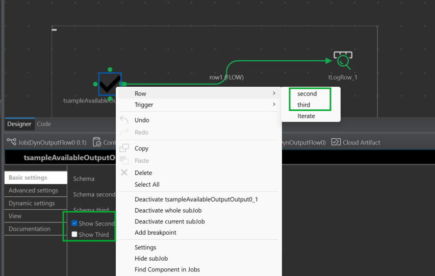

= Sample for Conditional Output

Output Flows are defined in @ElementListener  methods of a processor.
We add 2 annotations to make each output flow available or not, at design time.

This TCK container proposes 3 TCK processors that show this dynamic output flow. Each of those process are the same and
use the same configuration. They simply configure the dynamic behavior of output flows differently:

- `AvailableOutputNoAnnotation`: It doesn't use `@ConditionalOutput`, so, whereas its configuration contains
`showSecond` and `showThird`, all of its output flows are always available.

- `AvailableOutputWithAnnotationOne`: This processor calls the service annotated with `@AvailableOutputFlows` named
`output-flow1`. With this, the available output flows are according to the selected options `showSecond` and
`showThird`.

- `AvailableOutputWithAnnotationTwo`: Is quite the same as `AvailableOutputWithAnnotationOne`. Just, it is not the same
configuration class, now options are `showSecond2` and `showThird2`, and the service is named `output-flow2`.

