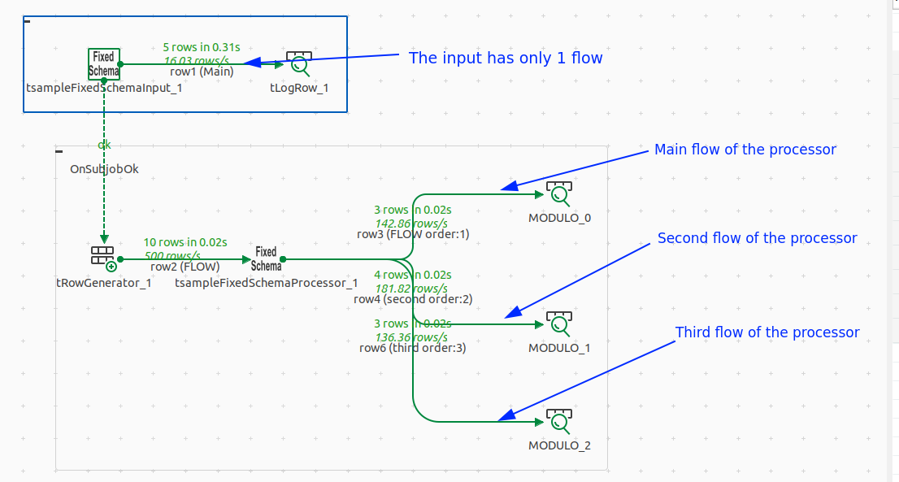

This is a TCK connector to validate the integration of `@FixedSchema` annotation.

# How to build & deploy in a studio
From the root of `component-runtime` workspace, run:
```shell
mvn clean install -pl sample-parent/sample-features/fixed-schema/ -am
```
Then deploy it into a studio:
```shell
java -jar sample-parent/sample-features/fixed-schema/target/fixedschema-<version>.car studio-deploy --location <path to a studio> -f
```

# @FixedSchema feature
The `@FixedSchema` is used to inform final application (_application where TCK is integrated_), that the output flow
designed by this annotation should:
- Have its `Guess schema` button hidden
- Have the `@DiscoverSChema` or `@DiscoverSChemaExtended` automatically called and the schema set silently

## In an input connector
This sample connector has the `@FixedSchema` annotation set on its `@Emitter`
[here](./src/main/java/org/talend/sdk/component/sample/feature/fixedschema/input/FixedSchemaInput.java#L34). The service
to be called is explicitly `fixedschemadse` and since it is an `@Emitter` it is a
[@DiscoverSchema](src/main/java/org/talend/sdk/component/sample/feature/fixedschema/service/UIService.java#L39).

The parameter `final Dataset dse` of the service should be set with values defined in the form. Since the call should be
done when the form is open, it should be only default values.

You can see that the schema is built with static values, and the `dse` parameter is not used:
```java
factory.newSchemaBuilder(Schema.Type.RECORD)
                .withEntry(factory.newEntryBuilder().withName("id").withType(Schema.Type.INT).build())
                .withEntry(factory.newEntryBuilder().withName("input").withType(Schema.Type.STRING).build())
                .withEntry(factory.newEntryBuilder().withName("another").withType(Schema.Type.STRING).build())
                .withEntry(factory.newEntryBuilder().withName("aBoolean").withType(Schema.Type.BOOLEAN).build())
                .build();
```

## In a processor
This sample processor has the `@FixedSchema` annotation set on its `@Processor`
[here](src/main/java/org/talend/sdk/component/sample/feature/fixedschema/processor/FixedSchemaProcessor.java#L38). Its 
value is `fixedschemaextended` and so point to the  `@DiscoverSchemaExtended` service (_since it's a processor_) named
`fixedschemaextended`.

It that, an additional parameter is set in the annotation `flows = { "__default__", "second" }`. Indeed, a processor can
have multiple output flows, and the `@FixedSchema` annotation is enabled for all the given ones in that `flows` attribute. Output flows are defined
int the `@ElementListener` method. In the sample, the `@Emitter`
[manages 3 output flows](src/main/java/org/talend/sdk/component/sample/feature/fixedschema/processor/FixedSchemaProcessor.java#L52):
- The unnamed is `__default__` (_the `main` flow in the studio_)
- `second`
- and  `third`

The `@FixedSchema` is only enabled for the `__default__` and `second` flows
[as you can see](src/main/java/org/talend/sdk/component/sample/feature/fixedschema/processor/FixedSchemaProcessor.java#L38).

That means for:
- `__default__`: 
    - Its guess schema button is hidden
    - The `@DiscoverSchemaExtended("fixedschemaextended")` is called with `branch` parameter set to `__default__`
        - The schema is silently set
- `second`:
    - Its guess schema button is hidden
    - The `@DiscoverSchemaExtended("fixedschemaextended")` is called with `branch` parameter set to `second`
        - The schema is silently set
-  `third`:
    -  Its guess schema button is displayed
    - No service is called
        - The schema is remained empty until the user set it manually or click on guess schema button

[As you can see](src/main/java/org/talend/sdk/component/sample/feature/fixedschema/service/UIService.java#L50),
the `guessSchema4Processors` return a different schema for each flow.

## Sample connector behavior
Since it's a simple sample, both [Input](src/main/java/org/talend/sdk/component/sample/feature/fixedschema/input/FixedSchemaInput.java#L35)
and [Processor](src/main/java/org/talend/sdk/component/sample/feature/fixedschema/processor/FixedSchemaProcessor.java#L39)
connectors use the
[same configuration](src/main/java/org/talend/sdk/component/sample/feature/fixedschema/config/Config.java#L34).

### The @Emitter
The intput connector generates 5 records with those attributes:
- `id`: the [index](src/main/java/org/talend/sdk/component/sample/feature/fixedschema/input/FixedSchemaInput.javaL#57)
of the record
- `input`: the value set in [Datastore#input](src/main/java/org/talend/sdk/component/sample/feature/fixedschema/config/Datastore.java#L34)
- `another`: the value set in [Dataset#anotherInput](src/main/java/org/talend/sdk/component/sample/feature/fixedschema/config/Dataset.java#L41)
- `aBoolean`: the value set in [Config#aBoolean](src/main/java/org/talend/sdk/component/sample/feature/fixedschema/config/Config.java#L42)

Here is an example of ouptut:
```text
|=-+-----+-------+-------=|
|id|input|another|aBoolean|
|=-+-----+-------+-------=|
|1 |aaa  |zz     |false   |
|2 |aaa  |zz     |false   |
|3 |aaa  |zz     |false   |
|4 |aaa  |zz     |false   |
|5 |aaa  |zz     |false   |
'--+-----+-------+--------'
```
It has only 1 output flow `__default__`.

### The processor
The processor will process all received input records. The input record has to contain a `id` attribute of `Integer` type.
It will compute the `modulo 3` on this `id`:
- If the result is `0`, 
[a record will be sent sent to the](src/main/java/org/talend/sdk/component/sample/feature/fixedschema/processor/FixedSchemaProcessor.java#L59)
`__default__` flow
- If the result is `1`,
[a record will be sent sent to the](src/main/java/org/talend/sdk/component/sample/feature/fixedschema/processor/FixedSchemaProcessor.java#L67)
`second` flow
- If the result is `2`,
[a record will be sent sent to the](src/main/java/org/talend/sdk/component/sample/feature/fixedschema/processor/FixedSchemaProcessor.java#L73)
`third` flow

Each flow has it own output schema:
- `__default__`: 
    - `id`: the input record `id` value
    - `input`: will always contain `"modulo == 0"`
    - `another`: will always contain `"dummy value"`
    - `aBoolean`: will always contain `true`
```text
|=-+-----------+-----------+-------=|
|id|input      |another    |aBoolean|
|=-+-----------+-----------+-------=|
|3 |modulo == 0|dummy value|true    |
|6 |modulo == 0|dummy value|true    |
|9 |modulo == 0|dummy value|true    |
'--+-----------+-----------+--------'
```

- `second`:
    - `second`:  the input record `id` value
    - `flow`: will always contain `"Second flow since module == 1"`
```text
|=-----+----------------------------=|
|second|flow                         |
|=-----+----------------------------=|
|1     |Second flow since module == 1|
|4     |Second flow since module == 1|
|7     |Second flow since module == 1|
|10    |Second flow since module == 1|
'------+-----------------------------'
```

- `third`:
    - A first column that has its name coming from
[Datastore#input](src/main/java/org/talend/sdk/component/sample/feature/fixedschema/config/Datastore.java#L34)
        - Containing the input record `id` value
    - A second column that has its name coming from
[Dataset#anotherInput](src/main/java/org/talend/sdk/component/sample/feature/fixedschema/config/Dataset.java#L41)
        - It always contains `"Third flow since module == 2"`
```text
|=--+---------------------------=|
|aaa|zzz                         |
|=--+---------------------------=|
|2  |Third flow since module == 2|
|5  |Third flow since module == 2|
|8  |Third flow since module == 2|
'---+----------------------------'
```

### Studio screenshot
Here is a screenshot of the usage of this sample connector in a studio:


And the output of its execution:
```text
.--+-----+-------+--------.
|        tLogRow_1        |
|=-+-----+-------+-------=|
|id|input|another|aBoolean|
|=-+-----+-------+-------=|
|1 |aaa  |zz     |false   |
|2 |aaa  |zz     |false   |
|3 |aaa  |zz     |false   |
|4 |aaa  |zz     |false   |
|5 |aaa  |zz     |false   |
'--+-----+-------+--------'

.--+-----------+-----------+--------.
|             MODULO_0              |
|=-+-----------+-----------+-------=|
|id|input      |another    |aBoolean|
|=-+-----------+-----------+-------=|
|3 |modulo == 0|dummy value|true    |
|6 |modulo == 0|dummy value|true    |
|9 |modulo == 0|dummy value|true    |
'--+-----------+-----------+--------'

.------+-----------------------------.
|              MODULO_1              |
|=-----+----------------------------=|
|second|flow                         |
|=-----+----------------------------=|
|1     |Second flow since module == 1|
|4     |Second flow since module == 1|
|7     |Second flow since module == 1|
|10    |Second flow since module == 1|
'------+-----------------------------'

.---+----------------------------.
|            MODULO_2            |
|=--+---------------------------=|
|aaa|zzz                         |
|=--+---------------------------=|
|2  |Third flow since module == 2|
|5  |Third flow since module == 2|
|8  |Third flow since module == 2|
'---+----------------------------'
```